#### matplotlib 常用功能总结

- 解决乱码和不能显示负号的问题

  ```python
  # 解决 windows 上中文乱码问题
  plt.rcParams['font.sans-serif'] = ['SimHei']
  
  # 用来正常显示负号
  plt.rcParams['axes.unicode_minus'] = False
  ```

- 图像读取、展示和保存

  ```python
  x = plt.imread("fig.png")
  plt.imshow(x)
  plt.show()
  plt.imsave("2.png", x)
  ```

- 简单的图像

  ```python
  fruit = ["香蕉", '橘子', '苹果', '桃子']
  x = [0, 1, 2, 3]
  y = [10, 20, 25, 30]
  
  plt.figure(figsize=(5, 5))
  plt.plot(x, y, color='lightblue', linewidth=3, label="销量")
  plt.xlabel("x轴")
  plt.ylabel("y轴")
  plt.xticks(x, fruit, rotation=45)  # 替换成中文名称并进行 45 度旋转
  plt.legend(loc="best")
  plt.show()
  ```

  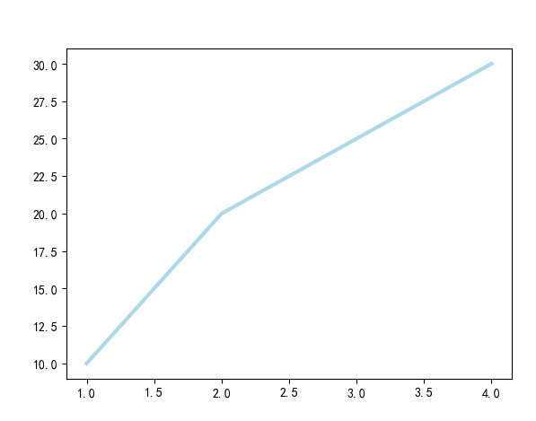

- 理解 Axes

  > 上面的方式固然简单，但是不能完成一些复杂的绘图工作，复杂的绘图工作需要用到  Axes
  >
  > figure 表示的是一个画板，一个画板中可能有多个图像，每个图像就是一个  Axes 对象
  >
  > 我们先要理解什么画图的框架，后面再讨论在里边填内容
  >
  > 创建 Axes 有两种方式

  1. 使用 plt.figure

     ```python
     # 创建一个画板
     fig = plt.figure(figsize=(4, 4))  # figsize 表示画布的大小
     fig.suptitle("总标题") # 整个画板设置一个标题
     
     # 121 表示一行两列的第一个 Axes 对象
     ax1 = fig.add_subplot(121)
     ax1.set(xlim=[0.5, 4.5], ylim=[-2, 8], title='first axes', ylabel='Y-Axis', xlabel='X-Axis')
     
     # 122 表示一行两列的第二个图像 Axes 对象
     ax2 = fig.add_subplot(122)
     ax2.set(xlim=[0.5, 4.5], ylim=[-2, 8], title='second axes', ylabel='Y-Axis', xlabel='X-Axis')
     
     # 保存为图片
     fig.savefig("fig.png")
     
     # 显示
     plt.show()
     ```

     

     2. 使用  plt.subplots

        ```python
        fig, axes = plt.subplots(nrows=1, ncols=2, figsize=(4, 4))
        fig.suptitle("总标题") # 整个画板设置一个标题
        
        for i, axis in enumerate(axes.flatten()):
            axis.set(title="第 %d 幅图像" % i, xlabel="X", ylabel="Y", xlim=[0.5, 4.5], ylim=[-2, 8])
        
        # 保存为图片
        fig.savefig("fig.png")
        
        plt.show()
        ```

        

     

     

     

  使用 Axes 对象实现如上的简单图像

  ```python
  fruit = ["香蕉", '橘子', '苹果', '桃子']
  x = [0, 1, 2, 3]
  y = [10, 20, 25, 30]
  
  fig, ax = plt.subplots(figsize=(5, 5))
  
  ax.plot(x, y, color='lightblue', linewidth=3, label="销量")
  ax.set_xlabel("x轴")
  ax.set_ylabel("y轴")
  
  ax.set_xticks(x)  # 替换成中文名称并进行 45 度旋转, y 轴类似，默认值为 both
  ax.set_xticklabels(fruit)
  ax.tick_params(axis='x', color='red', rotation=45)
  
  ax.legend(loc="best")
  
  plt.show()
  ```

  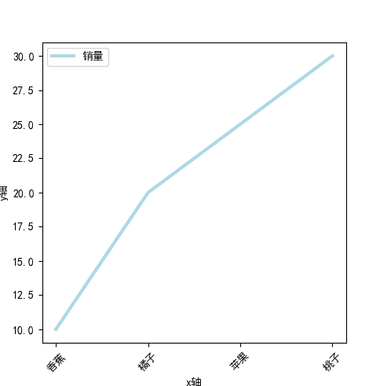

- 线图

  ```python
  x = np.linspace(0, np.pi)
  y_sin = np.sin(x)
  y_cos = np.cos(x)
  
  fig = plt.figure(figsize=(12, 3))
  
  ax1 = fig.add_subplot(131)
  ax1.plot(x, y_sin)
  
  ax2 = fig.add_subplot(132)
  ax2.plot(x, y_sin, 'go--', linewidth=2, markersize=12)
  
  ax3 = fig.add_subplot(133)
  ax3.plot(x, y_cos, color='red', marker='+')
  
  plt.show()
  fig.savefig("fig.png")
  ```

  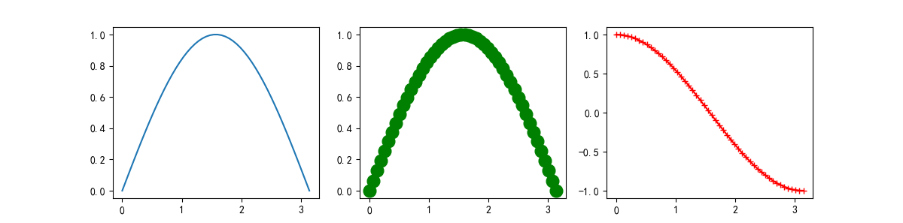

- 散点图

  ```
  x = np.arange(10)
  y = np.random.randn(10)
  plt.scatter(x, y, color='red', marker='+')
  plt.show()
  ```

  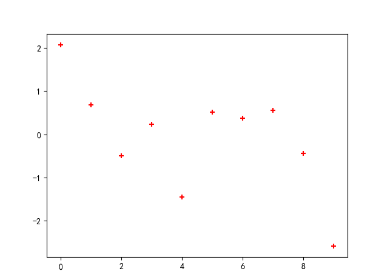

  泡泡图，第三个值 `s` 可以理解成普通散点，画的是二维，泡泡图体现了 Z 的大小

  ```python
  x = [1, 2, 3, 4, 10, 12]
  y = [2, 4, 5, 7, 3, 12]
  area = [20, 900, 90, 12, 10, 88]
  
  plt.scatter(x, y, s=area, alpha=0.5)
  plt.show()
  ```

  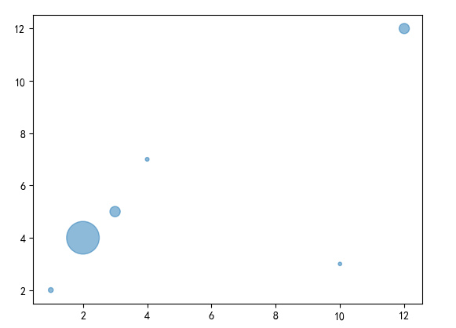

- 条形图

  ```python
  np.random.seed(1)
  x = np.arange(5)
  y = np.random.randn(5)
  
  fig, axes = plt.subplots(ncols=2, figsize=(10, 4))
  
  # bar：垂直，barh：水平
  # 返回的 vert_bars 和 horiz_bars 表示每个条形（Artists 数组），可以修改条形样式
  vert_bars = axes[0].bar(x, y, color='lightblue', align='center')
  horiz_bars = axes[1].barh(x, y, color='lightblue', align='center')
  
  # 在水平或者垂直方向上画线
  axes[0].axhline(0, color='red', linewidth=1)
  axes[1].axvline(0, color='gray', linewidth=1)
  plt.show()
  ```

  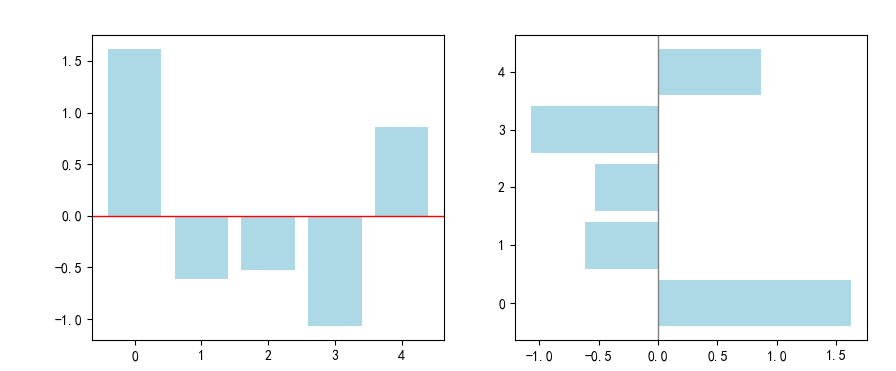

- 直方图

  ```python
  np.random.seed(19680801)
  
  n_bins = 10
  x = np.random.randn(1000, 3) # 3 个元素组成一组，一共一千组
  
  fig, axes = plt.subplots(nrows=2, ncols=2)
  ax0, ax1, ax2, ax3 = axes.flatten()
  
  # 没有设置 histtype， 默认为柱状
  colors = ['red', 'tan', 'lime']
  ax0.hist(x, n_bins, density=True, histtype='bar', color=colors, label=colors)
  ax0.legend(prop={'size': 10})
  ax0.set_title('bars with legend')
  
  # 设置 histtype 为 barstacked，则多个可以进行堆叠
  ax1.hist(x, n_bins, density=True, histtype='barstacked')
  ax1.set_title('stacked bar')
  
  # 设置 rwidth， 每个柱形图之间有一定的间距， orientation 为 horizontal 可以水平展示条形图
  ax2.hist(x,  histtype='barstacked', rwidth=0.9， orientation = "horizontal")
  
  ax3.hist(x[:, 0], rwidth=0.9)
  ax3.set_title('different sample sizes')
  
  fig.tight_layout()
  plt.show()
  ```

  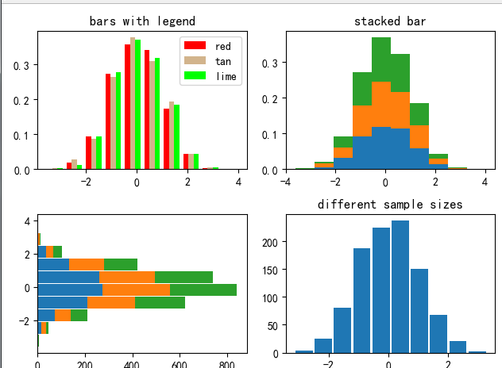

- 饼图

  > 参数说明
  >
  > 饼图自动根据数据的百分比画饼.。
  >
  > `labels`是各个块的标签，如子图一。
  >
  > `autopct=%1.1f%%`表示格式化百分比精确输出，即保留的小数位数
  >
  > `explode`，突出某些块，不同的值突出的效果不一样，如第二个图的黄色部分向外突出
  >
  > `pctdistance=1.12`百分比距离圆心的距离，默认是0.6.

  ```python
  labels = 'Frogs', 'Hogs', 'Dogs', 'Logs'
  sizes = [15, 30, 45, 10]
  explode = (0, 0.1, 0, 0)  # only "explode" the 2nd slice (i.e. 'Hogs')
  
  fig1, (ax1, ax2) = plt.subplots(2)
  ax1.pie(sizes, labels=labels, autopct='%1.1f%%', shadow=True)
  ax1.axis('equal')
  
  ax2.pie(sizes, autopct='%1.2f%%', shadow=True, startangle=90, explode=explode, pctdistance=1.12)
  ax2.axis('equal')
  ax2.legend(labels=labels, loc='upper right')
  
  plt.show()
  ```

  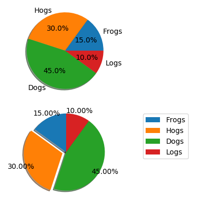

- 区间上下限、图例、边界

  1. 区间上下限

     ```python
     ax.set_xlim([xmin, xmax])   #设置X轴的区间
     ax.set_ylim([ymin, ymax])   #Y轴区间
     ax.axis([xmin, xmax, ymin, ymax])   #X、Y轴区间
     ax.set_ylim(bottom=-10)     #Y轴下限
     ax.set_xlim(right=25)       #X轴上限
     ```

  2. 图例

     > 可以通过参数 loc 空值图例的显示位置，可以查查看源码获取方式

     ```
     ax.legend()
     ```

  3. 布局

     > fig.subplots_adjust 修改各个子图之间的间距个离外边框的距离,参数说明：
     >
     > wspace：子图在水平方向上的间距
     >
     > hspace：子图在垂直方向上的间距
     >
     > left：左边距
     >
     > right：右边距
     >
     > top：上边距
     > bottom：下边距
     >
     > 注意：取值范围为 0， 1， 左下角作为原点

     ```python
     fig, axes = plt.subplots(2, 2, figsize=(5, 5))
     fig.subplots_adjust(wspace=0.2, hspace=0.3, left=0.2, right=0.9, top=0.9,   bottom=0.1)
     ```

     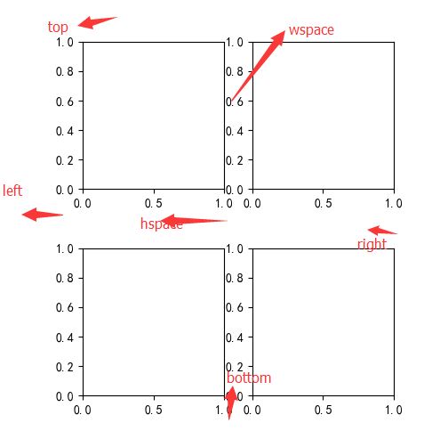

     当不知道怎么调整时，可以使用 tight_layout 进行自动调整

     ```python
     fig.tight_layout()
     ```

     上面讨论的是外边距，内边距修改使用：

     ```python
     fig, axes = plt.subplots(1, figsize=(4, 4))
     axes.margins(x=0.3, y=0.3)
     axes.plot([2, 3, 5], [7, 9, 12])
     plt.show()
     ```

     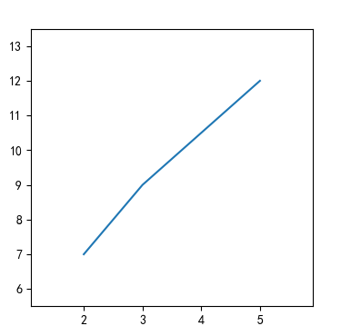

  4. 轴相关

     ```python
     fig, ax = plt.subplots()
     ax.plot([-2, 2, 3, 4], [-10, 20, 25, 5])
     ax.spines['top'].set_visible(False)     # 顶边界不可见
     ax.spines['right'].set_visible(False)   # 右边界不可见
     
     # "data"
     # 移动左、下边界到 (0, 0) 处相交
     ax.spines['bottom'].set_position(('data', 0))
     ax.spines['left'].set_position(('data', 0))
     
     # "axes"
     # 移动边界，按 Axes 的百分比位置, bottom left 分别移动 0.5 就到中间了
     # ax.spines['bottom'].set_position(('axes', 0.5))
     # ax.spines['left'].set_position(('axes', 0.5))
     plt.show()
     ```

  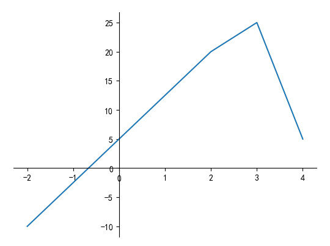


