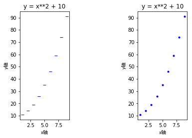
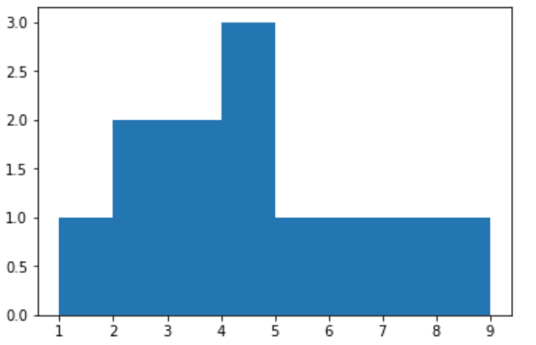

- I/O

  ```python
  import numpy as np 
  
  # 保存为普通文本
  a = np.arange(0,10,0.5).reshape(4, -1)
  print(a)
  np.savetxt("out.txt", a, fmt = "%d", delimiter = ",") # 改为保存为整数，以逗号分隔
  
  # 加载文本文件
  b = np.loadtxt("out.txt", delimiter = ",") # load 时也要指定为逗号分隔
  print(b)
  
  # 保存为二进制文件
  np.save('outfile.npy', a) 
  
  # 加载二进制文件
  c = np.load('outfile.npy') 
  print(c)
  
  # 将多个数组保存为压缩文件
  d = np.arange(10, 20, 0.5).reshape(4, -1)
  np.savez('outfile.npz', a, d) 
  
  # 加载二进制文件
  e = np.load('outfile.npz') 
  print(e.files) # 输出有哪些数组
  print(e['arr_0']) # 取其中一个数组
  
  # 使用 genfromtxt
  world_alcohol = numpy.genfromtxt("world_alcohol.txt", delimiter=",", dtype="U75", skip_header=1)
  ```

  输出：

  ```
  [[ 0.   0.5  1.   1.5  2. ]
   [ 2.5  3.   3.5  4.   4.5]
   [ 5.   5.5  6.   6.5  7. ]
   [ 7.5  8.   8.5  9.   9.5]]
  [[0 0 1 1 2]
   [2 3 3 4 4]
   [5 5 6 6 7]
   [7 8 8 9 9]]
  [[ 0.   0.5  1.   1.5  2. ]
   [ 2.5  3.   3.5  4.   4.5]
   [ 5.   5.5  6.   6.5  7. ]
   [ 7.5  8.   8.5  9.   9.5]]
  ['arr_0', 'arr_1']
  [[ 0.   0.5  1.   1.5  2. ]
   [ 2.5  3.   3.5  4.   4.5]
   [ 5.   5.5  6.   6.5  7. ]
   [ 7.5  8.   8.5  9.   9.5]]
  ```

- np.random.choice()

  > 通过给定的一维数组数据产生随机采样
  >
  > 参数说明：
  >
  > a：一维数组或者 int 型变量，如果是 int 则 使用 np.arrange(a) 生成数组
  >
  > size : 决定了输出的 shape
  >
  > replace : 采样中是否有重复值布尔参数，可选参数 
  >
  > p :每个采样点被选中的概率，可选参数 

  ```python
  xx = np.random.choice([1, 2, 3, 4, 5, 6], size=(2, 2), replace=True, p=[0, 0, 0.7, 0.1, 0.1, 0.1])
  print(xx)
  
  xx = np.random.choice(6, size=(2, 2), replace=True, p=[0, 0, 0.7, 0.1, 0.1, 0.1])
  print(xx)
  ```

  输出：

  ```
  [[3 3]
   [5 6]]
   
   [[3 2]
   [5 2]]
  ```

- dtype

  ```python
  student = np.dtype([('name','U20'), ('age', 'i1'), ('marks', 'f')]) 
  a = np.array([('abc', 21, 50.225001), ('xyz', 18, 75)], dtype = student) 
  
  # 追加元素
  a = np.append(a, np.array(('zxl', 18, 75), dtype=student))
  
  # 按列名取数据
  print(a['name'])
  
  # 按行取
  print(a[0])
  
  # 按行号和列名取数据
  print(a[0]['name'])
  
  # 按行号和列号取数据
  print(a[0][0])
  
  print(a.ndim)
  
  print(a.itemsize)
  ```

  输出：

  ```
  ['abc' 'xyz' 'zxl']
  ('abc', 21,  50.22500229)
  abc
  abc
  1
  85
  ```

- frombuffer

  ```python
  s =  b'Hello World' 
  a = np.frombuffer(s, dtype = 'S1')  
  print (a)
  ```

  输出：

  ```
  [b'H' b'e' b'l' b'l' b'o' b' ' b'W' b'o' b'r' b'l' b'd']
  ```

- 使用迭代器创建 ndarray 

  ```python
  # 使用迭代器创建 ndarray 
  it = (i for i in range(10))
  x = np.fromiter(it, dtype=float)
  print(x)
  ```

  输出：

  ```
  [ 0.  1.  2.  3.  4.  5.  6.  7.  8.  9.]
  ```

- 创建等比数列

  ```python
  # np.logspace(start, stop, num=50, endpoint=True, base=10.0, dtype=None)
  # 默认底数是 10
  a = np.logspace(1.0,  2.0, num = 10)  
  print(a)
  ```

  输出：

  ```
  [  10.           12.91549665   16.68100537   21.5443469    27.82559402
     35.93813664   46.41588834   59.94842503   77.42636827  100.        ]
  ```

- 使用省略号，表示满选

  ```python
  # 使用省略号，表示满选
  a = np.array([[1, 2, 3], [3, 4, 5], [4, 5, 6]])  
  print (a[..., 1])   # 第2列元素
  print (a[1, ...])   # 第2行元素
  print (a[..., 1:])  # 第2列及剩下的所有元素
  ```

  输出：

  ```
  [2 4 5]
  [3 4 5]
  [[2 3]
   [4 5]
   [5 6]]
  ```

- 数组索引

  ```python
  # 数组索引
  x = np.array([[1,  2],  [3,  4],  [5,  6]]) 
  y = x[[0, 1, 2], [0, 1, 0]]
  print(y)
  
  # 使用数组索引获取四个对角线的元素
  z = np.array([[0, 1, 2], [3, 4, 5], [6, 7, 8], [9, 10, 11]])
  a = z[[[0, 0], [3, 3]], [[0, 2], [0, 2]]]
  print(a)
  ```

  输出：

  ```
  [1 4 5]
  [[ 0  2]
   [ 9 11]]
  ```

- 布尔索引（找到是 True 位置的元素，最终组成一维数组输出）

  ```python
  x = np.arange(0, 12).reshape([4, 3])
  print(x > 5)
  print(x[x > 5]) # 为什么变成一维了？？？
  ```

  输出：

  ```
  [[ 0  1  2]
   [ 3  4  5]
   [ 6  7  8]
   [ 9 10 11]]
  [[False False False]
   [False False False]
   [ True  True  True]
   [ True  True  True]]
  [ 6  7  8  9 10 11]
  ```

- 取补运算符 ～， 类似：not 的用法

  ```python
  a = np.array([np.nan,  1, 2, np.nan, 3, 4, 5])  
  print(a[~np.isnan(a)])
  ```

  输出：

  ```
  [ 1.  2.  3.  4.  5.]
  ```

- 迭代数组

  ```python
  a = np.arange(6).reshape(2,3)
  print(a)
  for x in np.nditer(a):
      print(x, end=", ")
      
  # 修改数组中的元素，必须指定 op_flags=['readwrite']
  # 发现修改之后的数组维度没有变化
  a = np.arange(0, 60, 5)
  a = a.reshape(3, 4)
  print (a)
  for x in np.nditer(a, op_flags=['readwrite']): 
      x[...] = 2 * x
  print (a)
  
  # 广播迭代，第一个数组维度为 3X4，第二个数组维度为 1x4
  # 第二个数组被广播
  a = np.arange(0, 60, 5) 
  a = a.reshape(3, 4)
  print(a)
  b = np.array([1,  2,  3,  4], dtype = int)  
  print (b)
  for x,y in np.nditer([a,b]): 
      print ("%d:%d"  %  (x, y), end=", " )
  ```

  输出：

  ```
  [[0 1 2]
   [3 4 5]]
  0, 1, 2, 3, 4, 5, [[ 0  5 10 15]
   [20 25 30 35]
   [40 45 50 55]]
  [[  0  10  20  30]
   [ 40  50  60  70]
   [ 80  90 100 110]]
  [[ 0  5 10 15]
   [20 25 30 35]
   [40 45 50 55]]
  [1 2 3 4]
  0:1, 5:2, 10:3, 15:4, 20:1, 25:2, 30:3, 35:4, 40:1, 45:2, 50:3, 55:4, 
  ```

- flatten 和 ravel

  ```python
  a = np.arange(6).reshape(2, 3)
  
  # flatten, 转换为一维数组, 修改不影响原始数组
  f = a.flatten()
  print(f)
  f[0] = 100
  print(a)
  
  # ravel, 转换为一维数组, 修改影响原始数组
  r = a.ravel()
  print(r)
  r[0] = 100
  print(a)
  ```

  输出：

  ```
  [0 1 2 3 4 5]
  [[0 1 2]
   [3 4 5]]
  [0 1 2 3 4 5]
  [[100   1   2]
   [  3   4   5]]
  ```

- squeeze 删除维度

  ```python
  # 增加维度 numpy.expand_dims(arr, axis)
  a = np.arange(0, 12).reshape(3, 4)
  a = np.expand_dims(a, axis=2)
  print(a)
  
  # 删除维度，只能是维度为一的才能删除 numpy.squeeze(arr, axis)
  a = np.squeeze(a, axis=2)
  print(a)
  ```

  输出：

  ```
  [[[ 0]
    [ 1]
    [ 2]
    [ 3]]
  
   [[ 4]
    [ 5]
    [ 6]
    [ 7]]
  
   [[ 8]
    [ 9]
    [10]
    [11]]]
  [[ 0  1  2  3]
   [ 4  5  6  7]
   [ 8  9 10 11]]
  ```

- concatenate 合并数组

  ```python
  # 不会增加维度， numpy.concatenate((a1, a2, ...), axis)
  a = np.arange(0, 12).reshape(3, 4)
  b = np.arange(0, 12).reshape(3, 4)
  print(a)
  np.concatenate((a, b), axis=0)
  ```

  输出：

  ```
  [[ 0  1  2  3]
   [ 4  5  6  7]
   [ 8  9 10 11]]
   
   array([[ 0,  1,  2,  3],
         [ 4,  5,  6,  7],
         [ 8,  9, 10, 11],
         [ 0,  1,  2,  3],
         [ 4,  5,  6,  7],
         [ 8,  9, 10, 11]])
  ```

- stack,  指定维度的数据合并成新的维度

  ```python
  # 会增加维度，把指定维度的数据合并成新的维度， numpy.stack(arrays, axis)
  a = np.arange(0, 12).reshape(3, 4)
  b = np.arange(0, 12).reshape(3, 4)
  print(a)
  np.stack((a, b), axis=0)
  ```

  输出：

  ```
  [[ 0  1  2  3]
   [ 4  5  6  7]
   [ 8  9 10 11]]
   
   array([[[ 0,  1,  2,  3],
          [ 4,  5,  6,  7],
          [ 8,  9, 10, 11]],
  
         [[ 0,  1,  2,  3],
          [ 4,  5,  6,  7],
          [ 8,  9, 10, 11]]])
  ```

- numpy.vstack(arrays, axis) , 垂直堆叠，维度不变（类似 concatenate） 

  ```python
  a = np.arange(0, 12).reshape(3, 4)
  b = np.arange(0, 12).reshape(3, 4)
  print(a)
  np.vstack((a, b))
  ```

  输出：

  ```
  [[ 0  1  2  3]
   [ 4  5  6  7]
   [ 8  9 10 11]]
   
   array([[ 0,  1,  2,  3],
         [ 4,  5,  6,  7],
         [ 8,  9, 10, 11],
         [ 0,  1,  2,  3],
         [ 4,  5,  6,  7],
         [ 8,  9, 10, 11]])
  ```

- numpy.hstack(arrays, axis)，水平堆叠，维度不变（类似 concatenate）

  ```python
  a = np.arange(0, 12).reshape(3, 4)
  b = np.arange(0, 12).reshape(3, 4)
  print(a)
  np.hstack((a, b))
  ```

  输出：

  ```
  [[ 0  1  2  3]
   [ 4  5  6  7]
   [ 8  9 10 11]]
   
   array([[ 0,  1,  2,  3,  0,  1,  2,  3],
         [ 4,  5,  6,  7,  4,  5,  6,  7],
         [ 8,  9, 10, 11,  8,  9, 10, 11]])
  ```

- 分割数组 numpy.split(ary, indices_or_sections, axis)

  ```python
  a = np.arange(0, 12).reshape(3, 4)
  print(a)
  
  print(np.split(a, 3)) # 分成 3 个子数组
  print(np.split(a, [1, 2])) # 确定分割点
  
  print(np.split(a, 2, axis=1)) # 水平分割
  print(np.hsplit(a, 2))
  
  print(np.split(a, 3, axis=0)) # 垂直分割
  print(np.vsplit(a, 3))
  ```

  输出：

  ```
  [[ 0  1  2  3]
   [ 4  5  6  7]
   [ 8  9 10 11]]
  [array([[0, 1, 2, 3]]), array([[4, 5, 6, 7]]), array([[ 8,  9, 10, 11]])]
  [array([[0, 1, 2, 3]]), array([[4, 5, 6, 7]]), array([[ 8,  9, 10, 11]])]
  [array([[0, 1],
         [4, 5],
         [8, 9]]), array([[ 2,  3],
         [ 6,  7],
         [10, 11]])]
  [array([[0, 1],
         [4, 5],
         [8, 9]]), array([[ 2,  3],
         [ 6,  7],
         [10, 11]])]
  [array([[0, 1, 2, 3]]), array([[4, 5, 6, 7]]), array([[ 8,  9, 10, 11]])]
  [array([[0, 1, 2, 3]]), array([[4, 5, 6, 7]]), array([[ 8,  9, 10, 11]])]
  ```

- resize

  ```python
  # 如果新数组大小大于原始大小，则包含原始数组中的元素的副本， 和 reshape 的区别
  a = np.array([[1,2,3],[4,5,6]])
  b = np.resize(a, (3, 3))
  print(a)
  print(b)
  ```

  输出：

  ```
  [[1 2 3]
   [4 5 6]]
  [[1 2 3]
   [4 5 6]
   [1 2 3]]
  ```

- append

  ```python
  # 注意： append 会生成新的数组且如果不指定 axis，会变成一维度数组
  a = np.array([[1,2,3], [4,5, 6]])
  print(np.append(a, [[1,2,3]]))
  print(np.append(a, [[5,5,5], [7,8,9]], axis = 1))
  print(np.append(a, [[5,5,5], [7,8,9]], axis = 0))
  ```

  输出：

  ```
  [1 2 3 4 5 6 1 2 3]
  [[1 2 3 5 5 5]
   [4 5 6 7 8 9]]
  [[1 2 3]
   [4 5 6]
   [5 5 5]
   [7 8 9]]
  ```

- insert

  ```python
  # numpy.insert(arr, obj, values, axis)
  # 注意：会生成新的数组且如果不指定 axis，会变成一维度数组， 有广播机制
  a = np.array([[1,2],[3,4],[5,6]])
  print (a)
  print (np.insert(a, 3, [11,12]))
  print (np.insert(a, 1, [11], axis = 0))
  print (np.insert(a, 1, 11, axis = 1))
  ```

  输出：

  ```
  [[1 2]
   [3 4]
   [5 6]]
  [ 1  2  3 11 12  4  5  6]
  [[ 1  2]
   [11 11]
   [ 3  4]
   [ 5  6]]
  [[ 1 11  2]
   [ 3 11  4]
   [ 5 11  6]]
  ```

- delete

  ```python
  # Numpy.delete(arr, obj, axis)
  # 注意：会生成新的数组且如果不指定 axis，会变成一维度数组 和 insert 类似
  a = np.array([[1,2],[3,4],[5,6]])
  print (a)
  print (np.delete(a, 3))
  print (np.delete(a, 1, axis = 0))
  print (np.delete(a, 1, axis = 1))
  ```

  输出：

  ```
  [[1 2]
   [3 4]
   [5 6]]
  [1 2 3 5 6]
  [[1 2]
   [5 6]]
  [[1]
   [3]
   [5]]
  ```

- unique

  ```python
  # numpy.unique(arr, return_index, return_inverse, return_counts)
  a = np.array([5,2,6,2,7,5,6,8,2,9])
  print (a)
   
  u = np.unique(a)
  print (u, '\n')
  
  # return_index 新数组在旧数组的下标
  u, indices = np.unique(a, return_index = True)
  print (u)
  print (indices, '\n')
  
  # return_inverse 旧数组在新数组的下标
  u, indices = np.unique(a, return_inverse = True)
  print (indices)
  print (u[indices], '\n') # 还原旧数组
  
  # 统计每个元素个数
  u, indices = np.unique(a, return_counts = True)
  print (u)
  print (indices)
  ```

  输出：

  ```
  [5 2 6 2 7 5 6 8 2 9]
  [2 5 6 7 8 9] 
  
  [2 5 6 7 8 9]
  [1 0 2 4 7 9] 
  
  [1 0 2 0 3 1 2 4 0 5]
  [5 2 6 2 7 5 6 8 2 9] 
  
  [2 5 6 7 8 9]
  [3 2 2 1 1 1]
  ```

- char 字符串操作

  ```python
  # np.char.add 对字符相应位置上的元素进行拼接
  print(np.char.add(['hello', 'hi'],[' abc', ' xyz']))
  
  # np.char.multiply 对数组中的每个字符串元素，执行多重连接
  print(np.char.multiply(['Runoob', 'tony'], 3))
  
  # np.char.center 字符居中
  # str: 字符串，width: 长度，fillchar: 填充字符
  print(np.char.center('Runoob', 20,fillchar = '*'))
  
  # numpy.char.capitalize()第一个字母大写
  # numpy.char.title() 字符串中的所有单词的第一个字母大写
  # numpy.char.lower()
  # numpy.char.upper()
  # numpy.char.strip()
  # numpy.char.join()
  # np.char.split()
  # numpy.char.replace()
  # numpy.char.encode()
  # numpy.char.decode()
  ```

  输出：

  ```
  ['hello abc' 'hi xyz']
  ['RunoobRunoobRunoob' 'tonytonytony']
  *******Runoob*******
  ```

- 加/减/乘/除/余

  ```python
  # 数组间的加/减/乘/除/余
  # numpy.add(a,b)
  # numpy.subtract(a,b)
  # numpy.multiply(a,b)
  # numpy.divide(a,b)
  # numpy.mod(a,b)
  
  # 单个数组求指数/倒数
  # numpy.power()
  # numpy.reciprocal() 
  ```

- 统计相关

  ```python
  # 统计相关的函数
  # numpy.amin() 用于计算数组中的元素沿指定轴的最小值, 可用 min 替代
  # numpy.amax() 用于计算数组中的元素沿指定轴的最大值，可用 max 替代
  a = np.array([[3,7,5],[8,4,3],[2,4,9]])  
  print(a, '\n')
  
  print(np.amin(a, axis=1))
  print(np.amax(a, axis=0), '\n')
  
  print(np.min(a,  axis=1))
  print(np.max(a,  axis=0), '\n')
  
  # numpy.ptp() 计算最大值和最小值的差, 也可以指定 axis
  print(np.ptp(a))
  print(np.ptp(a, axis=0), '\n')
  
  # numpy.median() 中位数
  # numpy.mean() 均值
  # numpy.std() 标准差 
  # numpy.var() 方差
  # numpy.average() 加权平均值，当没有设置权重的时候和 mean 一样， returned =  True表示返回权重的和
  print (np.average([1, 2, 3, 4], weights = [4,3,2,1], returned =  True))
  # 可以指定具体的轴
  print(np.average(a, axis = 1, weights = [0.1, 0.5, 0.4]))
  ```

  输出：

  ```
  [[3 7 5]
   [8 4 3]
   [2 4 9]] 
  
  [3 3 2]
  [8 7 9] 
  
  [3 3 2]
  [8 7 9] 
  
  7
  [6 3 6] 
  
  (2.0, 10.0)
  [ 5.8  4.   5.8]
  ```

- 排序

  ```python
  # 排序 numpy.sort(a, axis, kind, order), 生成新的数组
  # order 排序的字段; kind 可选 quicksort(默认) mergesort heapsort
  a = np.array([[3,7,5],[8,4,3],[2,4,9]])
  print(a)
  print(np.sort(a, axis=0, kind='mergesort'), '\n')
  
  dt = np.dtype([('name', 'U20'), ('age', 'i1')])
  b = np.array([('lixue', 20), ('tony', 30), ('tom', 10)], dtype=dt)
  b = np.sort(b, order='age')
  print(b, '\n')
  
  # argsort, 返回排序后对应之前数组的下标值
  c = np.array([[3,7,5],[8,4,3],[2,4,9]])
  print(c)
  c = np.argsort(c)
  print(c, '\n')
  
  # lexsort 多个序列排序，后面的优先考率
  nm =  ('raju','anil','ravi', 'amar', 'amar')
  dv =  ('f.y.',  's.y.',  's.y.',  'f.y.', 'f.x')
  ind = np.lexsort((dv, nm))# 当 nm 一致时，按 dv 排序
  print(ind)
  print([nm[i]  +  ", "  + dv[i]  for i in ind], '\n')
  
  # numpy.argmax()和 numpy.argmin()分别沿给定轴返回最大和最小元素的索引
  a = np.array([[3,7,5],[8,4,3],[2,4,9]])
  maxindex = np.argmax(a, axis=1)
  minindex = np.argmin(a, axis=1)
  print(maxindex, minindex, '\n')
  
  # numpy.nonzero() 返回输入数组中非零元素的索引
  a = np.array([[0, 0, 5], [0, 0, 0], [2, 4, 9]])
  print(np.nonzero(a), '\n')
  
  # numpy.where(condition, x, y) 返回输入数组中满足给定条件的元素的索引, 满足条件(condition)，输出x，不满足输出y
  dt = np.dtype([('name', 'U20'), ('age', 'i1')])
  b = np.array([('lixue', 20), ('tony', 30), ('tom', 10)], dtype=dt)
  print(np.where(b['name'] == 'lixue'), '\n')
  
  # numpy.extract() 根据某个条件从数组中抽取元素，返回满条件的元素, 结果变成了一维数组
  x = np.arange(9.).reshape(3,  3)  
  print (np.extract(np.mod(x, 2)  ==  0  , x))
  ```

  输出：

  ```
  [[3 7 5]
   [8 4 3]
   [2 4 9]]
  [[2 4 3]
   [3 4 5]
   [8 7 9]] 
  
  [('tom', 10) ('lixue', 20) ('tony', 30)] 
  
  [[3 7 5]
   [8 4 3]
   [2 4 9]]
  [[0 2 1]
   [2 1 0]
   [0 1 2]] 
  
  [4 3 1 0 2]
  ['amar, f.x', 'amar, f.y.', 'anil, s.y.', 'raju, f.y.', 'ravi, s.y.'] 
  
  [1 0 2] [0 2 0] 
  
  (array([0, 2, 2, 2]), array([2, 0, 1, 2])) 
  
  (array([0]),) 
  
  [ 0.  2.  4.  6.  8.]
  ```

- 完全不拷贝/视图/副本

  ```python
  a = np.arange(1, 7).reshape(3, 2)
  print(a)
  
  # 完全不拷贝
  b = a
  print(id(a))
  print(id(b), '\n')
  
  # ndarray.view() 视图，视图可以共享数据，切片就是试图
  c = a.view()
  print(id(a))
  print(id(c))
  c[0:1, :] = 1
  c = np.reshape(c, (2, 3)) # 改变试视图形状原始形状不会改变
  print(c, '\n', a, '\n')
  
  # ndarray.copy() 创建一个副本
  a = np.array([[10,10],  [2,3],  [4,5]])  
  b = a.copy()
  print(id(a))
  print(id(b))
  ```

  输出：

  ```
  [[1 2]
   [3 4]
   [5 6]]
  140533627151664
  140533627151664 
  
  140533627151664
  140533627127888
  [[1 1 3]
   [4 5 6]] 
   [[1 1]
   [3 4]
   [5 6]] 
  
  140533627127888
  140533627153104
  ```

- 线性代数

  ```python
  # numpy.dot()
  # numpy.matmul() 和 dot 类似
  # numpy.vdot()  向量的点积
  # numpy.inner()
  
  a = np.array([[1, 2], [2, 2]])
  b = np.array([[2, 4], [3, 5]])
  print(np.dot(a, b))
  print(np.matmul(a, b)) 
  print(np.vdot(a, b)) # 计算时会把 a 和 b 展开成一维数组，再进行计算： 1*2 + 2*4 + 2*3 + 2*5 = 26 
  print(np.inner(a, b)) # 当时一维数组时和向量的点集类似
  # 当时高维度数组时
  a = np.array([[1, 2], [3, 4]]) 
  b = np.array([[11, 12], [13, 14]]) 
  print (np.inner(a,b), '\n')
  
  # 求行列式
  a = np.arange(9).reshape(3, 3)
  d = np.linalg.det(a)
  print(d, '\n')
  
  # 求矩阵方程的解
  # 对于方程组
  # x + y + z = 6
  # 2y + 5z = -4
  # 2x + 5y - z = 27
  a = np.array([[1, 1, 1],
                [0, 2, 5],
                [2, 5, -1]
               ]) 
  b = np.array([[6],[-4],[27]]) 
  # X = A^(-1)B
  ainv = np.linalg.inv(a) 
  print('a 的逆：', '\n', ainv)
  x = np.linalg.solve(a, b) 
  print(x)
  ```

  输出：

  ```
  [[ 8 14]
   [10 18]]
  [[ 8 14]
   [10 18]]
  26
  [[10 13]
   [12 16]]
  [[35 41]
   [81 95]] 
  
  0.0 
  
  a 的逆： 
   [[ 1.28571429 -0.28571429 -0.14285714]
   [-0.47619048  0.14285714  0.23809524]
   [ 0.19047619  0.14285714 -0.0952381 ]]
  [[ 5.]
   [ 3.]
   [-2.]]
  ```

- matplotlib

  显示中文字体

  - windows 下  
    plt.rcParams['font.sans-serif']=['SimHei']

  - ubuntu 下  

    - 方法一：
      下载 https://www.fontpalace.com/font-details/SimHei/ 字体, 
      使用 fontproperties 属性  
      myfont = FontProperties(fname='SimHei.ttf')
      plt.ylabel('y轴', fontproperties=myfont)
    - 方法二：（没有生效）
      1. 下载字体
         ubuntu下没有黑体这个字体，从网上下载 simhei.ttf 字体或从 windows 拷贝  
      2. 修改matplotlib的配置文件  
         找到文件位置：print(matplotlib.matplotlib_fname())  
         修改文件：sudo gedit home/tony/.conda/envs/carnd/lib/python3.6/site-packages/matplotlib/mpl-data/matplotlibrc  
         首先找到 font.family 和 font.sans-serif 两项，将 # 注释去掉，并且在 font.sans-serif 后添加 simhei.tff  
         其次找到 axes.unicode_minus，去掉注释，将后面的 true 改为 false，是为了显示负号‘-’  
      3. 复制下载的字体至matplotlib的字体路径  
         sudo cp simhei.ttf /home/tony/.conda/envs/carnd/lib/python3.6/site-packages/matplotlib/mpl-data/fonts/ttf  
      4. 删除缓存  
         import matplotlib as mpl  
         print(mpl.get_cachedir()) # 获取位置  
         cd /home/tony/.cache/matplotlib  
         rm -rf *

    ```python
    # matplotlib
    from matplotlib import pyplot as plt
    
    myfont = FontProperties(fname='/home/tony/simhei.ttf')
    x = np.arange(1, 10)
    y = x**2 + 10
    plt.subplot(1, 3, 1)
    plt.title('y = x**2 + 10')
    plt.xlabel('x轴', fontproperties=myfont)
    plt.ylabel('y轴', fontproperties=myfont)
    plt.plot(x, y, '_b')
    plt.subplot(1, 3, 3)
    plt.title('y = x**2 + 10')
    plt.xlabel('x轴', fontproperties=myfont)
    plt.ylabel('y轴', fontproperties=myfont)
    plt.plot(x, y, '.b')
    plt.show()
    ```

​        

- 直方图

  ```python
  #  使用 numpy 统计直方图
  a = [2, 3, 4, 2, 4, 6, 7, 3, 9, 1, 4, 5]
  b, bins = np.histogram(a, bins=[1, 2, 3, 4, 5, 6, 7, 8, 9])
  print(b, bins)
  
  #  使用 matplotlib 画出直方图
  plt.hist(a, bins=[1, 2, 3, 4, 5, 6, 7, 8, 9])
  plt.show()
  ```

  输出：

  ```
  [1 2 2 3 1 1 1 1] [1 2 3 4 5 6 7 8 9]
  ```

  