- 载入、显示、翻转、保存图像

  ```python
  # 载入、显示、翻转、保存图像
  img = cv2.imread("1.jpg")
  show_img("img", img)
  
  # 创建新图像
  # new_img = np.zeros(img.shape, np.uint8)
  # 或直接复制
  new_img = img.copy()
  
  # 正数水平翻转、0 垂直翻转、负数既水平又垂直
  cv2.flip(img, -1, new_img)
  show_img("img", new_img)
  
  # 保存
  cv2.imwrite("new_image.jpg", img)
  ```

  <center>
  	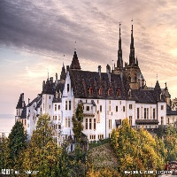
      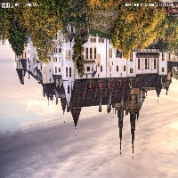
  </center>

- 设置椒盐噪点

  ```python
  rows = img.shape[0]
  cols = img.shape[1]
  channels = img.shape[2]
  for i in range(1000):
      row = random.randint(0, 2000) % rows
      col = random.randint(0, 2000) % cols
      if len(img.shape) > 2:
          img[row][col] = [0, 0, 0]
      else:
          img[row][col] = 0
  show_img("img", img)
  ```

  <center>
      
      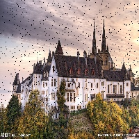
  </center>

- 图像加文字 cv2.putText()

  > 参数1：图像
  >
  > 参数2：文字内容
  >
  > 参数3：坐标位置
  >
  > 参数4：字体
  >
  > 参数5：字号
  >
  > 参数6：颜色
  >
  > 参数7：字体粗细

  ```python
  cv2.putText(img, "good", (50, 50), cv2.FONT_ITALIC, 0.8, (0, 0, 0), 2)
  ```

  <center>
      
      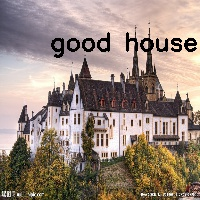
  </center>

- 图像加框 cv2.rectangle()

  > 参数1：图像
  >
  > 参数2：左上角坐标
  >
  > 参数3：右下角坐标
  >
  > 参数4：框的颜色
  >
  > 参数5：框的粗细

  ```python
  cv2.rectangle(img, (50, 50), (100, 100), (0, 0, 255), 1)
  ```

  <center>
      
      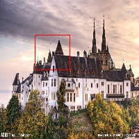
  </center>

- 图像二值化

  ```python
  gray = cv2.cvtColor(img, cv2.COLOR_BGR2GRAY)
  ret, gray = cv2.threshold(gray, 150, 255, cv2.THRESH_BINARY)
  ```

  <center>
      
      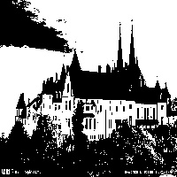
  </center>

- 中值滤波 cv2.medianBlur()

  ```
  gray = cv2.medianBlur(gray, 3)
  ```

  <center>
      
      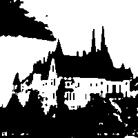
  </center>

- 扩充图像

  ```python
  gray = cv2.copyMakeBorder(gray, 100, 100, 100, 100, cv2.BORDER_ISOLATED, value=0)
  ```

  <center>
      
      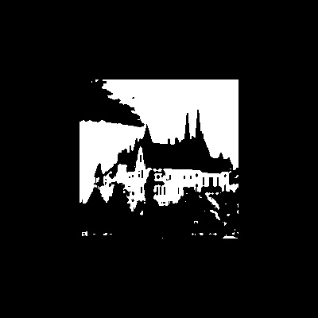
  </center>

- 旋转图像 cv2.getRotationMatrix2D()

  > 首先构建旋转矩阵，确定中心点和旋转的角度 angle，角度为为负顺时针旋转，角度为正逆时针旋转
  >
  > scale 参数表示对图像的放大缩小

  ```python
  rotateMatrix = cv2.getRotationMatrix2D(center=(img.shape[1] / 2, img.shape[0] / 2), angle=-90, scale=1)
  rotImg = cv2.warpAffine(img, rotateMatrix, (img.shape[1], img.shape[0]))
  cv2.imshow("ff", rotImg)
  ```

  <center>
      
      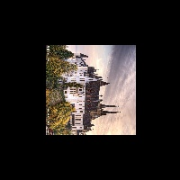
  </center>

- 提取图像轮廓 cv2.findContours()

  > 参数1：图像
  >
  > 参数2：提取规则。cv2.RETR_EXTERNAL：只找外轮廓，cv2.RETR_TREE：内外轮廓都找。
  >
  > 参数3：输出轮廓内容格式。cv2.CHAIN_APPROX_SIMPLE：输出少量轮廓点。cv2.CHAIN_APPROX_NONE：输出大量轮廓点。
  >
  > 输出参数1：图像
  >
  > 输出参数2：轮廓列表
  >
  > 输出参数3：层级
  >
  > 注意：输入的数据需要先进行二值化

  ```python
  # 二值化
  gray = cv2.cvtColor(img, cv2.COLOR_BGR2GRAY)
  ret, gray = cv2.threshold(gray, 150, 255, cv2.THRESH_BINARY)
  
  #  查找轮廓
  contours_map, contours, hierarchy = cv2.findContours(gray, cv2.RETR_EXTERNAL, cv2.CHAIN_APPROX_SIMPLE)
  
  # 去掉轮廓面积小的轮廓
  contours = [contour for contour in contours if cv2.contourArea(contour) > 500]
  
  # 判断像素点是否在某一轮廓内
  # True：输出该像素点到轮廓最近距离，False，输出为正表示在轮廓内，0为轮廓上，负为轮廓外。
  result = cv2.pointPolygonTest(contours[0], (20, 30), False)
  
  # 在每个轮廓的中间添加轮廓的编号
  for idx, c in enumerate(contours):
      # 获取中心点,质心
      M = cv2.moments(c)
      if M["m00"] > 0 and M["m00"]>0:
          cX = int(M["m10"] / M["m00"])
          cY = int(M["m01"] / M["m00"])
  
          # 在轮廓中兴中心写上标签值
          # cv2.circle(img, (cX, cY), 7, (255, 255, 255), -1)
          cv2.putText(img, str(idx), (cX, cY), cv2.FONT_HERSHEY_SIMPLEX, 0.5, (255, 0, 0), 1)
  
  # 在图像上添加边框
  # 第一个参数表示需要添加轮廓的图像，可以是彩色图片
  # 第二个参数表示轮廓列表
  # 第三个表示需要天机的轮廓的 id，-1 表示添加所有
  # 第四个参数表示线条的粗细
  cv2.drawContours(img, contours, -1, (0, 255, 255), 2)
  
  # 包含轮廓的最小外接矩形
  # 返回的是最小外接矩形的（中心(x,y), (宽,高), 旋转角度）
  # 注意：这一步返回的是 float 数据类型
  rect = cv2.minAreaRect(contours[0])
  
  # 获取最小外接矩形的 4 个顶点，且转换为 int 类型
  # np.int0 可以近似理解为 np.int64
  box = np.int0(cv2.boxPoints(rect))
  cv2.drawContours(img, [box], 0, (0, 255, 255), 2)
  
  show_img("new_img", img)
  cv2.imwrite("new_img.jpg", img)
  ```

  <center>
      
      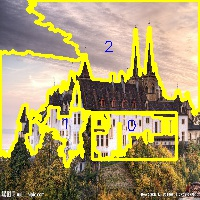
  </center>

- 图像叠加

  ```python
  # 图像进行叠加
  # 注意：图像叠加必须有相同的大小
  img2 = cv2.imread("2.jpg")
  img2 = cv2.resize(img2, (50, 50))
  
  # 找到底图的 ROI，把 img2 叠加到 img 的正中间
  img_shape = img.shape
  img2_shape = img2.shape
  roi_img = img[img_shape[0] // 2 - img2_shape[0] // 2:img_shape[0] // 2 + img2_shape[0] // 2, img_shape[1] // 2 - img2_shape[1] // 2:img_shape[1] // 2 + img2_shape[1] // 2]
  cv2.addWeighted(roi_img, .5, img2, .8, 0., roi_img)
  
  show_img("new_img", img)
  cv2.imwrite("new_img.jpg", img)
  ```

  <center>
      
      
      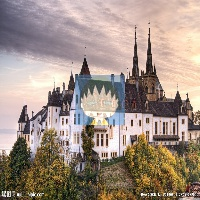
  </center>

  


