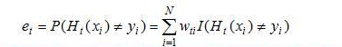
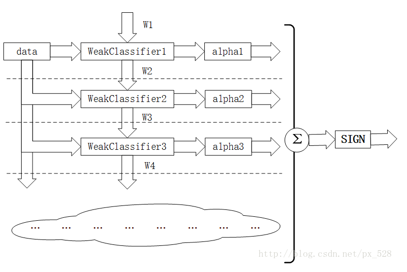

## Adaboost(Adaptive Boosting)

结构图：

>1. 通过数据集 data 与数据权重 W(i) 找到弱分类器 WeakClassifier(i)（使得最终的错误率最小，可以使用迭代或者别的方法找到该弱分类器，**注意：错误率的计算使用的权重值 W**，下面公式 H 表示分类器预测值， y 表示真实值）
>
>   
>
>2. 根据上一步计算的错误率计算出弱分类器权重 alpha(i) （1 - e）且更新数据权重（分类正确的数据权重小，分类错误的数据权重大）
>
>3. 通过加权投票表决的方法，让所有弱分类器进行加权投票表决的方法得到最终预测输出（结果为正：1， 结果为负：-1），计算最终分类错误率，如果最终错误率低于设定阈值（比如5%），那么迭代结束；如果最终错误率高于设定阈值，那么更新数据权重得到 W(i+1)，继续从步骤 1 开始迭代
>
>**注意：数据集 data 是不会改变的，改变的只是权重 W， 理解该算法的重点是两个权重**

例子：

3 轮迭代，各个样本权值和误差率的变化，（D 中加了下划线的表示在上一轮中被分错的样本的新权值）：

1. 训练之前，各个样本的权值被初始化为 D1 = (0.1, 0.1,0.1, 0.1, 0.1, 0.1, 0.1, 0.1, 0.1, 0.1)；
2. **第一轮迭代**中，样本“**6 7 8”**被分错，对应的误差率为 **e1**=P(G1(xi)≠yi) = 3*0.1 = 0.3，此第一个基本分类器在最终的分类器中所占的权重为 **a1** = 0.4236。第一轮迭代过后，样本新的权值为 **D2** = (0.0715, 0.0715, 0.0715, 0.0715, 0.0715,  0.0715, 0.1666, 0.1666, 0.1666, 0.0715)；
3. **第二轮迭代**中，样本**“3 4 5”**被分错，对应的误差率为 **e2**=P(G2(xi)≠yi) = 0.0715 * 3 = 0.2143，此第二个基本分类器在最终的分类器中所占的权重为 **a2**= 0.6496。第二轮迭代过后，样本新的权值为 **D3** = (0.0455, 0.0455, 0.0455, 0.1667, 0.1667,  0.01667, 0.1060, 0.1060, 0.1060, 0.0455)；
4. **第三轮迭代**中，样本**“0 1 2 9”**被分错，对应的误差率为 **e3** = P(G3(xi)≠yi) = 0.0455*4 = 0.1820，此第三个基本分类器在最终的分类器中所占的权重为 **a3** = 0.7514。第三轮迭代过后，样本新的权值为 **D4** = (0.125, 0.125, 0.125, 0.102, 0.102,  0.102, 0.065, 0.065, 0.065, 0.125)。

 从上述过程中可以发现，如果某些个样本被分错，它们在下一轮迭代中的权值将被增大，同时，其它被分对的样本在下一轮迭代中的权值将被减小。就这样，分错样本权值增大，分对样本权值变小，**而在下一轮迭代中，总是选取让误差率最低的阈值（决策点）来设计基本分类器**，所以误差率e（所有被Gm(x)误分类样本的权值之和）不断降低。

综上，将上面计算得到的 a1、a2、a3 各值代入G(x)中，G(x) = sign[f3(x)] = sign[ a1 * G1(x) + a2 * G2(x) + a3 * G3(x) ]，得到**最终的分类器**为：

​		G(x) = sign[f3(x)] = sign[ 0.4236G1(x) + 0.6496G2(x)+0.7514G3(x) ]。

**注意：数据点的权重影响着决策点的选择，权重大的得到更多的关注，权重小的得到更少的关注。**

参考：https://blog.csdn.net/px_528/article/details/72963977

​       	https://blog.csdn.net/px_528/article/details/72963977