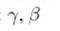
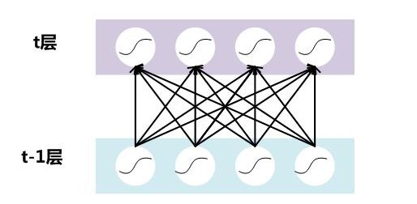
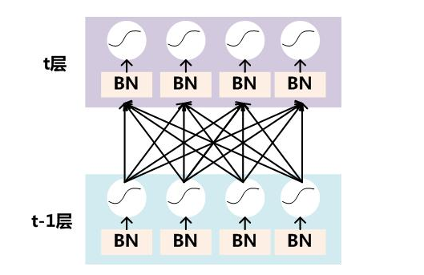
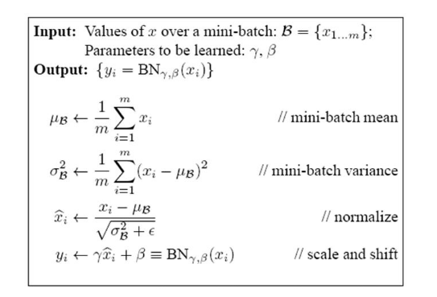

## Batch Norm

为什么使用 Batch Norm：因为当数据流过隐藏层的神经元的时候，数据分布逐渐发生偏移或变动，可能后面会使得数据向着激活函数的最大或最小的方向跑（比如：sigmoid），在经过激活函数（比如：sigmoid，值就变了了 0 或 1），在反向传播的时候就会出现梯度消失（比如：x 值太小经过 sigmoid 接近于 0），从而导致收敛速度变慢。Batch Norm 就是把数据转再换为服从高斯分布，但是这样会降低网络的，所以引入两个参数 

如下是某一神经网络的两层：

加入 Batch Norm：

**注意:是在激活函数（比如： sigmoid）之前加入 NB**

计算过程：

1. 获取当前训练批次在通过某个神经元的后值的平均值
2. 获取当前训练批次在通过某个神经元的后值的方差
3. 把结果值变为服从高斯分布
4. 引入了两个参数 （通过训练，学习获得），因为数据变化后网络的表达能力下降，为了使结果表达能力增强加入了这两个参数。

参考：https://www.cnblogs.com/guoyaohua/p/8724433.html