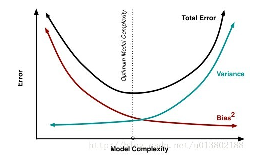
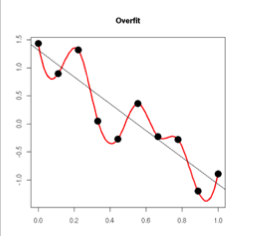

* 欠拟合（训练集和验证集的准确率都低，高偏差低方差）：

  增大epochs（模型还没有收敛）

  增加神经网络层数（模型可能太简单）

* 过拟合（训练集准确率高，验证集准确率低，高方差低偏差）：

  使用dropout或则pooling层

  减少少神经网络层数

  增加更多的数据

* 训练集和验证集的准确率都高（低方差，低偏差），但是模型在测试集上的效果不是很好

  数据的搜集和数据预处理的问题。

  

* 为什么要增加正则化项

  数学解释：过拟合的时候，拟合函数的系数往往非常大，为什么？如下图所示，过拟合，就是拟合函数需要顾忌每一个点，最终形成的拟合函数波动很大。在某些很小的区间里，函数值的变化很剧烈。这就意味着函数在某些小区间里的导数值（绝对值）非常大，由于自变量值可大可小，所以只有系数足够大，才能保证导数值很大。而正则化是通过约束参数的范数使其不要太大，所以可以在一定程度上减少过拟合情况。

  

* control_dependencies 的用法错误

  > control_dependencies 先执行指定的操作（比如下面代码中的 x_plus_1 操作），再执行内部的操作（比如下面代码中的 y = x），但是如下代码输出是 1,1,1,1,1， 而不是 2,3,4,5,6，原因是 control_dependencies 中的代码需要指定操作（会创建结点）才能执行不能只赋值（不会创建结点），把 y = x 改成 y = tf.identity(x) （是操作，会生成结点）  就可以了。
  >
  > **注意：tf.identity 的作用表示返回一个大小一模一样的 tensor。**

  ```python
  x = tf.Variable(1.0)
  y = tf.Variable(0.0)
  
  x_plus_1 = tf.assign_add(x, 1)
  
  with tf.control_dependencies([x_plus_1]):
      # 下面是错误的写法，正确的是 y = tf.identity(x)
      y = x
  
  init = tf.initialize_all_variables()
  with tf.Session() as session:
      init.run()
      for i in xrange(5):
          print(y.eval())
  ```

- 一些总结

  https://blog.csdn.net/attitude_yu/article/details/80963323

- 


