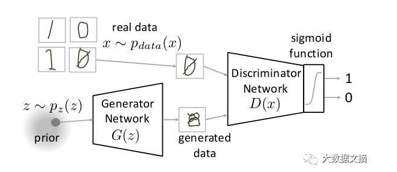

## GAN（对抗生成网络）

- 结构图

  

- 步骤：

  > 1. 生成器生成假数据
  > 2. 判别器分别对真假数据进行判断，并计算损失（真实数据的标签值为1， 假数据的标签值为0，我们希望判别器能把真的判为真，假的判为假），判别器的总损失为两个的和
  > 3. 根据判别器假数据的损失，计算生成器的损失（生成器的标签为 1，和判别器相反，我们的目的是希望我们生成的假数据尽量接近真实数据）

  - `model_inputs`
  - `discriminator`
  - `generator`
  - `model_loss`
  - `model_opt`
  - `train`

1. model_inputs

   > z_dim：表示生成器需要用到的每个样本的初始化维度，即开始需要定义输入数据的 shape 为 [None, z_dim]

   ```python
   def model_inputs(image_width, image_height, image_channels, z_dim):
       """
       Create the model inputs
       :param image_width: The input image width
       :param image_height: The input image height
       :param image_channels: The number of image channels
       :param z_dim: The dimension of Z
       :return: Tuple of (tensor of real input images, tensor of z data, learning rate)
       """
       real_input=tf.placeholder(dtype=tf.float32, shape= [None,image_width,image_height,image_channels])
       z_data=tf.placeholder(dtype=tf.float32, shape=[None, z_dim])
       learn_rate = tf.placeholder(dtype=tf.float32)
       return real_input, z_data, learn_rate
   ```

2. discriminator（判别器）

   ```python
   def discriminator(images, reuse=False):
       """
       Create the discriminator network
       :param images: Tensor of input image(s)
       :param reuse: Boolean if the weights should be reused
       :return: Tuple of (tensor output of the discriminator, tensor logits of the discriminator)
       """
       alpha=0.2
       x = images
       with tf.variable_scope('discriminator', reuse=reuse):
           x = tf.layers.conv2d(x, 64, 4,   strides=2,padding="same",kernel_initializer=tf.contrib.layers.xavier_initializer())
           x = tf.layers.batch_normalization(x, training=True)
           x = tf.maximum(alpha * x, x)
           x = tf.layers.dropout(x, 0.8)
   
           x = tf.layers.conv2d(x, 128, 4, strides=2, padding="same",kernel_initializer=tf.contrib.layers.xavier_initializer())
           x = tf.layers.batch_normalization(x, training=True)
           x = tf.maximum(alpha * x, x)
           x = tf.layers.dropout(x, 0.8)
   
           x = tf.layers.conv2d(x, 256, 4, strides=2, padding="same",kernel_initializer=tf.contrib.layers.xavier_initializer())
           x = tf.layers.batch_normalization(x, training=True)
           x = tf.maximum(alpha * x, x)
           x = tf.layers.dropout(x, 0.8)
   
           x = tf.reshape(x, (-1, 4*4*256))
           logits = tf.layers.dense(x, 1)
           out = tf.sigmoid(logits)
       return out, logits
   ```

3. generator（生成器）

   > training：在训练的时候更新参数， 在测试时不更新参数

   ```python
   def generator(z, out_channel_dim, is_train=True):
       """
       Create the generator network
       :param z: Input z
       :param out_channel_dim: The number of channels in the output image
       :param is_train: Boolean if generator is being used for training
       :return: The tensor output of the generator
       """
       reuse = not is_train
       alpha=0.2
       with tf.variable_scope('generator', reuse=reuse):
           x = tf.layers.dense(z, 4*4*512)
           
           x = tf.reshape(x, (-1,4,4,512))
           x = tf.layers.batch_normalization(x,training=is_train)
           x = tf.maximum(alpha * x, x)
           x = tf.layers.dropout(x, 0.8)
          
           x = tf.layers.conv2d_transpose(x, 256, 4, strides=1, padding="valid",kernel_initializer=tf.contrib.layers.xavier_initializer())
           x = tf.layers.batch_normalization(x,training=is_train)
           x = tf.maximum(alpha * x, x)
           x = tf.layers.dropout(x, 0.8)
           
           x = tf.layers.conv2d_transpose(x, 128, 4, strides=2, padding="same",kernel_initializer=tf.contrib.layers.xavier_initializer())
           x = tf.layers.batch_normalization(x,training=is_train)
           x = tf.maximum(alpha * x, x)
           x = tf.layers.dropout(x, 0.8)
   
           x = tf.layers.conv2d_transpose(x, out_channel_dim, 4, strides=2, padding="same",kernel_initializer=tf.contrib.layers.xavier_initializer())
           logits = x
           out = tf.tanh(logits)
       return out
   ```

4. loss（损失函数）

   ```python
   def model_loss(input_real, input_z, out_channel_dim):
       """
       Get the loss for the discriminator and generator
       :param input_real: Images from the real dataset
       :param input_z: Z input
       :param out_channel_dim: The number of channels in the output image
       :return: A tuple of (discriminator loss, generator loss)
       """
       smooth = 0.1
       
       # 生成器生成数据，判别器分别判断真、伪
       _, d_logits_real = discriminator(input_real, reuse=False)
       fake = generator(input_z, out_channel_dim, is_train=True)
       d_logits_fake = discriminator(fake, reuse=True)
       
       # 真实的数据通过判别器标签值为 1，加入 smooth 的目的是希望我们生成的结果有一定的探索性，不一
       # 定和原始数据一模一样
       d_loss_real = tf.reduce_mean(tf.nn.sigmoid_cross_entropy_with_logits(
           logits=d_logits_real, labels=tf.ones_like(d_logits_real) * (1 - smooth)))
       
       # 生成器生成的数据的标签值为 0
       d_loss_fake = tf.reduce_mean(tf.nn.sigmoid_cross_entropy_with_logits(
          logits=d_logits_fake, labels=tf.zeros_like(d_logits_fake)))
      
   	# 判别器的总损失为如上两个损失的和，目的是希望对的判对，错的判错
       d_loss = d_loss_real + d_loss_fake
   
       # 生成器希望生成的数据都是对的，所以标签为 1，刚好和判别器相反 
       g_loss = tf.reduce_mean(tf.nn.sigmoid_cross_entropy_with_logits(
          logits=d_logits_fake, labels=tf.ones_like(d_logits_fake)))
       return d_loss, g_loss
   ```

5. optimization（优化）

   ```python
   def model_opt(d_loss, g_loss, learning_rate, beta1):
       """
       Get optimization operations
       :param d_loss: Discriminator loss Tensor
       :param g_loss: Generator loss Tensor
       :param learning_rate: Learning Rate Placeholder
       :param beta1: The exponential decay rate for the 1st moment in the optimizer
       :return: A tuple of (discriminator training operation, generator training operation)
       """
       # 把生成器和判别器的参数分开
       t_vars = tf.trainable_variables()
       g_vars = [var for var in t_vars if var.name.startswith('generator')]
       d_vars = [var for var in t_vars if var.name.startswith('discriminator')]
       
       # 把生成器和判别器的操作分开
       all_update_ops = tf.get_collection(tf.GraphKeys.UPDATE_OPS)
       g_update_ops = [var for var in all_update_ops if 
                       var.name.startswith('generator')]
       d_update_ops = [var for var in all_update_ops if
                       var.name.startswith('discriminator')]
   
       # 保证 d_train_opt 在 d_update_ops 之后执行
       with tf.control_dependencies(d_update_ops):
           d_train_opt = tf.train.AdamOptimizer(learning_rate, beta1=beta1)
           .minimize(d_loss, var_list=d_vars)
       
       # 保证 g_train_opt 在 g_update_ops 之后执行
       with tf.control_dependencies(g_update_ops):
           g_train_opt = tf.train.AdamOptimizer(learning_rate, beta1=beta1)
           .minimize(g_loss, var_list=g_vars)
       
       return d_train_opt, g_train_opt
   ```

6. train（训练）

   > z_dim：表示生成器刚开始初始化的值

   ```python
   import time
   def train(epoch_count, batch_size, z_dim, learning_rate, beta1, get_batches, data_shape, data_image_mode):
       """
       Train the GAN
       :param epoch_count: Number of epochs
       :param batch_size: Batch Size
       :param z_dim: Z dimension
       :param learning_rate: Learning Rate
       :param beta1: The exponential decay rate for the 1st moment in the optimizer
       :param get_batches: Function to get batches
       :param data_shape: Shape of the data
       :param data_image_mode: The image mode to use for images ("RGB" or "L")
       """
       inputs_real, inputs_z, lr = model_inputs(data_shape[1], data_shape[2],   data_shape[3], z_dim)
       d_loss, g_loss = model_loss(inputs_real, inputs_z, data_shape[-1])
       d_train_opt, g_train_opt = model_opt(d_loss, g_loss, learning_rate, beta1)
       step = 0 
       
       with tf.Session() as sess:
           sess.run(tf.global_variables_initializer())
           for epoch_i in range(epoch_count):
               for batch_images in get_batches(batch_size):
                   # 训练模型
                   start_time = time.time()
                   step = step + 1
                   batch_images = batch_images * 2
                   
                   # 随机生成生成器的开始的数据
                   batch_z = np.random.uniform(-1, 1, size=(batch_size, z_dim))
                   
                   # 训练且优化判别器和生成器
                   _ = sess.run(d_train_opt, feed_dict={inputs_real: batch_images, inputs_z: batch_z, lr:learning_rate})
                   _ = sess.run(g_train_opt, feed_dict={inputs_z: batch_z, lr:learning_rate})
                   
                   if step % 100 == 0:
                       train_loss_d = d_loss.eval({inputs_z:batch_z, inputs_real: batch_images})
                       train_loss_g = g_loss.eval({inputs_z:batch_z})
                       print("Epoch {}/{} Step {}...".format(epoch_i+1, epoch_count, step),
                         "Discriminator Loss: {:.4f}...".format(train_loss_d),
                         "Generator Loss: {:.4f}".format(train_loss_g),
                         "... Time spent={:.4f}".format(time.time() - start_time))    
   
                   if step % 200 == 0:
                       show_generator_output(sess, 25, inputs_z, data_shape[3], data_image_mode)
   ```

7. 数据集上执行训练

   ```python
   batch_size = 64
   z_dim = 100
   learning_rate = 0.001
   beta1 = 0.5
   epochs = 10
   
   mnist_dataset = helper.Dataset('mnist', glob(os.path.join(data_dir,'mnist/*.jpg')))
   with tf.Graph().as_default():
       train(epochs, batch_size, z_dim, learning_rate, beta1,
             mnist_dataset.get_batches, mnist_dataset.shape, mnist_dataset.image_mode)
   ```

8. 展示生成器生成的数据

   ```python
   import numpy as np
   
   def show_generator_output(sess, n_images, input_z, out_channel_dim, image_mode):
       """
       Show example output for the generator
       :param sess: TensorFlow session
       :param n_images: Number of Images to display
       :param input_z: Input Z Tensor
       :param out_channel_dim: The number of channels in the output image
       :param image_mode: The mode to use for images ("RGB" or "L")
       """
       cmap = None if image_mode == 'RGB' else 'gray'
       z_dim = input_z.get_shape().as_list()[-1]
       example_z = np.random.uniform(-1, 1, size=[n_images, z_dim])
   
       samples = sess.run(
           generator(input_z, out_channel_dim, False),
           feed_dict={input_z: example_z})
   
       images_grid = helper.images_square_grid(samples, image_mode)
       pyplot.imshow(images_grid, cmap=cmap)
       pyplot.show()
   ```

代码地址：https://github.com/tonyxxq/face_generation


