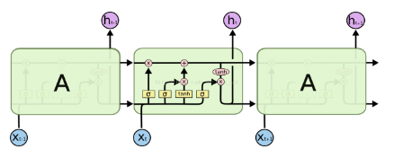

## RNN(Recurrent Neural Network)

- RNN 是一类用于处理序列数据的神经网络，意思就是后面的数据依赖前面的数据。

- 结构图

  > 和普通的神经网络不一样的是上一步的隐藏层的数据会传到下一步的隐藏层，有如下两个特点
  >
  > 1. 权值共享， 同一层的权值是一致的，比如下图中的 W
  > 2. 每次传递都是在相同的隐藏层神经元之间，不能传递到不同层的神经元
  >
  > 下图中的各个参数介绍：
  >
  > x：输入数据
  >
  > h：隐藏层单元
  >
  > W：隐藏层单元权重
  >
  > o：输出数据
  >
  > L：损失函数
  >
  > y：标签

  

- N vs M, 这种结构又叫Encoder-Decoder模型，也可以称之为Seq2Seq模型

  > 上面定义的 RNN 的输入和输出序列的大小是一致的，但是实际中可能是不一样的，比如：机器翻译，翻译之前和之后的语句长短很可能不一致。

  那么就可能遇见如下几种情况：

  

  

  所以就引入了 seq2seq 模型（先编码后解码），属于 RNN 的变种：

  

- 创建 RNN 的步骤

  - get_inputs
  - get_init_cell
  - get_embed
  - build_rnn
  - build_nn
  - get_batches

- Input

  > 输入层，定义输入数据，结果数据和学习率

  ```python
  def get_inputs():
      """
      Create TF Placeholders for input, targets, and learning rate.
      :return: Tuple (input, targets, learning rate)
      """
      input_data = tf.placeholder(tf.int32, [None, None], name='input')
      targets = tf.placeholder(tf.int32, [None, None] , name='targets')
      learning_rate = tf.placeholder(tf.float32, name='learning_rate')
      return input_data, targets, learning_rate
  ```

- 创建 RNN Cell 并进行初始化

  ```python
  def get_init_cell(batch_size, rnn_size):
      """
      Create an RNN Cell and initialize it.
      :param batch_size: Size of batches
      :param rnn_size: Size of RNNs
      :return: Tuple (cell, initialize state)
      """
      def lstm_cell():
          lstm = tf.contrib.rnn.BasicLSTMCell(rnn_size)
          return lstm
      cell = tf.contrib.rnn.MultiRNNCell([lstm_cell() for _ in range(2)])
      initial_state = cell.zero_state(batch_size, tf.float32)
      InitailState = tf.identity(initial_state, name='initial_state')
      return cell, InitailState
  ```

- 创建查找表

  > 找到数字和单词的映射关系，包括单词到数字，数字到单词

  ```python
  import numpy as np
  import problem_unittests as tests
  
  def create_lookup_tables(text):
      """
      Create lookup tables for vocabulary
      :param text: The text of tv scripts split into words
      :return: A tuple of dicts (vocab_to_int, int_to_vocab)
      """
      text=set(text)
      vocab_to_int={c:i for i,c in enumerate(text)}
      int_to_vocab=dict(enumerate(text))
      return vocab_to_int, int_to_vocab
  ```

- 标点符号

  > 我们会把电视剧脚本分隔（空格）成单词数组，但是神经网络比较难理解比如： "bye" 和 "bye!"的区别，
  >
  > 所以把标点符号变成指定的字符。建立如下的映射关系。

  ```python
  def token_lookup():
      """
      Generate a dict to turn punctuation into a token.
      :return: Tokenize dictionary where the key is the punctuation and the value is the token
      """
      tokenize_dict={".":"||Period||",",":"||Comma||",'"':"||QuotationMark||",\
                  ';':"||Semicolon||","!":"||Exclamationmark||","?":"||Questionmark||",\
                  '(':"||LeftParentheses||",")":"||RightParentheses||","--":"||Dash||",\
                  '\n':'Return'}
      return tokenize_dict
  
  ```

- 创建 RNN 结构

  ```python
  def get_init_cell(batch_size, rnn_size):
      """
      Create an RNN Cell and initialize it.
      :param batch_size: Size of batches
      :param rnn_size: Size of RNNs
      :return: Tuple (cell, initialize state)
      """
      # 定义一个 LSTM 单元格（好比是神经网络中的一层）
      def lstm_cell():
          lstm = tf.contrib.rnn.BasicLSTMCell(rnn_size)
          return lstm
      # 多个 LSTM 单元格进行叠加（构建多层的网络，深度学习）
      cell = tf.contrib.rnn.MultiRNNCell([lstm_cell() for _ in range(2)])
      # 初始状态，tf.identity 是创建一个操作（结点），值和 initial_state 一行
      initial_state = cell.zero_state(batch_size, tf.float32)
      InitailState = tf.identity(initial_state, name='initial_state')
      return cell, InitailState
  ```

- 

