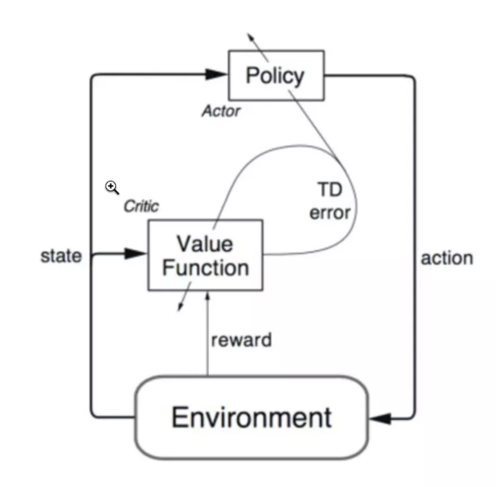

## Actor-Critic

Q-learning ：优点： 学习效率高，能进行单步更新；缺点：不能处理连续动作

Policy Gradients：优点： 能处理连续动作；缺点：学习效率低，回合更新

Actor-Critic：Q-learning 和  Policy Gradients 的合体, Actor来选择动作，Critic 来告诉 Actor 它选择的动作是否合适。

缺点：

Actor-Critic 涉及到了两个神经网络, 而且每次都是在连续状态中更新参数（不是在记忆中学习）, 每次参数更新前后都存在相关性, 导致神经网络只能片面的看待问题, 甚至导致神经网络学不到东西。

步骤：

1. 把状态 s 输入 actor 神经网络， 获取 action
2. 在环境中执行 action，并获取 reward 和新的状态 s`
3. 状态 s` 输入 critic 神经网络，获取未来预测的 Q 值, 状态 s 输入 critic 神经网络，获取上一状态 s 的 Q 值
4. 根据公式 **TD = r + gamma \* f(s') - f(s)** 计算 TD error,即为， 其中 gamma 是折扣因子, r 当前获取的奖励
5. 把 TD error （loss）反向传播调整 actor 和 critic 网络