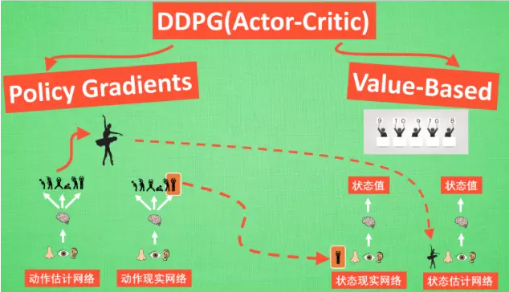
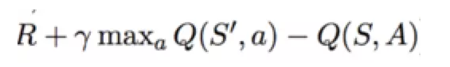
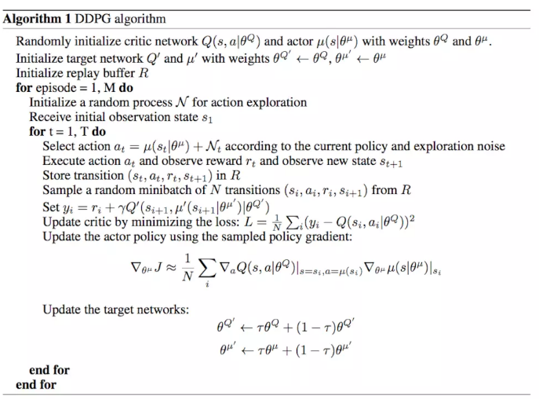

# DDPG(Deep Deterministic Policy Gradient)

DDPG 是 Actor-Critic（数据不是独立同分布，没有在记忆中学习） 和 DQN（action 范围很多的时候会很崩溃）算法的结合体，解决相互之间的缺点，又综合了各自的优点。**DDPG  的 actor 输出的是一个确定的动作且使用了样本数据集**。

网络结构：

> 使用了类似 DQN 的双网络结构，而且Actor和Critic都有 target-net 和 eval-net。只训练 eval-net， target-net 每隔一段时间复制 eval-net 的参数值。

算法：

> - 分别初始化 actor 和 critic 的 eval 和 target 网络参数
>
> - 初始化样本空间（随机选择一个动作执行并获取奖励和下一步的状态值，存入样本空间）
>
> - 当收集到足够的样本， 循环
>
>   - 根据当前策略 actor 的 target net（带噪声）选择一个动作执行并获取奖励和下一步的状态值 S`，
>
>     存入样本数据集
>
>   - 获取一个批次的样本数据集，状态 S 输入到 critic 的 target 网络，获取输出结果 Q（S, A）
>
>     ​						  状态 S\` 输入到 critic 的 eval 网络，获取输出结果 Q（S`, a）
>
>   - 根据公式计算 critic 网络的损失函数：
>
>   - 计算 actor 网络的损失函数，因为上一步获取的 Q 值越大则损失越小，反之亦然。所以，loss = -Q 
>   - 更新网络参数（soft 方式，每次只更新一点）
>   - 当每执行到一定步，分别复制参数到 target 网络

\

