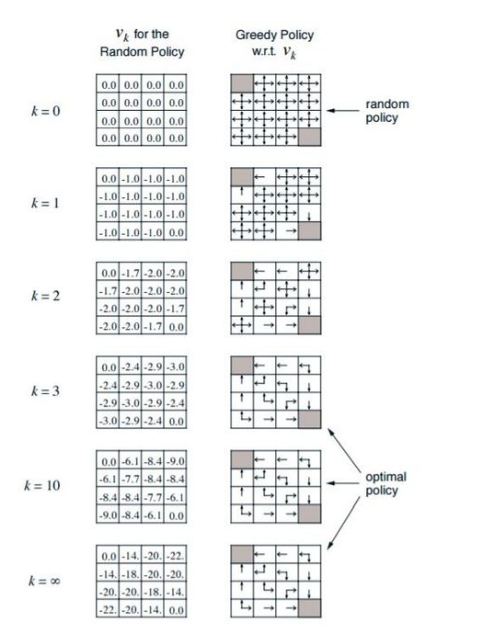
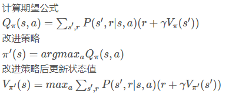
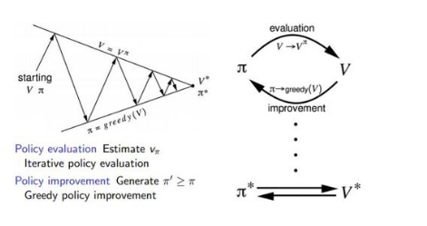
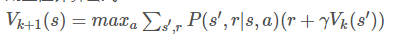

## Dynamic Programming （动态规划）

使用动态规划求解强化学习问题，要求一个完全已知的环境模型，即 MDP 的五元组全部已知，主要指状态转移概率已知。

使用动态规划解决问题需要需要满足如下两条性质：

- 最优结构：①满足最优原理；②最优的解可以被分解成子问题的最优解
- 交叠式子问题：①子问题能够被多次重复；②子问题的解要能够被缓存并再利用

恰好 MDP 就满足这两个性质：

- 贝尔曼方程是递归的形式，把问题分解成子问题
- 值函数有效的存储了子问题的解，并能够再利用

主要有如下几个类别：

1. 策略评估

   > 就是对当前策略下计算出每个状态下的状态值，这就是策略预估，我们也把它称为预测问题

   **注意：策略评估没有更新策略，每一次的值都是根据上一次的值计算出来的，这是和策略迭代的区别，策略迭代更新值之后需要更新策略**

   例子（策略是在每个方向的概率都是相等的）：

   

2. 策略改进（策略迭代）

   > 每更新一步状态值 v，就更新一下策略值 v

   1. 使用当前策略 π ，计算当前策略最终状态价值 v
   2. 根据当前状态价值 v，使用一定的方法（比如贪心算法）更新策略 π
   3. 重复1， 2步，直到得到收敛的策略 π 和状态 v

   公式：

   

   流程图：

   

3. 价值迭代

   > 对每一个当前状态 s , 对每个可能的动作 a 都计算一下采取这个动作后到达的下一个状态的期望价值。看看哪个动作可以到达的状态的期望价值函数**最大**（策略评估求的是所有动作的的期望而不是最大），就将这个最大的期望价值函数作为当前状态的价值函数 V(s)  循环执行。与策略迭代不同的是值迭代是根据状态期望值选择动作，而策略迭代是根据概率选择动作。
   >
   > 使用值迭代的算法：Q-learning

   公式：