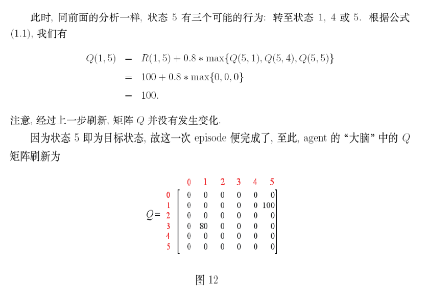
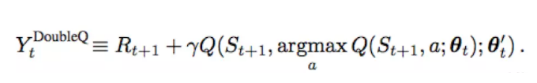
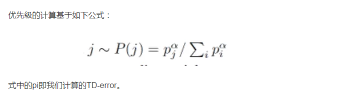

## DQN

####Q-learning：

例子：





步骤：

> 注意：在更新 Q 表时，使用贝尔曼方程，假设下一状态 Q 值已经求出来了，而不是累加。

1. 给定折扣因子和 reward 矩阵 R 

2. 令 Q = 0（Q 表示 Q table）

3. 循环

   - 随机选择一个初始状态， 并随机选择该状态的一个行为 a

   - 利用如上随机选择的行为，确定下一个状态

   - 查询出 Q 表中**下一状态**最大的 Q 值和**当前状态和行为**在 Reward 矩阵中的奖励值，使用如下公式计算

     

   - 更新 Q 表
   - 如果下一状态是目标状态，再随机选择状态和行为，否则使用下一状态继续执行 和 更新 Q 表

#### DQN

算法：


1. 初始化样本容量 N， 在记忆中学习，其实就是记忆之前观察的数据，包括当前状态、下一状态、行为、奖励值、是否终止等

2. 初始化 target_q 网络（对应 Q-learning 中的 Q 表，代表未来预测奖励值）, 初始化 eval_q 网络

3. 循环如下

   4.1 获取模拟器观察值，输入 eval_q  神经网络，获取值最大的 action

   4.2 在模拟器中执行该 action，并获得返回的奖励、下一个状态、是否终止，更新样本数据集

   4.3 如果当样本数据集达到样本容量，训练（也可多观察几步再训练数据）

   ​	4.3.1 随机获取批量样本数据，分别输入eval_q 网络  和 target_q 网络

   ​	4.3.2 根据公式计算奖励值 R(s, a) 表示该批次数据的奖励值， 表示 target_q 输出值，即未来预		    测的奖励值，结果 Q(s, a) 作为 eval_q 网络的 lable

   ​		

   ​	4.3.3 使用上面计算出的 Q(s, a) 和 eval_q 的输出值，使用 SGD 进行反向传播，更新 eval_q 参数，这样  就能保证 eval_q  网络是在上升的（之前一直没明白这个地方）

   4. 4  训练一定次数后，更新 target_q参数  为 eval_q  参数

**注意：如果 terminal 是 true 的话没有未来预测，所以是 0 。添加样本集合的目的是因为采集的数据前后有很强的相关性，为了打乱这种相关性，使用在记忆中学习的方式。**


#### DQN 的三大改进

1. Double DQN

   

   DQN，我们根据状态s'选择动作a'的过程，以及估计Q(s',a')使用的是同一张Q值表，或者说使用的同一个网络参数，这可能导致选择过高的估计值，从而导致过于乐观的值估计。为了避免这种情况的出现，我们可以对选择和衡量进行解耦，从而就有了双 Q 学习，在Double DQN中，q-target的计算基于如下的公式：

   

   我们根据一张Q表或者网络参数来选择我们的动作a',再用另一张Q值表活着网络参数来衡量Q(s',a')的值。

2. Prioritised replay

   在 DQN 的样本集中选取的数据可能很多都是没有奖励值的，在 action 值多的时候最明显，这时学习速率很慢。为了解决这个问题，使用了 Prioritised replay 算法， 我们 batch 抽样的时候并不是随机抽样, 而是按照 Memory 中的样本优先级来抽。 所以这能更有效地找到我们需要学习的样本. 样本的优先级如何确定？我们可以用到 **TD-error**, 也就是 q-target - q-eval 来规定优先学习的程度. 如果 TD-error 越大, 就代表我们的预测精度还有很多上升空间, 那么这个样本就越需要被学习, 也就是优先级 p 越高。

   

   使用了 **SumTree** 算法抽取样本数据：

3. Dueling-DQN

   在某些状态下状态值和动作关系不大，如下，上面图片中赛车和当前的动作关系不大，下面的赛车和当前的动作关系比较大。（不用知道这个图是怎么制作出来的）

   

   所有就把之前 DQN 最后一层的 q 值分解成 state value 和 action， 然后求和。

   结构图如下：第一幅图是普通的 DQN ；第二幅图是使用 Dueling-DQN，表明在状态相同的时候，执行不同的操作优势是不一样的。

   


​	公式：

​	

​	部分实现例如下：

```
with tf.variable_scope('Value'):
     w2 = tf.get_variable('w2',[n_l1,1],initializer=w_initializer,collections=c_names)
     b2 = tf.get_variable('b2',[1,1],initializer=b_initializer,collections=c_names)
     self.V = tf.matmul(l1,w2) + b2

with tf.variable_scope('Advantage'):
     w2 = tf.get_variable('w2',[n_l1,self.n_actions],initializer=w_initializer,collections=c_names)
     b2 = tf.get_variable('b2',			  [1,self.n_actions],initializer=b_initializer,collections=c_names)
     self.A = tf.matmul(l1,w2) + b2

with tf.variable_scope('Q'):
     out = self.V + (self.A - tf.reduce_mean(self.A, axis=1, keep_dims=True))
```


#### Deep Recurrent Q Network(DRQN)

DRQN 主要用于部分可观察问题


DRN 论文：https://arxiv.org/pdf/1312.5602.pdf

Double-DQN 论文：[https://arxiv.org/pdf/1509.06461v3.pdf](https://link.jianshu.com/?t=https%3A%2F%2Farxiv.org%2Fpdf%2F1509.06461v3.pdf)

Dueling-DQN论文：https://arxiv.org/pdf/1511.06581.pdf

