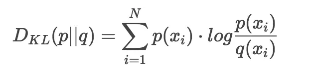

## KL散度（Kullback–Leibler divergence）

KL 散度可以计算两个分布之间的相似性

公式：

> p 表示观察的分布，q 表示去拟合 p 的分布

使用K-L散度优化模型：

当确定分布之后，使用不同的概率值去验证 KL 散度，直到找到合适的概率值。

KL 散度和交叉熵之间可以转换：KL divergence(p||q) = cross entropy(p, q) - entropy(p)

