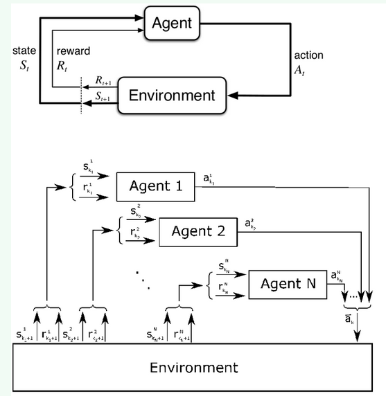

## 多智能体强化学习（MARL）

多智能体强化学习（MARL）是一门深度学习学科。它关注的是那些包含多个智能体的模型，这些智能体通过和环境动态交互来学习。在单智能体强化学习的环境中，环境的状态仅仅取决于单个智能体的变化。在多智能体环境中，环境的状态受到场景中所有智能体变化的影响。从这个角度来看，我们可以把MARL环境看成一个元组{X1-A1,X2-A2….Xn-An} ，其中 Xm 是给定的智能体， Am 是给定的动作（变化）。**环境的新状态由 A1xA2x….An定义的一组连接动作决定**。也就是说，**MARL场景的复杂性随着场景中智能体数量的增加而增加**。

单智能体和多智能体对比：

**另一个增加 MARL 场景复杂性的因素与智能体的行为有关**。在许多情况下，MARL模型中的智能体可以合作、竞争或表现出中立行为。为了处理这些复杂性，MARL技术借鉴了一些博弈论中的思想，当模型环境中出现多个参与者时，这些思想非常有用。常见的博弈模型：

**静态博弈**：是指所有参与者在**不知道其他参与者决策的情况下**，同时做出决策（或选择一种决策）的一种博弈。即使决策可能不是在同一时间做出的，博弈仍旧是同步的，因为每个参与者都不知道其他人的决策。因此，这就好像是在同一时间做出决策。

**动态博弈**：各博弈方的选择和行动**不仅有先后顺序，而且后选择后行动的博弈方在自己选择行动之前，可以看到其他博弈方的行动选择，甚至还包括自己的行动选择**。这种博弈无论如何都无法看做同时决策。

**重复博弈**：是指参与者通过多次类似阶段博弈（如囚徒困境），进行互动的一种博弈。不同于一次性博弈，重复博弈**允许策略决策参考过去的动作，进而对后续博弈起到奖惩效果**。

**阶段博弈**：重复博弈的每次博弈称为阶段博弈