## MDP

1. 几乎所有的 RL 问题都能通过 MDPs 来描述：

   - 最优控制问题可以用 MDPs 来描述;
   - 部分观测环境可以转化成 POMDPs;
   - 赌博机问题是只有一个状态的 MDPs;

2. 马尔科夫性

   > 状态 St 包含了所有历史相关信息

   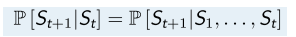

   例子：下棋时只关心当前局面，俄罗斯方块也只关心当前屏幕。

   状态之间的转换概率，使用状态转移矩阵：

   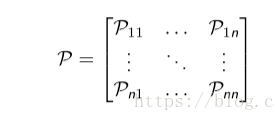

   函数表示：

   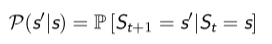

3. 马尔科夫过程

   说白了就是各种状态组成序列，也称为马尔科夫链，描述的是状态之间的转移关系。

4. 片段（episode）

   强化学习中，从初始状态 S1 到**终止状态**的序列过程，被称为一个片段（episode），S1, S2，... ，ST

   - 如果一个任务**总以终止状态结束**，那么这个任务被称为片段任务；
   - 如果一个任务**没有终止状态**，会被无限执行下去，这被称为连续性任务。

5. 马尔科夫奖励过程（MRP）

   在马尔科夫过程的基础上加上马尔科夫奖励，就是 MRP

6. 回报

   奖励值：对每一个状态的评价；

   回报值：对每一个片段的评价。

7. 衰减值

   回报中，考虑未来的奖励是逐渐衰减的

8. 值函数

   某一个状态的回报是对某一个片段的结果，值函数是**该状态**所有回报的期望值。

9. MRPs 的贝尔曼方程

   > 瞬时奖励 Rt+1 加上后继状态 St+1 的值函数，这是强化学习的核心理论之一

   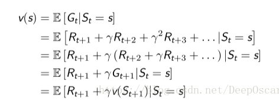

   > 如果已知转移矩阵，上面的结果可以转换为

   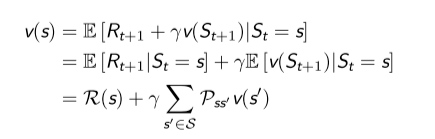

   > 贝尔曼方程的矩阵形式：

   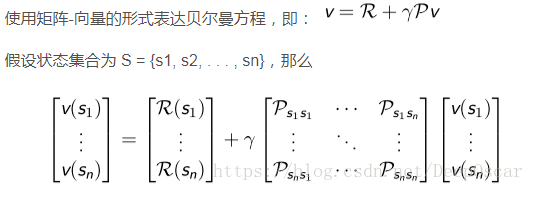

   > 可以直接求解，仅限于小的 MPRs：

    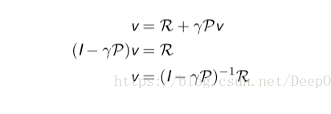

10. MDP

    **马尔科夫过程的目的是找到决策，MPR 迭代一定次数后，通过观察能找到比较好的策略，为了一般性，使用函数，即策略函数**(这个地方之前一直没搞明白)

    把 MRP 针对状态的奖励变成了针对 〈s, a〉 的奖励（因为不同两个状态，通过动作到达相同状态的奖励可能是不一样的，会有不同的代价）；能通过动作进行控制的状态转移，由原来的状态转移概率变成了动作；

11. 策略

    把之前的状态转移矩阵分为两部分，两部分的乘积作为新的状态转移概率：

    1. 能被智能体控制的策略，即 policy；
    2. MDPs中的 **转移矩阵P** (不受智能体控制，认为是环境的一部分)。

    定义：在MDPs中，一个策略 π 是在给定状态下的动作的概率分布，。

    假设动作是有限的，我们就会写成一个向量，向量上的值对应相应动作的概率，该向量求和为1，不同的状态就会对应不同的向量值。当为确定性策略的时候，就不是一个分布问题了，就是a=π。

    - 策略是对智能体行为的全部描述，若策略给定，所有动作将被确定。
    - 在 MDPs 中的策略是基于马尔科夫状态的（而不是基于历史的）
    - 策略是时间稳定的，只和 s 有关，与时间 t 无关。
    - 策略是 RL 问题的终极目标

    如果策略的概率分布输出的是独热的，那么称为确定性策略，否则为随机策略

12. MDP 和 MRP 的关系

    对于一个MDP问题 〈S, A, P,R, γ〉，如果给定了策略 π，MDP 将会退化成 MRP，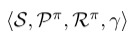

    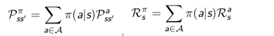

13. MDP 值函数

    V （状态函数） 和 Q（状态动作函数） 

    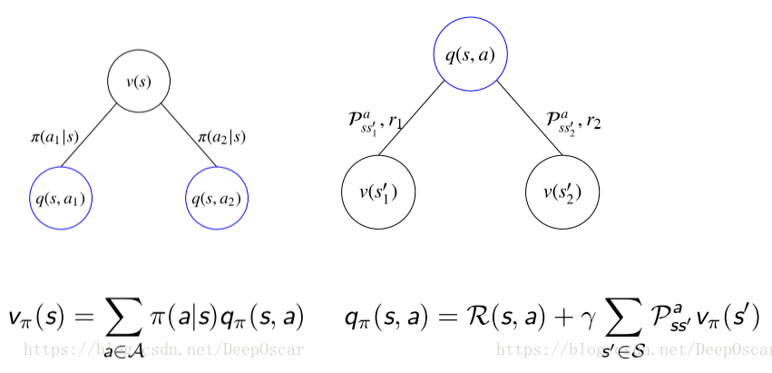

    贝尔曼期望方程 V 函数:

    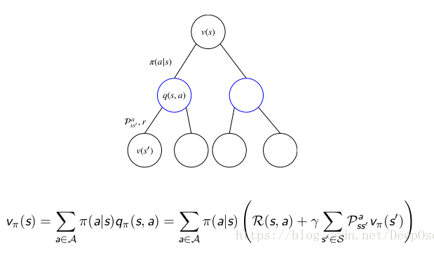

    ​	等价于：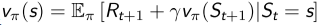

    贝尔曼期望方程 Q 函数:

    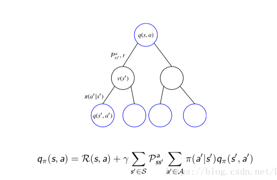

    等价于：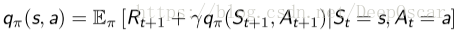

14. 最优值函数

    之前值函数，以及贝尔曼期望方程针对的都是给定策略 π 的情况，是一个评价的问题。我们的目标是找到最好的策略。

    定义：最优值函数指的是在**所有**策略中的值函数最大值，其中包括最优 V 函数和最优 Q 函数：

    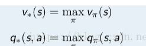

    策略比较关系：

    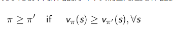

    定理：

    对于任何 MDP 问题，

    - 总存在一个策略 π* 要好于或等于其他所有的策略，π∗ ≥ π, ∀π；
    - 所有的最优策略都能够实现最优的 V 函数 vπ∗(s) = v∗(s)
    - 所有的最优策略都能够实现最优的 Q 函数 qπ∗(s,a) = q∗(s,a)

    当我们已知了最优 Q 函数后，我们能够马上求出最优策略，只要根据 q∗(s, a) 选择相应的动作即可。

    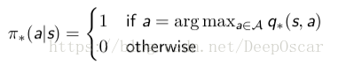

    可以看出对于任何 MDPs 问题，总存在一个确定性的最优策略，因为在所有的动作中，总存在一个使得 Q 值最大的动作。执行某一个动作比其他动作的 Q 都大，则是最优。

15. v∗ 与 q∗ 的相互转化

    > 注意：和贝尔曼期望方程不同的是此处不是期望，而是求**最大值**。

    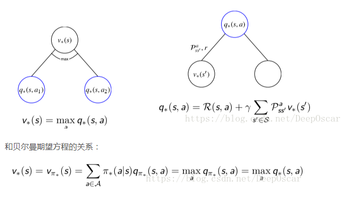

    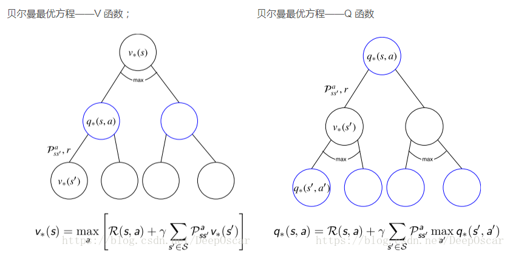

    最优值函数和和贝尔曼期望方程的关系:

    - 贝尔曼最优方程本质上就是利用了 π∗ 的特点，将求期望的算子转 化成了 MAXa
    - 在贝尔曼期望方程中，π 是已知的。而在贝尔曼最优方程中，π∗ 是未知的
    - 解贝尔曼期望方程的过程即对应了评价，解贝尔曼最优方程的过程即对应了优化**(没明白)**

16. 解贝尔曼最优方程

    值迭代

    策略迭代

参考：https://blog.csdn.net/DeepOscar/article/details/81036635

