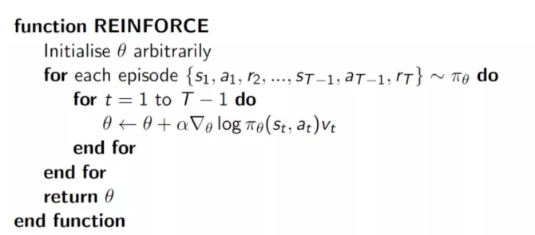

# Policy Gradient

基于值的强化学习算法的基本思想是根据当前的状态，计算采取每个动作的价值，然后根据价值贪心的选择动作。如果我们省略中间的步骤，即直接根据当前的状态来选择动作，也就引出了强化学习中的另一种很重要的算法，即**策略梯度(Policy Gradient)**。

简单来说，只用一个神经网络，输入观察值， 输出每一个动作的概率。但是训练神经网络的需要使用正确的标签值，但是我们只有奖励值。

**如果一个动作得到的 reward 多，那么我们就使其出现的概率增加，如果一个动作得到的 reward 少，我们就使其出现的概率减小。**

可以定义损失函数： **loss= -log(prob)\*vt** 

上式中 log(prob) 表示在状态 s 对所选动作 a 的吃惊度, 即网络的输出值, 如果概率越小, 反向的log(prob) 反而越大. 而vt代表的是当前状态 s 下采取动作 a 所能得到的奖励，这是当前的奖励和未来奖励的贴现值的求和，每次训练前需要先生成 episode 数据， 训练完成清空， 之后再生成 episode  数据， 再清空...

算法：

