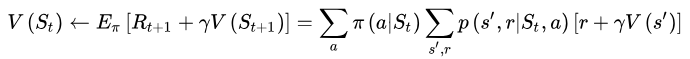
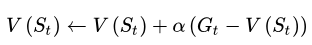
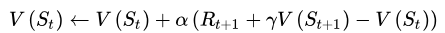
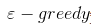
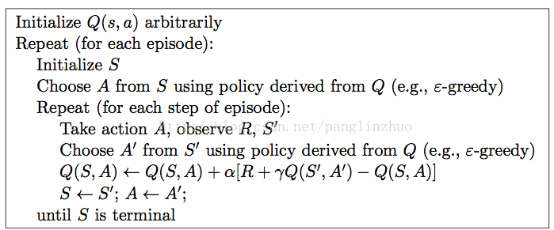
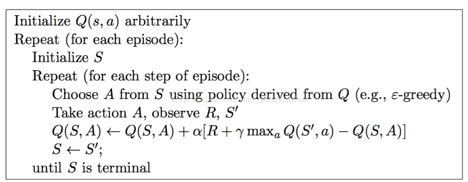

## 时间差分学习(Temporal-Difference learning)

它结合了 DP和 MC，并兼具两种算法的优点

DP 更新值函数公式，可以重复使用后继值，计算量小，但是需要模型：

MC 更新值函数公式，每次计算需要把状态执行到结束，不需要模型（采样），很耗时：

TD 更新值函公式不需要模型（采样），且不耗时：

**Sarsa 和 Q-learning 都属于时间差分学习算法**

> 这两个算法差不多，只是在更新状态 Q-learning 直接选下个状态 Q 值最大的动作，而到下一步选择动作的时候再选一遍，Sarsa 通过策略选择下个状态的动作， 到下一步选择动作的时候上一步已经确定，不用再选。
>
> Sarsa：属于 on-policy， 下一个状态的动作在上一个状态就已经确定了，用一个 算法就够了
>
> Q-learning：属于 off-policy， 下一个状态的动作在上一个状态没有确定。选择动作使用 
>
> 算法， 选择 Q 值使用最大 Q 值

Sarsa 算法

1. 初始化状态 S（可以随机抽样）

2. 选择状态 S 的动作 A（），递归如下步骤，直到终止状态：

   执行动作 A ，并获得奖励 R 和下一个状态 S`

   选择下一个状态 S\` 的动作 A\`（）

   计算 TD，更新 状态 S 的 Q 值

   把 S\` 作为当前状态 S，把 A\` 作为 S 的动作 A

Q-learning 算法：

1. 初始化状态 S（可以随机抽样）

2. 选择状态 S 的动作 A（）

3. 执行动作 A， 并获得奖励 R 和下一个状态 S`

4. 获取 S` 下最大的 Q 值 （注意：这个地方和 Sarsa 不一样，直接选最大 Q 值的动作）

5. 把 S` 作为当前状态

6. 递归，直到终止状态

   算法：例如：0.9 的概率选取 Q 值最大的动作， 0.1的概率随机。 