## RNN(Recurrent Neural Network：循环神经网络)

- 前馈神经网络不考虑数据之间的关联性，网络的输出只和当前时刻网络的输入相关。RNN 是一类用于处理序列数据的神经网络，即考虑了数据的关联性。

- 普通 RNN 结构图

  > 和普通的神经网络不一样的是上一步的隐藏层的数据会传到下一步的隐藏层，有如下两个特点
  >
  > 1. 权值共享
  > 2. 每次传递都是在相同的隐藏层神经元之间，不能传递到不同层的神经元
  >
  > 下图中的各个参数介绍：
  >
  > x：输入数据
  >
  > h：隐藏层
  >
  > U：输入数据到隐藏层的权重
  >
  > W：记忆单元到隐藏层的权重
  >
  > V：隐藏层到输出数据的权重
  >
  > o：输出数据
  >
  > L：损失函数
  >
  > y：标签
  >
  > **注意：在下面图中每次只有一个输入数据 x，和普通的前馈网络不同的是计算隐藏层的时候不仅包括x，还需要加上上一步的 state，每次有多少个输入值，就有多少个 state，比如：下面只有一个输入值就只有一个 state, 每个 state 其实也就是一个输入值**

  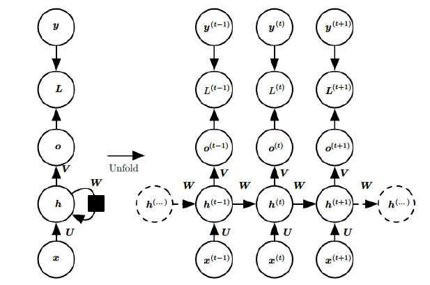

  > 如果两个 state 是这样的，只有一个输出

  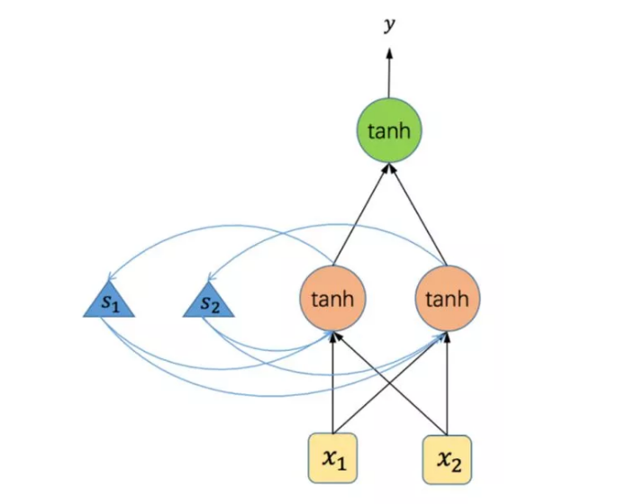

  > **多层神经网络**：就是在基本的循环神经网络的基础上增加了隐藏层的数量，和基本结构的循环神经网络相比，多层循环神经网络的泛化能力更强，不过训练的时间复杂度和空间复杂度也更高

  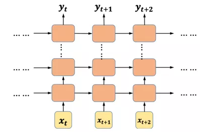


   

- RNN 梯度爆炸和梯度消失问题

  > 当出现如下的序列比较长的时候：

  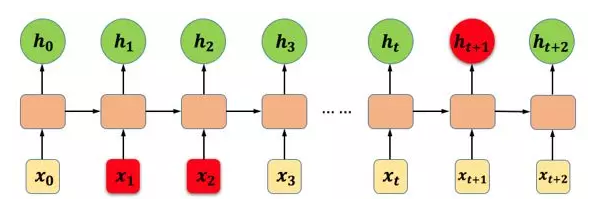

  > 会出现梯度爆炸或消失的情况，梯度爆炸可使用正则化或设置权重阈值的方法，梯度消失一般不好解决，可以使用如下介绍的 LSTM 或 GRU（下图中 w 表示隐藏层的权重）：

  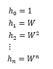

- Encoder-Decoder 模型，也可以称之为 Seq2Seq 模型

  > 有许多输入输出长度不一致的场景：
  >
  > 1. one to one 结构，仅仅只是简单的给一个输入得到一个输出，此处并未体现序列的特征，例如：图像分类
  > 2. one to many 结构，给一个输入得到一系列输出，这种结构可用于生产图片描述的场景。
  > 3. many to one 结构，给一系列输入得到一个输出，这种结构可用于文本情感分析，对一些列的文本输入进行分类，看是消极还是积极情感。
  > 4. many to many 结构，给一些列输入得到一系列输出，这种结构可用于翻译或聊天对话场景，对输入的文本转换成另外一些列文本。
  >
  > 5. 同步 many to many 结构（输入输出长度一致，而且长度固定），它是经典的 RNN结构，前一输入的状态会带到下一个状态中，而且每个输入都会对应一个输出，我们最熟悉的就是用于字符预测了，同样也可以用于视频分类，对视频的帧打标签。

  因为考虑到输入与输出的大小不一致的情况，所以就引入了 seq2seq 模型（先编码后解码），属于 RNN 的变种，就是建立两个 RNN，其中一个 RNN 作为编码器，另外一个 RNN 作为解码器，如下图所示：

  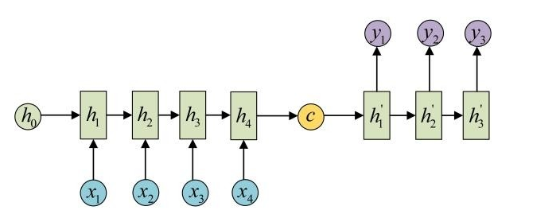

- LSTM（Long Short Term Memory：长短期记忆）

  > 使用上面的 RNN， 如果序列过长会导致优化时出现**梯度消散**的问题，而 LSTM 没有这个问题，它是一种特殊的 RNN 类型。LSTM 可以知道哪些是重要需要“记住”，哪些不是需要的选择忘记。LSTM 通过刻意的设计来避免长期依赖问题。所谓“门”的结构就是一个使用 sigmod 神经网络和一个按位做乘法的操作，这两个操作合在一起就是一个“门”结构

  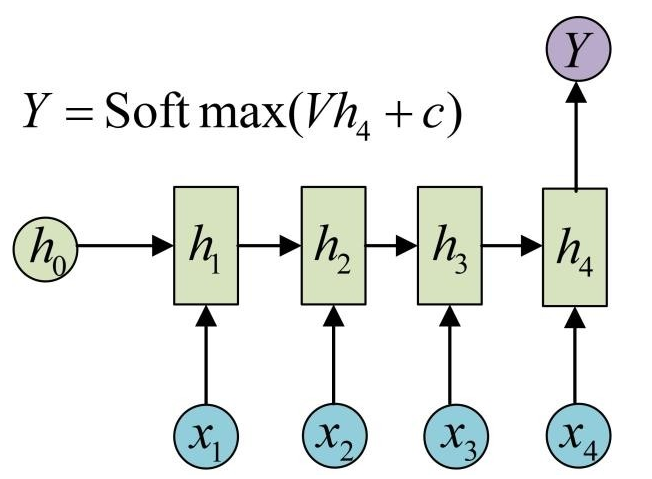

  数学表达：

  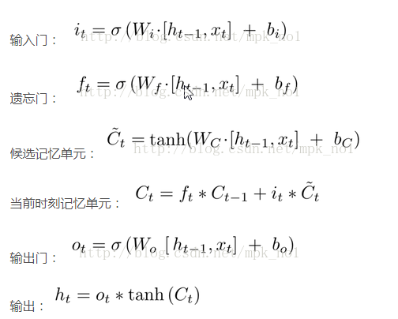

- GRU

  GRU 把 LSTM 中的遗忘门和输入门用更新门来替代，把 cell state 和隐状态 ht 进行合并，在计算当前时刻新信息的方法和 LSTM 有所不同。

  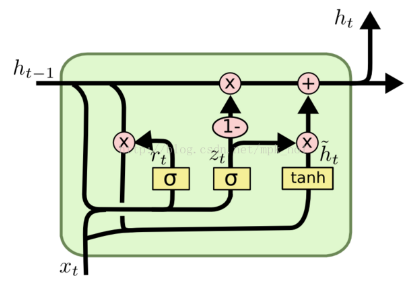

  数学公式：

  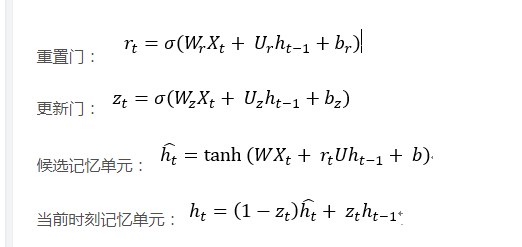

- 双向 RNN（BiRNN）

  > 在有些问题中，当前时刻的输出不仅和之前的状态有关系，也和之后的状态相关，所以就需要使用双向 RNN。**其实就是建立两个 RNN，其中一个 RNN 输入上文，另一个 RNN 输入下文，最终输出结果通过这两个 RNN 进行决定（例如：求和）**
  >
  > 按时间展开后如图所示，下面的 RNN预测值向右（上文），上面的 RNN 预测值向左（下文）：

  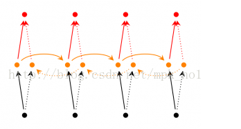

  同时也可以结合 LSTM 和 GRU 就变成了 BiLSTM  和 BiGRU，并且也可以构建深度双向 RNN 等。

- 使用 Udacity生成电视剧剧本作为实例代码，https://github.com/tonyxxq/tv-script-generation

  大概需要实现如下步骤：

  - get_inputs
  - get_init_cell
  - get_embed
  - build_rnn
  - build_nn
  - get_batches

- Input

  > 输入层，定义输入数据，结果数据和学习率

  ```python
  def get_inputs():
      """
      Create TF Placeholders for input, targets, and learning rate.
      :return: Tuple (input, targets, learning rate)
      """
      input_data = tf.placeholder(tf.int32, [None, None], name='input')
      targets = tf.placeholder(tf.int32, [None, None] , name='targets')
      learning_rate = tf.placeholder(tf.float32, name='learning_rate')
      return input_data, targets, learning_rate
  ```

- 创建单词和数字以及数字和单词的映射表

  ```python
  import numpy as np
  
  def create_lookup_tables(text):
      """
      Create lookup tables for vocabulary
      :param text: The text of tv scripts split into words
      :return: A tuple of dicts (vocab_to_int, int_to_vocab)
      """
      text=set(text)
      vocab_to_int={c:i for i,c in enumerate(text)}
      int_to_vocab=dict(enumerate(text))
      return vocab_to_int, int_to_vocab
  ```

- 标点符号

  > 我们会把电视剧脚本分隔（空格）成单词数组，但是神经网络比较难理解比如： "bye" 和 "bye!"的区别，
  >
  > 所以把标点符号变成指定的字符。建立如下的映射关系。

  ```python
  def token_lookup():
      """
      Generate a dict to turn punctuation into a token.
      :return: Tokenize dictionary where the key is the punctuation and the value is the token
      """
      tokenize_dict={".":"||Period||",",":"||Comma||",'"':"||QuotationMark||",\
                  ';':"||Semicolon||","!":"||Exclamationmark||","?":"||Questionmark||",\
                  '(':"||LeftParentheses||",")":"||RightParentheses||","--":"||Dash||",\
                  '\n':'Return'}
      return tokenize_dict
  
  ```

- 单词嵌入

  > input_data：是由数字组成的向量，数字对应具体的单词
  >
  > 把单词转换成了具体的向量形式，即把单词进行了向量初始化

  ```python
  def get_embed(input_data, vocab_size, embed_dim):
      """
      Create embedding for <input_data>.
      :param input_data: TF placeholder for text input.
      :param vocab_size: Number of words in vocabulary.
      :param embed_dim: Number of embedding dimensions
      :return: Embedded input.
      """
      # 生成一个服从均匀分布的矩阵，行数为单词的个数，列数为每个单词向量的维度
      embedding = tf.Variable(tf.random_uniform((vocab_size, embed_dim), -1, 1))
      # 从 embedding 查找出 input_data 中数字对应单词的向量
      return tf.nn.embedding_lookup(embedding, input_data)
  ```

- 创建 RNN 结构并进行初始化

  > batch_size：一共输入多少次
  >
  > rnn_size ：每次输入几个词
  >
  > 上面两个参数相乘就是一个序列的长度

  ```python
  def get_init_cell(batch_size, rnn_size):
      """
      Create an RNN Cell and initialize it.
      :param batch_size: Size of batches
      :param rnn_size: Size of RNNs
      :return: Tuple (cell, initialize state)
      """
      # 定义一个 LSTM 单元格，参数 rnn_size 表示这个 LSTM 单元格中隐藏层的数量
      def lstm_cell():
          lstm = tf.contrib.rnn.BasicLSTMCell(rnn_size)
          return lstm
      # 多个 LSTM 单元进行叠加（构建多层的网络，深度学习）
      cell = tf.contrib.rnn.MultiRNNCell([lstm_cell() for _ in range(2)])
      # 初始状态，因为是按批次进行训练的且当前批次和下一批次相同位置之间是序列关系（比如当前位置的第
      # 一个单词和下一位置的第一个单词是序列关系），所以需要 batch_size 个状态,（这个地方之前一直没     # 搞明白），tf.identity 是创建一个操作（新建一个结点）
      initial_state = cell.zero_state(batch_size, tf.float32)
      InitailState = tf.identity(initial_state, name='initial_state')
      return cell, InitailState
  ```

- 创建 RNN

  > 使用了 RNN 结构和输入数据建立 RNN

  ```python
  def build_rnn(cell, inputs):
      """
      Create a RNN using a RNN Cell
      :param cell: RNN Cell
      :param inputs: Input text data
      :return: Tuple (Outputs, Final State)
      """
      # inputs 是一个矩阵，每一行表示一个单词的向量，因为使用的是 RNN，所以这个地方的输入和输出格式     # 是一样的, dynamic_rnn 自动根据输入和输出去设置权重的 shape（我的理解）
      outputs,state= tf.nn.dynamic_rnn(cell, inputs, dtype=tf.float32)
      final_state=tf.identity(state, name='final_state')
      return outputs, final_state
  ```

- 创建神经网络

  ```python
  def build_nn(cell, rnn_size, input_data, vocab_size, embed_dim):
      """
      Build part of the neural network
      :param cell: RNN cell
      :param rnn_size: Size of rnns
      :param input_data: Input data
      :param vocab_size: Vocabulary size
      :param embed_dim: Number of embedding dimensions
      :return: Tuple (Logits, FinalState)
      """
      embed = get_embed(input_data, vocab_size, embed_dim)
      rnn,finalState = build_rnn(cell, embed)
      # 建立了一个全连接层
      logits = tf.contrib.layers.fully_connected(rnn, vocab_size, activation_fn=None,         \weights_initializer = tf.truncated_normal_initializer(stddev=0.1),
          \biases_initializer=tf.zeros_initializer())
      return logits, finalState
  ```

- 获取批次

  输出结构为 (number of batches, 2, batch size, sequence length)

  > number of batches：训练集分成多少个批次
  >
  > 2：分为输入和标签
  >
  > batch size：每个批次里边分为多个训练
  >
  > 注意：number of batches 是总的批次数， batch_size 是一个批次中的行数

  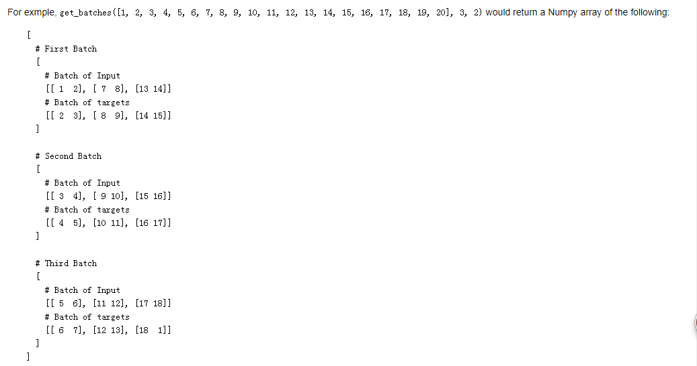

  ```python
  def get_batches(int_text, batch_size, seq_length):
      """
      Return batches of input and target
      :param int_text: Text with the words replaced by their ids
      :param batch_size: The size of batch
      :param seq_length: The length of sequence
      :return: Batches as a Numpy array
      """
      # 计算num of batches
      batches = len(int_text)//(batch_size*seq_length)
      # 去掉最后一个批次的数据
      int_text = int_text[:batches*batch_size*seq_length]
      # reshape
      seq_text = np.reshape(int_text,(batch_size,-1))
      arrs = []
      for n in range(0, np.shape(seq_text)[1], seq_length):
          x=seq_text[:,n:n+seq_length]
          y=np.zeros_like(x)
          if n + seq_length == np.shape(seq_text)[1]:
              y[:, :-1] = seq_text[:, n + 1:n + seq_length + 1]
              y[-1, -1],y[:-1, -1]=seq_text[0, 0],seq_text[1:, 0]
          else:
              y[:, :] = seq_text[:, n + 1:n + seq_length + 1]  
          arrs.append([x,y])
      
      return np.array(arrs)
  ```

- 计算图

  ```python
  from tensorflow.contrib import seq2seq
  
  train_graph = tf.Graph()
  with train_graph.as_default():
      vocab_size = len(int_to_vocab)
      
      # input_text：当前批次的输入数据 targets：当前批次的输出数据
      input_text, targets, lr = get_inputs()
      input_data_shape = tf.shape(input_text)
      
      # input_data_shape[0] 获取的是输入数据的行数，即 batch_size，等于状态的数量
      cell, initial_state = get_init_cell(input_data_shape[0], rnn_size)
      logits, final_state = build_nn(cell, rnn_size, input_text, vocab_size, embed_dim)
      
      # Probabilities for generating words
      probs = tf.nn.softmax(logits, name='probs')
      
      # Loss function
      cost = seq2seq.sequence_loss(
          logits,
          targets,
          tf.ones([input_data_shape[0], input_data_shape[1]]))
  
      # Optimizer
      optimizer = tf.train.AdamOptimizer(lr)
  
      # Gradient Clipping
      gradients = optimizer.compute_gradients(cost)
      capped_gradients = [(tf.clip_by_value(grad, -1., 1.), var) for grad, var in gradients if grad is not None]
      train_op = optimizer.apply_gradients(capped_gradients)
  
  ```

- 训练

  ```python
  batches = get_batches(int_text, batch_size, seq_length)
  
  with tf.Session(graph=train_graph) as sess:
      sess.run(tf.global_variables_initializer())
  
      for epoch_i in range(num_epochs):
          # input_text 获取的是第一个批次的输入数据
          state = sess.run(initial_state, {input_text: batches[0][0]})
  
          # x：输入数据， y：目标数据
          for batch_i, (x, y) in enumerate(batches):
              feed = {
                  input_text: x,
                  targets: y,
                  initial_state: state,
                  lr: learning_rate
              }
              train_loss, state, _ = sess.run([cost, final_state, train_op], feed)
  
              # Show every <show_every_n_batches> batches
              if (epoch_i * len(batches) + batch_i) % show_every_n_batches == 0:
                  print('Epoch {:>3} Batch {:>4}/{}   train_loss = {:.3f}'.format(
                      epoch_i,
                      batch_i,
                      len(batches),
                      train_loss))
  
      # Save Model
      saver = tf.train.Saver()
      saver.save(sess, save_dir)
      print('Model Trained and Saved')
  ```
