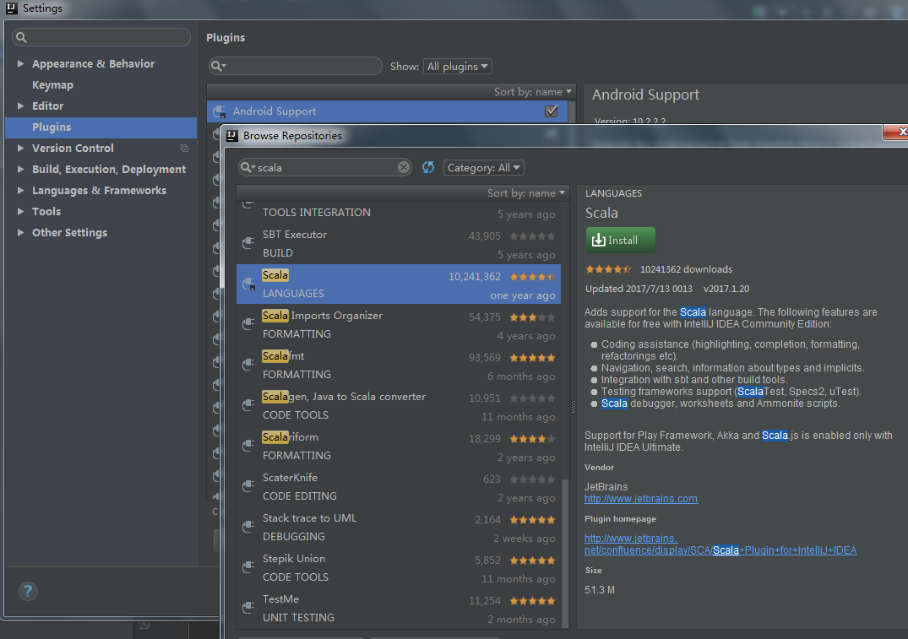
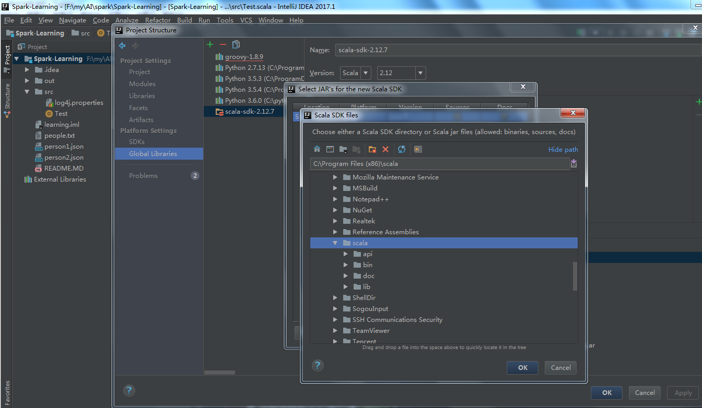
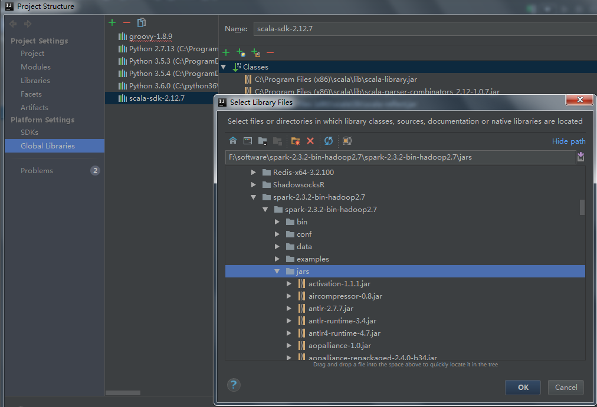
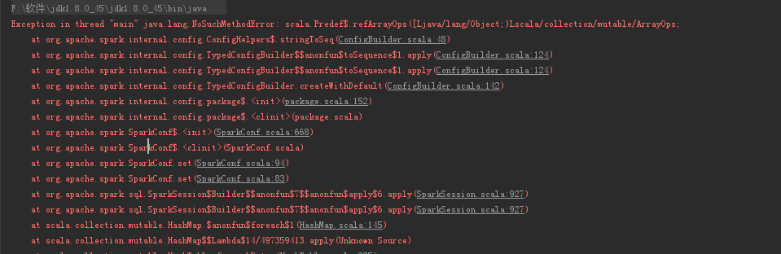
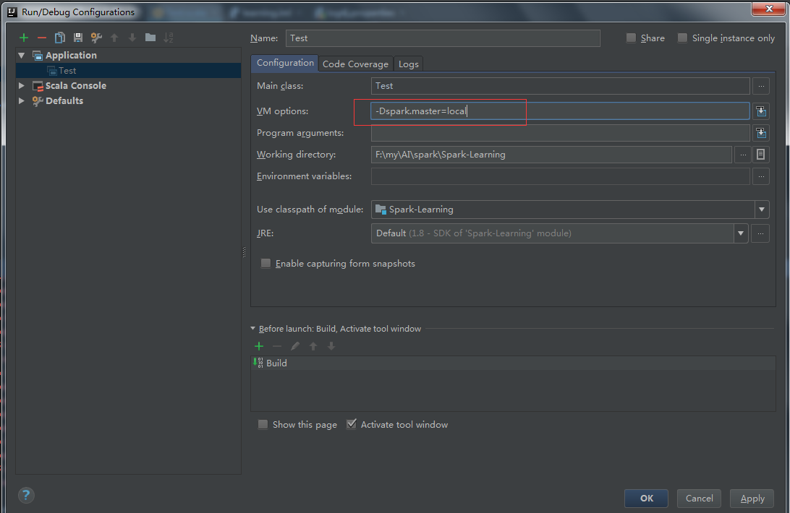
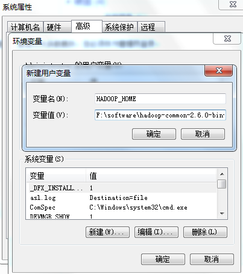

- 设置 spark 在 IDEA 的开发环境

  - 下载安装 scala 并配置环境变量

  - 下载安装 spark 并配置环境变量

  - idea 安装 scala 插件

    

  - idea 配置 scala 本地路径

    

  - idea 添加 sprak jar 包，选择  "+"    ->   " java "  ->  找到spark下的 jars 目录

    

  - 重启 idea

- 问题解决

  1. 出现下面问题是因为scala 的版本 和spark-sql的版本不一致的问题。解决方法是 scala 和 jar 文件的版本一致。

     

  2. 从提示中可以看出找不到程序运行的master， 此时需要配置参数，可选的有

     > local 本地单线程
     > local[K] 本地多线程（指定K个内核）
     > local[*] 本地多线程（指定所有可用内核）
     > spark://HOST:PORT 连接到指定的 Spark standalone cluster master，需要指定端口。
     > mesos://HOST:PORT 连接到指定的 Mesos 集群，需要指定端口。
     > yarn-client客户端模式 连接到 YARN 集群。需要配置 HADOOP_CONF_DIR。

     指定本地单线程 -Dspark.master=local

     

  - 解决 Failed to locate the winutils binary in the hadoop binary path  `java.io.IOException: Could not locate executable``null``\bin\winutils.exe in the Hadoop binaries.` 问题

    1. 下载winutils的windows版本 <https://github.com/srccodes/hadoop-common-2.6.0-bin>

    2. 配置环境变量，增加用户变量HADOOP_HOME，值是下载的zip包解压的目录，然后在系统变量path里增加$HADOOP_HOME\bin 即可。　　

       

    3. 重启 idea 再次运行程序，正常执行。

