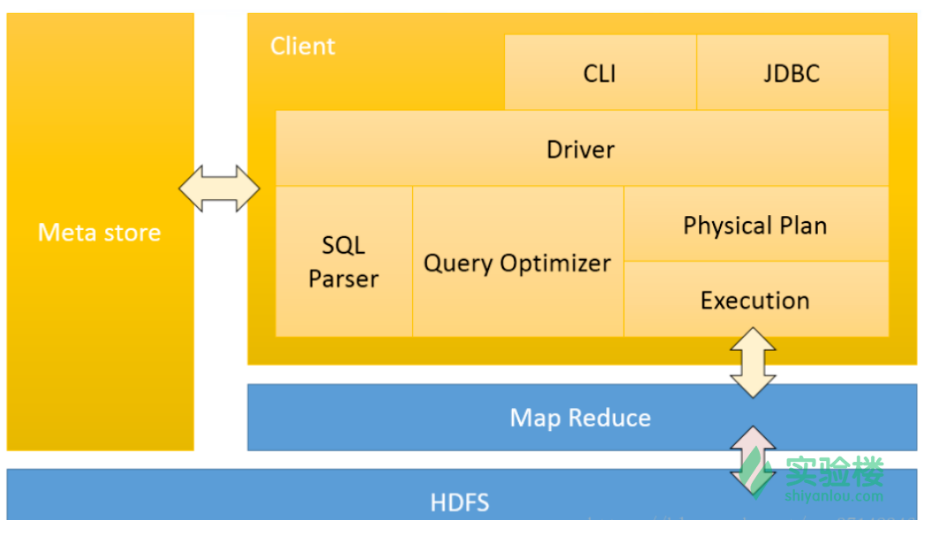

## Hive

可以像编写 SQL 一样来分析数据， FaceBook 开源了 Hive 用于对海量数据进行统计分析。它可以基于 HDFS 提取结构化数据文件，将其映射为一张表，通过 SQL 语句的方式来分析数据。

因此，Hive 主要有以下优点：

- 可以将数据通过 SQL 语句来处理，支持提取，转换，加载以及数据分析等大数据作业。
- 可以将结构化日志数据转化为文件存储在 HDFS 或者 Hbase 等数据存储系统上。
- 底层用 MapReduce 对数据进行计算，也可以自己通过 MapReduce、Spark 编写程序来拓展 Hive 的功能实现更多自定义的数据处理。
- Hive 的实质就是将 HQL 语言转化为 MapReduce。它适合离线数据的处理。

Hive架构图：



从上面的架构图可以看出，Hive 主要由 Meta store （元数据），SQL Parser （SQL 解析器），Query Optimizer（查询优化器），Physical Plan（物理计划）这几个重要的部分组成。

Meta Store 是 Hive 的元数据，默认的 Hive 会将表的元数据存储在 derby 内存数据库中，这是 Hive 自带的，当然一般情况下我们并不会将元数据存储在内存中，而是存入 Mysql 数据库，具体我们会在后面 Hive 的安装部署中介绍到。

SQL Parser 是指当输出 SQL 语句后，Hive 首先会生成 SQL 语法树，然后解析当前 SQL 语法是否正确，表是否存在，主要做验证检查工作。

Query Optimizer 会在 SQL Parser 检查之后对 SQL 语句做简单的优化操作，以 Hive 认为最优的方式去执行当前 SQL。

最后在经过优化之后会生成 Physical Plan ，然后提交给执行引擎去执行，实际上在 SQL 的基层是 MapReduce 作业，将数据存储在 HDFS 文件系统中。

Hive安装：

1. 下载 Hive http://hive.apache.org/downloads.html  并解压

2. 在 conf 目录下 修改 hive-env.sh.template 为 hive-env.sh 并修改如下两行配置

   HADOOP_HOME=/opt/hadoop-2.6.1
   export HIVE_CONF_DIR=/opt/hive-2.3.3/conf

3. 启动 hadoop

   ```
   $ ssh localhost  #注意：检查是否配置了ssh免密码登录
   $ hdfs namenode -format  #初始化namenode
   $ start-dfs.sh
   $ start-yarn.sh
   ```

4. 命令行执行 jps, 如果有 NameNode 和 DateNode 则 HDFS 启动成功。

5. 创建文件并且修改权限

   ```
   $ hdfs dfs -mkdir /tmp
   $ hdfs dfs -mkdir  -p /user/hive/warehouse
   $ hdfs dfs -chmod g+w   /tmp
   $ hdfs dfs -chmod g+w   /user/hive/warehouse
   ```

6. 安装 Mysql

7. 在 `$HIVE_HOME/conf` 目录下创建并且编辑 `hive-site.xml`

   ```xml
   <?xml version="1.0" encoding="UTF-8" standalone="no"?>
   <?xml-stylesheet type="text/xsl" href="configuration.xsl"?>
   <configuration>
       <property>
           <name>javax.jdo.option.ConnectionURL</name>
           <value>jdbc:mysql://localhost:3306/hive?createDatabaseIfNotExist=true</value>
           <description>数据库 url</description>
       </property>
   
       <property>
           <name>javax.jdo.option.ConnectionDriverName</name>
           <value>com.mysql.jdbc.Driver</value>
           <description>数据库驱动</description>
       </property>
   
       <property>
           <name>javax.jdo.option.ConnectionUserName</name>
           <value>hive</value>
           <description>数据库名称</description>
       </property>
   
       <property>
           <name>javax.jdo.option.ConnectionPassword</name>
           <value>hive</value>
           <description>数据库密码</description>
       </property>
   </configuration>
   ```

   8. 添加 mysql 驱动包到`$HIVE_HOME/lib` 目录下

   9. 初始化元数据库， 并设置其为 mysql, 在 Hive 目录下执行如下命令

      ```
      $ bin/schematool -dbType mysql -initSchema
      ```

   10. 执行如下命令启动 Hive,  数据库会新建一张 Hive 表

       ```
       $HIVE_HOME/bin/hive
       ```

   11. 创建新数据

       ```
       # 创建文件
       vim /home/hadoop/data/student.txt
       
       # 内容
       110 zhangsan
       111 lili
       112 tom
       ```

   12. Hive命令行创建新表

       ```
       # 创建表
       hive > create table student(id int,name string) ROW FORMAT DELIMITED FIELDS TERMINATED BY ' ';
       
       # 加载数据
       hive > load data local inpath '/home/hadoop/data/student.txt' into table student;
       
       # 执行查询
       hive > select * from student;
       ```

   13.  Spark SQL 整合 Hive

       1. 将 `hive-site.xml` 拷贝到 Spark conf 目录下。

       2. 将 mysql 驱动拷贝到 Spark jars 目录下。

       3. 启动spark

          ```
          spark-shell --master local[2]
          
          # HiveContext
          import spark.implicits._
          import org.apache.spark.sql.SparkSession
          val sqlContext=new org.apache.spark.sql.hive.HiveContext(sc)
          
          # 查看 Hive 表
          sqlContext.table("student").show()
          
          # 也可以使用 Spark 访问 Hive 表， 效果是一样的
          val spark = SparkSession.builder().appName("hiveContext").getOrCreate()
          spark.sql("select * from default.student").show()
          ```

       4. 直接使用 SQL 查询表

          ```
          $ $SPARK_HOME/bin/spark-sql --master local[2]
          select * from default.student;
          ```

       5. thriftserver

          ```
          # 启动服务
          $ $SPARK_HOME/sbin/start-thriftserver.sh
          
          # 启动客户端，-n 指定用户名
          $SPARK_HOME/bin/beeline -u jdbc:hive2://localhost:10000 -n hadoop
          
          # 访问数据库
          show tables;
          ```


          ```
          
          ```
