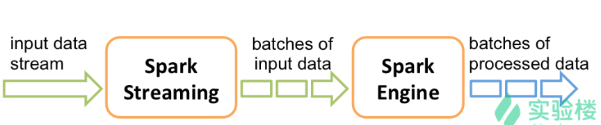
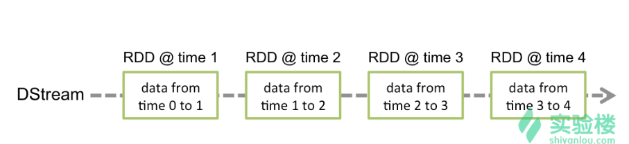

## Spark Streaming

- 结构图：

分成三步：

1. 通过数据源（Flume、HDFS等）产生输入数据流

2. 由 Spark Streaming 捕获该数据流，进行分块后的处理，结果存放至 HDFS、HBase 等处。

3. 已处理的结果块交由各项服务作后续处理（Drill 、Hive）等。

- 启动 SparkStreaming

  >  nc -l -p 9999  NetCat 模拟发送数据的的服务器端口，下面的代码中的数据源

  ```scala
  import org.apache.spark._
  import org.apache.spark.streaming._
  import org.apache.spark.streaming.StreamingContext._
  
  val conf = new SparkConf().setMaster("local[2]").setAppName("NetworkWordCount")
  val ssc = new StreamingContext(conf, Seconds(2))
  
  // 设置数据源
  val lines = ssc.socketTextStream("localhost", 9999)
  val words = lines.flatMap(_.split(" "))
  val pairs = words.map(word => (word, 1))
  val wordCounts = pairs.reduceByKey(_ + _)
  wordCounts.print()
  ssc.start()
  ```

- DStream（ Discretized Stream）

  它是一种 RDD 的序列（一个 DStream 对象是由连续的多个 RDD 组成的），任何应用于 DStream 的操作最终都会被转化为底层的 RDD 上的操作。

  


- Spark Streaming 结合 Spark SQL

  ```scala
  import org.apache.spark.rdd.RDD
  import org.apache.spark.storage.StorageLevel
  import org.apache.spark.streaming.{Seconds, StreamingContext, Time}
  
  case class Record(word:String)
  
  val ssc = new StreamingContext(sc, Seconds(2))
  val lines = ssc.socketTextStream("localhost", 9999, StorageLevel.MEMORY_AND_DISK_SER)
  
  val words = lines.flatMap(_.split(" "))
  words.foreachRDD{(rdd:RDD[String], time:Time)=>
  	val wordsDataFrame = rdd.map(w=> Record(w)).toDF() 
  	wordsDataFrame.registerTempTable("words")
  	val sqlContext = new org.apache.spark.sql.SQLContext(sc)
  	val sql = "select word, count(*) as total from words group by word"
  	val wordCountsDataFrame = sqlContext.sql(sql)
  	println(s"=======  $time ======")
  	wordCountsDataFrame.show()
  }
  ssc.start()
  ```

- - 

- 在 spark-shell 中粘贴代码块

  1. :paste 
  2. :load -v -filepath

- 过滤黑名单用户

  > 输入数据格式如 00001 张三

  ```scala
  import org.apache.spark.SparkConf
  import org.apache.spark.streaming.StreamingContxt
  import org.apache.spark.streaming.Seconds
  
  val ssc = new StreamingContxt(sc, Seconds(2))
  val st = ssc.socketTextStream("localhost", 8888)
  
  // 设置用户黑名单
  val bl = Array(("Jim", true), ("hack", true))
  val blRdd = ssc.sparkContext.parallelize(bl, 3)
  
  // 获取 输入源 的姓名
  val users = st.map{ l => (l.split(" ")(1), 1) }
  
  // 过滤掉在黑名单中的用户
  val validRddDS = users.transform(ld => {
  	val ljoinRdd = ld.leftOuterJoin(blRdd)
  	val fRdd = ljoinRdd.filter((tuple) => {
  		if(tuple._2._2.getOrElse(false)){
  			false		
  		} else {
  			true		
  		}
  	})
  	val validRdd = fRdd.map(tuple => tuple._2._1)
  	validRdd
  })
  
  validRddDS.print()
  ssc.start()
  ssc.awaitTermination()
  
  ```
