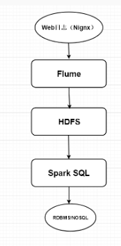
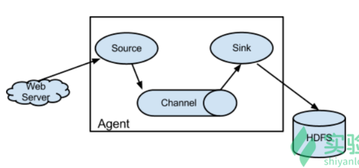

## 离线日志分析

- 架构图

  

  步骤：

  1. 通过 Flume 将数据收集存储到 HDFS 文件系统中。
  2. 使用 Spark SQL 从 HDFS 中读取数据进行离线批处理操作。
  3. 将分析的结果落地到 RDBMS 或者 NOSQL 数据库中。
  4. 从数据库中读取数据使用可视化工具进行展示。

- Flume

  Flume 是 Cloudera 开发的日志收集系统，具有**分布式、高可用**的特点，为**大数据日志收集、汇总聚合和转储传输提供了支持。为了保证 Flume 的扩展性和灵活性，在日志系统中定制各类数据发送方以及数据接收方**。同时 Flume 提供对数据进行简单处理，并写入各种数据到接受方的能力。

  **Flume 的核心是把数据从数据源收集过来，再送到数据接收方。为了保证送达成功，在送到目的地之前，会先缓存数据，待数据真正到达目的地后，删除自己缓存的数据。**

  Flume 传输的数据的基本单位是事件(Event)，如果是文本文件，通常会是一行数据，这也是事务的基本单位。事件（Event）从源（Source）传输到通道（Channel），再到数据输出槽（Sink），本身为一个比特（byte）数组，并可携带消息头（header）信息。

  Flume 运行的核心是 Agent，它是一个完整的数据收集工具，含有三个核心组件，分别是 Source，Channel，Sink。通过这些组件，可以将 Event 从一个地方收集到另一个地方。

  如图：

  

- Flume 搭建实例

  >

