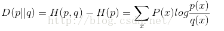

## 交叉熵(cross entropy)

熵的本质是香农信息量的期望。可以看出当各个类别的 p 越分散则熵越大，表示数据越发散，

交叉熵：有两个概率分布 p （真实分布）和 q（非真实分布）, 

根据 Gibbs' inequality， 可知 **H(p,q)>=H(p)** 恒成立，所有可以用于神经网络的损失函数。

对于二分类问题，交叉熵可以转为如下形式：

## KL散度（Kullback–Leibler divergence）

KL 散度可以计算两个分布之间的相似性

公式：

> p 表示观察的分布，q 表示去拟合 p 的分布

使用 K-L 散度优化模型：

当确定分布之后，使用不同的概率值去验证 KL 散度，直到找到合适的概率值。

KL 散度和交叉熵之间可以转换：KL divergence(p||q) = cross entropy(p, q) - entropy(p)

