## 牛顿法

牛顿法可以用于求解方程和最优化， 理解该算法的重点该算法使用了泰勒展开。

为什么会收敛，还一直没搞明白。。。。

每一次迭代的方向都是沿着梯度下降的方向

- 求解方程的根

  > 几何意义就是通过切线去拟合曲线

  1. 利用一阶泰勒公式，使 f(x)  在 x0 （初始化的值，可以随意指定）处展开得： f(x) = f(x0) + (x－x0)*f'(x0)（其实就是(x0， f(x0)) 处的切线方程，使用切线去拟合曲线，自然切线为 0 的地方，曲线的值也接近 0）

  2. 令  f(x)  = 0  整理得： x = x1= x0－f(x0)/f'(x0)，因为是一阶展开，这个地方的 x1 并不能让 f(x) = 0，只是近似，**x1 使得 f(x) 更接近 0**

  3. 然后使用将 f(x) 在 x=x1 处一阶泰勒展开，使用同样的方式求出 x2，......

  4. 通过迭代，这个式子必然在 f(x*) = 0 的时候收敛

     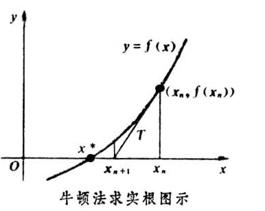

- 处理优化问题

  > 几何意义就是用一个二次曲面去拟合当前所处位置的局部曲面，而梯度下降是用平面取拟合曲面
  >
  > 优点：二阶收敛，收敛速度快；
  >
  > 缺点：牛顿法是一种迭代算法，每一步都需要求解目标函数的 Hessian 矩阵的逆矩阵，计算比较复杂。

  1. 把函数 φ(x) 使用泰勒公式展开成二阶形式（这个地方和求根不一样的）

     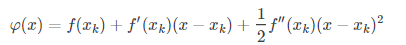

  2. 因为是求极值，φ(x) 应满足，φ′(x) = 0 (x 为自变量求导)，

     得：

     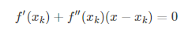

     从而得到：

     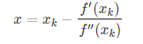

  3. 于是，若给定初始值 x0, 迭代如下公式，直到收敛

     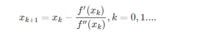

**推广：**

当 x 为矩阵的时候，二阶泰勒展开：

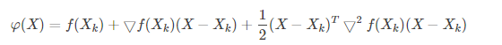

其中 ▽f 为 f 的梯度向量，▽2f 为 f 的海森矩阵，其定义如下：

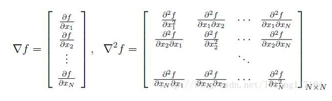

令 g = ▽f ， H = ▽2f

> 计算步骤和上面一样

1. 因为需要 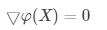

   得（和上面一样） :

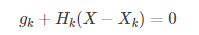

2. 假设 Hk 可逆，得：

   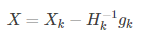

3. 迭代格式，直至收敛

   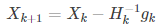

## 拟牛顿法

**拟牛顿法的本质思想是改善牛顿法每次需要求解复杂的 Hessian 矩阵的逆矩阵的缺陷，它使用正定矩阵来近似Hessian矩阵的逆，从而简化了运算的复杂度。**

https://blog.csdn.net/wenzishou/article/details/73350591