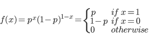
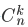
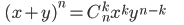
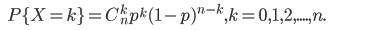
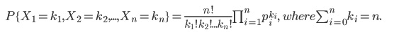
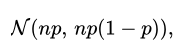

##  伯努利分布

伯努利试验（Bernoulli trial），只有两种可能结果，例如，抛一次硬币是正面向上吗？刚出生的小孩是男孩还是女孩？如果试验E是一个伯努利试验，将E独立重复地进行n次，则称这一串重复的独立试验为 n 重伯努利试验。

**进行一次伯努利试验**，成功 (X=1) 概率为 p(0<=p<=1)，失败 (X=0) 概率为 1-p，则称随机变量 X 服从伯努利分布，**伯努利分布是离散型概率分布**，其分布函数为：

## 二项分布

如果试验 E 是一个 n 重伯努利试验，每次伯努利试验的成功概率为 p，X 代表成功的次数，则 X 的概率分布是二项分布，记为 X~B(n, p)，其分布函数为：

> 当 n = 1 时，即为伯努利分布，伯努利分布是二项分布的特例
>
> 公式中 k 表示实验成功**一共出现 k 次**， 为二项式定理的系数

## 多项分布

多项分布由二项分布演化过来的，因为二项分布结果只有两个值，多项分布可以有多个值，其分布函数为：

##  贝塔分布

几个分布的关系：

- 当 n 足够大，且二项分布的近似曲线不是很弯曲的时候，我们可以用以下式子使二项分布B(n, p)近似于正态分布。并且我们可以用适当的连续性校正（continuity correction）来改善这样一个近似的正态分布。

  > 均值 np 的理解，比如：当实验10000 次，即 n = 10000，为正的概率 p = 0.5，均值 np = 5000， 在该均值附近出现的结果会比较多。可以想象正态分布的横坐标为正面出现的次数，纵坐标为出现这么多次正面的情况下的概率。

  

- 在 np 固定不变，n 趋于无穷大，p 趋于0 的时候，我们可以用一个二项分布来近似一个泊松分布。这样的话，泊松分布的 λ=np