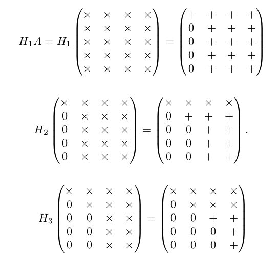

## 齐次坐标

在欧氏几何空间，同一平面的两条平行线不能相交，然而，在透视空间里面，两条平行线可以相交，例如：火车轨道随着我们的视线越来越窄，最后两条平行线在无穷远处交于一点。

**齐次坐标，简而言之，齐次坐标就是用 N+1 维来代表 N 维坐标。**

例如，笛卡尔坐标系下（1，2）的齐次坐标可以表示为（1，2，1），如果点（1，2）移动到无限远处，在笛卡尔坐标下它变为 (∞, ∞)，它的齐次坐标表示为（1，2，0），因为(1/0,  2/0) = (∞,∞)，我们可以不用 ”∞" 来表示一个无穷远处的点了。

为什么叫齐次坐标：

(1, 2, 3),  (2, 4, 6) 和 (4, 8, 12) 对应同一个笛卡尔积坐标 (1/3,  2/3)，任何标量的乘积，例如 (1a, 2a, 3a) 对应 笛卡尔空间里面的(1/3, 2/3) 。因此，这些点是 “齐次的”，因为他们代表了笛卡尔坐标系里面的同一个点。

> 下面的方程没有解（C 不等于 D）或无穷多个解（C 等于 D）

> 在透视空间使用齐次坐标，x/w、y/w 代替 x、y
>
> 现在我们有一个解(x, y, 0)，两条直线相交于(x, y, 0)，这个点在无穷远处。

> 如果把一个点从普通坐标变成齐次坐标，给 x,y,z 乘上同一个非零数 w，然后增加第4个分量 w；如果把一个齐次坐标转换成普通坐标，把前三个坐标同时除以第 4 个坐标，然后去掉第 4 个分量。

## QR 分解

QR 分解是把矩阵分解成一个正交矩阵与一个上三角矩阵的积。QR 分解经常用来解线性最小二乘法问题。QR 分解也是特定特征值算法即 QR 算法的基础。Q 为正交矩阵，R 为上三角阵，用图可以将分解形象地表示成：

假设 A 是一个 5×4 的矩阵，用 × 号表示本次变换未变化的元素，用 + 号表示本次发生变换的元素， H 矩阵等效于对右侧的 A 矩阵进行行操作，其实就是做初等变换:

四次变换之后, A 就转化成一个上三角矩阵。并且如果 A 是列向量不相关，则 R 矩阵是非奇异矩阵，

由于 H1, H2, H3, H4 都是标准化正交矩阵，那么 QT 也是标准正交矩阵。左乘 Q 可得 A = QR

用于解决最小二乘法

