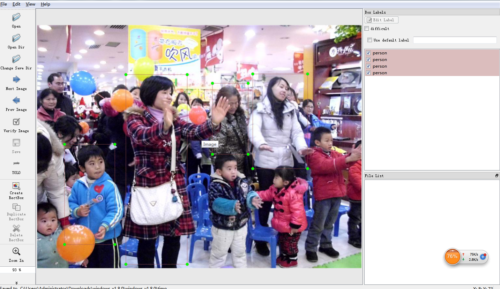
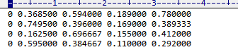
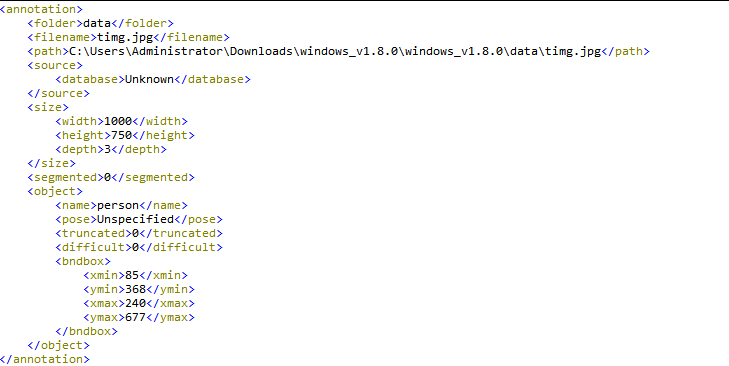

## LabelImg

- 安装

  安装过程不需要网上那种麻烦的安装，直接下载安装文件就可以了。地址：http://tzutalin.github.io/labelImg/，包括 windows 版本和 linux 版本。

- 使用（windows 直接打开 labelImg.exe 文件，linux 执行 labelImg 命令）

  Open Dir：加载需要标注的图片文件夹子

  Change Save Dir：修改保存数据的目录，**每一张图片会对应一个文件**，可以选择生成 PascalVoc 或 YOLO 格式

  在安装目录下的 classes.txt 表示默认的所有类别，可以修改为自己想要的类别

  

  生成的文件格式如图：

  > YOLO 格式：

  

  > Pascal VOC格式：

  ​		

- 快捷键

  ```
  Ctrl + u  加载目录中的所有图像，鼠标点击Open dir同功能
  Ctrl + r  更改默认注释目标目录(xml文件保存的地址) 
  Ctrl + s  保存
  Ctrl + d  复制当前标签和矩形框
  space     将当前图像标记为已验证
  w         创建一个矩形框
  d         下一张图片
  a         上一张图片
  del       删除选定的矩形框
  Ctrl ++   放大
  Ctrl --   缩小
  ↑→↓←      键盘箭头移动选定的矩形框
  ```
