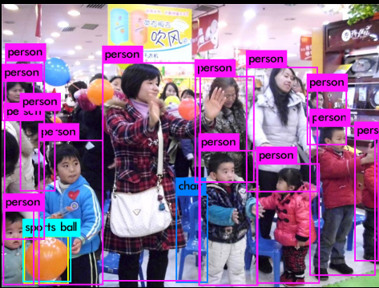
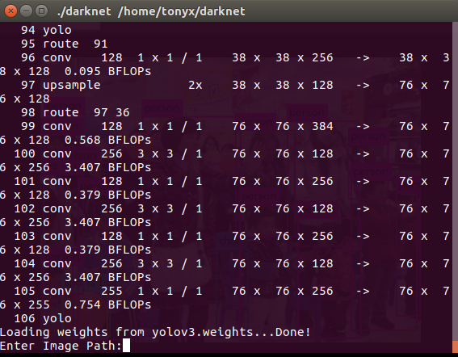

## DarkNet

基于 YOLO 网络结构的目标检测工具，可以检测单张图片、多张图片、视频、摄像头输入

- 编译项目

  ```
  git clone https://github.com/pjreddie/darknet
  cd darknet
  make
  cd cfg
  ```

- 下载权重，并使用该权重检测一张图片, 注意：内存需要吧稍微大点，之前虚拟机设置 2G 程序崩溃了

  > 输出图片为 darknet 目录下的 predictions.jpg

  ```
  wget https://pjreddie.com/media/files/yolov3.weights
  ./darknet detect cfg/yolov3.cfg yolov3.weights data/time.jpg
  ```

  

- 检测多张图片，就是在之前的基础上不用输入具体的图片，回车之后会提醒，输出还是为 predictions.jpg

  ```
  ./darknet detect cfg/yolov3.cfg yolov3.weights
  ```

  


- 设置阈值，大于该阈值的目标才会显示

  ```
  # 表示显示检测到的所有物体
  ./darknet detect cfg/yolov3.cfg yolov3.weights data/dog.jpg -thresh 0
  ```

- 使用微型权重，结果可能没上一个权重准确，但是速度快

  ```
  wget https://pjreddie.com/media/files/yolov3-tiny.weights
  ./darknet detect cfg/yolov3-tiny.cfg yolov3-tiny.weights data/dog.jpg
  ```

- 使用 webCam 实时检测

  > 多个摄像头，选择其中一个，传递参数 -c <num>, 0 为默认的摄像头

  ```
  ./darknet detector demo cfg/coco.data cfg/yolov3.cfg yolov3.weights
  ```

- 检测视频

  ```
  ./darknet detector demo cfg/coco.data cfg/yolov3.cfg yolov3.weights <video file>
  ```

- 自己训练数据，可以查看官网的


官网：https://pjreddie.com/darknet/yolo/