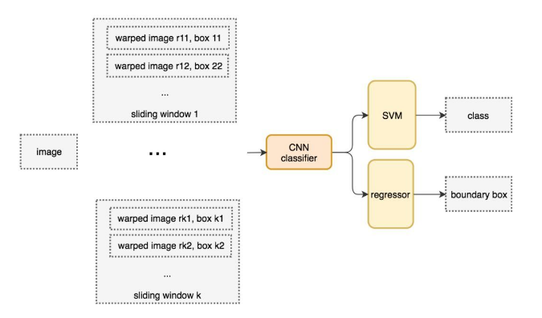
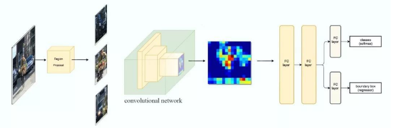
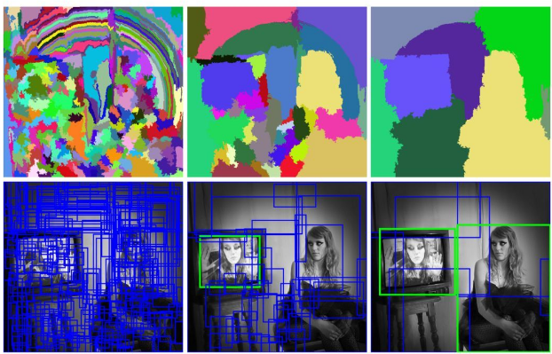
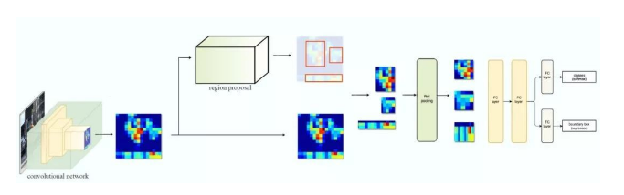
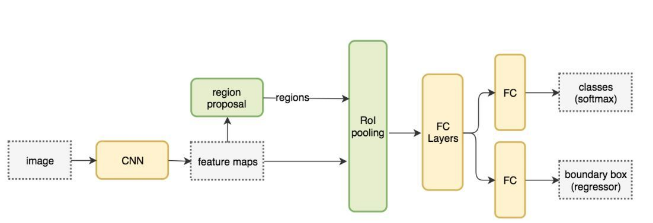
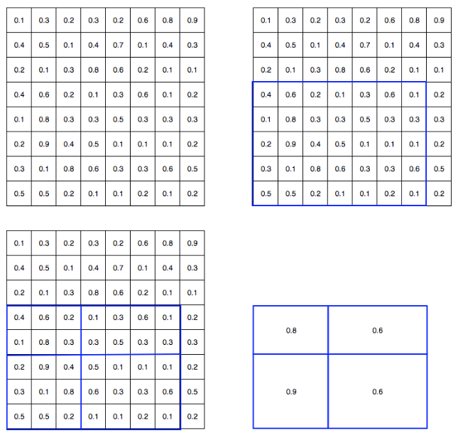
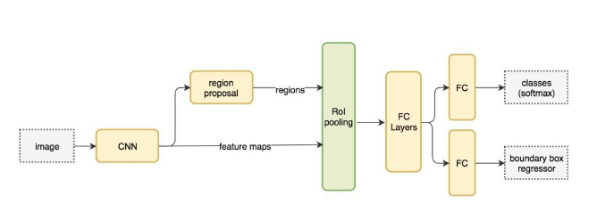
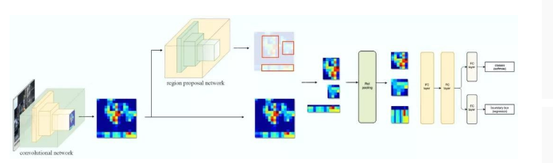
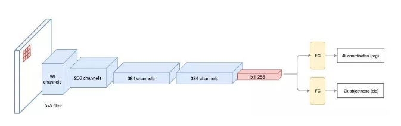

## RCNN

- 滑动窗口

  > 该方法的缺点是窗口数量很多，而且每一个窗口都要进行一次特征提取，效率极低

- R-CNN

  R-CNN 利用候选区域方法创建了约 2000 个 ROI。**这些区域被转换为固定大小的图像**，并分别馈送到卷积神经网络中。该网络架构后面会跟几个全连接层，以实现目标分类并提炼边界框。

  > 该方法的 2000 个 ROI 是固定的，极大的减少了窗口数量，比滑动窗口更大更迅速

  

  > 用候选区域方法（region proposal method）创建目标检测的感兴趣区域（ROI）
  >
  > 1. 使每一个像素作为一组，把纹理相近的合并为一组
  > 2. 为了避免单个区域吞噬其他区域，较小的组先进行合并，较大的组后面再合并
  > 3. 迭代直到满足要求
  >
  > 该方法相对于滑动窗口减少了很多窗口，效率有了不小的提升，但是还是很耗时间
  >
  > 下图第一行展示了如何使区域增长，第二行中的蓝色矩形代表合并过程中所有可能的 ROI。
  >
  > 

- Fast R-CNN

  R-CNN 使用了很多的候选区域，每个区域都需要提取一遍特征，但是一幅图像的候选区域中有很多都是重叠的，这样提取的特征也会是重叠的（重复提取，降低了效率），Fast R-CNN 以特征图代替原始图像进行目标检测，因为避免了特征的重复提取，效率大大提高

  1. 使用特征提取器（CNN）先提取整个图像的特征
  2. 将创建候选区域的方法直接应用到提取到的特征图上产生候选区域
  3. 候选区域结合特征图像裁剪出制定区域，把该区域特征使用 ROI 池化转为固定大小
  4. 馈送到全连接层进行分类和定位

  

  流程图

  

  Fast R-CNN 的训练速度是 R-CNN 的 10 倍，推断速度是后者的 150 倍

  > ROI 池化：因为 Fast R-CNN 使用全连接层，所以我们应用 ROI 池化将不同大小的 ROI 转换为固定大小。
  >
  > 池化过程：
  >
  > 1. 左上角为特征图
  > 2. 右上角为特征图和候选区域叠加
  > 3. 左下角根据目标维度的大小进行分割，例如，对于 2×2 目标，我们将 ROI 分割为 4 个大小相似或相等的单元。
  > 4. 找到每个单元的最大值，得到变换后的特征图
  >
  > 

- Faster R-CNN

  Faster R-CNN 采用与 Fast R-CNN 相同的设计，只是它用内部深层网络代替了候选区域方法。新的候选区域网络（**RPN**）在生成 ROI 时效率更高，并且以每幅图像 10 毫秒的速度运行。

  流程图（和 Fast R-CNN 一样，重点是候选区域网络）：

  ​	

  

  > 候选区域网络（RPN）
  >
  > 1. RPN 使用特征图作为输入，使用 3x3 的卷积核进行卷积运算，输出 256 个值（ZF 网络）
  > 2. 输出的每一个值进行 K （K 个区域）次预测，RPN 将输出 4×k 个坐标值（区域坐标和宽、高）和每个位置上 2×k 个得分（有没有物体）
  > 3. 计算损失
  >
  > 流程图
  >
  > 

- 基于区域的全卷积神经网络（R-FCN）

参考：https://www.cnblogs.com/dudumiaomiao/p/6560841.html

论文：https://arxiv.org/pdf/1506.01497.pdf

这篇文章总结得太好了：http://www.sohu.com/a/229665297_129720

https://blog.csdn.net/dsl_gree/article/details/81085576