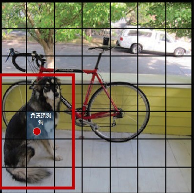
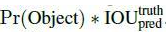
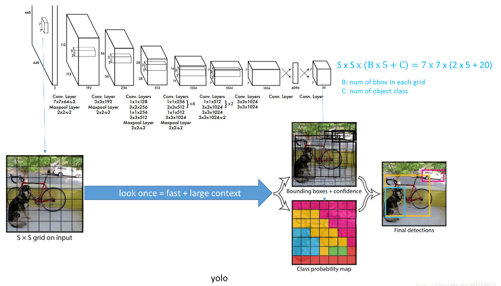
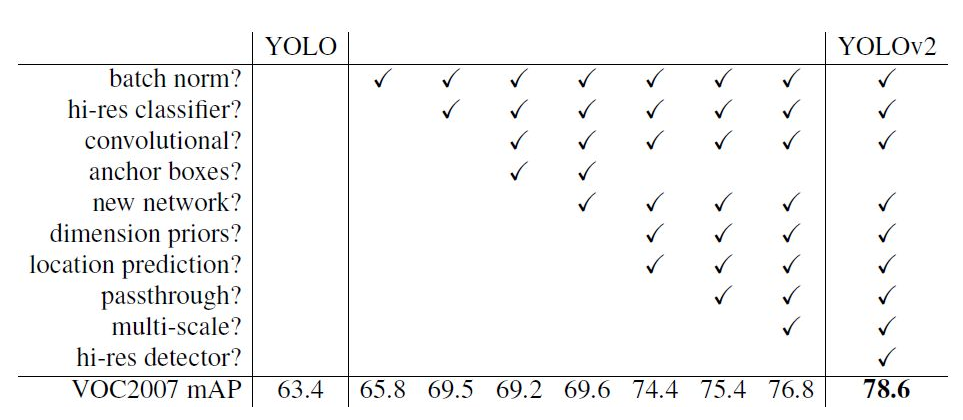

## YOLO（You Only Look Once）

####YOLO v1




算法步骤

1. 图像 resize 成指定大小

2. 图像分割成 S X S 的格子（grid cell），真实目标中心所在的格子负责预测目标类别（如上图中：红点所在的格子负责预测红框，即狗的目标）， 每个格子生成指定数量的 Bounding Box（有一定的规则，可以根据论文设置），每个 Bounding Box 有 5 个参数（x,y： 相对格子的偏移，w,h:宽高，  Confidence：置信度，表示该Bounding Box 有物体的概率）， 每个格子除了指定数量的 Bounding Boxes 还有每个类别的概率。最终输出数据的大小为：S\*S\*(5*B + C)

   >**Bounding Box 置信度的计算方式**：如果 grid cell 里面没有object，confidence 就是 0，如果有，则 confidence score 等于预测的 box 和 ground truth 的 IOU 值
   >
   >​	公式：P的取值： 当前 Bounding Box 所在的 grid cell 有物体为1，否则 0
   >
   >grid cell 的 C 值 ：是一个向量，表示该 grid cell 属于哪个类别

3. 进行 NMS（非极大值抑制）进行 Bounding Box 的冗余裁剪，处理掉大批的冗余，得到最后的预测结果。

   **grid cell score 的计算方式**：利用上上一步已经计算出的所有 Bounding Box 的置信度乘以该 grid cell 的score（是一个向量，表示类别的每个类别的分数）得到 Bounding Box 的 score 矩阵（比如：12 x 20, 12 表示 Bounding Box 数量， 20 表示每个类别的分数 ），在某个类别中，即矩阵某列，把小于阈值的分数（比如：0.2）设置 0，使用 NMS算法去掉指定类别中重复的 Bounding Box 的分数设为 0，最终从每个 Bounding BOX 中选出大于 0 且最大分数值的那个作为当前 Bounding Box 的类别， 如果最大分数时小等于 0，直接忽略该 Bounding Box, 表示没有检测到物体。

   **NMS 计算方法**：指定某一类别，选择一个 Bounding Box 计算和其他所有 Bounding Box 的 IOU 值如果大于 0.5 ，分数值设为 0， 否则保持不变，这样迭代所有类别




注意：理解最终的输出结果的构成是理解该算法的关键


#### YOLO v2

YOLO 有两个缺点：1

1. 定位不准确
2. 和基于 region proposal 的方法相比召回率较低

YOLO v2 是在 YOLO 的基础上增加了一些改进, 从而提升模型的 mAP，如下所示：

详细说明每一种改进：

1. Batch Normalization

   在 YOLO v2 中，每个卷积层后面都添加了 Batch Normalization 层（可以一定程度上的正则化），并且不再使用 droput。<a href="../Batch Norm.md">BN</a>

2. High Resolution Classifier

   调整分辨率 为 448\*448，之前的分辨率是 224\*224，分辨率太低不适合目标检测（使用的是 ImageNet 进行迁移学习，因为之前的输入分辨率是 224\*224 ，在之前的分类基础上加入了 fineturn，以满足448 *448）

3. Convolutionlal With Anchor Boxes

4. Dimension Clusters

5. New Network：Darknet-19

6. Direct location prediction

7. Fine-Grained Features  

8. Multi-Scale Training


步骤：


## DarkNet

基于 YOLO 网络结构的目标检测工具，可以检测单张图片、多张图片、视频、摄像头输入

- 编译项目

  ```
  git clone https://github.com/pjreddie/darknet
  cd darknet
  make
  cd cfg
  ```

- 下载权重，并使用该权重检测一张图片, 注意：内存需要吧稍微大点，之前虚拟机设置 2G 程序崩溃了

  > 输出图片为 darknet 目录下的 predictions.jpg

  ```
  wget https://pjreddie.com/media/files/yolov3.weights
  ./darknet detect cfg/yolov3.cfg yolov3.weights data/time.jpg
  ```

  

- 检测多张图片，就是在之前的基础上不用输入具体的图片，回车之后会提醒，输出还是为 predictions.jpg

  ```
  ./darknet detect cfg/yolov3.cfg yolov3.weights
  ```

  


- 设置阈值，大于该阈值的目标才会显示

  ```
  # 表示显示检测到的所有物体
  ./darknet detect cfg/yolov3.cfg yolov3.weights data/dog.jpg -thresh 0
  ```

- 使用微型权重，结果可能没上一个权重准确，但是速度快

  ```
  wget https://pjreddie.com/media/files/yolov3-tiny.weights
  ./darknet detect cfg/yolov3-tiny.cfg yolov3-tiny.weights data/dog.jpg
  ```

- 使用 webCam 实时检测

  > 多个摄像头，选择其中一个，传递参数 -c <num>, 0 为默认的摄像头

  ```
  ./darknet detector demo cfg/coco.data cfg/yolov3.cfg yolov3.weights
  ```

- 检测视频

  ```
  ./darknet detector demo cfg/coco.data cfg/yolov3.cfg yolov3.weights <video file>
  ```

- 自己训练数据，可以查看官网的

  或：https://blog.csdn.net/u010122972/article/details/77259141


官网：https://pjreddie.com/darknet/yolo/


论文：http://arxiv.org/abs/1506.02640

​	   https://arxiv.org/abs/1612.08242