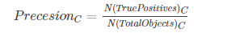
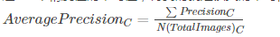
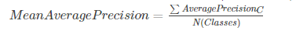

## mAP（Mean Average Precision）

在目标检测任务中判断模型的性能不仅需要识别出物体的类别还需要检测出物体的位置（Bounding Box），所以在图像分类任务中判断精度的方式就不适用了，需要 mAP 衡量目标检测模型的好坏。

一张图像中，在每个 Bounding Box 置信度阈值之后（去除了相同类别重叠度高的框） ,对每个类别的目标的 Bounding Box 和ground truth 求 IoU 值，如果 IoU 大于指定阈值（比如：0.5），则任务识别正确。识别正确的物体除以物体总和，就得到了物体识别的精度。

> 即给定一张图像的类别 C 的Precision = 图像正确预测 (True Positives) 的数量 / 在图像中这一类的总的目标数量。 结果是这一张图像中类别 C 的准确率。

我们求准确率的时候一般都是数据集合，所以当有多张图像的时候需要求所有图像的准确率的平均值。

> 即一个 C 类的平均精度 = 在验证集上所有的图像对于类 C 的精度值的和 / **有类 C **这个目标的所有图像的数量。 

上面的计算只是一个类别，当判断数据集中所有类别数据的精度的时候，需要求所有类别的精度的平均值 mAP

> 即数据集中所有类的平均精度的平均值

注意：可能模型中的数据的类别识别的精度是不一样的，有的类别识别度很高有的很低，需要的时候查看各个类别的精度平均值。