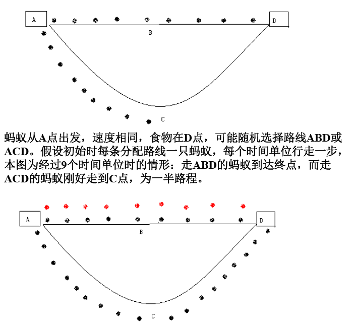
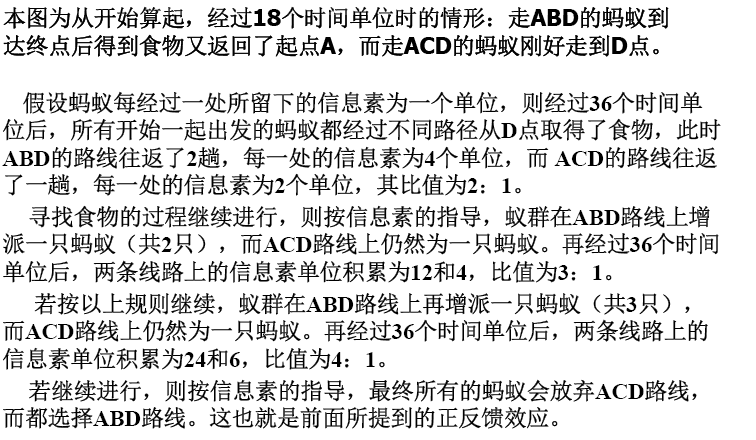

## 蚁群算法

蚁群算法是受到对真实蚂蚁群觅食行为研究的启发而提出。生物学研究表明：一群相互协作的蚂蚁能够找到食物和巢穴之间的最短路径,而单只蚂蚁则不能。生物学家经过大量细致观察研究发现,蚂蚁个体之间的行为是相互作用相互影响的。蚂蚁在运动过程中,能够在它所经过的路径上留下一种称之为信息素的物质,而此物质恰恰是蚂蚁个体之间信息传递交流的载体。蚂蚁在运动时能够感知这种物质,并且习惯于追踪此物质爬行,当然爬行过程中还会释放信息素。一条路上的信息素踪迹越浓,其它蚂蚁将以越高的概率跟随爬行此路径,从而该路径上的信息素踪迹会被加强,因此,由大量蚂蚁组成的蚁群的集体行为便表现出一种信息正反馈现象。某一路径上走过的蚂蚁越多,则后来者选择该路径的可能性就越大。蚂蚁个体之间就是通过这种间接的通信机制实现协同搜索最短路径的目标的。

> 就是说越短的路径上蚂蚁来回运动的次数越多，则产生的信息素越多。
>
> 蚂蚁在家附近的信息素和实物附近的喷洒的信息素是不一样的，且随着距离的越来越远，浓度越来越小。

这篇文档写的很好 https://www.v2ex.com/t/291807 ，包括了 H5 模拟的蚁群页面，很有意思

这篇有蚁群算法解决TSP 的代码：https://blog.csdn.net/golden1314521/article/details/45059719