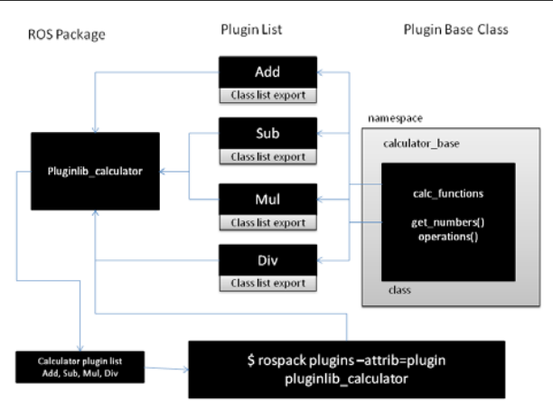
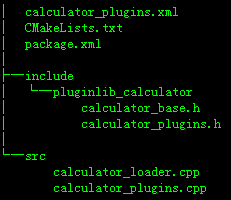
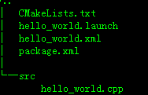
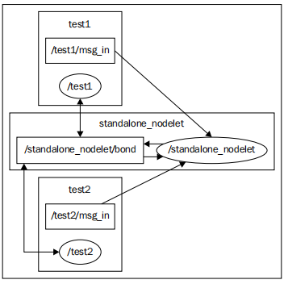
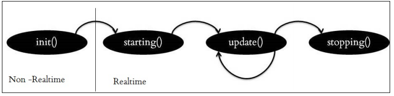
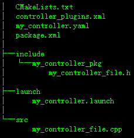
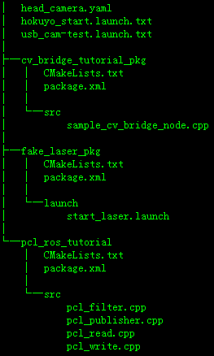

#### 使用 pluginlib 创建给计算器应用常见插件

结构图

> 每一个插件都需要继承 calc_functions 类



目录



##### 第一步 创建  calculator_base 头文件

> calc_functions 里边封装了一些公用的方法，插件必须继承这个类，calculator_base  命名空间还可以加入一些其它的类

```c++
#ifndef PLUGINLIB_CALCULATOR_CALCULTOR_BASE_H_
#define PLUGINLIB_CALCULATOR_CALCULTOR_BASE_H_

namespace calculator_base {
  class calc_functions {
    public:
      virtual void get_numbers(double number1, double number2) = 0;
      virtual double operation() = 0;
      virtual ~calc_functions(){}

    protected:
      calc_functions(){}
  };
};
#endif
```

##### 第二步 创建 calculator_plugins 头文件

>继承 calc_functions 类，下面的代码只展示了 Add 类，其他的比如乘法和除法是一样的操作

```c++
#ifndef PLUGINLIB_CALCULATOR_CALCULTOR_PLUGINS_H_
#define PLUGINLIB_CALCULATOR_CALCULTOR_PLUGINS_H_
#include <pluginlib_calculator/calculator_base.h>
#include <cmath>

namespace calculator_plugins {
  class Add : public calculator_base::calc_functions {
    public:
	Add() {
		number1_ = 0;
		number2_ = 0;
	}

	void get_numbers(double number1, double number2) {
		try {
			number1_ = number1;
			number2_ = number2;
		} catch(int e) {
			std::cerr<<"Exception while inputting numbers"<<std::endl;
		}
	}

	double operation() {
		return(number1_ + number2_);
	}

    private:
      double number1_;
      double number2_;
  };
};
#endif
```

##### 第三步 使用 calculator_plugins.cpp 导出插件

> 为了使插件能动态加载，我们需要使用一个叫做 PLUGINLIB_EXPORT_CLASS 的特殊宏去导出每一个插件。PLUGINLIB_EXPORT_CLASS 需要提供插件类和基础类名称。

```c++
#include <pluginlib_calculator/calculator_base.h>
#include <pluginlib_calculator/calculator_plugins.h>

PLUGINLIB_EXPORT_CLASS(calculator_plugins::Add, calculator_base::calc_functions);
PLUGINLIB_EXPORT_CLASS(calculator_plugins::Sub, calculator_base::calc_functions);
PLUGINLIB_EXPORT_CLASS(calculator_plugins::Mul, calculator_base::calc_functions);
PLUGINLIB_EXPORT_CLASS(calculator_plugins::Div, calculator_base::calc_functions);
```

#####第四步  calculator_loader.cpp 实现插件加载器

> 使用 calculator base 作为参数创建类加载器，创建子类实例。

```c++
#include <boost/shared_ptr.hpp>
#include <pluginlib/class_loader.h>
#include <pluginlib_calculator/calculator_base.h>

int main(int argc, char** argv) {
    // 使用 calculator base 作为参数
    pluginlib::ClassLoader<calculator_base::calc_functions> 	  
      calc_loader("pluginlib_calculator", "calculator_base::calc_functions");
    
    try {
	  // 加载子类，多态，会创建一个 Add 类的实例
      boost::shared_ptr<calculator_base::calc_functions> add =  
        	calc_loader.createInstance("pluginlib_calculator/Add");
      add->get_numbers(10.0,10.0);
      double result = add->operation();
      ROS_INFO("Triangle area: %.2f", result);
  } catch(pluginlib::PluginlibException& ex) {
      ROS_ERROR("The plugin failed to load for some reason. Error: %s", ex.what());
  }
}
```

#####第五步 创建插件描述  calculator_plugins.xml

> 这个配置文件是很重要的，因为它可以让 ROS 系统取发现、加载插件，且可以添加每个插件的描述信息.下面是 Add 插件的描述。定义了插件的  library 路径、插件的名称、插件的基础类、插件的类型和插件的描述

```xml
<library path="lib/libpluginlib_calculator">
 	<class name="pluginlib_calculator/Add" type="calculator_plugins::Add" 
		base_class_type="calculator_base::calc_functions">
 		<description>This is a add plugin.</description>
 	</class>
</library>
```

##### 第六步 注册插件

> 在 packages.xml 中添加如下几行

```xml
<!--导出第五步创建的 xml 文件，不然 ROS 系统找不到该文件-->
<export>
    <pluginlib_calculator plugin="${prefix}/calculator_plugins.xml"/>
</export>

<!--添加依赖-->
<build_depend>pluginlib_calculator</build_depend>
<run_depend>pluginlib_calculator</run_depend>
```

##### 第七步 编辑 CMakeLists.txt 文件

```cmake
......
# pluginlib_calculator library
add_library(pluginlib_calculator src/calculator_plugins.cpp)
target_link_libraries(pluginlib_calculator ${catkin_LIBRARIES})

# calculator_loader executable
add_executable(calculator_loader src/calculator_loader.cpp)
target_link_libraries(calculator_loader ${catkin_LIBRARIES})
......
```

执行 `catkin_make`

##### 第八步 查询包中插件

```
$ rospack plugins --attrib=plugin pluginlib_calculator
```

#####第九步 加载插件

```
$ roscore
$ rosrun pluginlib_calculator calculator_loader
```


#### 理解 ROS  nodelets

> nodelets 可以在一个进程中同时运行多个结点 ，每个结点使用一个线程，这样进程内部的数据是可以共用的，同时这个内部结点也可以和外部交流。nodelets 在数据传输量很大的结点间使用多，比如 3D 数据的传输。

创建一个 nodelet， 订阅 msg_in， 输出到 msg_out

目录结构



#####第一步 创建包

 $ catkin_create_pkg nodelet_hello_world  nodelet  roscpp  std_msgs

#####第二步 创建  hello_world.cpp 文件

##### 第三步 理解  hello_world.cpp

```c++
#include <pluginlib/class_list_macros.h>
#include <nodelet/nodelet.h>
#include <ros/ros.h>
#include <std_msgs/String.h>
#include <stdio.h>

namespace nodelet_hello_world {
class Hello : public nodelet::Nodelet {
    private:
        virtual void onInit() {
            ros::NodeHandle& private_nh = getPrivateNodeHandle();
            NODELET_DEBUG("Initialized the Nodelet");
            pub = private_nh.advertise<std_msgs::String>("msg_out",5);
            sub = private_nh.subscribe("msg_in",5, &Hello::callback, this);
        }

        void callback(const std_msgs::StringConstPtr input) {
            std_msgs::String output;
            output.data = input->data;
            NODELET_DEBUG("Message data = %s", output.data.c_str());
            ROS_INFO("Message data = %s", output.data.c_str());
            pub.publish(output);
        }

        ros::Publisher pub;
        ros::Subscriber sub;
    };
}

// 导出作为插件可以动态加载，书上换个代码里边有差别

// 代码
// PLUGINLIB_DECLARE_CLASS(nodelet_hello_world, Hello, nodelet_hello_world::Hello, //nodelet::Nodelet);

// 书上
PLUGINLIB_DECLARE_CLASS(nodelet_hello_world,Hello,nodelet_hello_world::Hello, nodelet::Nodelet);
```

#####第四步 创建插件描述文件

```xml
<library path="libnodelet_hello_world">
  <class name="nodelet_hello_world/Hello" type="nodelet_hello_world::Hello" 
		base_class_type="nodelet::Nodelet">
  	<description>
  		A node to republish a message
  	</description>
  </class>
</library>
```

##### 第五步 在 package.xml 中导出

```xml
<export>
 	<nodelet plugin="${prefix}/hello_world.xml"/>
</export>

<build_depend>nodelet_hello_world</build_depend>
<run_depend>nodelet_hello_world</run_depend>
```

#####第六步 编辑 Cmake 文件

```cmake
......
## Declare a cpp library
add_library(nodelet_hello_world src/hello_world.cpp)
  
## Specify libraries to link a library or executable target against
target_link_libraries(nodelet_hello_world ${catkin_LIBRARIES})
......
```

##### 第七步 编译和运行

执行 `catkin_make`，会生成一个 libnodelet_hello_world.so 文件，这就是一个插件。nodelet_manager 是一个可执行的 c++ 程序，监听 ROS  services 并且动态加载 nodelets，启动 nodelet_manager 可以从命令行和配置文件中启动

```
$ roscore

# 启动 nodelet_manager
$ rosrun nodelet nodelet manager __name:=nodelet_manager

# 使用 nodelet_manager 启动 nodelet
$ rosrun nodelet nodelet load nodelet_hello_world/Hello 
nodelet_manager __name:=nodelet1

# 发送消息
$ rostopic pub /nodelet1/msg_in std_msgs/String "Hello"

# 打印接收消息
$ rostopic echo /nodelet1/msg_out
```

#####第八步 创建 launch files

> 启动多个 nodelet

```xml
<launch>
   <!-- Started nodelet manager -->
   <node pkg="nodelet" type="nodelet" name="standalone_nodelet" 
       args="manager" output="screen"/>

   <!-- Starting first nodelet -->
   <node pkg="nodelet" type="nodelet" name="test1"
 	   args="load nodelet_hello_world/Hello standalone_nodelet" output="screen">
   </node> 

   <!-- Starting second nodelet -->
   <node pkg="nodelet" type="nodelet" name="test2" 
       args="load nodelet_hello_world/Hello standalone_nodelet"  output="screen">
   </node>
</launch>
```

执行 `roslaunch nodelet_hello_world hello_world.launch`

输出

`$rosrun rqt_gui rqt_gui`

 依次选择 Plugins > Introspection > Node Graph 就可以输出下面的图




## Gazebo  插件

> Gazebo 插件帮助我们控制机器人的模型、传感器、环境属性、甚至是路径。Gazebo  模拟器可以动态加载这些插件。这些插件是独立的，不使用 ROS 也可以使用这些插件，主要分为以下几个类别。
>
> - 环境属性插件，可以修改物理引擎、光照等属性
>
> - 模型插件，模型插件依附于具体的模型，可以控制模型的连接状态等
> - 系统插件，在 Gazebo 启动的时候伴随着启动，可以控制系统相关的功能
> - 可视化插件，可视化属性可以通过它控制

创建一个基本的 world plugin

```
$ mkdir ~/gazebo_basic_world_plugin
$ cd ~/gazebo_basic_world_plugin
$ nano hello_world.cc
```

hello_world.cc 内容

> 头文件
>
> - gazebo/gazebo.hh： 包含 Gazebo 的一些基本的方法
>
> - gazebo/physics/physics.hh: 物理引擎
> - gazebo/rendering/rendering.hh:处理渲染参数
> - gazebo/sensors/sensors.hh: 处理传感器
>
> 插件导出的宏命令
>
> - GZ_REGISTER_MODEL_PLUGIN：模型插件导出
> - GZ_REGISTER_SENSOR_PLUGIN： 传感器插件导出
> - GZ_REGISTER_SYSTEM_PLUGIN：系统插件导出
> - GZ_REGISTER_VISUAL_PLUGIN：可视化插件导出
> - GZ_REGISTER_WORLD_PLUGIN：导出为世界插件

```c++
#include <gazebo/gazebo.hh>

// 所有的 gazebo 插件都需要命名空间
namespace gazebo {
    // WorldpluginTutorials 实现 worldPlugin 标准类。每一个插件都需要实现于标准类
    class WorldPluginTutorial : public WorldPlugin {
        public: WorldPluginTutorial() : WorldPlugin() {
            printf("Hello World!\n");
        }

        // The Load function can receive the SDF elements 
        public: void Load(physics::WorldPtr _world, sdf::ElementPtr _sdf) {
        }
    };
	
    // 注册这个插件到模拟器
 	GZ_REGISTER_WORLD_PLUGIN(WorldPluginTutorial)
}
```

修改  CMakeLists.txt 文件

```cmake
cmake_minimum_required(VERSION 2.8 FATAL_ERROR)
find_package(Boost REQUIRED COMPONENTS system)
include_directories(${Boost_INCLUDE_DIRS})
link_directories(${Boost_LIBRARY_DIRS})
include (FindPkgConfig)
if (PKG_CONFIG_FOUND)
	pkg_check_modules(GAZEBO gazebo)
endif()
include_directories(${GAZEBO_INCLUDE_DIRS})
link_directories(${GAZEBO_LIBRARY_DIRS})
add_library(hello_world SHARED hello_world.cc)
target_link_libraries(hello_world ${GAZEBO_LIBRARIES} ${Boost_LIBRARIES})
```

build

```
$ mkdir ~/gazebo_basic_world_plugin/build
$ cd ~/gazebo_basic_world_plugin/build
$ cmake ../
$ make

# 设置插件 libhello_world.so 的路径到环境变量
export GAZEBO_PLUGIN_PATH=${GAZEBO_PLUGIN_PATH}:~/gazebo_basic_world_plugin/build
```

这样就可以在 SDF 和 URDF 文件中使用该插件了，例如：

$ nano ~/gazebo_basic_world_plugin/hello.world

```xml
<?xml version="1.0"?>
<sdf version="1.4">
	<world name="default">
        <plugin name="hello_world" filename="libhello_world.so"/>
    </world>
</sdf> 
```

加载文件

```
$ cd ~ /gazebo_basic_world_plugin
$ gzserver hello.world --verbose
```

https://bitbucket.org/osrf/gazebo，可以获取各种 Gazebo 插件


#### 编写 ROS 控制器和可视化插件

理解 pr2_mechanism 的各个包：

**pr2_controller_interface**：编写一个基本的实时控制器必须继承 pr2_controller_
interface::Controller 类，这个类有四个重要的方法  init() , start(), update(), and stop(). 

基本结构：

```c++
namespace pr2_controller_interface {
 class Controller {
 public:
 	virtual bool init(pr2_mechanism_model::RobotState *robot,
 		ros::NodeHandle &n);
 	virtual void starting();
 	virtual void update();
 	virtual void stopping();
 };
}
```

工作流程：




开发一个控制器，可以获取连接点和按照正弦曲线移动

目录结构：



##### 第一步 创建包

> 依赖 pr2_controller_interface pr2_mechanism_model 等

```
$ catkin_create_pkg my_controller_pkg roscpp pluginlib 
pr2_controller_interface pr2_mechanism_model
```

#####第二步 创建控制器头文件

> 继承自 pr2_controller_interface::Controller 类

```c++
#include <pr2_controller_interface/controller.h>
#include <pr2_mechanism_model/joint.h>

namespace my_controller_ns {

// Inheriting Controller class inside pr2_controller_interface
class MyControllerClass: public pr2_controller_interface::Controller {
    private:
       pr2_mechanism_model::JointState* joint_state_;
       double init_pos_;
    public:
       virtual bool init(pr2_mechanism_model::RobotState *robot, ros::NodeHandle &n);
       virtual void starting();
       virtual void update();
       virtual void stopping();
   };
}
```

#####第三步 编写控制器 cpp

```c++
#include "my_controller_pkg/my_controller_file.h"
#include <pluginlib/class_list_macros.h>

namespace my_controller_ns {

/// Controller initialization in non-realtime
// 在控制器被 controller manager 加载的时候会调用该方法
bool MyControllerClass::init(pr2_mechanism_model::RobotState *robot,
                            ros::NodeHandle &n) {
  std::string joint_name;
  if (!n.getParam("joint_name", joint_name)) {
    ROS_ERROR("No joint given in namespace: '%s')", n.getNamespace().c_str());
    return false;
  }

  joint_state_ = robot->getJointState(joint_name);
  if (!joint_state_) {
    ROS_ERROR("MyController could not find joint named '%s'", joint_name.c_str());
    return false;
  }
  return true;
}

/// Controller startup in realtime
void MyControllerClass::starting() {
  init_pos_ = joint_state_->position_;
}

/// Controller update loop in realtime
void MyControllerClass::update() {
  double desired_pos = init_pos_ + 15 * sin(ros::Time::now().toSec());
  double current_pos = joint_state_->position_;
  joint_state_->commanded_effort_ = -10 * (current_pos - desired_pos);
}

// Controller stopping in realtime
void MyControllerClass::stopping(){}
} // namespace

// Register controller to pluginlib
PLUGINLIB_EXPORT_CLASS(my_controller_ns::MyControllerClass, 
                         pr2_controller_interface::Controller);
```

##### 第四步 理解上面的代码

##### 第五步 添加插件描述文件 controller_plugins.xml

```xml
<library path="lib/libmy_controller_lib">
    <class name="my_controller_pkg/MyControllerPlugin"
           type="my_controller_ns::MyControllerClass"
           base_class_type="pr2_controller_interface::Controller" />
</library>
```

##### 第六步 更新 package.xml

```xml
<export>
	<pr2_controller_interface plugin="${prefix}/controller_plugins.xml"/>
</export>
```

##### 第七步 更新 CMakeLists.txt

```cmake
## my_controller_file library
add_library(my_controller_lib src/my_controller_file.cpp)
target_link_libraries(my_controller_lib ${catkin_LIBRARIES})
```

#####第八步 编译控制器

```
$ catkin_make

# 显示所有以 pr2_controller_interface 作为基础类插件的控制器的文件
# 如果能看到上面新建的 controller_plugins.xml 表明创建成功
$ rospack plugins --attrib=plugin pr2_controller_interface
```

##### 第九步 编写控制器配置文件

配置文件包括 控制器的类别，连接名称，限制范围等，必须以 YAML 格式保存在包内部

```yaml
my_controller_name:
 type: my_controller_pkg/MyControllerPlugin
 joint_name: r_shoulder_pan_joint
```

#####第十步 编写 launch 文件

> 使用该配置文件可以运行控制器

```xml
<launch>
   <rosparam file="$(find my_controller_pkg)/my_controller.yaml" command="load" />

   <node pkg="pr2_controller_manager" type="spawner" args="my_controller_name" name="my_controller_spawner"/>
</launch>
```

#####第十一步 在 PR2 模拟器中运行控制器

```
# 启动模拟器，伴随着所有相关控制器也启动了
$ roslaunch pr2_gazebo pr2_empty_world.launch

# 我们控制的连接点是 r_shoulder_pan_joint， 如果已经存在对应的控制器，我们的控制是无效的，必须把之前# 的给停掉

# 展示 pr2 的所有控制器
$ rosrun pr2_controller_manager pr2_controller_manager list

# 停掉 r_arm_controller
$ rosrun pr2_controller_manager pr2_controller_manager stop 
r_arm_controller

# 启动我们自己的控制器
$ roslaunch my_controller_pkg my_controller.launch
```

#### ros_control 包

之前使用的 pr2_mechanism 包只适用于 PR2，为了获得更好的泛化性，形成了一个新的包  ros_control (http://wiki.ros.org/ros_control)，ros_control 实现了一些标准的控制器，比如： effort_controllers, joint_state_controllers，position_controllers, and velocity controllers 等，使用于所有的机器人。


#### 理解 ROS RViz 及其插件

在 RViz 顶部的 Dockable panels 可以添加自己编写的插件

RViz 使用 Qt 写的，所以在写页面的时候用到了 Qt 的相关东西。

##### 第一步 创建包

> rviz 在编译的时候已经依赖了  Qt ，所以不用在添加 Qt 依赖

```
$ catkin_create_pkg rviz_telop_commander roscpp rviz std_msgs
```

##### 第二部步 创建头文件

```c++
#ifndef TELEOP_PAD_H
#define TELEOP_PAD_H
#include <ros/ros.h>
#include <ros/console.h>
#include <rviz/panel.h>

class QLineEdit;

namespace rviz_telop_commander
{

//class DriveWidget;

// BEGIN_TUTORIAL
// Here we declare our new subclass of rviz::Panel.  Every panel which
// can be added via the Panels/Add_New_Panel menu is a subclass of
// rviz::Panel.
//
// TeleopPanel will show a text-entry field to set the output topic
// and a 2D control area.  The 2D control area is implemented by the
// DriveWidget class, and is described there.
class TeleopPanel: public rviz::Panel
{
// This class uses Qt slots and is a subclass of QObject, so it needs
// the Q_OBJECT macro.
Q_OBJECT
public:
  // QWidget subclass constructors usually take a parent widget
  // parameter (which usually defaults to 0).  At the same time,
  // pluginlib::ClassLoader creates instances by calling the default
  // constructor (with no arguments).  Taking the parameter and giving
  // a default of 0 lets the default constructor work and also lets
  // someone using the class for something else to pass in a parent
  // widget as they normally would with Qt.
  TeleopPanel( QWidget* parent = 0 );

  // Now we declare overrides of rviz::Panel functions for saving and
  // loading data from the config file.  Here the data is the
  // topic name.
  virtual void load( const rviz::Config& config );
  virtual void save( rviz::Config config ) const;

  // Next come a couple of public Qt slots.
public Q_SLOTS:
  // The control area, DriveWidget, sends its output to a Qt signal
  // for ease of re-use, so here we declare a Qt slot to receive it.
//  void setVel( float linear_velocity_, float angular_velocity_ );

  // In this example setTopic() does not get connected to any signal
  // (it is called directly), but it is easy to define it as a public
  // slot instead of a private function in case it would be useful to
  // some other user.
  void setTopic( const QString& topic );

  // Here we declare some internal slots.
protected Q_SLOTS:
  // sendvel() publishes the current velocity values to a ROS
  // topic.  Internally this is connected to a timer which calls it 10
  // times per second.
  void sendVel();

  void update_Linear_Velocity();
  void update_Angular_Velocity();

  // updateTopic() reads the topic name from the QLineEdit and calls
  // setTopic() with the result.
  void updateTopic();

  // Then we finish up with protected member variables.
protected:
  // The control-area widget which turns mouse events into command
  // velocities.
  // DriveWidget* drive_widget_;

  // One-line text editor for entering the outgoing ROS topic name.
  QLineEdit* output_topic_editor_;

  // The current name of the output topic.
  QString output_topic_;

  QLineEdit* output_topic_editor_1;

  // The current name of the output topic.
  QString output_topic_1;

  QLineEdit* output_topic_editor_2;

  // The current name of the output topic.
  QString output_topic_2;


  // The ROS publisher for the command velocity.
  ros::Publisher velocity_publisher_;

  // The ROS node handle.
  ros::NodeHandle nh_;

  // The latest velocity values from the drive widget.
  float linear_velocity_;
  float angular_velocity_;
  // END_TUTORIAL
};

} // end namespace rviz_plugin_tutorials

#endif // TELEOP_PANEL_H
```

。。。。

#####ROS – OpenCV 接口　vision_opencv

vision_opencv 由两个包组成

cv_bridge :可以把 ROS 的获取的 sensor_msgs/Image 格式的消息数据，转换为 open_cv  能够处理的 cv::Mat 格式，反之亦然。

image_geometry: 相机矫正，有 C++ 和 python 两种库，把 sensor_msgs/CameraInfo 消息格式的参数传给open_cv 的矫正函数

##### ROS – PCL 接口　perception_pcl

perception_pcl 有如下包：

pcl_conversions：把 PCL 数据类型转换为 ROS 的消息格式，反之亦然。

pcl_msgs：包含 PCL 相关的消息格式，包括，ModelCoefficients，PointIndices，PolygonMesh，Vertices

pcl_ros：包含一些工具和结点，把 PCL 数据转换位 ROS 的格式　 

pointcloud_to_laserscan：把 3D 点云数据转换为 2D 的雷达扫描，用于机器人的 2D-SLAM 导航

##### 安装　ROS perception

。。。

#####使用 ROS 和 OpenCV 图像处理

目录结构：



##### 第一步：创建包

```
$ catkin_create_pkg cv_bridge_tutorial_pkg cv_bridge image_transport
roscpp sensor_msgs std_msgs
```

#####第二步：创建 sample_cv_bridge_node.cpp 文件

##### 第三步：代码

```c++
#include <image_transport/image_transport.h>

#include <cv_bridge/cv_bridge.h>
#include <sensor_msgs/image_encodings.h>

//　OpenCV 图像处理和 GUI
#include <opencv2/imgproc/imgproc.hpp>
#include <opencv2/highgui/highgui.hpp>

// 用于接收和发送 ROS 的图像消息，比 ros::Publishers 更高效
image_transport::ImageTransport it_;
public:
Edge_Detector(): it_(nh_)
{
// Subscribe to input video feed and publish output video feed
image_sub_ = it_.subscribe("/usb_cam/image_raw", 1,
&ImageConverter::imageCb, this);
image_pub_ = it_.advertise("/edge_detector/processed_image", 1);
```


  

