## 安装 gazebo 模拟器

安装和启动

```apt-get install ros-kinetic-turtlebot-gazebo 
$ apt-get install ros-kinetic-turtlebot-*

# 启动模拟器
$ roslaunch turtlebot_gazebo turtlebot_world.launch 

# 启动键盘控制（只能在终端界面用键盘控制turtlebot移动，无法在 Gazebo 界面控制）
$ roslaunch turtlebot_teleop keyboard_teleop.launch

# 观察摄像机采集的数据
$ roslaunch turtlebot_rviz_launchers view_robot.launch
```

遇到的问题和解决办法

1. 打开一直处于如下状态，进不去，原因是没下载 models

   解决办法：

   ``` cd  ~/.gazebo/
   $ mkdir -p models
   $ cd  ~/.gazebo/models/
   $ wget http://file.ncnynl.com/ros/gazebo_models.txt
   $ wget -i gazebo_models.txt
   $ ls model.tar.g* | xargs -n1 tar xzvf
   ```

2. 错误：*Invalid tag: environment variable ‘TURTLEBOT_GAZEBO_WORLD_FILE’ is not set. Arg xml is arg default=”$(env TURTLEBOT_GAZEBO_WORLD_FILE)” name=”world_file”The traceback for the exception was written to the log file.*

   解决方法：重新配置环境

   ```
   $ sudo rosdep init
   $ rosdep update
   $ echo "source /opt/ros/kinetic/setup.bash" >> ~/.bashrc
   $ source ~/.bashrc
   ```


## 人脸检测

####结构图

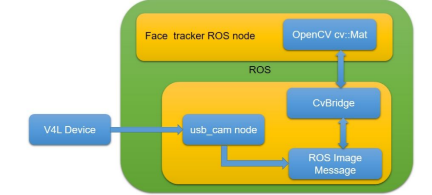

####创建 ROS 包

> mac 不能调用摄像头问题,解决方法： https://github.com/patjak/bcwc_pcie/wiki/Get-Started
>
> v4l-utils：实时从 webcam 抓取视频
>
> usb_cam：获取 v4l 的视频流，并且发布为 ROS 图像消息

```
# 进入空间
$ cd ros_project_dependencies_ws/src/

# 下载包 web_cam，用于读取摄像头的图像，可以放到一个第三方包空间中
$ git clone https://github.com/bosch-ros-pkg/usb_cam.git
$ cd ros_project_dependencies_ws
$ catkin_make

# 安装 v4l-utils
sudo apt-get install v4l-utils

# 创建 face_tracker_pkg 包
$ catkin_create_pkg face_tracker_pkg roscpp rospy cv_bridge dynamixel_controllers 	   message_generation

# 创建 face_tracker_control 包
$ catkin_create_pkg face_tracker_control roscpp rospy std_msgs dynamixel_controllers message_generation
```

> 1. opencv 通过 vision_opencv 这个包集成在 ROS 中，在安装 ROS（全部安装） 的时候就已经安装了，有两个包
>
>    cv_bridge：把 OpenCV  的图像类型转为 ROS 的图像消息( sensor_msgs/Image.msg )，或把摄像头获取的图像转换为 OpenCV 支持的类型
>
>    image_geometry：提供了一系列关于图像几何处理的方法
>
> 2. image_transport 
>
>    该包使用图像压缩技术减少传递的带宽，在安装 ROS（全部安装） 的时候就已经安装了

1. 编写 face_tracker_pkg

   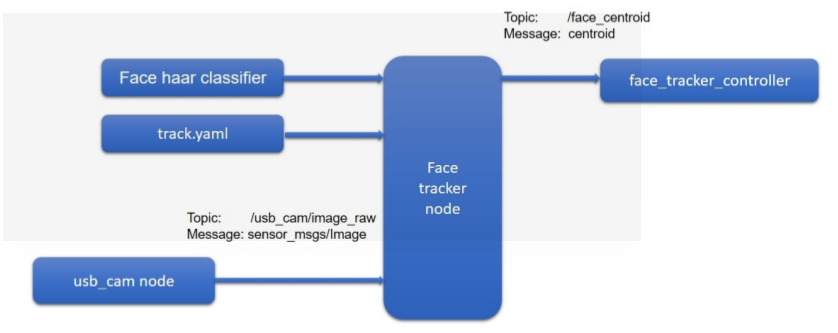

包结构:

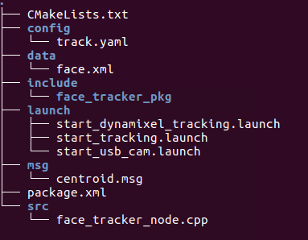

face_tracker_node.cpp

```c++
// ROS headers
#include <ros/ros.h>
#include <image_transport/image_transport.h>
#include <cv_bridge/cv_bridge.h>
#include <sensor_msgs/image_encodings.h>

// Open-CV headers
#include <opencv2/imgproc/imgproc.hpp>
#include <opencv2/highgui/highgui.hpp>
#include "opencv2/objdetect.hpp"

// Centroid message headers
#include <face_tracker_pkg/centroid.h>

// OpenCV window name
static const std::string OPENCV_WINDOW = "raw_image_window";
static const std::string OPENCV_WINDOW_1 = "face_detector";

using namespace std;
using namespace cv;

class Face_Detector {
  ros::NodeHandle nh_;
  
  image_transport::ImageTransport it_;
  image_transport::Subscriber image_sub_;
  image_transport::Publisher image_pub_;
 
  ros::Publisher face_centroid_pub;

  face_tracker_pkg::centroid face_centroid;

  string input_image_topic, output_image_topic, haar_file_face;
  int face_tracking, display_original_image, display_tracking_image, center_offset,      screenmaxx;

  
public:
  
  Face_Detector(): it_(nh_) {
  
  // 默认值，使用 track.yaml 文件的内容进行覆盖
  input_image_topic = "/usb_cam/image_raw";
  output_image_topic = "/face_detector/raw_image";
  haar_file_face = "/home/robot/face.xml";
  face_tracking = 1;
  display_original_image = 1;
  display_tracking_image = 1;
  screenmaxx = 640;
  center_offset = 100;

  // 加载 track.yaml 问价文件中配置的参数
  try {
  	nh_.getParam("image_input_topic", input_image_topic);
  	nh_.getParam("face_detected_image_topic", output_image_topic);
  	nh_.getParam("haar_file_face", haar_file_face);
  	nh_.getParam("face_tracking", face_tracking);
  	nh_.getParam("display_original_image", display_original_image);
  	nh_.getParam("display_tracking_image", display_tracking_image);
  	nh_.getParam("center_offset", center_offset);
  	nh_.getParam("screenmaxx", screenmaxx);

  	ROS_INFO("Successfully Loaded tracking parameters");
  } catch(int e) {
      ROS_WARN("Parameters are not properly loaded from file, loading defaults");
  }

   // 订阅 input_image_topic，回调函数 imageCb, 发布到 output_image_topic 和 face_centroid
   image_sub_ = it_.subscribe(input_image_topic, 1, &Face_Detector::imageCb, this);
   image_pub_ = it_.advertise(output_image_topic, 1);
   face_centroid_pub = nh_.advertise<face_tracker_pkg::centroid>("/face_centroid", 10);
  }

  ~Face_Detector() {
    if( display_original_image == 1 or display_tracking_image == 1)
    	cv::destroyWindow(OPENCV_WINDOW);
  }

  // 订阅的回调函数
  void imageCb(const sensor_msgs::ImageConstPtr& msg) {
    cv_bridge::CvImagePtr cv_ptr;
    namespace enc = sensor_msgs::image_encodings;

    // 把获取的 ROS 图像数据转换为 OpenCV 的格式
    try {
      cv_ptr = cv_bridge::toCvCopy(msg, sensor_msgs::image_encodings::BGR8);
    } catch (cv_bridge::Exception& e){
      ROS_ERROR("cv_bridge exception: %s", e.what());
      return;
    }

    // 加载分类器
	string cascadeName = haar_file_face;
    CascadeClassifier cascade;
	if(!cascade.load(cascadeName)) {
		cerr << "ERROR: Could not load classifier cascade" << endl;
	}

	if (display_original_image == 1) {
		imshow("Original Image", cv_ptr->image);
	}
    
    // 使用分类器在图像上找出人脸，并且画出来
    detectAndDraw( cv_ptr->image, cascade );
    
    // 发布
    image_pub_.publish(cv_ptr->toImageMsg());
    waitKey(30);
}

// 检测图像并在图像上画出检测出的人脸
void detectAndDraw( Mat& img, CascadeClassifier& cascade)
{
    double t = 0;
    double scale = 1;
    vector<Rect> faces, faces2;
    const static Scalar colors[] = {
        Scalar(255,0,0),
        Scalar(255,128,0),
        Scalar(255,255,0),
        Scalar(0,255,0),
        Scalar(0,128,255),
        Scalar(0,255,255),
        Scalar(0,0,255),
        Scalar(255,0,255)
    };
    Mat gray, smallImg;

    // 对图像转换位灰度图、resize、直方图均衡化
    cvtColor( img, gray, COLOR_BGR2GRAY );
    double fx = 1 / scale ;
    resize( gray, smallImg, Size(), fx, fx, INTER_LINEAR );
    equalizeHist(smallImg, smallImg);
	
  	// 检测人脸
    t = (double)cvGetTickCount();
    cascade.detectMultiScale(smallImg, faces, 1.1, 15, 0 | CASCADE_SCALE_IMAGE,     Size(30, 30));
    t = (double)cvGetTickCount() - t;
  
    // 对检测的人脸进行
    for ( size_t i = 0; i < faces.size(); i++ ) {
        Rect r = faces[i];
        Mat smallImgROI;
        vector<Rect> nestedObjects;
        Point center;
        Scalar color = colors[i%8];
        int radius;

        double aspect_ratio = (double)r.width / r.height;
        if( 0.75 < aspect_ratio && aspect_ratio < 1.3 ) {
            center.x = cvRound((r.x + r.width*0.5)*scale);
            center.y = cvRound((r.y + r.height*0.5)*scale);
            radius = cvRound((r.width + r.height)*0.25*scale);
            circle( img, center, radius, color, 3, 8, 0 );

   	    	face_centroid.x = center.x;
   	    	face_centroid.y = center.y;
  
            // 发布计算出的检测到的人脸中心
  	    	face_centroid_pub.publish(face_centroid);
        } else {
            rectangle( img, cvPoint(cvRound(r.x*scale), cvRound(r.y*scale)),
                       cvPoint(cvRound((r.x + r.width-1)*scale), cvRound((r.y +	 	r.height-1)*scale)), color, 3, 8, 0);
        }
    }

    // 添加左右和中心线,固定的
    Point pt1, pt2 ,pt3, pt4, pt5, pt6;

    // 中心点
    pt1.x = screenmaxx / 2;
    pt1.y = 0;
    pt2.x = screenmaxx / 2;
    pt2.y = 480;

    // 左边点
    pt3.x = (screenmaxx / 2) - center_offset;
    pt3.y = 0;
    pt4.x = (screenmaxx / 2) - center_offset;
    pt4.y = 480;

    // 右边点
    pt5.x = (screenmaxx / 2) + center_offset;
    pt5.y = 0;
    pt6.x = (screenmaxx / 2) + center_offset;
    pt6.y = 480;

    // 画出这三条线并添加文字
    line(img,  pt1,  pt2, Scalar(0, 0, 255),0.2);
    line(img,  pt3,  pt4, Scalar(0, 255, 0),0.2);
    line(img,  pt5,  pt6, Scalar(0, 255, 0),0.2);

    putText(img, "Left", cvPoint(50,240), FONT_HERSHEY_SIMPLEX, 1, cvScalar(255,0,0), 2, CV_AA);
    putText(img, "Center", cvPoint(280,240), FONT_HERSHEY_SIMPLEX, 1, cvScalar(0,0,255), 2, CV_AA);
    putText(img, "Right", cvPoint(480,240), FONT_HERSHEY_SIMPLEX, 1, cvScalar(255,0,0), 2, CV_AA);

    if (display_tracking_image == 1) {
    	imshow( "Face tracker", img );
     }
}
};

int main(int argc, char** argv) {
  ros::init(argc, argv, "Face tracker");
  Face_Detector ic;
  ros::spin();
  return 0;
}
```

track.yml

> haar_file_face 并不是只用人脸，同时可以检测眼睛等，下载配置文件替换就可以了，下载地址：https://github.com/opencv/opencv/tree/master/data

```
image_input_topic: "/usb_cam/image_raw"
face_detected_image_topic: "/face_detector/raw_image"
haar_file_face: "/home/tony/ros_robotics_projects_ws/src/face_tracker_pkg/data/face.xml"
face_tracking: 1
display_original_image: 1
display_tracking_image: 1
```

start_usb_cam.launch

```yaml
<launch>
	<node name="usb_cam" pkg="usb_cam" type="usb_cam_node" output="screen" >
		<param name="video_device" value="/dev/video0" />
		<param name="image_width" value="640" />
		<param name="image_height" value="480" />
		<param name="pixel_format" value="yuyv" />
		<param name="camera_frame_id" value="usb_cam" />
		<param name="auto_focus" value="false" />
		<param name="io_method" value="mmap"/>
	</node>
</launch>
```

start_tracking.launch

> 使用 **find** 可以加载别的包下的 lauch 文件和配置文件

```yaml
<launch>
	<!-- Launching USB CAM launch files and Dynamixel controllers -->
	<include file="$(find face_tracker_pkg)/launch/start_usb_cam.launch"/>
	
	<!-- Starting face tracker node -->
	<rosparam file="$(find face_tracker_pkg)/config/track.yaml" command="load"/>
	
	<node name="face_tracker" pkg="face_tracker_pkg" type="face_tracker_node" 
	output="screen"/>
</launch>
```

## 聊天机器人

####AIML 数据格式

> AIML 是一种基于 XML 语言的数据存储格式，能很好的进行数据存储和检索

示例

category：输入和输出放在里边

pattern：输入的内容

template：输入内容

\*：匹配任何内容

star：n 表示匹配到的第几个

```xml
<aiml version="1.0.1" encoding="UTF-8">
	<category>
		<pattern> MY NAME IS * </pattern>
		<template>
			NICE TO SEE YOU <star index="1"/>
		</template>
		</category>
	<category>
		<pattern> MEET OUR ROBOTS * AND * </pattern>
		<template>
			NICE TO SEE <star index="1"/>AND <star index="2"/>.
		</template>
	</category>
</aiml>
```

输入：You: MY NAME IS LENTIN 

回答： Robot: NICE TO SEE YOU LENTIN

输入：You: MEET OUR ROBOTS ROBIN AND TURTLEBOT
回答：Robot: NICE TO SEE ROBIN AND TURTLEBOT    

####PyAIML interpreter

> PyAIML interpreter 可以加载 AIML 数据并生成一棵树，使用深度优先搜索查询数据。

安装：

```
$ sudo apt-get install python-aiml
```

简单使用：

```python
import aiml

bot = aiml.Kernel()
bot.setBotPredicate("name", ROBIN)
#　加载指定的 AIML 文件
bot.learn('sample.aiml")
print bot.respond("MY NAME IS LENTIN")
```

加载多个 AIML 文件：

```xml
<aiml version="1.0">
<category>
	<pattern>LOAD AIML B</pattern>
		<template>
			<!-- 可以加载指定目录下的所有 AIML 文件 -->
			<learn>*.aiml</learn>
		</template>
	</category>
</aiml>
```

示例代码：

```python
import aiml
import sys
import os

#　设置 AIML 文件夹的路径
os.chdir('/home/robot/Desktop/aiml/aiml_data_files') 
bot =　aiml.Kernel()

# 判断该目录下是否有　brainFile，有就直接加载　brainFile，没有生成　brainFile，这样就不用程序执行的
# 时候都生成一遍
initialize using bootstrap() method
if os.path.isfile("standard.brn"): 
  bot.bootstrap(brainFile =　"standard.brn") 
else:
　brain bot.bootstrap(learnFiles = "startup.xml", commands = "load　aiml b") 　bot.saveBrain("standard.brn")

# 输入数据获得输出
while True: 
  print bot.respond(raw_input("Enter input >"))
```

####搭建聊天机器人

结构图：

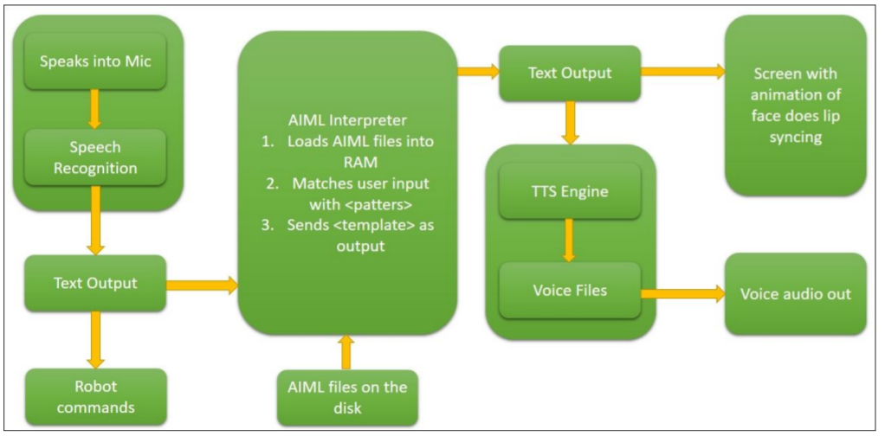AIML ROS 包

结点之间的关系图：

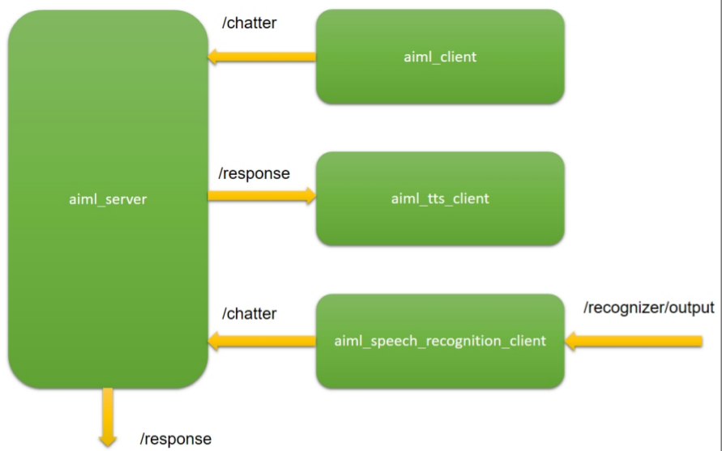

安装　ROS sound_play 包

```
# 安装依赖项
$ sudo apt-get install libgstreamer1.0-dev libgstreamer-plugins-base1.0-dev gstreamer1.0 gstreamer1.0-plugins-base gstreamer1.0-plugins-good　gstreamer1.0-plugins-ugly python-gi festival

＃　安装　sound_play
ros_project_dependencies_ws/src$ git clone https://github.com/ros-drivers/audio_common

ros_project_dependencies_ws$ catkin_make

# 能成功进入则表示安装成功
$ roscd sound_play
```

创建　ROS AIML 包：

```
catkin_create_pkg ros_aiml rospy std_msgs sound_play
```

目录结构位：

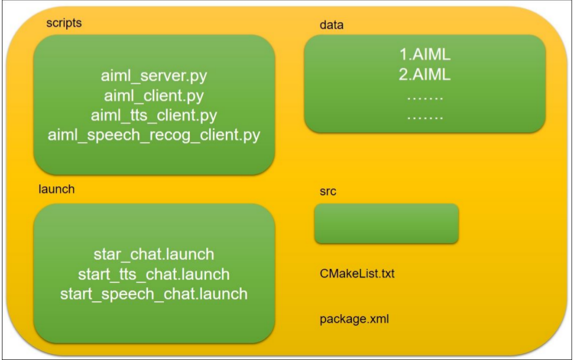

代码：。。。

启动结点：

    $ sudo chmod +x *.launch
    $ roslaunch ros_aiml start_chat.launch
    $ roslaunch ros_aiml start_speech_chat.launch
    
    # 下载这个可以进行语音识别,还没试过
    $ roslaunch pocketsphinx robotcup.launch
## 目标检测

####find_object 包

> find_object_2d 实现了 SURF, SIFT, FAST,and BRIEF 特征提取方式和描述子，且可以标注出物体进行保存，作为之后的物检测，且可以发布检测到的目标

安装

```
# 直接安装
$ sudo apt-get install ros-kinetic-find-object-2d
$ catkin_make

# 或通过克隆下载安装
$ git clone https://github.com/introlab/find-object.git src/find_object_2d
$ catkin_make
```

执行 2D 目标检测：

```
$ roscore

# 需要先安装 usb_cam，启动
$ roslaunch usb_cam usb_cam-test.launch

# 使用 /usb_cam/image_raw 主题数据作为 find_object_2d 的输入
$ rosrun find_object_2d find_object_2d image:=/usb_cam/image_raw

# 打印检测出的物体的位置
$ rosrun find_object_2d print_objects_detected

# /objects 主题下可以获取检测到目标的详细信息，包括检测出物体的宽、高、单应矩阵
$ rostopic echo /objects
```

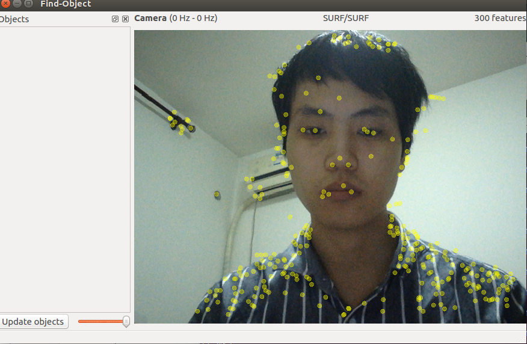

> 在左边空白处点击鼠标右键，可以选择 add objects from screen 和 add objects from files，这里选择第一个，然后选择　 take  picture，　

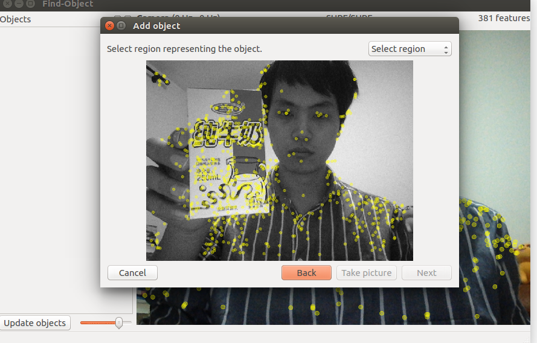

> 选择区域或关键点

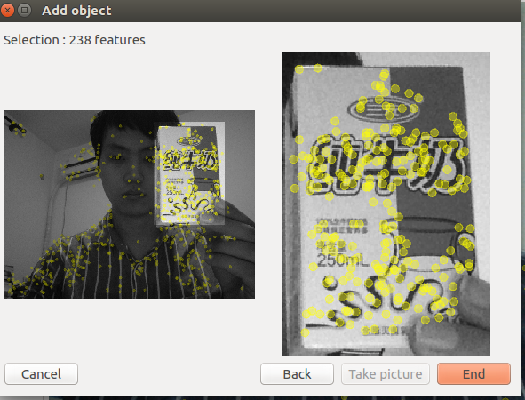

> 选择　End ，可以对指定的物体进行检测了

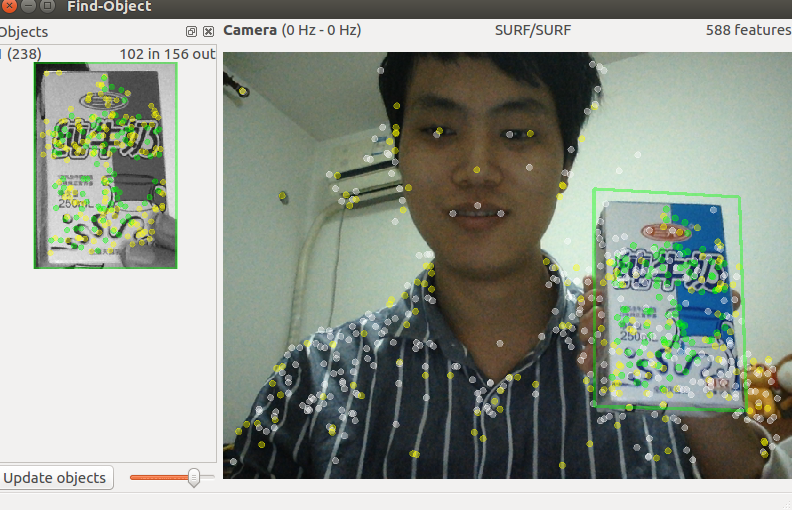

这时 /objects 主题下也有数据了

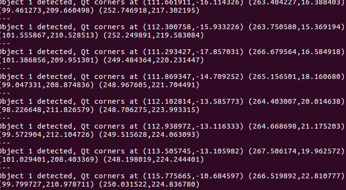

使用深度传感器，执行 3D 目标检测：

```
# 下面装的依赖和前面的装的 usb_cam 作用是一样的，就是获取摄像头数据
# Kinect 一代需要的依赖
$ sudo apt-get install ros-kinetic-openni-launch

# Kinect 二代需要自己克隆安装依赖
$ git clone https://github.com/code-iai/iai_kinect2

# 使用 Kinect 一代, 启动，操作之后的操作和之前 2D 的操作是一样的
$ roslaunch openni_launch openni.launch depth_registration:=true

# 启动 find_object_3d
$ roslaunch find_object_2d find_object_3d.launch
```

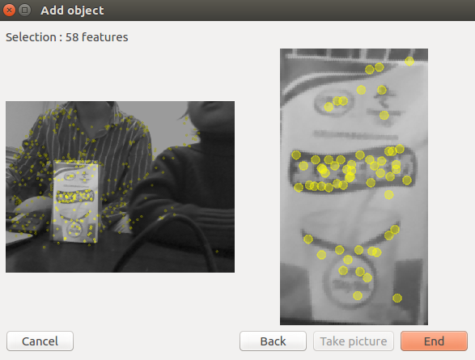

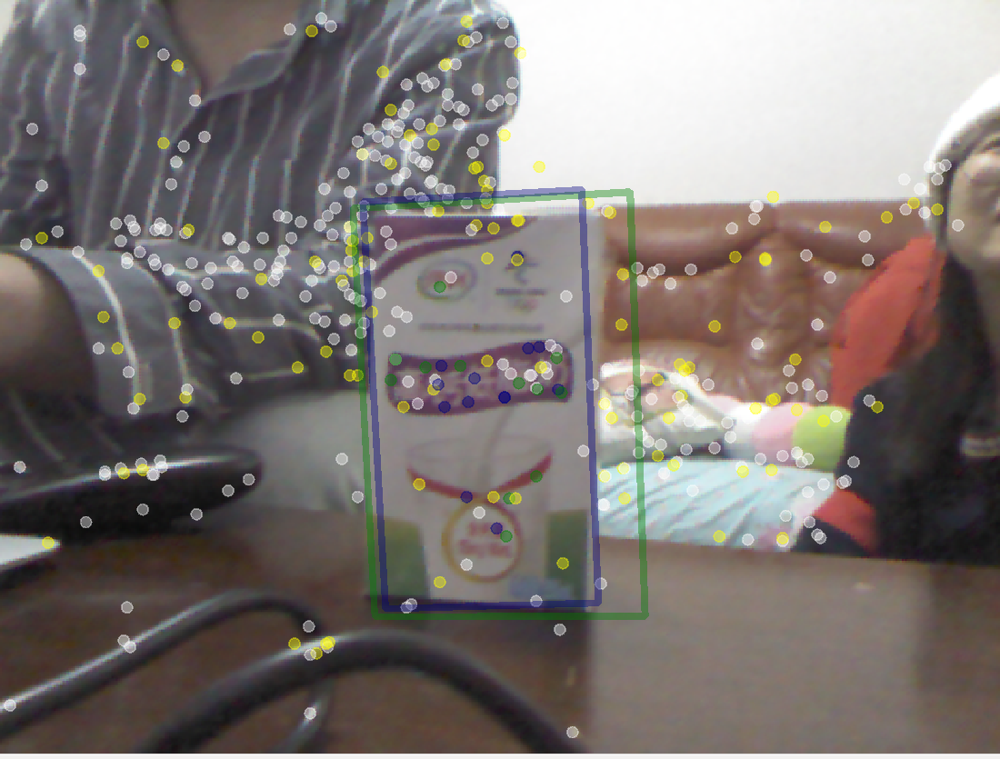

####  3D 物体识别， Object Recognition Kitchen ( ORK)

安装：

```
$ sudo apt-get install ros-kinetic-object-recognition-*

# 可以下载 ork 教程
$ git clone https://github.com/wg-perception/ork_tutorials

# 
```

## ROS 和深度学习的集成

安装 tensorflow

> 在安装过程中遇到如下问题：
>
> １．　提示 pip升级，升级完之后出现　cannot from pip import main　问题。
>
> ​	解决办法：
>
> ​	sudo  gedit /usr/bin/pip
>
> ​	把　from pip import main　修改为　from pip._internal import main
>
> ２．无法下载　tensorflow,　pip 源的问题
>
> ​	解决办法：
>
> ​	修改 ~/.pip/pip.conf (没有就创建一个文件夹及文件，文件夹要加"."，表示是隐藏文件夹)，内容如下：
> ​	[global]
> ​	index-url = https://pypi.tuna.tsinghua.edu.cn/simple
> ​	install]
>
> 　　trusted-host=mirrors.aliyun.com	

```
# 安装 pip
$ sudo apt-get install python-pip python-dev

# tensorflow 二进制　URL（cpu）
$ export TF_BINARY_URL=https://storage.googleapis.com/tensorflow/linux/cpu/tensorflow-0.11.0-cp27-none-linux_x86_64.whl

# tensorflow 二进制　URL（gpu）
$ export TF_BINARY_URL=https://storage.googleapis.com/tensorflow/linux/gpu/tensorflow-0.11.0-cp27-none-linux_x86_64.whl

# 安装　tensorflow
$ sudo pip install --upgrade $TF_BINARY_URL
```

安装成功：

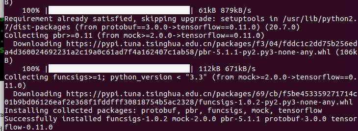

使用 tensorflow 进行图像识别：

> 遇到问题
>
> 在执行 `python image_recognition.py image:=/cv_camera/image_raw `  过程中出现　
>
> ```
> TA protocol message was rejected because it was too big (more than 67108864 bytes).
> ```
>
> 解决方法：
>
> 设置换进变量　export  PROTOCOL_BUFFERS_PYTHON_IMPLEMENTATION=python

```
# 安装 cv_bridge
$ sudo apt-get install ros-kinetic-cv-bridge ros-kinetic-cv-camera

$ roscore

# 开启摄像头
$ rosrun cv_camera cv_camera_node

# 执行图像识别（执行过程中会先进行下载），设置图像输入
$ python image_recognition.py image:=/cv_camera/image_raw

# 识别出的物体通过 /result 主题进行输出 
$ rostopic echo /result

#　image_view 查看图像，　默认选择全部安装 ros 时会自动安装 image_view, 如果没有，则安装　
# sudo apt-get install ros-kinetic-image-view
$ rosrun image_view image_view image:= /cv_camera/image_raw
```

识别出的结果：

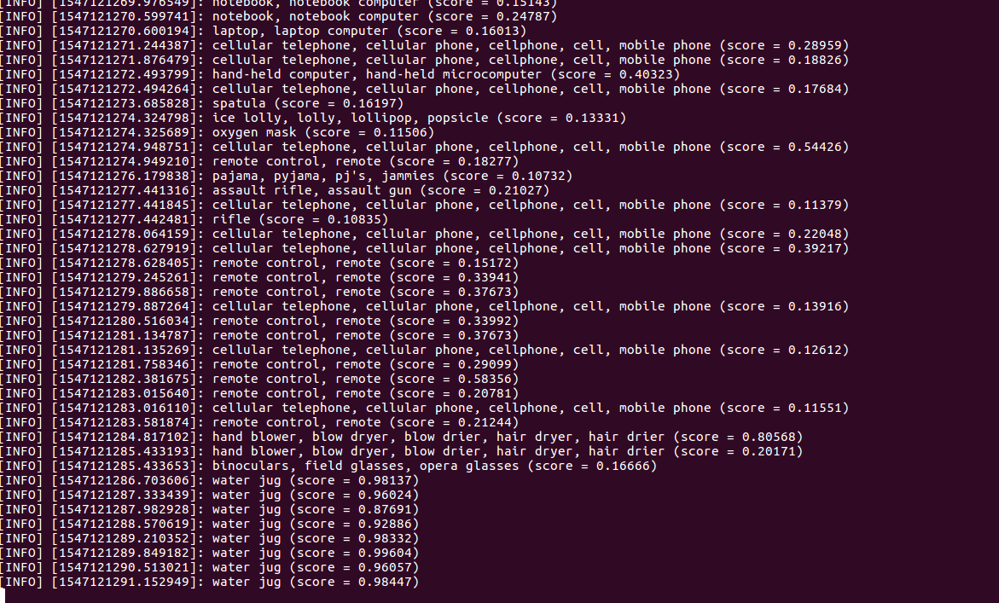

image_recognition.py 代码：

```python
import rospy
from sensor_msgs.msg import Image
from std_msgs.msg import String
from cv_bridge import CvBridge
import cv2
import numpy as np
import tensorflow as tf
from tensorflow.models.image.imagenet import classify_image

class RosTensorFlow():
    def __init__(self):
        # 下载tensorflow 模型，下载到地址 /tmp/imagenet
        classify_image.maybe_download_and_extract()
        
        self._session = tf.Session()
        classify_image.create_graph()
        self._cv_bridge = CvBridge()

        # 订阅和发布
        self._sub = rospy.Subscriber('image', Image, self.callback, queue_size=1)
        self._pub = rospy.Publisher('result', String, queue_size=1)
        
        #　评分阈值和显示数量
        self.score_threshold = rospy.get_param('~score_threshold', 0.1)
        self.use_top_k = rospy.get_param('~use_top_k', 5)

    def callback(self, image_msg):
        cv_image = self._cv_bridge.imgmsg_to_cv2(image_msg, "bgr8")
        
        # copy from https://github.com/tensorflow/tensorflow/blob/master/tensorflow
        # /models/image/imagenet/classify_image.py
        image_data = cv2.imencode('.jpg', cv_image)[1].tostring()
        
        # Creates graph from saved GraphDef.softmax_tensor　是计算图中的一个tensor,　长度是　
        # 1000，即能识别出 1000 种类型
        softmax_tensor = self._session.graph.get_tensor_by_name('softmax:0')
        predictions = self._session.run(
            softmax_tensor, {'DecodeJpeg/contents:0': image_data})
        predictions = np.squeeze(predictions)
        
        # Creates node ID --> English string lookup.
        node_lookup = classify_image.NodeLookup()
        top_k = predictions.argsort()[-self.use_top_k:][::-1]
        for node_id in top_k:
            human_string = node_lookup.id_to_string(node_id)
            score = predictions[node_id]
            if score > self.score_threshold:
                rospy.loginfo('%s (score = %.5f)' % (human_string, score))
                # 识别出物体，发布
                self._pub.publish(human_string)

    def main(self):
        rospy.spin()

if __name__ == '__main__':
    rospy.init_node('rostensorflow')
    tensor = RosTensorFlow()
    tensor.main()
```

很遗憾的是上面的识别任务只能识别出图像的物体，并没有标出物体的位置。

#### 使用 darknet_ros

安装

https://github.com/leggedrobotics/darknet_ros

##　制作一个可以自动移动的机器人

#### 地图构建

```
＃ 打开模拟器
$　roslaunch turtlebot_gazebo turtlebot_world.launch

# 打开键盘控制
$ roslaunch turtlebot_teleop keyboard_teleop.launch 

# 打开 gmaping
$ roslaunch turtlebot_gazebo gmapping_demo.launch

# 可视化构图过程
$ roslaunch turtlebot_rviz_launchers view_navigation.launch

# 保存地图，在 home 目录下会产生两个文件 turtlebot_world.pgm, turtlebot_world.yaml
$ rosrun map_server map_saver -f ~/turtlebot_world
```

移动机器人，在 rviz　中可以看到构建的地图

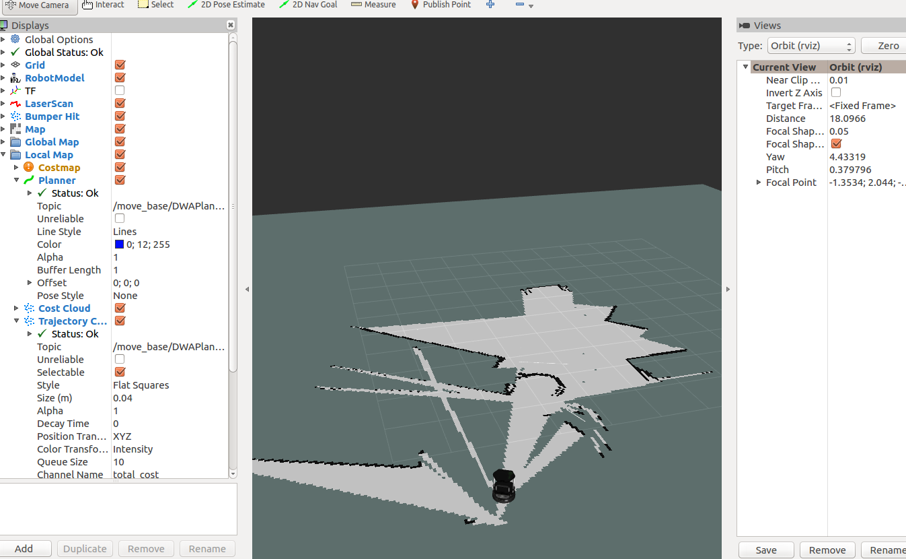

#### 导航与定位


点击　rvize 顶部菜单栏的　2D Nav Goal ，并在地图中选择目的地，机器人会自动导航到对应地点

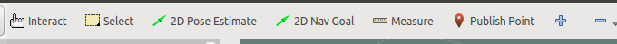

导航过程　

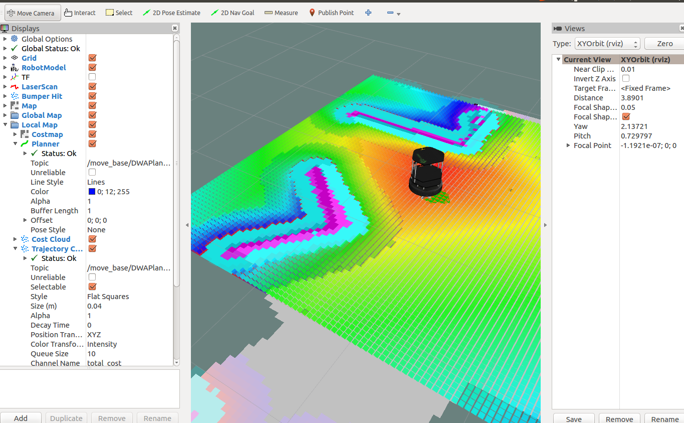

#### 使用 Android 控制机器人

安装 rosjava

```
# 安装 rosjava 使用包管理工具
$ sudo apt-get install ros-<rosversion_name>-rosjava

# 或安装 rosjava 从源码安装
$ mkdir -p ~/rosjava/src
$ wstool init -j4 ~/rosjava/src https://raw.githubusercontent.com/rosjava/rosjava/indigo/rosjava.rosinsta
```

#### Velodyne LIDAR

安装和测试 Velodyne LIDAR 模拟器

```
# 安装模拟器
$ sudo apt-get install ros-kinetic-velodyne-simulator

# 或从源码安装, catkin_make
$ git clone https://bitbucket.org/DataspeedInc/velodyne_simulator.git

# 启动模拟器，需要消耗不少内存，电脑内存应该在 8G 以上
$ roslaunch velodyne_description example.launch
```

安装真实的 Velodyne  LIDAR 驱动器和转换器

```
# 安装 LIDAR 的 ros 包（包括驱动和转换器）
$ sudo apt-get install ros-kinetic-velodyne

# 启动驱动器，指定 LIDAR 的类型 HDL-64E, HDL-32E,and VLP-16
$ roslaunch velodyne_driver nodelet_manager.launch model:=32E

# 启动转换器，把 Velodyne 消息 (velodyne_msgs/VelodyneScan) 转换为点云消息
# (sensor_msgs/PointCloud2), 其中矫正文件在 velodyne_pointcloud 包中
$ roslaunch velodyne_pointcloud cloud_nodelet.launch calibration:=~/calibration_file.yaml
```

同时启动驱动器和转换器

```xml
<launch>
	<!-- start nodelet manager and driver nodelets -->
	<include file="$(find velodyne_driver)/launch/nodelet_manager.launch" />
	
    <!-- start transform nodelet -->
	<include file="$(find velodyne_pointcloud)/launch/transform_nodelet.launch">
	<arg name="calibration"value="$(find velodyne_pointcloud)/params/64e_utexas.yaml"/>
</include
</launch>
```

#### laser scanner

模拟器

真实的 scanner 驱动

```
# Hokuyo laser
$ sudo apt-get install ros-kinetic-hokuyo3d 

# SICK laser
$ sudo apt-get install ros-kinetic-sick-tim ros-kinetic-lms1xx
```

#### 单目和立体相机

模拟器

```
# 单目相机
$ roslaunch sensor_sim_gazebo camera.launch

# 或立体相机
$ roslaunch sensor_sim_gazebo stereo_camera.launch

# 单目相机查看图像
$ rosrun imageview imageview image:=/sensor/camera1/image_raw

# 立体相机查看图像
$ rosrun image_view image_view image:=/stereo/camera/right/image_raw
$ rosrun image_view image_view image:=/stereo/camera/left/image_raw
```

真实情况安装各个厂商的相机的驱动

Point Grey camera (http://wiki.ros.org/pointgrey_camera_driver)

Mobileyesensor（https://autonomoustuff.com/product/mobileye-camera-dev-kit）

IEEE 1394 digitalcameras (http://wiki.ros.org/camera1394)

ZEDcamera (http://wiki.ros.org/zed-ros-wrapper )

normal USB web camera (http://wiki.ros.org/usb_cam)

####GPS

模拟器

```
$ roslaunch sensor_sim_gazebo gps.launch
```

####IMU

启动模拟器

```
$ roslaunch sensor_sim_gazebo imu.launch
```

#### ultrasonic sensor

启动模拟器

```
$ roslaunch sensor_sim_gazebo sonar.launch
```

####低成本的 LIDAR 传感器

Sweep LIDAR

> 测量角度 360 度，距离范围为 40 米

```
# 安装依赖
$ sudo apt-get install ros-kinetic-pcl-conversions ros-kinetic-pointcloud-to-laserscan

# clone并使用 catkin_make 安装
https://github.com/scanse/sweep-ros

# 把 LIDAR 通过 USB 连接到 PC,且修改权限
$ sudo chmod 777 /dev/ttyUSB0

# 查看雷达扫描过程
$ roslaunch sweep_ros view_sweep_laser_scan.launch

# 查看点云数据
$ roslaunch sweep_ros view_sweep_pc2.launch
```

RPLIDAR

> 测量角度 360 度，测量半径 12 米 
>
> ros 包地址：http://wiki.ros.org/rplidar 
>
> GitHub  地址：https://github.com/robopeak/rplidar_ros

#### 模拟无人车

```
# 安装依赖
$ sudo apt-get install ros-indigo-controller-manager
$ sudo apt-get install ros-indigo-ros-control ros-indigo-ros-controllers
$ sudo apt-get install ros-indigo-gazebo-ros-control

# 安装激光雷达
$ sudo apt-get install ros-indigo-velodyne

# 毫米波雷达
$ sudo apt-get install ros-indigo-sicktoolbox ros-indigo-sicktoolbox-wrapper

# 创建新的 ROS 空间并下载无人车模拟器
$ cd ~
$ mkdir -p catvehicle_ws/src
$ cd catvehicle_ws/src
$ catkin_init_workspace
$ cd ~/catvehicle_ws/src
$ git clone https://github.com/sprinkjm/catvehicle.git
$ git clone https://github.com/sprinkjm/obstaclestopper.git
$ cd ../
$ catkin_make
$ source ~/catvehicle_ws/devel/setup.bash

# 启动模拟器（只是在命令行启动）
$ roslaunch catvehicle catvehicle_skidpan.launch

# 打开另一窗口输入（可以看到无人车模拟环境）
$ gzclient

# rviz 可以看到各传感器的数据
$ rosrun rviz rvize  

# 执行如下命令成功之后，可以使用键盘移动车辆
$ roslaunch turtlebot_teleop keyboard_teleop.launch
$ rosrun topic_tools relay /cmd_vel_mux/input/teleop /catvehicle/cmd_vel

# 地图构建
$ roslaunch catvehicle catvehicle_canyonview.laun
$ gzclient
$ roslaunch catvehicle hectorslam.launch

# To visualizethe map generated, you can start Rvizand open theconfiguration filecalled #catvehicle.rviz

# 保存地图
$ rosrun map_server map_saver -f map_name
```

Interfacing a DBW car with ROS

> 下面的开源项目是属于 Dataspeed 公司  (http://dataspeedinc.com/ )

```
# 安装包
bash <(wget -q -O - https://bitbucket.org/DataspeedInc/dbw_mkz_ros/raw/default/dbw_mkz/scripts/ros_install.bash)

# 查看车
$ roslaunch dbw_mkz_description rviz.launch

# 查看传感器数据，下载并进行解压
$ wget https://bitbucket.org/DataspeedInc/dbw_mkz_ros/downloads/mkz_20151207_extra.bag.tar.gz

# 读取传感器数据
$ roslaunch dbw_mkz_can offline.launch

# 查看汽车模型
$ roslaunch dbw_mkz_description rviz.launch

# 执行 bag 文件
$ rosbag play mkz_20151207.bag -clock

# 查看传感器数据
$ rosrun tf static_transform_publisher 0.94 0 1.5 0.07 -0.02 0 base_footprint velodyne 50

# 和汽车通信
$ roslaunch dbw_mkz_can dbw.laun

# 使用操纵杆控制
$ roslaunch dbw_mkz_joystick_demo joystick_demo.launch sys:=true
```

## 使用 VR 头盔和体感器远程操控机器人

####安装 leap motion SDK 和 驱动

1. 下载  leap motion SDK ( https://www.leapmotion.com/setup/linux )，在下载文件中有驱动信息 和 SDK

2. 安装驱动

   ```
   # 64 系统
   $ sudo dpkg -install Leap-*-x64.deb

   # 32 位系统
   $ sudo dpkg -install Leap-*-x86.deb
   ```

####可视化 leap motion 数据

 leap motion 插入 USB 接口

```
# 判断是否连接成功
$ dmesg

#　打开控制面板
$ sudo LeapControlPanel

# 打开驱动
$ sudo leapd

＃ 重启驱动
$ sudo service leapd stop

# 启动 leap_motion 的 ros 结点
# 配置开发环境 SDK 环境变量，下载是把 SDK 放到了 home 路径下可以换为别的地方
$ export LEAP_SDK=$LEAP_SDK:$HOME/LeapSDK
$ export PYTHONPATH=$PYTHONPATH:$HOME/LeapSDK/lib:$HOME/LeapSDK/lib/x64
$ sudo cp $LEAP_SDK/lib/x64/libLeap.so /usr/local/lib
$ sudo ldconfig

# 下载并编译 leap_motion 包
$ git clone https://github.com/ros-drivers/leap_motion
$ catkin_make install --pkg leap_motion

# 启动 leap_motion 的 ros 节点　
$ roslaunch leap_motion sensor_sender.launch

# 查看 sensor_sender 节点发布的数据
$ rostopic echo /leapmotion/data

# 启动 ROS 可视化，订阅 leap_motion 的数据，把数据转换为 Rviz 支持的格式（在16.04上没有测试成功）
$ export LEAPSDK=$LEAPSDK:$HOME/LeapSDK
$ git clone https://github.com/qboticslabs/leap_client
$ catkin_make
$ roslaunch leap_client leap_client.launch
# 打开 rviz 选择 leap_client/launch/leap_client.rviz
$ rosrun rviz rviz
```

####使用手势控制机器人

> |           手势            |       机器人移动方向        |
> | :---------------------: | :------------------: |
> |     Hand pitch low      |     Move forward     |
> |     Hand pitch high     |    Move backward     |
> | Hand roll anticlockwise | Rotate anticlockwise |
> |   Hand roll clockwise   |   Rotate clockwise   |

```python
!/usr/bin/env python
import rospy
from leap_motion.msg import leap
from leap_motion.msg import leapros
from geometry_msgs.msg import Twist

# 主题的发布地址
teleop_topic = '/cmd_vel_mux/input/teleop'

# 机器人速度、转向和手的俯仰角和翻滚交的限制
low_speed = -0.5
stop_speed = 0
high_speed = 0.5
low_turn = -0.5
stop_turn = 0
high_turn = 0.5

pitch_low_range = -30
pitch_high_range = 30
roll_low_range = -150
roll_high_range = 150

def callback_ros(data):
    global pub
    msg = leapros()
    msg = data
    yaw = msg.ypr.x
    pitch = msg.ypr.y
    roll = msg.ypr.z
    twist = Twist()
    twist.linear.x = 0; twist.linear.y = 0; twist.linear.z = 0
    twist.angular.x = 0; twist.angular.y = 0; twist.angular.z = 0

	# 指定范围内的才能检测到手势，pitch 在(-30, 0) Pitch high， (30, 60) Pitch low
    if(pitch > pitch_low_range and pitch < pitch_low_range + 30):
	    twist.linear.x = high_speed; twist.linear.y = 0; twist.linear.z = 0
	    twist.angular.x = 0; twist.angular.y = 0; twist.angular.z = 0
        rospy.loginfo("Pitch high")
    elif(pitch > pitch_high_range and pitch < pitch_high_range + 30):
	    twist.linear.x = low_speed; twist.linear.y = 0; twist.linear.z = 0
	    twist.angular.x = 0; twist.angular.y = 0; twist.angular.z = 0
        rospy.loginfo("Pitch low")
    
    if(roll > roll_low_range and roll < roll_low_range + 30):
	    twist.linear.x = 0; twist.linear.y = 0; twist.linear.z = 0
	    twist.angular.x = 0; twist.angular.y = 0; twist.angular.z = high_turn
        rospy.loginfo("Roll left")
    elif(roll > roll_high_range and roll < roll_high_range + 30):
	    twist.linear.x = 0; twist.linear.y = 0; twist.linear.z = 0
	    twist.angular.x = 0; twist.angular.y = 0; twist.angular.z = low_turn
        rospy.loginfo("Roll right")
    
    pub.publish(twist)
    #rospy.loginfo(rospy.get_name() + ": Roll %s" % msg.ypr.x)
    #rospy.loginfo("\n")
    rospy.loginfo(rospy.get_name() + ": Pitch %s" % msg.ypr.y)
    #rospy.loginfo("\n")
    #rospy.loginfo(rospy.get_name() + ": Yaw %s" % msg.ypr.z)
    #rospy.loginfo("\n")

# 订阅 leapmotion/data 主题，发布到 /cmd_vel_mux/input/teleop 主题
def listener():
    global pub
    rospy.init_node('leap_sub', anonymous=True)
    rospy.Subscriber("leapmotion/data", leapros, callback_ros)
    pub = rospy.Publisher(teleop_topic, Twist, queue_size=1)
    rospy.spin()

if __name__ == '__main__':
    listener()
```

把机器人模拟器观察到的数据在 Android 中显示

```
# 查看本地的 IP
$ ifconfig

# 添加环境变量
$ export ROS_IP=192.168.1.101

# 打开 Android app 填入PC 端的 IP 地址，进行连接

# 安装 usb_cam 包，执行
$ roslaunch usb_cam usb_cam-test.launch

# remap 主题信息，因为 App 订阅需要的主题是 /camera/image/compressed
$ rosrun topic_tools relay /usb_cam/image_raw/compressed /camera/image/compressed

# 启动模拟器
$ roslaunch turtlebot_gazebo turtlebot_playground.launch

# 把模拟器的观察图像发送到手机订阅的主题
$ rosrun topic_tools relay /camera/rgb/image_raw/compressed /usb_cam/image_raw/compressed
```


##　使用 web 控制机器人

####rosbridge_suite

> rosbridge_suite 相当于 web 和 ros 的中间，负责数据转换（web 端需要的是 json 数据，ros 端需要的是主题数据），负责转换的结点名称为　rosbridge_server，消息类型位 service。

结构图：

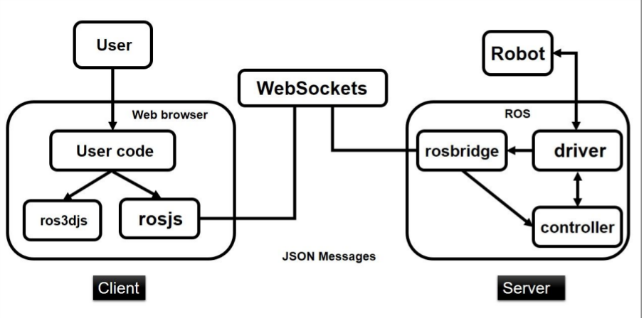

> rosbridge_suite 包含下面三个包：
>
> 1. rosbridge_library：包含 Python API 把 JSON 消息转换为 ROS 消息
> 2. rosbridge_server：使用 WebSocket 实现了 rosbridge 库，通过这个包实现和  web 端的数据通信
> 3. rosapi ：可以通过这个包获取 ROS 的主题列表、参数等元数据 

安装 rosbridge_suite

```
$ sudo apt-get update
$ sudo apt-get install ros-kinetic-rosbridge-suite

# 或使用源码安装
$ git clone https://github.com/RobotWebTools/rosbridge_suite
$ catkin_make
```

#### roslibjs, ros2djs, and ros3djs

> 这几个 js 库文件是在网页端使用的 rosbridge 客户端
>
> roslibjs： (http://wiki.ros.org/roslibjs ), 可以用 js 实现一些基本的 ROS 方法 ，比如 ROS topics, services, actionlib, TF support, URDF 等
>
> The ros2djs (http://wiki.ros.org/ros2djs ) , 该库基于 roslibjs, 提供了 ROS 的 2 维可视化，可以使用它在浏览器中可视化 2维 地图
>
> ros3djs (http://wiki.ros.org/ros3djs ) ：可以在浏览器中可视化三维数据。比如：URDF, TF, interactive markers, and maps，可以创建一个基于 web 的 Rviz 实例

下载这几个库文件，因为这几个库文件是网页端使用的，所以不需要想其他的 ROS 包一样，下载下来就可以了，不需要 catkin_make 编译

```
$ git clone https://github.com/RobotWebTools/roslibjs.git
$ git clone https://github.com/RobotWebTools/ros2djs
$ git clone https://github.com/RobotWebTools/ros3djs
```

roslibjs APIs: http://robotwebtools.org/jsdoc/roslibjs/current/ 

ros2djs APIs: http://robotwebtools.org/jsdoc/ros2djs/current/

 ros3djs APIs: http://robotwebtools.org/jsdoc/ros3djs/current/

#### tf2_web_republisher

安装

```
$ git clone https://github.com/RobotWebTools/tf2_web_republisher
$ sudo apt-get install ros-kinetic-tf2-ros
```

####远程操控机器人并可视化（简单）

结构：

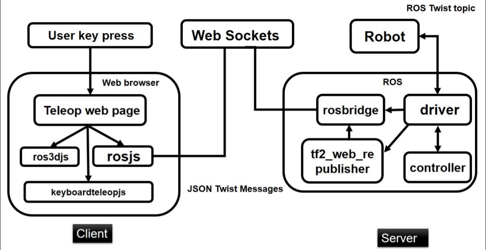

使用 keyboardteleopjs (http://wiki.ros.org/keyboardteleopjs ),根据按键发送消息

代码展示

```html
<!DOCTYPE html>
<html>
<head>
<meta charset="UTF-8">

 <!--Ｊquery　相关库文件-->
<link rel="stylesheet" type="text/css"
  href="http://ajax.googleapis.com/ajax/libs/jqueryui/1.8/themes/base/jquery-ui.css" />
<script src="https://ajax.googleapis.com/ajax/libs/jquery/1.8.0/jquery.min.js"></script>
<script src="https://ajax.googleapis.com/ajax/libs/jqueryui/1.8.23/jquery-ui.min.js"></script>

<!---->
<script src="http://cdn.robotwebtools.org/threejs/current/three.js"></script>
<script src="http://cdn.robotwebtools.org/threejs/current/ColladaLoader.js"></script>
<script src="http://cdn.robotwebtools.org/threejs/current/STLLoader.js"></script>
<script src="http://cdn.robotwebtools.org/ColladaAnimationCompress/current/ColladaLoader2.js"></script>

<script src="http://cdn.robotwebtools.org/EventEmitter2/current/eventemitter2.min.js"></script>

 <!--rosbridge 相关库文件-->
<script src="http://cdn.robotwebtools.org/roslibjs/current/roslib.js"></script>
<script src="http://cdn.robotwebtools.org/ros3djs/current/ros3d.min.js"></script>

<!--keyboardteleop-->
<script src="http://cdn.robotwebtools.org/keyboardteleopjs/current/keyboardteleop.js"></script>

<script>
  /**
   * Setup all GUI elements when the page is loaded. 
   */
 var teleop_topic = '/cmd_vel_mux/input/teleop'
 var base_frame = 'odom';
 var init_flag = false;

　function submit_values()　{
  　teleop_topic = document.getElementById("tele_topic").value;
  　base_frame = document.getElementById("base_frame_name").value;
  　init_flag = true;
 　 init();
　}

  function init() {
    if(init_flag == true)
    {
    // Connecting to ROS.
    var ros = new ROSLIB.Ros({
      url : 'ws://localhost:9090'
    });
    
    // Initialize the teleop.
    var teleop = new KEYBOARDTELEOP.Teleop({
      ros : ros,
      topic : teleop_topic
    });

////////////////////////////////////////////////////////////////////////////////////////////////////////
    var viewer = new ROS3D.Viewer({
      background : 000,
      divID : 'urdf',
      width : 1280,
      height : 600,
      antialias : true
    });
 
    // Add a grid.
    viewer.addObject(new ROS3D.Grid());

    // Setup a client to listen to TFs.
    var tfClient = new ROSLIB.TFClient({
      ros : ros,
      fixedFrame : base_frame,
      angularThres : 0.01,
      transThres : 0.01,
      rate : 10.0
    });

    // Setup the URDF client.
    var urdfClient = new ROS3D.UrdfClient({
      ros : ros,
      tfClient : tfClient,
      path : 'http://resources.robotwebtools.org/',
      rootObject : viewer.scene,
      loader : ROS3D.COLLADA_LOADER
    });


///////////////////////////////////////////////////////////////////////////////////////////////////

    // Create a UI slider using JQuery UI.
    $('#speed-slider').slider({
      range : 'min',
      min : 0,
      max : 100,
      value : 90,
      slide : function(event, ui) {
        // Change the speed label.
        $('#speed-label').html('Speed: ' + ui.value + '%');
        // Scale the speed.
        teleop.scale = (ui.value / 100.0);
      }
    });

    // Set the initial speed .
    $('#speed-label').html('Speed: ' + ($('#speed-slider').slider('value')) + '%');
    	teleop.scale = ($('#speed-slider').slider('value') / 100.0);
    	init_flag = false;
  	}
  }
</script>
</head>
<body onload="init()">
  <h1>Web-browser keyboard teleoperation</h1>
　<form >
  <!--主题-->
  Teleop topic:<br>
  <input type="text" name="Teleop Topic" id='tele_topic' value="/cmd_vel_mux/input/teleop">
  <br>
  
  Base frame:<br>
  <input type="text" name="Base frame" id='base_frame_name' value="/odom">
  <br>

 <input type="button" onmousedown="submit_values()" value="Submit"> 

　</form> 
  <p>Run the following commands in the terminal then refresh this page. Check the JavaScript console for the output.</p>
  <ol>
    <li><tt>roslaunch turtlebot_gazebo turtlebot_world.launch </tt></li>
    <li><tt>roslaunch rosbridge_server rosbridge_websocket.launch</tt></li>
    <li>Use your arrow keys on your keyboard to move the robot (must have this browser   window focused).</li>
  </ol>
  <div id="speed-label"></div>
  <div id="speed-slider"></div>
  <div id="urdf"></div>
</body>
</html>
```

启动

> 很多的 js 不能用了，需要自己下载 

```
# 设置只在浏览器展示可视化界面
$ rosparam set use_gui true

# 打开模拟器
$ roslaunch turtlebot3_gazebo turtlebot3_world.launch

# 打开 tf2_web_republisher 结点
$ rosrun tf2_web_republisher tf2_web_republisher

# 打开 websocket 连接
$ roslaunch rosbridge_server rosbridge_websocket.launch

# 打开刚才建的页面
$ google-chrome keyboardteleop.html
```

页面打开之后：

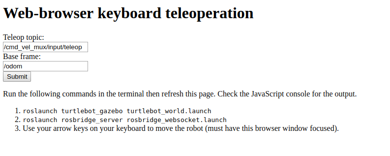

点击 Submit，可以使用键盘控制机器人

####通过浏览器控制机器人连接处

结构图：

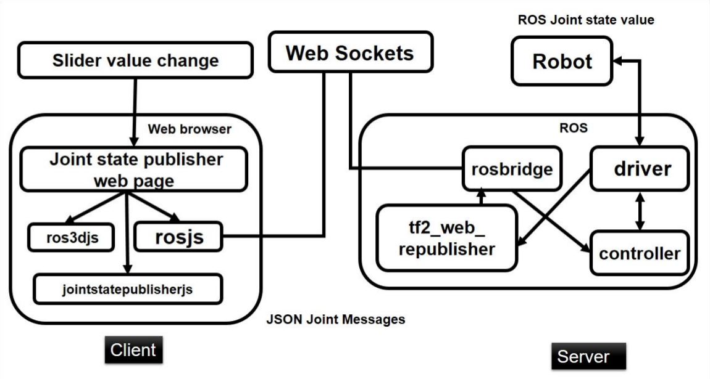

安装 joint_state_publisher_js

```
# 下载包文件
git clone https://github.com/DLu/joint_state_publisher_js

# 编译
catkin_make
```

> 在 build 目录下可以看到两个 js 文件

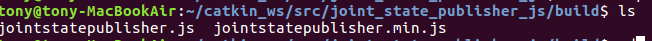

代码

```html
<!DOCTYPE html>
<html>
<head>
<meta charset="utf-8" />

<script src="http://cdn.robotwebtools.org/threejs/current/three.min.js"></script>
<script src="http://cdn.robotwebtools.org/ColladaAnimationCompress/current/ColladaLoader2.min.js"></script>
<script src="http://cdn.robotwebtools.org/threejs/r61/STLLoader.min.js"></script>
<script src="http://cdn.robotwebtools.org/EventEmitter2/current/eventemitter2.min.js"></script>
<script src="http://cdn.robotwebtools.org/roslibjs/current/roslib.min.js"></script>
<script src="http://cdn.robotwebtools.org/ros3djs/current/ros3d.min.js"></script>
<script src="../build/jointstatepublisher.js"></script>

<script>
  var topic;
  /**
   * Setup all visualization elements when the page is loaded.
   */
  function init() {
    // Connect to ROS.
    var ros = new ROSLIB.Ros({
      url : 'ws://localhost:9090'
    });

    // Create the main viewer.
    var viewer = new ROS3D.Viewer({
      divID : 'urdf',
      width : 1280,
      height : 720,
      antialias : true
    });

    // Add a grid.
    viewer.addObject(new ROS3D.Grid());

    // Setup a client to listen to TFs.
    var tfClient = new ROSLIB.TFClient({
      ros : ros,
      angularThres : 0.01,
      transThres : 0.01,
      rate : 10.0,
      fixedFrame : '/base_link'
    });

    // Setup the URDF client.
    var urdfClient = new ROS3D.UrdfClient({
      ros : ros,
      tfClient : tfClient,
      rootObject : viewer.scene,
      path : 'http://resources.robotwebtools.org/'
    });
        
    var jsp = new JOINTSTATEPUBLISHER.JointStatePublisher({
        ros : ros,
        divID : 'sliders'
    });
  }
</script>
</head>
<body onload="init()">
  <h1>Web based joint state controller for Robot</h1>
  <p>Run the following commands in the terminal then refresh this page.</p>
  <ol>
    <li><tt>roslaunch pr2_description upload_pr2.launch </tt></li>
    <li><tt>rosparam set use_gui true</tt></li>
    <li><tt>roslaunch joint_state_publisher_js core.launch</tt></li>
  </ol>
  <div id="sliders" style="float: right"></div>
  <div id="urdf"></div>
</body>
</html>
```

启动

```
# 安装 ros-kinetic-pr2-description
$ sudo apt-get install ros-kinetic-pr2-description

$ roslaunch pr2_description upload_pr2.launch
$ rosparam set use_gui true
$ roslaunch joint_state_publisher_js core.launch
```

#### 声控机器人的移动

安装

```
$ sudo apt-get install apache2
```

使用 chrome 的浏览器的语音识别

> 使用了 webkitSpeechRecognition API
>
> - SpeechRecognition.lang：设置识别的是什么语言，cmn-Hans-CN 代表普通话
> - SpeechRecognition.interimResults：定义 speech recognition 系统要不要返回临时结果(interim results)，还是只返回最终结果。
> - SpeechRecognition.maxAlternatives ：定义每次结果返回的可能匹配值的数量
> - recognition.continuous：是否等说完了再开始识别

```html
<!DOCTYPE html>
<html>
<head>
<meta charset="utf-8" />
<script>
 if (!('webkitSpeechRecognition' in window)) {
    console.log("not supported");
} else { 
    var recognition = new webkitSpeechRecognition();
    recognition.continuous = true;
    recognition.interimResults = true;
    
    recognition.lang = "en-US";
    recognition.maxAlternatives = 1;

    recognition.onstart = function() {
    	console.log('started');
    };
   
    recognition.onend = function() {
       console.log('ended');
    };

    recognition.onresult = function(event) {
       // no result
       if (typeof(event.results) === 'undefined') {
           recognition.stop();
	   console.log('no result');
           return;
       }
       
       // result
       for (var i = event.resultIndex; i < event.results.length; ++i) {
	    　　// 可以获得识别的信度　event.results[i][0].confidence
         　if (event.results[i].isFinal) {
	        　　console.log("final results: " + event.results[i][0].transcript);
	    　　} else {
	        　　console.log("interim results: " + event.results[i][0].transcript);
	    　　}
	　　}
    }

    recognition.onerror = function(event) {
    　　console.log("error");
	　　console.log(event);
    }

    function startButton(event) {
	　　recognition.start();
    }
}
</script>
</head>
<body>
  <button onclick="startButton(event);">start</button>
</body>
</html>
```

启动

```
# 在 speech_commands 是前面编写的页面，在 apache2 可以直接访问
$ sudo cp -r speech_commands /var/www/html

$ roslaunch turtlebot_gazebo turtlebot_world.launch
$ roslaunch rosbridge_server rosbridge_websocket.launch
```


https://blog.csdn.net/u010853356/article/details/79226764