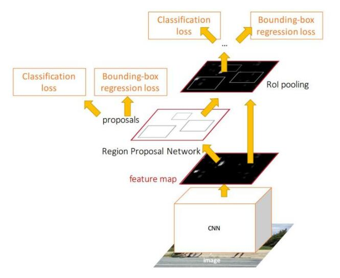

**DPM**（**Deformable Part Model**），正如其名称所述，可变形的组件模型，是一种基于组件的检测算法，其所见即其意。

## FAST RCNN

1. RCNN的流程图

   > 1. 输入图片，提取图像的特征。
   > 2. 根据特征图，使用RPN提取感兴趣区域ROI。
   > 3. 结合feature map和ROI提取出感兴趣区域的特征。
   > 4. 对特征进行分类和微调坐标。

   