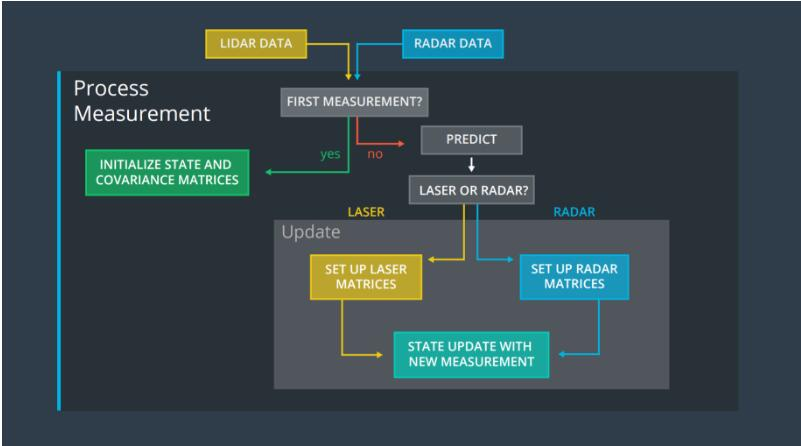
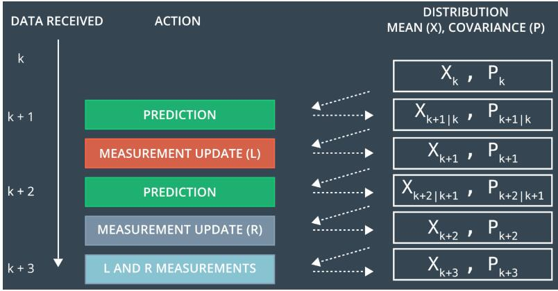
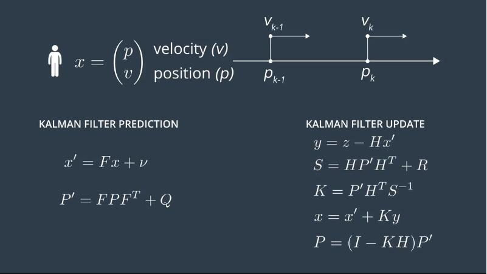
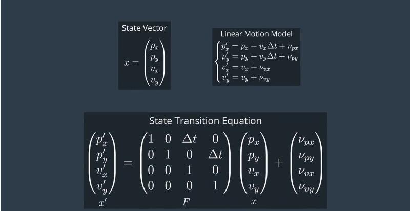
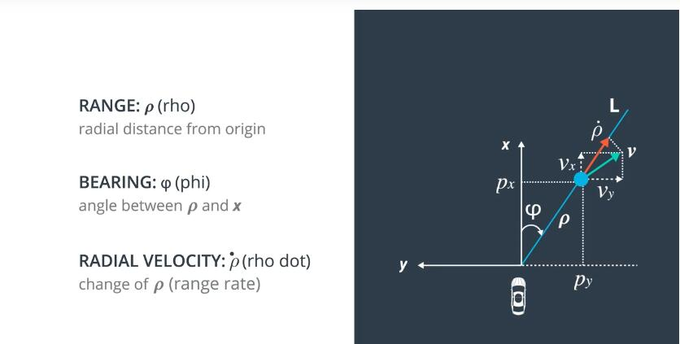
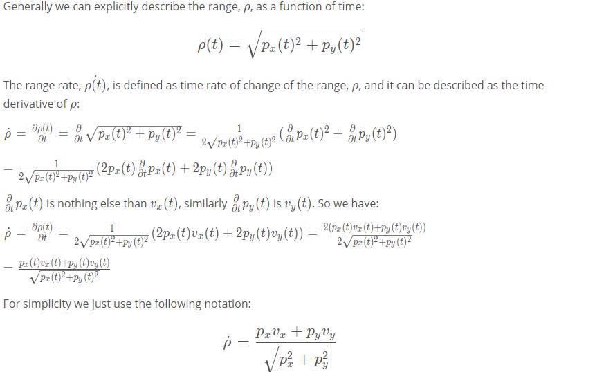
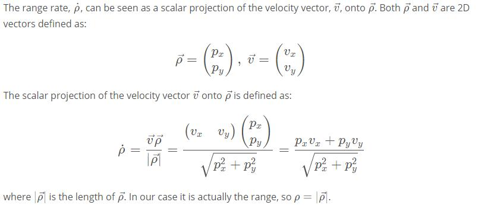
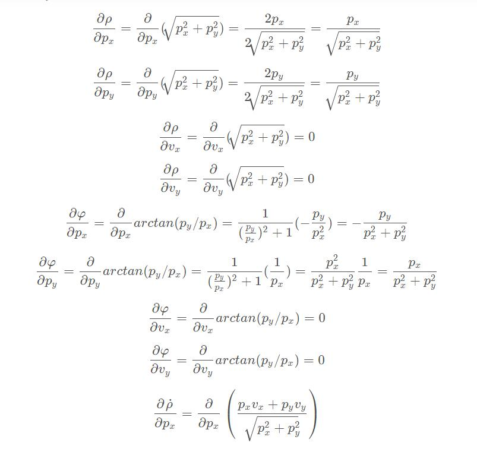

1. 流程图

   > - **first measurement** - the filter will receive initial measurements of the bicycle's position relative to the car. These measurements will come from a radar or lidar sensor.
   > - **initialize state and covariance matrices** - the filter will initialize the bicycle's position based on the first measurement.
   > - then the car will receive another sensor measurement after a time period \Delta{t}Δt.
   > - **predict** - the algorithm will predict where the bicycle will be after time \Delta{t}Δt. One basic way to predict the bicycle location after \Delta{t}Δt is to assume the bicycle's velocity is constant; thus the bicycle will have moved velocity * \Delta{t}Δt. In the extended Kalman filter lesson, we will assume the velocity is constant; in the unscented Kalman filter lesson, we will introduce a more complex motion model.
   > - **update** - the filter compares the "predicted" location with what the sensor measurement says. The predicted location and the measured location are combined to give an updated location. The Kalman filter will put more weight on either the predicted location or the measured location depending on the uncertainty of each value.
   > - then the car will receive another sensor measurement after a time period \Delta{t}Δt. The algorithm then does another **predict** and **update** step.

   

2. 更新过程

   

   > - x is the mean state vector. For an extended Kalman filter, the mean state vector contains information about the object's position and velocity that you are tracking. It is called the "mean" state vector because position and velocity are represented by a gaussian distribution with mean xx.
   > - P is the state covariance matrix, which contains information about the uncertainty of the object's position and velocity. You can think of it as containing standard deviations.
   > - k represents time steps. So x_kxk refers to the object's position and velocity vector at time k.
   > - The notation k+1|kk+1∣k refers to the prediction step. At time k+1k+1, you receive a sensor measurement. Before taking into account the sensor measurement to update your belief about the object's position and velocity, you predict where you think the object will be at time k+1k+1. You can predict the position of the object at k+1k+1 based on its position and velocity at time kk. Hence x_{k+1|k}xk+1∣k means that you have predicted where the object will be at k+1k+1 but have not yet taken the sensor measurement into account.
   > - x_{k+1}xk+1 means that you have now predicted where the object will be at time k+1k+1 and then used the sensor measurement to update the object's position and velocity.

   **注意：**如果两个传感器的数据同时到达，使用其中一个传感器的数据，预测更新，再使用另外一个传感器的数据更新。

3. 卡尔曼滤波中的几个公式

   

4. 一维卡尔曼滤波

   ```c++
   #include <iostream>
   #include "Dense"
   #include <vector>

   using namespace std;
   using namespace Eigen;

   //Kalman Filter variables
   VectorXd x;	// object state
   MatrixXd P;	// object covariance matrix
   VectorXd u;	// external motion
   MatrixXd F; // state transition matrix
   MatrixXd H;	// measurement matrix
   MatrixXd R;	// measurement covariance matrix
   MatrixXd I; // Identity matrix
   MatrixXd Q;	// process covariance matrix

   vector<VectorXd> measurements;
   void filter(VectorXd &x, MatrixXd &P);

   int main() {
   	
   	x = VectorXd(2);
   	x << 0, 0;

   	P = MatrixXd(2, 2);
   	P << 1000, 0, 0, 1000;

   	u = VectorXd(2);
   	u << 0, 0;

   	F = MatrixXd(2, 2);
   	F << 1, 1, 0, 1;

   	H = MatrixXd(1, 2);
   	H << 1, 0;

   	R = MatrixXd(1, 1);
   	R << 1;

   	I = MatrixXd::Identity(2, 2);

   	Q = MatrixXd(2, 2);
   	Q << 0, 0, 0, 0;

   	//create a list of measurements
   	VectorXd single_meas(1);
   	single_meas << 1;
   	measurements.push_back(single_meas);
   	single_meas << 2;
   	measurements.push_back(single_meas);
   	single_meas << 3;
   	measurements.push_back(single_meas);
   	//call Kalman filter algorithm
   	filter(x, P);
       return 0;
   }

    void filter(VectorXd &x, MatrixXd &P) {
      	for (unsigned int n = 0; n < measurements.size(); ++n) {
      		VectorXd z = measurements[n];
      		// KF Measurement update step
      		VectorXd y = z - H*x;
      		MatrixXd Ht = H.transpose();
      		MatrixXd S = H * P * Ht + R;
      		MatrixXd Si = S.inverse();
      		MatrixXd K = P * Ht * Si;
      		// new state
      		x = x + K * y;
      		P = (I - K * H) * P;
      		// KF Prediction step
      	    x = F * x + u;
      	    MatrixXd Ft = F.transpose();
      	    P = F * P * Ft + Q;
      	    std::cout << "x=" << std::endl <<  x << std::endl;
      	    std::cout << "P=" << std::endl <<  P << std::endl;
      	}
   }
   ```


5. 二维方向上的卡尔曼滤波

   > 两个问题：
   >
   > 1.速度很大的可能不是恒定的，有加速度。
   >
   > 2.时间也可能不是均匀增加的。

   

   >使用加速度作为随机噪声，下面是公式推导

   

   > 噪声向量

   

   > 求协方差，因为ax,ay是变量，所以可以把G提出来。

   

   > 假设ax和ay是相互独立的。

   

   > 最终结果

   

6. radar测量

   

   > x是车辆的行驶方向，y在x的左边。
   >
   > 下面是对ρ，φ， ρ˙三个参数的讲解：
   >
   > ρ：表示车辆到物体的距离，ρ = sqrt(p_x^2 + p_y^2)ρ。
   >
   > φ：表示ρ方向到x方向的夹角, φ = atan(py/px)，有方向，以逆时针方向为正，所以上图的φ应该为负。
   >
   > ρ˙：表示物体的速度投影到直线L上。

   ρ˙的两种从笛卡尔坐标转换到极坐标的推导方式：

   - 第一种：

     

   - 第二种：

     

   > 下面的公式是把测量数据转换到笛卡尔坐标的最终结果，如下的公式相当于激光雷达中的h(x‘) = H*x，但是这种转换是非线性的，非线性转换之后数据可能就不再满足高斯分布，所以需要进行线性化操作。下面将介绍使用泰勒展开对下边公式的值进行近似处理。

7. 使用泰勒展开式

   - 普通函数的泰勒展开式为：

   

   - 矩阵函数的泰勒展开式为：

   

   其中Df(a) 表示雅克比矩阵(Jacobian matrix) and D^2f(a)叫做黑塞矩阵(Hessian matrix)。

   > 求雅克比矩阵过程如下：

    

   

   

   ```c++

   ```


```c++
include <iostream>
include "Dense"
include <vector>
using namespace std;
using Eigen::MatrixXd;
using Eigen::VectorXd;
MatrixXd CalculateJacobian(const VectorXd& x_state);

int main() {
    /*
    * Compute the Jacobian Matrix
    */

    //predicted state  example
    //px = 1, py = 2, vx = 0.2, vy = 0.4
    VectorXd x_predicted(4);
    x_predicted << 1, 2, 0.2, 0.4;
    MatrixXd Hj = CalculateJacobian(x_predicted);
    cout << "Hj:" << endl << Hj << endl;
    return 0;
}
```


	MatrixXd CalculateJacobian(const VectorXd& x_state) {
	MatrixXd Hj(3,4);
	//recover state parameters
	float px = x_state(0);
	float py = x_state(1);
	float vx = x_state(2);
	float vy = x_state(3);
	
	//pre-compute a set of terms to avoid repeated calculation
	float c1 = px*px+py*py;
	float c2 = sqrt(c1);
	float c3 = (c1*c2);
	
	//check division by zero
	if(fabs(c1) < 0.0001){
	    cout << "CalculateJacobian () - Error - Division by Zero" << endl;
	    return Hj;
	}
	
	//compute the Jacobian matrix
	Hj << (px/c2), (py/c2), 0, 0,
	-(py/c1), (px/c1), 0, 0,
	py*(vx*py - vy*px)/c3, px*(px*vy - py*vx)/c3, px/c2, py/c2;
	
	return Hj;
}
   ```


8. 总结

   使用激光雷达在测量更新阶段使用H矩阵去计算y, SS, KK and PP。

   使用雷达在测量更新阶段使用Hj矩阵去计算y, SS, KK and PP

9. 计算卡尔曼滤波的表现

   ```c++
   #include <iostream>
   #include "Dense"
   #include <vector>

   using namespace std;
   using Eigen::MatrixXd;
   using Eigen::VectorXd;
   using std::vector;

   VectorXd CalculateRMSE(const vector<VectorXd> &estimations,
   		const vector<VectorXd> &ground_truth);

   int main() {
   	/*
   	 * Compute RMSE
   	 */
   	vector<VectorXd> estimations;
   	vector<VectorXd> ground_truth;
   	//the input list of estimations
   	VectorXd e(4);
   	e << 1, 1, 0.2, 0.1;
   	estimations.push_back(e);
   	e << 2, 2, 0.3, 0.2;
   	estimations.push_back(e);
   	e << 3, 3, 0.4, 0.3;
   	estimations.push_back(e);
   	//the corresponding list of ground truth values
   	VectorXd g(4);
   	g << 1.1, 1.1, 0.3, 0.2;
   	ground_truth.push_back(g);
   	g << 2.1, 2.1, 0.4, 0.3;
   	ground_truth.push_back(g);
   	g << 3.1, 3.1, 0.5, 0.4;
   	ground_truth.push_back(g);
   	//call the CalculateRMSE and print out the result
   	cout << CalculateRMSE(estimations, ground_truth) << endl;
   	return 0;
   }

   VectorXd CalculateRMSE(const vector<VectorXd> &estimations,
   		const vector<VectorXd> &ground_truth){

   	VectorXd rmse(4);
   	rmse << 0,0,0,0;

   	// check the validity of the following inputs:
   	//  * the estimation vector size should not be zero
   	//  * the estimation vector size should equal ground truth vector size
   	if(estimations.size() != ground_truth.size() || estimations.size() == 0){
   		cout << "Invalid estimation or ground_truth data" << endl;
   		return rmse;
   	}
   	//accumulate squared residuals
   	for(unsigned int i=0; i < estimations.size(); ++i){
   		VectorXd residual = estimations[i] - ground_truth[i];
   		//coefficient-wise multiplication
   		residual = residual.array()*residual.array();
   		rmse += residual;
   	}
   	//calculate the mean
   	rmse = rmse/estimations.size();
   	//calculate the squared root
   	rmse = rmse.array().sqrt();
   	//return the result
   	return rmse;
   }
   ```

   ​