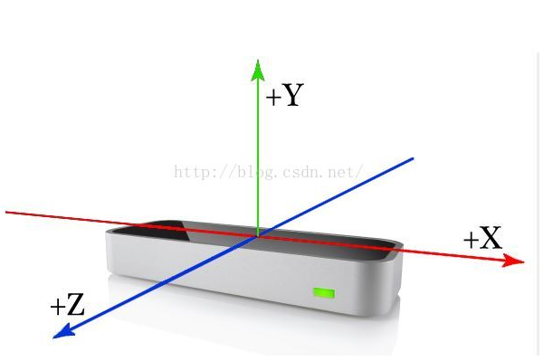
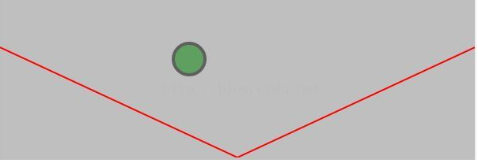
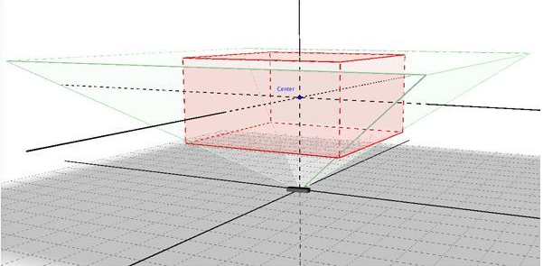
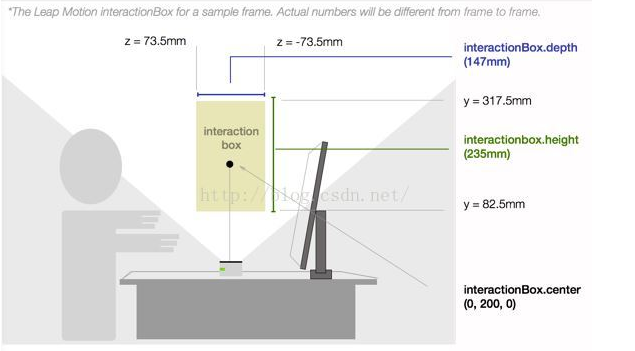
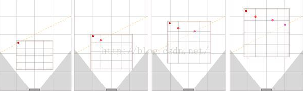

- 环境搭建

  下载地址（需要翻墙）官网：https://developer.leapmotion.com/get-started


​       官方文档 API 地址：https://developer-archive.leapmotion.com/documentation/index.html

​       Ubuntu 的开发环境的搭建参考：https://blog.csdn.net/zmdsjtu/article/details/72830934

​       一些坐标的转换的讲解     

- 简介

  **LeapMotion 坐标系统**：LeapMotion 控制器在每个数据帧中提供的坐标以毫米为单位，坐标原点在 LeapMotion 硬件的上表面的中心点。有绿灯正对的方向为 Z 轴的正方向。使用右手坐标系。

  

  LeapMotion 的观察范围是一个倒金字塔的结构，可以看出，在红线的下面部分是观察不到的。

  当我们需要把观察的坐标数据在应用程序中使用的时候需要进行坐标的转换（不能直接使用，因为 LeapMotion 的坐标轴是无限的，但是我们的应用程序可能是有边界的，比如画图板）

  

  **将 LeapMotion 坐标转换到你的应用坐标系中**：，LeapMotion可视区域定义了一个箱型区域。可以注意到，不在箱子内部的手势是观测不到的。

  

  人的操作在这个箱子中，InteractionBox 的大小由 LeapMotion可在 LeapMotion 控制面板中设置, 也能将交互高度设置为自动适应，如果用户在低于箱型区域移动手，控制器软件会自动将交互高度自动调小（直到最小的数值）。同样的，当用户手部的运动高于这个交互箱型区域时，控制器会抬高箱型区域的位置，这时每一个Frame 的 InteractionBox 可能是不一样的。

  

  使用自适应的 InteractionBox，会出现当前数据帧中的点的归一化坐标可能与现实中归一化坐标并不匹配的问题，如下图，会出现不连续性。为保证连续帧中一系列被追踪的点都能正确的归一化，可以使用一个单独的InteractionBox 对象----其具有最大的高度、宽度、深度。所有的点都用它来归一化。

  

  映射到 2D：

  ```python
  app_width = 800
  app_height = 600

  pointable = frame.pointables.frontmost
  if pointable.is_valid:
      # 获取 interaction_box
      iBox = frame.interaction_box 
      
      # 获取点的位置
      leapPoint = pointable.stabilized_tip_position
      
      # 归一化
      normalizedPoint = iBox.normalize_point(leapPoint, False)
      
      # 转换到应用程序需要的坐标，注意：没有考虑 z 坐标
      app_x = normalizedPoint.x * app_width
      app_y = (1 - normalizedPoint.y) * app_height
  ```

  映射到 3D：

  ```python
  def leap_to_world(self, leap_point, iBox):
      # 右手系转换到左手系（只需把 z 轴变为相反数）
      leap_point.z *= -1.0; 
      normalized = iBox.normalize_point(leap_point, False)
      normalized = normalized + Leap.Vector(0.5, 0, 0.5); #recenter origin
      return normalized * 100.0;
  ```

  参考：https://blog.csdn.net/qq_27582707/article/details/50896459

  例子，操作画布：

  ```js
  <canvas id="displayArea" width="200" height="100" style="background:#dddddd;"></canvas>
  <script>
  var canvasElement = document.getElementById("displayArea");
  var displayArea = canvasElement.getContext("2d");

  var controller = new Leap.Controller();
  controller.on("frame", function(frame){
      if(frame.pointables.length > 0) {
          canvasElement.width = canvasElement.width; //clear
          
          //Get a pointable and normalize the tip position
          var pointable = frame.pointables[0];
          var interactionBox = frame.interactionBox;
          var normalizedPosition = interactionBox.normalizePoint(pointable.tipPosition, true);
          
          // Convert the normalized coordinates to span the canvas
          var canvasX = canvasElement.width * normalizedPosition[0];
          var canvasY = canvasElement.height * (1 - normalizedPosition[1]);
          //we can ignore z for a 2D context
          
          displayArea.strokeText("(" + canvasX.toFixed(1) + ", " + canvasY.toFixed(1) + ")", canvasX, canvasY);
      }
  });
  controller.connect();
  </script>
  ```

- 基本术语

  https://blog.csdn.net/smilingeyes/article/details/13627681

- 基本功能开发

  这位博主写的比较好：https://blog.csdn.net/zmdsjtu/article/category/6414124

