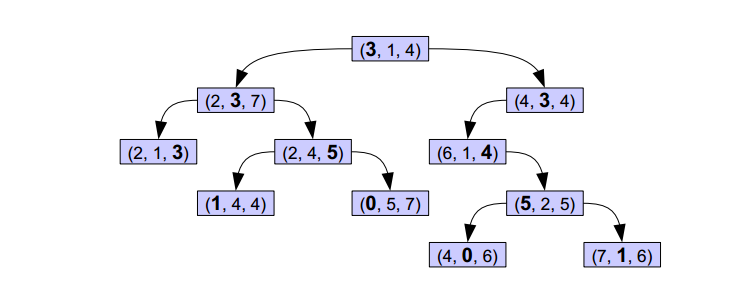

## KD-tree(K-dimension tree)

kd树，是一种分割k维数据空间的数据结构。主要应用于多维空间关键数据的搜索（如：范围搜索和最近邻搜索）。

例子：

上图的树就是一棵KDTree，形似二叉搜索树，其实KDTree就是二叉搜索树的变种。这里的K = 3.

首先来看下树的组织原则。将每一个元组按0排序（第一项序号为0，第二项序号为1，第三项序号为2），在树的第n层，第 n%3 项被用粗体显示，而这些被粗体显示的树就是作为二叉搜索树的key值，比如，根节点的左子树中的每一个节点的第一个项均小于根节点的的第一项，右子树的节点中第一项均大于根节点的第一项，子树依次类推。

对于这样的一棵树，对其进行搜索节点会非常容易，给定一个元组，首先和根节点比较第一项，小于往左，大于往右，第二层比较第二项，依次类推。

