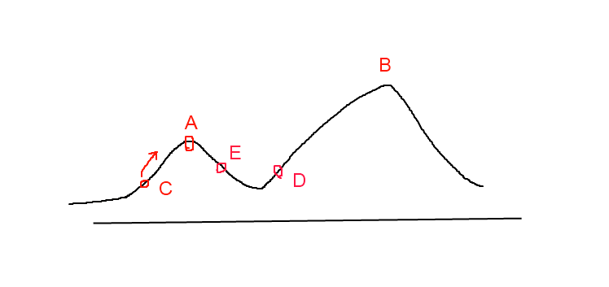

## 模拟退火算法

爬山法是完完全全的贪心法，每次都鼠目寸光的选择一个当前最优解，因此只能搜索到局部的最优值。模拟退火其实也是一种贪心算法，但是它的搜索过程引入了随机因素。模拟退火算法**以一定的概率**来接受一个比当前解要差的解，因此**有可能**会跳出这个局部的最优解，达到全局的最优解。以下图为例，模拟退火算法在搜索到局部最优解A后，会**以一定的概率**接受到E的移动。也许经过几次这样的不是局部最优的移动后会到达D点，于是就跳出了局部最大值A。

算法描述：

若J( Y(i+1) )>= J( Y(i) )  (即移动后得到更优解)，则总是接受该移动

若J( Y(i+1) )< J( Y(i) )  (即移动后的解比当前解要差)，则**以一定的概率接受移动，而且这个概率随着时间推	移逐渐降低（逐渐降低才能趋向稳定）**

这里的“一定的概率”的计算参考了金属冶炼的退火过程，这也是模拟退火算法名称的由来。

根据热力学的原理，在温度为T时，出现能量差为dE的降温的概率为P(dE)，表示为：

**P(dE) = exp( dE/(kT) )**

其中k是一个常数，exp表示自然指数，且dE<0。这条公式说白了就 是：温度越高，出现一次能量差为dE的降温的概率就越大；温度越低，则出现降温的概率就越小。又由于dE总是小于0（否则就不叫退火了），因此dE/kT < 0 ，所以P(dE)的函数取值范围是(0,1) 。