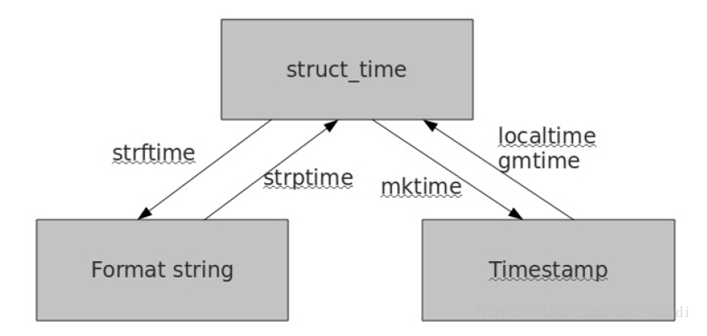
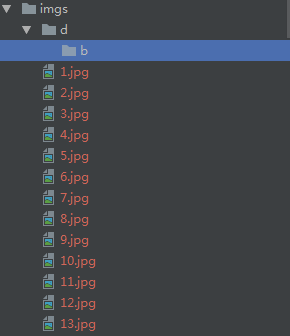

- 在 linux 平台， python 文件中加上如下注释，并授给执行权限，就能直接运行 .py 文件了

  ```
  #!/usr/bin/env python3
  ```

- ascii, unicode， utf-8 的关系

  > ascii 是最早的计算机编码，只能表示 127 个字符，包括大小写英文字母、数字和一些符号
  >
  > 后来为了支持中文中国制定了`GB2312`， 两个字节
  >
  > 再后来为了统一各个国家的文字编码，使用 Unicode， 常用两个自己，生僻的 4 个字节
  >
  > 最后为了节省空间，因为有的字符比如字母和数字是一个字节，用 Unicode 两个字节存储浪费空间，所以诞生了 utf-8 编码，会调节编码长度，且和 ascii 编码不冲突

- 列表和元组的区别

  元组的中的元素是不能修改的（保证安全性），但是如果元组内部的 list 是可以修改

  ```python
  # 下面语句是正确的
  a = (1, 2, [1, 2, 3])
  a[2][0] = 2
  
  # 下面语句是错误的
  b = (1, 2, [1, 2, 3])
  b[1] = 2
  ```

- 多行输出字符串，使用 ''''''

  ```python
  print(r'''hello,\n
  world''')
  ```

- map 函数 

  接收一个函数和一个或多个 list 返回一个 list (没有去掉元素)

  ```python
  # 输出 ['1', '2', '3', '4', '5', '6', '7', '8', '9']
  list(map(str, [1, 2, 3, 4, 5, 6, 7, 8, 9]))
  
  # 输出 [1, 2, 3, 4, 5]，字符串的每个字符当做一个元素处理
  list(map(lambda x: int(x), "12345"))
  ```

- filter函数

  接收一个函数和一个或多个 list 返回一个 list (去掉不满足条件的元素)

- reduce 函数

  ```python
  # python3 中需要导入 reduce
  from functools import reduce
  
  def fn(x, y):
      return 10 * x + y
  
  t = reduce(fn, [1, 2, 3, 4])
  
  print(t)
  ```

- capitalize  把字符串的第一个字符大写，其它字符都小写

  ```python
  # 输出 Hello world
  print("hello world".capitalize())
  ```

- random.choice 方法返回一个列表，元组或字符串的随机项。

  ```python
  import random
  
  print(random.choice([1, 2, 3]))
  print(random.choice('A String'))
  ```

- python 包，目录下有\_\_init\_\_.py文件

  \_\_init\_\_.py文件的作用

  1. python 中 package 的标识，不能删除

  2. 在内部定义 \_\_all\_\_ 用来模糊导入 (import *)，导入的是在各模块中定义的类，变量，常量，方法等

     注意：这是定义文件夹下所有模块的的类，方法，常量等，导入的时候按模块导入，当发现这个模块没有这个类或方法就不加载

     ```python
     # 定义一次以后就用 * 就可一次性导入
     __all__ = ["Pack1Class", "Pack1Class1"]
     ```

- python 模块是一个 Python 文件，以 .py 结尾

- help() 函数

  ```python
  help(max)
  ```

- dir() 函数（可带参数不带参数）

  ```python
  # 不到参数返回当前范围内的所有变量
  # 下方输出 ['__builtins__', '__cached__', '__doc__', '__file__', '__loader__', 
  # '__name__', '__package__', '__spec__']
  print(dir())
  
  # 带参数返回当前对象的所有的方法和属性列表，参数可以是 对象、变量、类型
  # z 下方输出 ['__add__', '__class__', '__contains__', '__delattr__', '__delitem__', #'__delslice__', '__doc__', '__eq__', '__format__', '__ge__', '__getattribute__', #'__getitem__', '__getslice__', '__gt__', '__hash__', '__iadd__', '__imul__', #'__init__', '__iter__', '__le__', '__len__', '__lt__', '__mul__', '__ne__', #'__new__', '__reduce__', '__reduce_ex__', '__repr__', '__reversed__', '__rmul__', #'__setattr__', '__setitem__', '__setslice__', '__sizeof__', '__str__', #'__subclasshook__', 'append', 'count', 'extend', 'index', 'insert', 'pop', 'remove', #'reverse', 'sort']
  l = [1, 2, 3, 4, 5]
  print(dir(l))
  ```

  仅仅把属性和方法列出来是不够的，配合`getattr()`、`setattr()`以及`hasattr()`，我们可以直接操作一个对象的状态

  注意：只有在不知道对象信息的时候，我们才会去获取对象信息

  ```python
  class MyObject(object):
       def __init__(self):
           self.x = 9
       def power(self):
           return self.x * self.x
  
  obj = MyObject()
  
  hasattr(obj, 'x') # 有属性'x'吗？
  # True
  obj.x
  # 9
  hasattr(obj, 'y') # 有属性'y'吗？
  #False
  setattr(obj, 'y', 19) # 设置一个属性'y'
  hasattr(obj, 'y') # 有属性'y'吗？
  # True
  getattr(obj, 'y') # 获取属性'y'
  # 19
  obj.y # 获取属性'y'
  # 19
  getattr(obj, 'z', 404) # 不存在设置一个默认值
  
  hasattr(obj, 'power') # 有属性'power'吗？
  # True
  fn = getattr(obj, 'power') # 获取属性'power'并赋值到变量fn
  fn() # 调用fn()与调用obj.power()是一样的
  # 81
  ```

- \_\_doc\_\_函数，查看模块的文档

  ```python
  print(int.__doc__)
  ```

- \_\_file\_\_ 输出文件的所在路径

  ```python
  import random
  
  # 输出 C:\ProgramData\Anaconda2\envs\carnd-term1\lib\random.py
  print(random.__file__)
  ```

- environ，获取当前系统的环境变量

  ```python
  import os
  
  # 输出 F:\software\jdk1.8.0_45\jdk1.8.0_45
  print(os.environ['JAVA_HOME'])
  ```

- globals() 和 locals()

  >python 的全局名字空间存储在一个叫 globals() 的 dict 对象中；局部名字空间存储在一个叫 locals()的dict 对象中。全局名字空间：在模块内部，局部名字空间：在类或函数内部

  ```python
  # 查看所有全局和局部变量
  print(globals())
  print(locals())
  
  # 查看指定名称的全局和局部变量
  print(globals()["name"])
  print(locals()["name2"])
  ```

- eval 执行一个字符串表达式，并返回表达式的值

  > 同时也可以把字符串转换为列表、字典、元组
  >
  > 参数 globals 表示全局变量搜索变量
  >
  > 参数 locals 表示在局部搜索变量

  ```python
  n = 81
  print(eval("n + 4"))
  
  # 输出 3
  print(eval("x + y", {'x': 1, 'y': 2}))
  
  # 字符串转换成列表，输出 [1,2]
  a = "[[1,2], [3,4], [5,6], [7,8], [9,0]]"
  b = eval(a)
  print(b[0])
  
  # 字符串转换成字典，输出 a
  a = "{1: 'a', 2: 'b'}"
  b = eval(a)
  print(b[1])
  
  # 字符串转换成元组，输出 [1,2]
  a = "([1,2], [3,4], [5,6], [7,8], (9,0))"
  b = eval(a)
  print(b[0])
  
  # 优先使用全局变量
  print(eval("x+y", globals()))
  ```

- 把变量放置到 scope （globals, loacals）作用域内

  ```python
  x = 1
  exec("x=3", globals())
  # 输出 3
  print(x)
  ```

- pip 安装时可以设置默认的时间大一点

  ```
  pip --default-timeout=100 install -U scikit-learn
  ```

- \_\_repr\_\_和\_\_str\_\_这两个方法都是用于显示的，\_\_str\_\_是面向用户的，而\_\_repr\_\_面向程序员

  > 类似 java 中的 toString
  >
  > \_\_repr\_\_ 和 \_\_str\_\_的不同是在命令行可以不用输入 print，直接输入对象名就能打印对象内容

  ```python
  class Car:
      def __init__(self):
          self.name = "jiaoche"
          self.age = 10
  
      def __str__(self):
          return self.name + str(self.age)
  
      def __repr__(self):
          return self.name + str(self.age)
  
  car = Car()
  
  # 输出 jiaoche10
  print(car)
  ```

- 生成迭代器的几种方式

  > 迭代器在处理数据量比较大的迭代的时候比较不好用，不会一次性把数据加入内存
  >
  > 注意：列表、自定、元组等他们虽然可迭代但不是迭代器
  >
  > 迭代器对象必须有 \_\_iter\_\_( )方法和 \_\_next\_\_( )方法
  >
  > 对象只要有 \_\_iter\_\_( ) 或 \_\_getitem\_\_ 方法就是可迭代的

  1. 类方式

     ```python
     class Data:
         def __init__(self, data):
             self.data = data
     
         # 只要存在 __iter__ 就表示可迭代的
         def __iter__(self):
             return self
     	
         # 迭代返回值，必须抛出 StopIteration 异常
         def __next__(self):
             if self.data > 2:
                 raise StopIteration
             else:
                 self.data += 1
                 return self.data
     
     data = Data(1)
     # 输出 
     # 2
     # 3
     for i in data:
         print(i)
     ```

  2. 生成器函数

     >与普通的函数的区别是多了一个或多个 yield
     >
     >普通函数在执行之后直接退出当前函数，但是生成器函数执行之后并没有退出，生成器函数其实是返回的一个对象

     ```python
     def xx():
         for i in range(100):
             yield i
     
     for i in xx():
         print(i)
     ```

  3. 简单的生成器

     ```python
     xx = (x for x in range(10))
     
     # 一般不会用 next 来获取生成器的值
     print(next(xx))
     print(next(xx))
     
     # 一般用 for 循环的方式
     for n in xx:
         print(n)
     ```

- 判断当前文件夹下的文件或文件夹是否存在

  ```python
  import os
  
  # 判断文件（文件夹）是否存在
  os.path.exists("test_file.txt")
  
  # 判断文件是否存在，不包括文件夹
  os.path.isfile("test-data")
  
  # 使用 try except 语句,判断文件文件是否存在，不包括文件夹子
  # 但是当 open 的第二个参数包含 a 或 w 时会自动创建文件不会抛出异常
  try:
      f =open("file.txt")
      f.close()
  except IOError:
      print（"File is not accessible."）
  
  # 使用 pathlib
  import pathlib
  
  path = pathlib.Path("path/file")
  path.exists()
  path.is_file()
  ```

- 写文件

  ```python
  """
  'r'：读
  'w'：写
  'a'：追加
  'r+' == r+w（可读可写，文件若不存在就报错(IOError)）
  'w+' == w+r（可读可写，文件若不存在就创建）
  'a+' == a+r（可追加可写，文件若不存在就创建）
  对应的，如果是二进制文件，就都加一个b就好啦：
  'rb' 'wb' 'ab' 'rb+' 'wb+' 'ab+'
  """
  
  file = r'D:\test.txt'
  with open(file, 'w+') as f:
      f.write(mobile)
  ```

- 读取文件

  ```python
  # read 按字节读取,参数为字节数，不传表示读取所有
  f = open('go.txt')
      print(f.read())
      f.close()
  
  # readline
  file = open("sample.txt") 
  while 1:
    line = file.readline()
    if not line:
      break
    pass # do something
  file.close()
  
  # readlines， 读取文件的所有行放到列表中
  file = open("sample.txt") 
  while 1:
    lines = file.readlines()
    if not lines:
      break
    for line in lines:
      pass # do something
  file.close()
  
  # 迭代器，当读取大文件的时候按这种方式
  file = open("sample.txt") 
  for line in file:
    pass # do something
  file.close()
  
  # 当读入的文件中包含中文的时候需要加上 encoding='UTF-8'，不然会出现
  """
  UnicodeDecodeError: 'gbk' codec can't decode byte 0x80 in position 44: illegal multibyte sequence
  """
  file = open(path, "r", encoding='UTF-8')
  ```

- 字符串去掉空格的方法

  ```
  strip()：把头和尾的空格去掉
  lstrip()：把左边的空格去掉
  rstrip()：把右边的空格去掉
  replace(‘c1’, ‘c2’)：把字符串里的 c1 替换成 c2。故可以用replace(’ ‘,’’)来去掉字符串里的所有空格
  split()：通过指定分隔符对字符串进行切片，如果参数 num 有指定值，则仅分隔 num 个子字符串
  ```

- 定时任务

  ```python
  from threading import Timer
  
  def printHello(): 
    # 每隔两秒打印一下 hello world，这也是个递归调用
    t = Timer(2, printHello) 
    t.start() 
    print("Hello World")
   
  if __name__ == "__main__": 
    printHello() 
  ```

- time

  ```python
  # 当前时间戳
  t = time.time()
  
  # 返回当前时间
  time.ctime()
  
  # localtime 获取本地时间，可以转为 struct_time
  t = time.localtime()
  
  # 可以代码获取年、月、日等信息
  t = time.struct_time(t)
  
  # 时间格式化， struct_time 作为参数
  t = time.strftime("%Y%m%d", t)
  
  # 时间字符串转为 struct_time
  t = time.strptime("19年1月1日", "%y年%m月%d日")
  
  # struct_time 转为时间戳
  t = time.mktime(t)
  
  # 返回系统运行时间，在测试程序执行时间时比较有用
  time.perf_counter()
  ```

  各种时间之间的转换关系，可以看出 struct_time 是比较重要的时间格式，作为纽带存在

  

- Python 中 \*args 和 \*\*kwargs 的区别

  > \*args 用来将参数打包成 tuple 给函数体调用

  ```python
  def function(x, y, *args):
      print(x, y, args)
  
  function(1, 2, 3, 4, 5)
  
  # 输出 1 2 (3, 4, 5)
  ```

  >  \* 用于给元组、列表、字典解包

  ```python
  def test(a, b, c):
      print(a, b, c)
  
  # 下面的都输出 1 2 3
  test(*[1, 2, 3])
  test(*(1, 2, 3))
  test(*{1: "a", 2: "b", 3: "c"})
  ```

  > \*\*kwargs 打包关键字参数成 dict 给函数体调用

  ```python
  def function(**kwargs):
      print(kwargs)
  
  function(a=1, b=2, c=3)
  # 输出 {'b': 2, 'a': 1, 'c': 3}
  ```

  **注意： 参数arg、\*args、\*\*kwargs三个参数的位置必须是一定的。必须是(arg, *args, \*\*kwargs)这个顺序，否则程序会报错。**

- 多线程

  ```python
  import time
  import threading
  
  def say_hello(xx2, *name, **xx):
      for i in range(10):
          print(xx2)
          print(name, "hello")
          print(xx['a'])
          time.sleep(1)
  
  
  def say_yes(name):
      for i in range(10):
          print(name, "yes")
          time.sleep(1)
  
  t1 = threading.Thread(target=say_hello, args=("xiaoqiang", "xiaoqing2"), kwargs={'a': 1})
  t2 = threading.Thread(target=say_yes, args=("xiaoming",))
  
  t1.start()
  t2.start()
  ```

- 文件遍历 os.walk() 与 os.listdir()

  目录结构：

  

  > os.listdir() 输出当前文件夹下的子文件夹和文件
  >
  > 不会遍历子文件夹下的文件

  ```python
  print(os.listdir("imgs"))
  ```

  输出为：

  ```
  ['1.jpg', '10.jpg', '11.jpg', '12.jpg', '13.jpg', '2.jpg', '3.jpg', '4.jpg', '5.jpg', '6.jpg', '7.jpg', '8.jpg', '9.jpg', 'd']
  ```

  > os.walk()  ，不仅遍历当前文件夹还遍历文件夹下的子文件夹
  >
  > root 表示根目录，即当前目录，dirs 表示子文件夹， files 文件
  >
  > topdown  True ：由外向内遍历，False：由内向外遍历

  ```python
  for root, dirs, files in os.walk('imgs', topdown=True):
      print(files, dirs, root)
  ```

  输出为：

  ```
  ['1.jpg', '10.jpg', '11.jpg', '12.jpg', '13.jpg', '2.jpg', '3.jpg', '4.jpg', '5.jpg', '6.jpg', '7.jpg', '8.jpg', '9.jpg'] ['d'] imgs
  [] ['b'] imgs\d
  ['1.jpg', '2.jpg', '3.jpg'] [] imgs\d\b
  ```

- global 和 nonlocal，闭包

  > 在函数累不修改全局变量的时候必须加上 global
  >
  > 在函数内部修改外部函数非全局变量的时候必须加上 nonlocal
  >
  > 闭包的作用是保存函数的状态信息，使函数的局部变量信息依然可以保存下来
  >
  > 返回闭包时牢记一点：返回函数不要引用任何循环变量，或者后续会发生变化的变量。

  1. 修改全局变量必须使用 global

     ```python
     gcount = 0
      
     def global_test():
         global  gcount
         gcount+=1
         print (gcount)
     global_test()
     ```

  2. 修改非全局变量的外部变量，使用 nonlocal

     > 闭包的作用是在

     ```python
     def Maker(step):
         num = 1
         def fun1():
             nonlocal num # 不然 num 是不允许修改的
             num = num + step
             print(num)
         return fun1
     
     j = 1
     func2 = Maker(3)  # 调用外部包装器
     while j < 5:
         func2()  # 调用内部函数4次 输出的结果是 4、7、10、13
         j += 1
     ```

- 装饰器

  参考：https://www.cnblogs.com/cicaday/p/python-decorator.html

  不带参数

  ```python
  def debug(func):
      def wrapper(*args, **kws):
          print("进入方法：{}".format(func.__name__))
          return func(*args)
      return wrapper
  
  @debug
  def say_goodbye(name):
      print(name, "hello!")
  
  say_goodbye("tony")
  ```

  带参数的， 比不带参数的多了一层

  ```python
  def debug(level):
      def wrapper(func):
          def inner_wrapper(*args, **kws):
              print(level, "进入方法：{}".format(func.__name__))
              return func(*args)
          return inner_wrapper
      return wrapper
  
  # 等价于 debug('warn')(say_goodbye)
  @debug(level="warn")
  def say_goodbye(name):
      print(name, "hello!")
  
  say_goodbye("tony")
  ```

- 打印命令行输入的参数

  ```python
  import sys
  
  def print_argv():
      print(sys.argv)
  
  if __name__ == '__main__':
      print_argv()
  ```

  命令行输入

  ```
  python pc.py tony
  ```

  结果，第一个为文件名称，后面的为参数

  ```
  ['pc.py', 'tony']
  ```

- 模块搜索路径

  ```python
  import sys
  
  # 查看所有搜索目录
  print(sys.path)
  
  # 也可以添加自己的搜索目录，只对运行时有效
  sys.path.append('/Users/michael/my_py_scripts')
  ```

- 内部属性不让外部访问

  > 给属性前加上 \_\_
  >
  > 注意：像 \_\_name\_\_ 这样的变量，是特殊变量，外部是可以访问的
  >
  > 如果外部需要访问 \_\_name 这样的变量，使用 get  set  方法，**set get 方法可以增加一些判断逻辑**
  >
  > __name 外部是可以访问的，编译器会在前面加上类名比如：\_Student\_\_name，所以最好不要直接访问

  ```python
  class Student(object):
  
      def __init__(self, name, score):
          self.__name = name
          self.__score = score
  
      def print_score(self):
          print('%s: %s' % (self.__name, self.__score))
  
      def get_name(self):
          return self.__name
  
      def set_name(self, name):
          self.__name = name
  
  student = Student("tony", 12)
  print(student.get_name())
  student.set_name("mical")
  print(student.get_name())
  ```

- 多态

  > 参数如果是父类，那么子类也可以作为参数，且子类作为参数的时候是调用子类的方法，所以子类的方法不同实现，会得到不同的结果
  >
  > 其实并不一定要继承，只要类中有相应的方法，都是可以作为参数传递的

  ```python
  class Animal(object):
      def run(self):
          print("animal is running")
  
  class Dog(Animal):
      def run(self):
          print("dog is running")
  
  class Cat(Animal):
      def run(self):
          print("cat is running")
          
  class Fish(object):
      def run(self):
          print("fish is running")
          
  def run(animal):
      animal.run()
  
  run(Animal())
  run(Dog())
  run(Cat())
  run(Fish())
  ```

   输出：

  ```
  animal is running
  dog is running
  cat is running
  fish is running
  ```

- 判断类型

  > 能用`type()`判断的基本类型也可以用`isinstance()`判断

  ```python
  class Animal(object):
      pass
  
  class Dog(Animal):
      pass
  
  class Fish(object):
      pass
  
  print(type(1) == int)
  print(type(Animal()) == Animal)
  print(isinstance(Dog(), Animal))
  print(isinstance(Dog(), Fish))
  
  # 判断是否为其中某一种
  print(isinstance(Animal(), (Fish, Animal)))
  ```

  > 判断是否是函数使用 `types` 模块中定义的常量

  ```python
  import types
  
  def fn():
      pass
  
  print(type(fn) == types.FunctionType)
  print(type(abs) == types.BuiltinFunctionType)
  print(type(lambda x: x) == types.LambdaType)
  print(type((x for x in range(10))) == types.GeneratorType)
  ```

  输出为：

  ```
  True
  True
  True
  True
  ```

- 类属性和实例属性的区别

  > 类属性是所有的实例共有的，而实例属性只有当前实例所有

  ```python
  class Student(object):
      # 类属性
      count = 0
  
      def __init__(self, name):
          # 实例属性
          self.name = name
  
          Student.count += 1
  
  # 每创建一个实例，count 加 1
  s1 = Student("tony")
  s2 = Student("tom")
  s3 = Student("job")
  print(Student.count)
  ```

- \_\_slot\_\_

  > 设置类可以绑定的属性和方法名称，之后对所有的实例都起作用
  >
  > 注意：对继承该类的子类是不起作用的

  ```python
  class Student(object):
      __slots__ = ('name', 'age') # 用 tuple 定义允许绑定的属性名称
  
  s = Student() # 创建新的实例
  s.name = 'Michael' # 绑定属性'name'
  s.age = 25 # 绑定属性'age'
  
  s.score = 99 # 绑定属性'score',由于没有这个 slot 没有这个属性所以会报错
  ```

- @property

  > 

  ```python
  class Student(object):
      
      @property
      def score(self):
          return self._score
  
      @score.setter
      def score(self, value):
          if not isinstance(value, int):
              raise ValueError('score must be an integer!')
          if value < 0 or value > 100:
              raise ValueError('score must between 0 ~ 100!')
          self._score = value
  ```

  

- 

  > 

  ```python
  
  ```

  

  

  

  

  