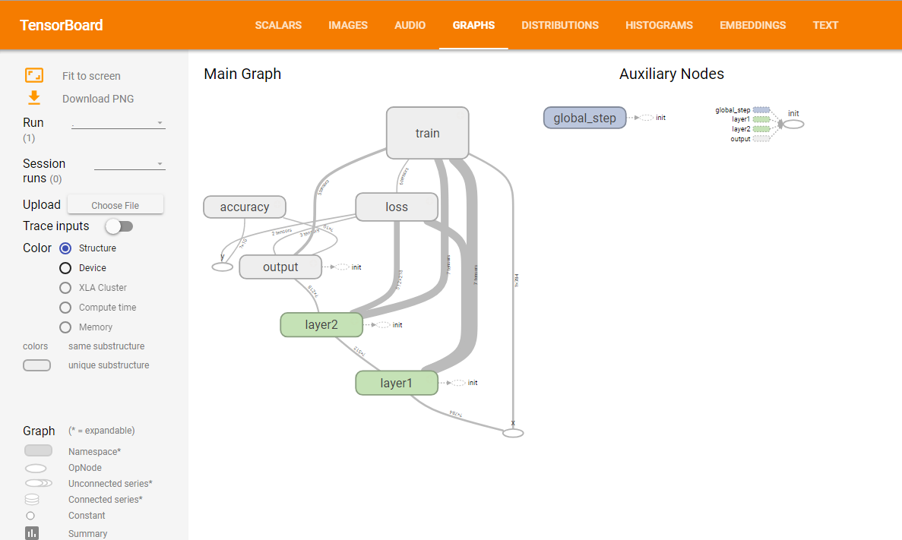
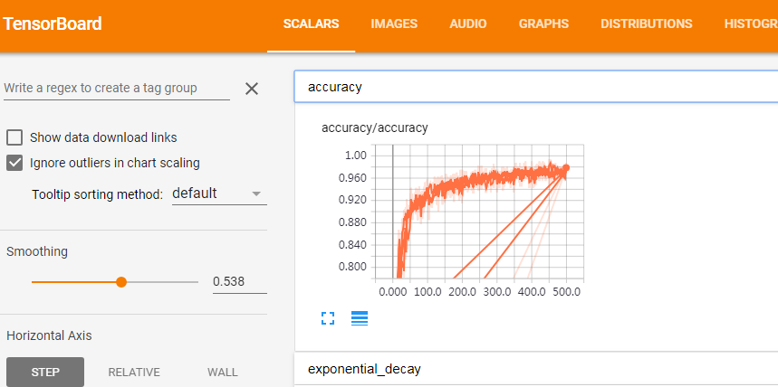
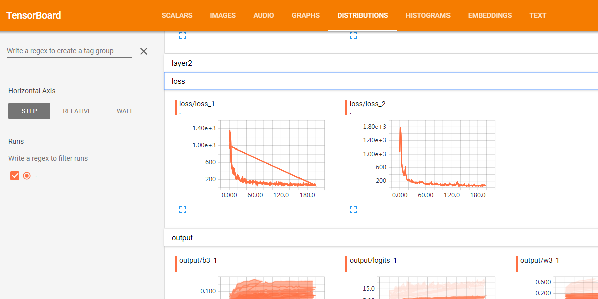
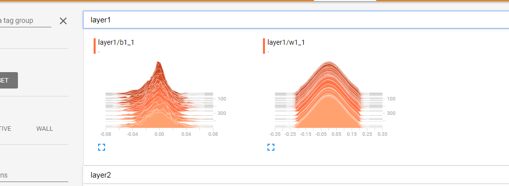

tensorboard 的常规使用方法

>  writer = tf.summary.FileWriter("logs", sess.graph)  把计算图写入 logs 文件夹下
>
>  在命令行执行：tensorboard --logdir logs
>
> 在浏览器输入：http://localhost:6006， 查看 GRAPHS
>
> 
>
> 添加数据到 histogram 和 scalar
>
> tf.summary.histogram('w2', w2) 
>
> tf.summary.scalar('loss', loss)
>
> merged = tf.summary.merge_all()
>
> rs = sess.run(merged, feed_dict={x: xs, y: ys})
>
> writer.add_summary(rs, i)
>
> 也可以添加图片和音频等
>
> 
>
> 
>
> HISTOGRAMS 每行的一个切片表示一次更新数据的分布情况
>
> 
>
> 下面使用   minst 数据集作为例子

```python
import tensorflow as tf
from tensorflow.examples.tutorials.mnist import input_data

tf.reset_default_graph()

mnist = input_data.read_data_sets("MNIST_data/", one_hot=True)

x = tf.placeholder(tf.float32, [None, 784], name="x")
y = tf.placeholder(tf.float32, [None, 10], name="y")

global_step = tf.Variable(0, dtype=tf.int32, trainable=False)

# 训练时使用原始变量
with tf.variable_scope("layer1"):
    w1 = tf.Variable(tf.truncated_normal((784, 512), stddev=0.1), name="w1")
    b1 = tf.Variable(tf.zeros(512), name="b1")
    layer_1_t = tf.nn.relu(tf.add(tf.matmul(x, w1), b1))
    
    tf.summary.histogram('w1', w1)
    tf.summary.histogram('b1', b1)
    

with tf.variable_scope("layer2"):
    w2 = tf.Variable(tf.truncated_normal((512, 218), stddev=0.1), name="w2")
    b2 = tf.Variable(tf.zeros(218), name="b2")
    layer_2_t = tf.nn.relu(tf.add(tf.matmul(layer_1_t, w2), b2))
    
    tf.summary.histogram('w2', w2)
    tf.summary.histogram('b2', b2)
    

with tf.variable_scope("output", reuse=True):
    w3 = tf.Variable(tf.truncated_normal((218, 10), stddev=0.1), name="w3")
    b3 = tf.Variable(tf.zeros(10), name="b3")
    logits = tf.add(tf.matmul(layer_2_t, w3), b3, name="logits")
    
    tf.summary.histogram('w3', w3)
    tf.summary.histogram('b3', b3)
    tf.summary.histogram('logits', logits)

with tf.variable_scope("loss"):
    loss = tf.reduce_sum(tf.nn.softmax_cross_entropy_with_logits(labels=y, logits=logits), name="loss")

    # 加上正则化项
    regularizer = tf.contrib.layers.l2_regularizer(0.001)
    regularization = regularizer(w1) + regularizer(w2)
    loss += regularization

    tf.summary.scalar('loss', loss)

# minimize 的 global_step 会自动递增
with tf.variable_scope('train'):
    train_step = tf.train.GradientDescentOptimizer(0.001).minimize(loss)

# 准确率
with tf.variable_scope("accuracy"):
    correct_prediction = tf.equal(tf.argmax(y, 1), tf.argmax(logits, 1))
    accuracy = tf.reduce_mean(tf.cast(correct_prediction, tf.float32))
    tf.summary.scalar("accuracy", accuracy)

# 合并所有的 summary 分量
merged = tf.summary.merge_all()

with tf.Session() as sess:
    tf.global_variables_initializer().run()

    # 生成计算图
    writer = tf.summary.FileWriter("logs", sess.graph)

    for i in range(500):
        xs, ys = mnist.train.next_batch(400)
        _, rs = sess.run([train_step, merged], feed_dict={x: xs, y: ys})

        # 添加 summary
        writer.add_summary(rs, i)

        # 验证
        if i % 100 == 0:
            print("训练次数 {}, 准确率 {:.3f}".format(i, sess.run(accuracy, feed_dict={x: xs, y: ys})))

    # 测试
    print("测试集准确率 {:.3f}".format(sess.run(accuracy, feed_dict={x: mnist.test.images, y: mnist.test.labels})))

    writer.close()
```


