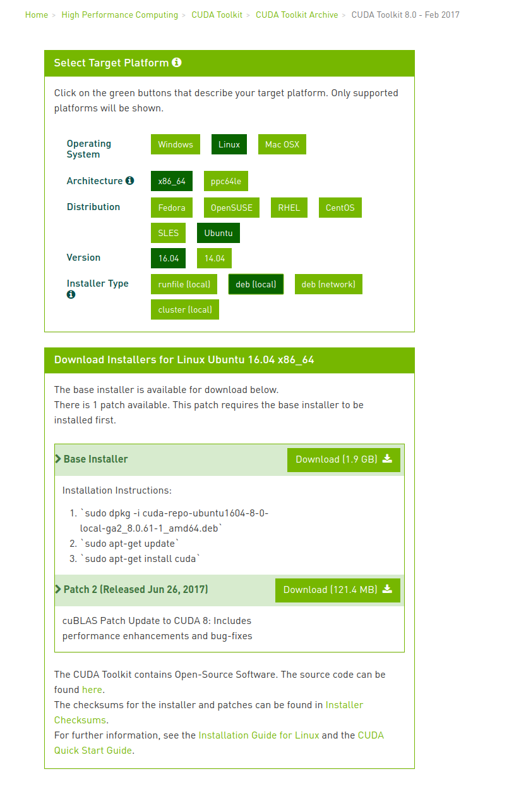

### ubuntu 16.04.5 安装  nvidia gtx1080ti 驱动 + cuda8.0 + cudnn6.0


#### 安装 nvidia 驱动

1. 禁用nouveau：

   - 查看文件属性：

     ```
     ll /etc/modprobe.d/blacklist.conf
     ```

   - 修改属性 ugo 皆为可读可写：其中读为4，写为2，执行为1；u为超级用户，g为当前用户，o为其他用户:

     ```
     sudo chmod 666 /etc/modprobe.d/blacklist.conf
     ```

   - 用编辑器打开：

     ```
     sudo vi /etc/modprobe.d/blacklist.conf
     ```

   - 在文件末尾添加

     ```
     blacklist vga16fb
     blacklist nouveau
     blacklist rivafb
     blacklist rivatv
     blacklist nvidiafb
     ```

   -  :wq保存退出，或者 shift+z

   - 还原文件属性

     ```
     sudo chmod 644 /etc/modprobe.d/blacklist.conf
     ```

   - 更新一下内核

     ```
     sudo update-initramfs -u
     ```

   - 重启系统

     ```
     reboot
     ```

   - 查看nouveau是否被屏蔽, 执行下面命令，没有输出表示屏蔽了

     ```
     lsmod | grep nouveau
     ```

2. 到官网 http://www.geforce.cn/drivers 下载相应的显卡驱动包

   

3. 进行安装

   - ctrl+alt+f1， 退出图形界面

   - 输入 Ubuntu 登录账户和密码

   - 关闭图形环境：

     ```
     sudo service lightdm stop
     ```

   - 修改驱动文件的权限

     ```
     chmod u+x,g+x NVIDIA-Linux-x86_64-390.59.run
     # 或 chmod 776 NVIDIA-Linux-x86_64-390.59.run
     ```

   - 开始安装

     ```
     sudo ./NVIDIA-Linux-x86_64-390.59.run -no-x-check -no-nouveau-check -no-opengl-files
     # -no-x-check 为安装驱动时关闭X服务
     # -no-nouveau-check 为安装驱动时禁用 nouveau
     # -no-opengl-files 为只安装驱动文件，不安装 OpenGL 文件
     ```

   - 重启

     ```
     reboot
     ```

   - 测试， 如果出现如下的输出，表示驱动安装成功

     ```
     sudo nvidia-smi
     sudo nvidia-settings
     ```

     

     

   

   #### 安装cuda8.0

   - 下载 cuda8.0 https://developer.nvidia.com/cuda-80-ga2-download-archive

     > Base Installer 和 Patch 2 两个都进行下载

     

   - 安装

     ```
     sudo dpkg -i cuda-repo-ubuntu1604-8-0-local-ga2_8.0.61-1_amd64.deb
     sudo apt-get update
     sudo apt-get install cuda
     
     sudo dpkg -i cuda-repo-ubuntu1604-8-0-local-cublas-performance-update_8.0.61-1_amd64.deb
     sudo apt-get update  
     sudo apt-get upgrade cuda
     ```

   - 在 ~/.basrc 中添加环境变量

     ```
     export PATH=/usr/local/cuda/bin${PATH:+:${PATH}}
     export LD_LIBRARY_PATH=/usr/local/cuda/lib64${LD_LIBRARY_PATH:+:${LD_LIBRARY_PATH}}
     export CUDA_HOME=/usr/local/cuda
     ```

   - 刷新环境变量

     ```
     source ~/.bashrc
     ```

     

   #### 安装cuDNN6.0

   > cuDNN6.0 和 CUDA8.0 最佳拍档

   - 下载

     在 NVIDIA官网上下载，找到 cudnn 的下载页面: https://developer.nvidia.com/rdp/cudnn-download， 下载前需要先登录，登录之后：

     选择 cuDNN v6.0 Library for Linux

     

   - 安装

     把 cudnn-8.0-linux-x64-v6.0.tgz 拷贝到 /usr/local/cuda 下

     ```
     sudo cp cudnn-8.0-linux-x64-v6.0.tgz /usr/local/cuda
     ```

     解压

     ```
     tar -zxvf cudnn-8.0-linux-x64-v6.0.tgz 
     ```

     文件拷贝

     ```
     sudo cp cuda/include/cudnn.h  /usr/local/cuda/include/
     
     # 注意：最后一行拷贝时 "-d" 不能少， 否则会提示 .so 不是 symbol link
     sudo cp cuda/lib64/libcudnn* /usr/local/cuda/lib64/ -d
     ```

      - 验证是否安装成功

        在如上下载 cuDNN v6.0 Library for Linux 的地方下载下面几个文件

        

        执行如下命令：

        ```
        sudo dpkg -i libcudnn6_6.0.21-1+cuda8.0_amd64.deb
        sudo dpkg -i libcudnn6-dev_6.0.21-1+cuda8.0_amd64.deb
        sudo dpkg -i libcudnn6-doc_6.0.21-1+cuda8.0_amd64.deb
        ```

        验证，/usr/src/cudnn_samples_v6 目录下有一些例子,  执行如下命令

        ```
        cp -r /usr/src/cudnn_samples_v6/ $HOME
        cd  $HOME/cudnn_samples_v6/mnistCUDNN
        make clean && make
        ./mnistCUDNN 
        ```

        如果得到如下结果，就表示安装正确了

        

​	
