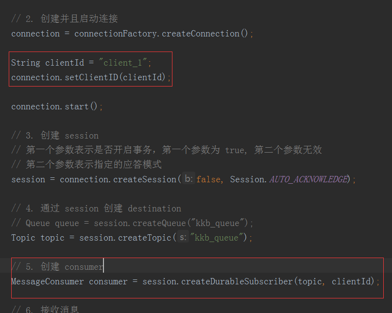

## ActiveMQ

### 一、JMS 介绍

- JMS 是什么？

  是消息发送和接收的一套规范

- JMS 的角色

  生产者、消费者、MOM 消息中间件（比如：ActiveMQ）

- JMS 作用

  异步通讯，完成程序之间的解耦

- JMS 消息模型

  点对点模型：只能一个取，消息的生产和消费没有时间上的相关性（消费者在消息产生之后启动也能获取消息）

  发布订阅模型：可以多个人取，类似广播模式，消息的生产和消费有时间上的相关性（消费者在消息产生之后启动不能获取消息， 但是修改为持久订阅就可以了）

- JMS 消息域

  Queue Region 和 Topic Region

- JMS 目的地

  Queue 目的地、Topic 目的地

- JMS 消息正文

  Stream、Map、Text、Byte、Object

### 二、下载与安装 ActiveMQ

> 前提条件，需要先安装 jdk

```bash
# 下载
wget https://mirrors.tuna.tsinghua.edu.cn/apache//activemq/5.15.9/apache-activemq-5.15.9-bin.tar.gz

# 解压缩
tar -zxvf apache-activemq-5.15.9-bin.tar.gz

# 进入 bin 目录，启动
./activemq start
```

通过浏览器访问控制台（IP 地址更换为 ActiveMQ 服务器所在的 IP ，访问不到可以关掉防火墙）
http://192.168.101.104:8161/admin

用户名密码都是 admin

### 三、ActiveMQ常用接口

生产者：

```java
public class Producer {

    public static void main(String[] args) throws Exception {
        String broker = "tcp://192.168.101.104:61616";
        Connection connection = null;
        Session session = null;
        try {
            // 1. 创建 Connection  工厂用于连接 broker
            ConnectionFactory connectionFactory = new ActiveMQConnectionFactory(broker);

            // 2. 创建并且启动连接
            connection = connectionFactory.createConnection();
            connection.start();

            // 3. 创建 session
            // 第一个参数表示是否开启事务，第一个参数为 true, 第二个参数无效
            // 第二个参数表示指定的应答模式
            session = connection.createSession(false, Session.AUTO_ACKNOWLEDGE);

            // 4. 通过 session 创建 destination
            Queue queue = session.createQueue("kkb_queue");
			// Topic topic = session.createTopic("kkb_queue");
            
            // 5. 创建 producer
            MessageProducer producer = session.createProducer(queue);

            // 6. 创建 message，并发送
            Message message = session.createTextMessage("你有男朋友吗？");
            producer.send(message);
        } catch (Exception e) {
            e.printStackTrace();
        } finally {
            connection.close();
            session.close();
        }
    }
}
```

消费者：

```java
public class Consumer {
    public static void main(String[] args) throws Exception {
        String broker = "tcp://192.168.101.104:61616";
        Connection connection = null;
        Session session = null;
        try {
            // 1. 创建 Connection  工厂用于连接 broker
            ConnectionFactory connectionFactory = new ActiveMQConnectionFactory(broker);

            // 2. 创建并且启动连接
            connection = connectionFactory.createConnection();
            connection.start();

            // 3. 创建 session
            // 第一个参数表示是否开启事务，第一个参数为 true, 第二个参数无效
            // 第二个参数表示指定的应答模式
            session = connection.createSession(false, Session.AUTO_ACKNOWLEDGE);

            // 4. 通过 session 创建 destination
            Queue queue = session.createQueue("kkb_queue");
			// Topic topic = session.createTopic("kkb_queue");

            // 5. 创建 producer
            MessageConsumer consumer = session.createConsumer(queue);

            // 6. 接收消息
            // 一种是使用 receive 接收, 同步消息，没有收到消息会阻塞
            // Message message = consumer.receive(1000);
            // 一种是使用监听器，异步消息，没有收到消息不会阻塞
            consumer.setMessageListener(new MessageListener() {
                @Override
                public void onMessage(Message message) {
                    if (message instanceof TextMessage) {
                        TextMessage tm = (TextMessage) message;
                        try {
                            System.out.println(tm.getText());
                        } catch (JMSException e) {
                            e.printStackTrace();
                        }
                    }
                }
            });
        } catch (Exception e) {
            e.printStackTrace();
        } finally {
            connection.close();
            session.close();
        }
    }
}
```

也可以自己新建一个 broker，那么这个 broker 就和 远程服务器ActiveMQ 没有关系了，可以使用消费者和生产者连接这个 broker

```java
public class Broker {
    public static void main(String[] args) {
        try {
            BrokerService service = new BrokerService();
            service.setUseJmx(true);
            service.addConnector("tcp://localhost:61616");
            service.start();
        } catch (Exception e) {
            e.printStackTrace();
        }
    }
}
```

### 四、JMS 事务


生产者发送应答消息给 Broker 是为了数据持久化

消费者发送应答消息给 Broker 是为了删除数据

应答消息分为四种：

指定事务（1种）：

SESSION_TRANSACTED：开启事务之后，使用该应用模式，需要执行 commit 进行消息应答

不指定事务（3种）：
AUTO_ACKNOWLEDGE：调用 send 方法之后，自动完成消息应答

CLIENT_ACKNOWLEDGE：需要生产者或消费者使用 acknowledge 完成手动应答

DUPS_OK_ACKNOWLEDGE：当接收消息数量到达一定阈值之后，通过一个 ACK 指令把它们自动全部确认


事务的作用：组合消息， commit 和 rollback

### 五、消息生产者处理

- 持久传输非持久传输

  当生产者宕机，如果消息未持久化，消息在内存，消息会丢失；如果持久化，消息在硬盘上不会丢失

  ```java
  // 改为非持久化方式
  producer.setDevieryMode(DevieryMode.NON_PERSISTENCE)；
  ```

- 消息同步发送和异步发送

  在不考虑事务的前提下：

  1. producer  同步发送，发送是阻塞的（sned 方法），直到收到确认
  2. producer 发送非持久化消息默认是异步发送，异步发送不会等待 broker 的确认

  设置发送方式：

  ```java
  // 通过 ActiveMQConnectionFactory 指定
  cf = new ActiveMQConnectionFactory("tcp://localhost:61616?jms.useAsycSend=true")  
  
  // 或调用 ActiveMQConnectionFactory API
  ((ActiveMQConnectionFactory)connectionFactory).setUseAsyncSend(true);
  
  // 或实例化对象中异步发送
  (ActiveMQConnection(connection)).setUseAsyncSend(true);
  ```

  异步发送优缺点：

  优点：生产者不阻塞


​       缺点：消息可能丢失（broker 挂了）；可能出现宕机（如果生产快，消费慢，broker 内存可能占满）

- 生产者流量控制

  **为什么需要流量控制？**

  默认情况下持久化消息使用同步发送，非持久化消息使用异步发送

  当使用同步发送时，生产者会被阻塞，消息存储成功 broker 就会返回 ProducerAck

  当使用异步发送时，生产者不会被阻塞，没有等到 broker 返回 ProducerAck， 也会一直发送数据，所以可能在这期间 broker 存储不了这么多数据，出现消息丢失的情况

  

  **流量控制**

  同步发送，默认就是流量控制，因为每当消息存储成功就会返回 ProducerAck

  异步发送，需要设置 ProducerWindowSize 窗口大小，设置再没有收到 ProducerAck 的情况下最多发送的消息的大小，单位为 Bytes，生产者处于阻塞状态，不能继续发送消息到 broker

  

  实现方式

  ```java
  // 方式一
  String broker = "tcp://localhost:61616?producerWindowSize=10240";
  
  // 方式二
  ((ActiveMQConnectionFactory) connectionFactory).setProducerWindowSize(10240);
  ```

  **关于 alwaysSyncSend 和 useAsyncSend**

  1. 当 alwaysSyncSend=false 时，如果指定了 useAsyncSend=false，持久化消息使用同步发送，非持久化消息异步发送（默认）

  2. 当 alwaysSyncSend=false 时，如果指定了 useAsyncSend=true，持久化和非持久化消息都使用异步发送
  3. 当 alwaysSyncSend=true 时，不管 useAsyncSend设置什么，都使用同步发送

  使用方式：在 brokerURL中添加加 jms.alwaysSyncSend 和 jms.useAsyncSend 参数

- 如何提高消息发送效率
  **为什么要提高消息发送效率？**

  1. Producer 的个数有限，但是 Consumer 的消费能力，Producer 忙不过来
2. Producer 的生产特别快，但是 Consumer 消费能力低，Producer 会被挤爆
  

  
**提高效率的办法有以下几种**
  
1. 消息持久化/非持久化权衡
  
   对于数据可靠性要低的数据可以进行非持久 化（因为非持久化会进行 IO ，降低效率）
  
2. 消息属性
  
   减少发送消息时设置的 properties 属性，因为每次发送的时候都会带上这些信息，且不能通过 Message 传递较大的文本和数据流
  
3. 异步发送
  
   建议开启异步发送，并设置 producerWindowSize
  
4. 事务
  
   因为所有未提交的事务都会在 Broker 的内存中，不要在事务中积压太多的消息，尽可能的提交事务
  
5. 提高消费者消费速率
  
   让 Consumer 的消费速率和 Producer 的生产速率保持同步
  
  6. 选择合适的存储器
  
     activeMQ 目前支持 JDBC/kahadb/LevelDB 三种主要的存储器，JDBC 存储到数据库，kahadb/LevelDB 属于日志存储 + BTree 索引，性能好，默认使用 kahadb

### 六、Broker Server 处理

- 配置存储空间大小，如果超出空间抛出异常

  > sendFailIfNoSpace：当 broker 的空间不足会抛出 javax.jms.ResourceAllocationException 异常，生产者或消费者可以捕获这个异常执行相应的操作，比如重新 send
  >
  > sendFailIfNoSpaceAfterTimeout：设置在指定时间之后再发送异常信息，但是是毫秒，这样的好处是让客户端阻塞一会，等 broker 进行一下缓存，而不是又直接发送消息过来

  ```xml
  <systemUsage>
       <systemUsage sendFailIfNoSpace="true" sendFailIfNoSpaceAfterTimeout="3000">
           <!--配置内存、磁盘、临时空间的大小-->
           
            <!--非持久化消息，重启丢失-->
           <memoryUsage>
               <memoryUsage percentOfJvmHeap="70" />
           </memoryUsage>
           <!--持久化消息，重启不会丢失-->
           <storeUsage>
               <storeUsage limit="100 gb"/>
           </storeUsage>
           <!--临时空间，在内存告急的时候会把内存数据存入里边，重启丢失-->
           <tempUsage>
               <tempUsage limit="50 gb"/>
           </tempUsage>
       </systemUsage>
  </systemUsage>
  ```

- 解决消费慢及无法消费的问题

  broker 中还可以单独配置生产者使用的 producerSystemUsage 和消费者使用的consumerSystemUsage，格式跟systeUsage一样。默认情况下，没有配置producerSystemUsage 和 consumerSystemUsage，则生产者和消费者都使用systemUsage。**这时可能会因为生产者线程把内存用完，导致消费者线程处理缓慢甚至无法消费的问题**。这种情况下，添加消费端的机器和消费者数量可能都无法增加消费的速度。

  解决办法：

  在 broker上设置 splitSystemUsageForProducersConsumers=”true”，使得生产者线程和消费者线程各使用各的内存。

  默认是 生产者线程内存：消费者线程内存 = 6:4。

  也可以通过如下两个参数设置生产者线程内存和消费者线程内存各一半：

  producerSystemUsagePortion = 50

  consumerSystemUsagePortion = 50

  ```xml
  <broker xmlns="http://activemq.apache.org/schema/core" brokerName="localhost" dataDirectory="${activemq.data}" splitSystemUsageForProducersConsumers="true" 
          producerSystemUsagePortion ="50" consumerSystemUsagePortion ="50">
      ...
  </broker>    
  ```

- 消息定时删除（重点）

  实现定时自动清理无效的 Topic 和 Queue 需要设置三个属性

  1. schedulePeriodForDestinationPurge：执行清理任务的周期
  2. gcInactiveDestinations="true" 启用清理功能
  3. inactiveTimoutBeforeGC="30000"  Topic 或 Queue 超时时间，在规定的时间内，无有效订阅，没有入队记录，超时后就会被清理

  ```xml
  <broker xmlns="http://activemq.apache.org/schema/core" schedulePeriodForDestinationPurge="10000">
      <destinationPolicy>
         <policyMap>
            <policyEntries>
               <policyEntry queue=">" gcInactiveDestinations="true" inactiveTimoutBeforeGC="30000"/>
            </policyEntries>
         </policyMap>
      </destinationPolicy>     
    </broker>
  ```

- 持久化存储方式

  ​    JDBC/kahadb/LevelDB

  ​	**注意：AciveMQ默认的存放方式就是 kahaDB**

- 传输协议

  ActiveMQ 支持的传输协议有多种：TCP（默认）、UDP、NIO(基于TCP)、SSL、HTTP、HTTPS、VM

  他们之间的切换在配置文件中是很容易修改的....

### 七、消息消费者处理

- prefetchSize （批量加载）

  ActiveMQ 在发送一些消息之后，开启 2 个消费者去处理消息。会发现一个消费者处理了所有的消息，另一个消费者根本没收到消息。原因在于 ActiveMQ 的 prefetch 机制。当消费者去获取消息时，不会一条一条去获
  取，而是一次性获取一批，默认是1000条（**提高效率**）

  不同的类型的队列，prefetchSize 的默认值也是不一样的，如下：

  1. 持久化队列和非持久化Queue（队列），prefetchSize默认值为1000

  2. 持久化 topic ，prefetchSize 默认值为100

  有时消费这些消息非常耗时，你开了 10 个消费者去处理，结果发现只有一台机器吭哧吭哧处理，另外9台啥事不干（**出现问题**）

  设置 prefetchSize（只对 Queue 有效 ）

  ```java
  Queue topic = session.createQueue("kkb-queue?consumer.prefetchSize=5");
  MessageConsumer consumer = session.createConsumer(queue);
  ```

- optimizeACK 机制（批量确认）

  可优化的消息 ACK 策略，关系到是否批量确认消息的策略，这个是 Consumer 端最重要的调优参数之一

  **optimizeAcknowledgeTimeOut**：如果消费端处理消息的时间超过 optimizeAcknowledgeTimeOut，自动ACK

  **prefetchSize * 0.65**：**成功消费但待确认**的消息数量超过预取数量 prefetchSize * 0.65 时，自动 ACK

  开启 optimizeACK  的方式：

  ```java
  String brokerUrl = "tcp://localhost:61616?" +   
                     "jms.optimizeAcknowledge=true" +   
                     "&jms.optimizeAcknowledgeTimeOut=30000";  
  ```


- ACK 类型

  DELIVERED_ACK_TYPE=0       消息已接收但尚未处理结束

  POSION_ACK_TYPE=1            消息错误，通常表示抛弃此消息，比如消息重发多次之后，都无法处理，删除消息

  STANDARD_ACK_TYPE=2       消息处理成功，broker 可以删除了

  REDELIVERED_ACK_TYPE=3   消息需要 “重发”，比如： consumer 处理消息时抛出了异常，broker 稍后会重新发送此消息

- 重发机制

  当收到消费端的 REDELIVERED_ACK_TYPE 指令时，把指定的消息再重发到消费端，可以指定重发的最大次数

  ```java
  String brokerUrl = "tcp://localhost:61616?" +   
                     "jms.redeliveryPolicy.maximumRedeliveries=6"
  ```

- 同步接收和异步接收

  同步可以 pull 和 push，异步只能 push，这里说的 pull 和 push 是 broker 的操作

  - 同步接收

    当 consumer 端使用 **receive** 方法获取消息时，prefetch 可以为 0 或任意正值

    1. prefetch=0， receive  方法发送一个 pull  指令，然后一直阻塞等待反 broker 响应
    2. prefetch > 0 , broker 端会批量  push  消息给 client

  - 异步接收

    在 consumer 端使用 **MessageListener** 异步获取消息时，这时**prefetch  值必须 >=1 **

- 持久订阅和非持久订阅

  注意：持久订阅和非持久订阅**只适用于 发布/订阅 模式**，因为 P2P 默认就是持久订阅

  当Broker发送消息给订阅者时，如果**订阅者处于 inactive 状态**：**持久**订阅者可以收到消息，而非持久订阅者则收不到消息，默认是非持久的
  示例：

  > 因为持久化需要记录哪个订阅者需要持久化，所以传入一个 cliendId 就可以了

  

### 八、ActivateMQ 集群


生产者


### 九、Spring 整合 ActivateMQ

