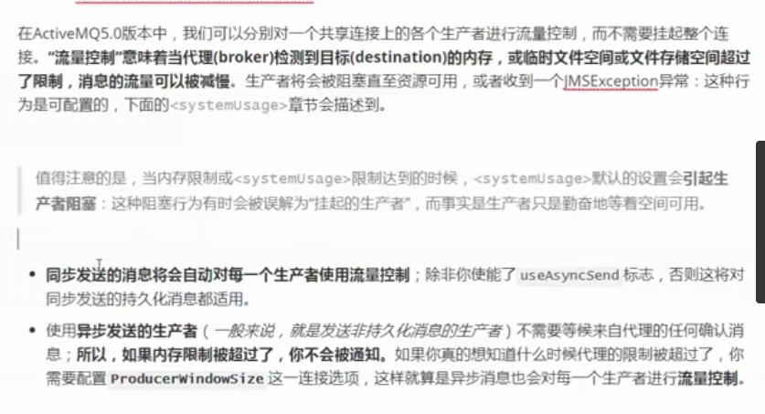

## ActiveMQ

### 一、JMS 介绍

- JMS 是什么？

  是消息发送和接收的一套规范

- JMS 的角色

  生产者、消费者、MOM 消息中间件（比如：ActiveMQ）

- JMS 作用

  异步通讯，完成程序之间的解耦

- JMS 消息模型

  点对点模型：只能一个取，消息的生产和消费没有时间上的相关性（消费者在消息产生之后能也获取消息）

  发布订阅模型：可以多个人取，类似广播模式，消息的生产和消费有时间上的相关性（消费者在消息产生之后不能获取消息）

- JMS 消息域

  Queue Region 和 Topic Region

- JMS 目的地

  Queue 目的地、Topic 目的地

- JMS 消息正文

  Stream、Map、Text、Byte、Object

### 二、下载与安装 ActiveMQ

> 前提条件，需要先安装 jdk

```bash
# 下载
wget https://mirrors.tuna.tsinghua.edu.cn/apache//activemq/5.15.9/apache-activemq-5.15.9-bin.tar.gz

# 解压缩
tar -zxvf apache-activemq-5.15.9-bin.tar.gz

# 进入 bin 目录，启动
./activemq start
```

通过浏览器访问控制台（IP 地址更换为 ActiveMQ 服务器所在的 IP ，访问不到可以关掉防火墙）
http://192.168.101.104:8161/admin

用户名密码都是 admin

### 三、ActiveMQ常用接口

生产者：

```java
public class Producer {

    public static void main(String[] args) throws Exception {
        String broker = "tcp://192.168.101.104:61616";
        Connection connection = null;
        Session session = null;
        try {
            // 1. 创建 Connection  工厂用于连接 broker
            ConnectionFactory connectionFactory = new ActiveMQConnectionFactory(broker);

            // 2. 创建并且启动连接
            connection = connectionFactory.createConnection();
            connection.start();

            // 3. 创建 session
            // 第一个参数表示是否开启事务，第一个参数为 true, 第二个参数无效
            // 第二个参数表示指定的应答模式
            session = connection.createSession(false, Session.AUTO_ACKNOWLEDGE);

            // 4. 通过 session 创建 destination
            Queue queue = session.createQueue("kkb_queue");
			// Topic topic = session.createTopic("kkb_queue");
            
            // 5. 创建 producer
            MessageProducer producer = session.createProducer(queue);

            // 6. 创建 message，并发送
            Message message = session.createTextMessage("你有男朋友吗？");
            producer.send(message);
        } catch (Exception e) {
            e.printStackTrace();
        } finally {
            connection.close();
            session.close();
        }
    }
}
```

消费者：

```java
public class Consumer {
    public static void main(String[] args) throws Exception {
        String broker = "tcp://192.168.101.104:61616";
        Connection connection = null;
        Session session = null;
        try {
            // 1. 创建 Connection  工厂用于连接 broker
            ConnectionFactory connectionFactory = new ActiveMQConnectionFactory(broker);

            // 2. 创建并且启动连接
            connection = connectionFactory.createConnection();
            connection.start();

            // 3. 创建 session
            // 第一个参数表示是否开启事务，第一个参数为 true, 第二个参数无效
            // 第二个参数表示指定的应答模式
            session = connection.createSession(false, Session.AUTO_ACKNOWLEDGE);

            // 4. 通过 session 创建 destination
            Queue queue = session.createQueue("kkb_queue");
			// Topic topic = session.createTopic("kkb_queue");
            
            // 5. 创建 producer
            MessageConsumer consumer = session.createConsumer(queue);

            // 6. 接收消息
            // 一种是使用 receive 接收, 同步消息，没有收到消息会阻塞
            // Message message = consumer.receive(1000);
            // 一种是使用监听器，异步消息，没有收到消息不会阻塞
            consumer.setMessageListener(new MessageListener() {
                @Override
                public void onMessage(Message message) {
                    if (message instanceof TextMessage) {
                        TextMessage tm = (TextMessage) message;
                        try {
                            System.out.println(tm.getText());
                        } catch (JMSException e) {
                            e.printStackTrace();
                        }
                    }
                }
            });
        } catch (Exception e) {
            e.printStackTrace();
        } finally {
            connection.close();
            session.close();
        }
    }
}
```

也可以自己新建一个 broker，那么这个 broker 就和 远程服务器ActiveMQ 没有关系了，可以使用消费者和生产者连接这个 broker

```java
public class Broker {
    public static void main(String[] args) {
        try {
            BrokerService service = new BrokerService();
            service.setUseJmx(true);
            service.addConnector("tcp://localhost:61616");
            service.start();
        } catch (Exception e) {
            e.printStackTrace();
        }
    }
}
```

### 四、JMS 事务


生产者发送应答消息给 Broker 是为了数据持久化

消费则发送应答消息给 Broker 是为了删除数据

应答消息分为四种：

指定事务（1种）：

SESSION_TRANSACTED：开启事务之后，使用该应用模式，需要执行 commit 进行消息应答

不指定事务（3种）：
AUTO_ACKNOWLEDGE：调用 send 方法之后，自动完成消息应答

CLIENT_ACKNOWLEDGE：需要生产者或消费者使用 acknowledge 完成手动应答

DUPS_OK_ACKNOWLEDGE：当接收消息数量到达一定阈值之后，通过一个 ACK 指令把它们自动全部确认


事务的作用：组合消息， commit 和 rollback


### 五、消息生产者处理

- 持久传输非持久传输

  当生产者宕机，如果消息未持久化，消息在内存，消息会丢失；如果持久化，消息在硬盘上不会丢失

  ```java
  // 改为非持久化方式
  producer.setDevieryMode(DevieryMode.NON_PERSISTENCE)；
  ```

- 消息同步发送和异步发送

  在不考虑事务的前提下：

  1. producer  同步发送，发送是阻塞的（sned 方法），直到收到确认
  2. producer 发送非持久化消息默认是异步发送，异步发送不会等待 broker 的确认

  设置发送方式：

  ```java
  // 通过 ActiveMQConnectionFactory 指定
  cf = new ActiveMQConnectionFactory("tcp://localhost:61616?jms.useAsycSend=true")  
      
  // 调用 ActiveMQConnectionFactory API
  ((ActiveMQConnectionFactory)connectionFactory).setUseAsyncSend(true);
  
  // 实例化对象中异步发送
  (ActiveMQConnection(connection)).setUseAsyncSend(true);
  ```

  异步发送优缺点：

  优点：生产者不阻塞


  缺点：消息可能丢失（broker 挂了）；可能出现宕机（如果生产快，消费慢，broker 内存可能占满）

- 生产者流量控制

  > 生产者开启异步发送模式时，为了控制生产者的消费流量，在生产者这边设置一个窗口大小，单位是 Bytes，当超过该大小，生产者处于阻塞状态，不能继续发送消息到 broker

  

  

  

  

- 如何提高消息发送效率
  

  

  提高效率

  1. 消息持久化

     

  2. 消息属性

     

  3. 异步发送

     

  4. 事务

     

  5. 提高消费者消费速率

     

  6. 选择合适的存储器

     

### 六、Broker Server 处理

#### 流量控制

设定指定队列和主题失效


生效内存限制


#### 配置生产者客户端的异常


> 比上面方法好，因为多了一个缓冲时间


#### 系统占用


#### 解决消费慢及无法消费的问题


#### 消息定时删除（重点）


有队记录，会被清理掉

#### 持久化存储方式

​	


 datalog 、 metadata cache 、metadata store

注意：AciveMQ默认的存放方式就是 kahaDB

#### 

####  2. 基于内存存储


#### 3. JDBC 存储文件

第一步：

> 在 lib 下加入 mysq 和 dbcp 驱动 jar


##### 第三部 配置在 数据库连接

> 在 broker 外配置数据库连接


#### 4.JDBC Message store with ActiveMQ journal  ---- 优化了 JDBC 的存储方案

- 在 ActiveMQ 和数据库之间，又利用了日志文件进行缓存，对于消费快的直接放到日志中，消费慢的放到数据库中

#### 5. LevelDb


#### 传输协议

ActiveMQ 支持的传输协议有多种：TCP、UDP、NIO(基于TCP)、SSL、HTTP、HTTPS、VM


​	

​	


可以看出，修改配置很简单，其他协议都是一样的修改

### 七、消息消费者处理


 


ACK 模型：前面讲过的四种

应答类型


 如果 ACK 类型是 3，重发就是下面的重发机制


### 同步接收和异步接收

> 同步可以 pull 和 push，异步只能 push
>
> 这里说的 pull 和 push 是 broker 的 操作


### ActivateMQ 集群


生产者


### Spring 整合 ActivateMQ