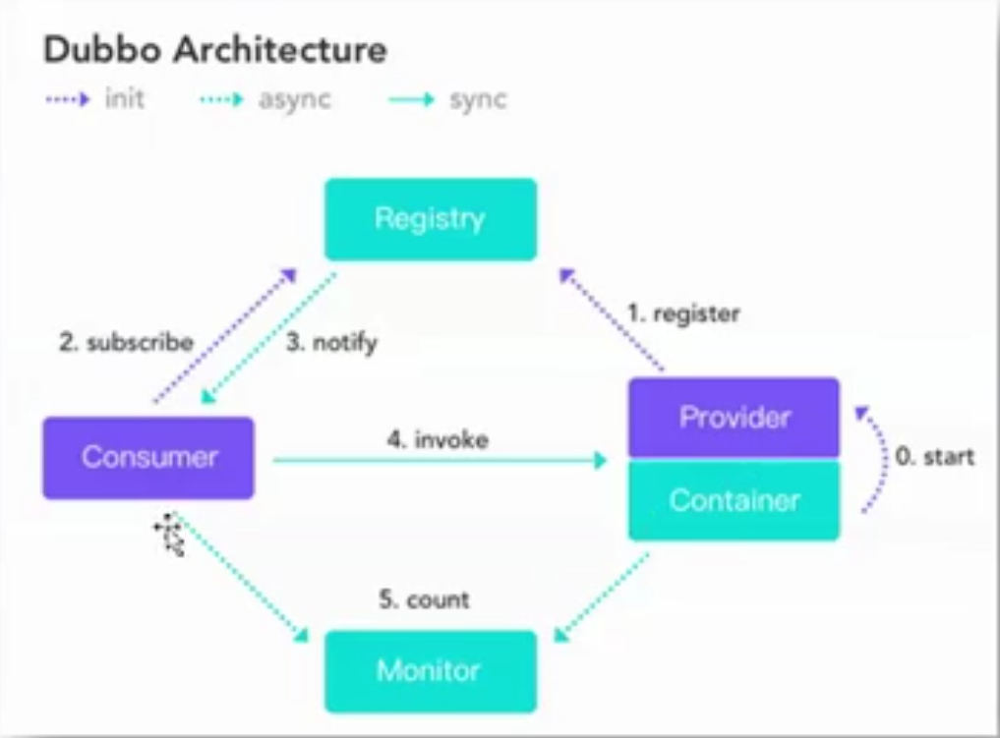
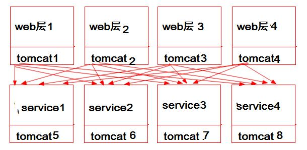
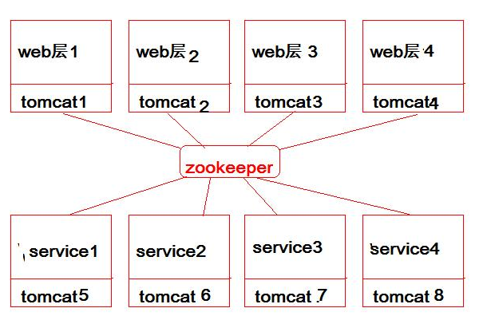
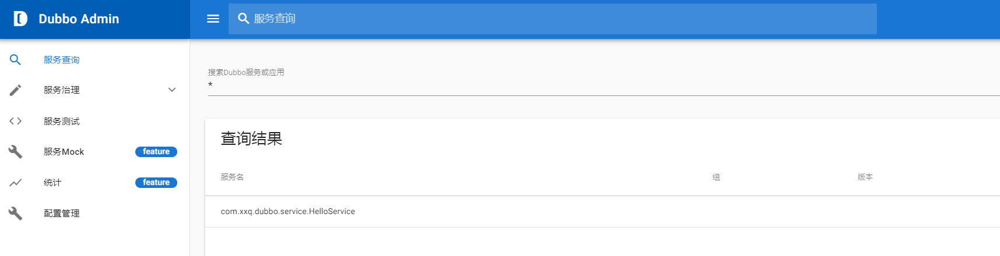

## 分布式 RPC 系统框架 Dubbo

### Dubbo 概述

####  系统架构设计的关键点

1. 水平应用架构

   当网站流量很小时，只需一个应用，将所有的功能都部署在一起，以减少节点和成本，当流量增加时通过搭建集群增加主机的水平扩展方式就可以提升整个系统的性能。此时，用于简化增删改查工作量的数据访问框架是关键。

2. 垂直应用架构

   当访问量逐渐增大，单一应用的水平扩展，其所带来的速度提升越来越小。此时，可以将所有应用拆成互不相干的几个应用，以提升效率。这时用于加速前端页面开发的 Web 框架是关键。

3. 分布式服务框架

   当垂直应用越来越多，应用之间的交互是不可避免的。这时将核心业务抽取出来作为独立的服务，逐渐形成稳定的**服务中心**，使前端应用能更快速的响应多变的市场需求。此时用于提高业务复用及整合的分布式框架是关键

4. 流动计算框架

   当服务越来越多，容量的评估（主机能支撑的特定服务的能力称为容量）、小服务资源的浪费问题逐渐显现，此时增加一个调度中心，使其基于访问压力实时管理集群容量，提高集群利用率，此时用于提高机器利用率的资源调度和自理中心是关键

使用多个独立的工程实现的系统架构，称为 SOA 系统架构（Service Oriented Architecture,  即面向服务的系统架构），各个工程之间的通信使用 RPC（远程过程调用）

其实 RPC 底层就是通过 Socket 实现的，只要知道主机名和端口号，就可以通过网络连接上，而无需知道底层怎样实现的通信

网址：<http://dubbo.apache.org/zh-cn/>

#### Duubo四大组件



#### Duubo 三大领域模型

Protocol 服务域：是 Invoker 暴露和引入的主功能入口，它负责 Invoker 的生命周期管理

Invoker 实体域：是 Double 的核心模型，其他模型都向它靠拢，或转换成它，它代表一个可执行实体，可想它发起 invoke  调用，它有可能是一个本地实现，也可能是一个远程的执行体，有可能是一个集群。

Invocation 会话域：它持有调用过程中多的变量，比如方法名，参数等、

#### Duubo 整体架构

Busniess 服务层

PRC

Remoting 层

#### 为什么需要服务注册中心？

> 解耦合

当没有注册中心的时候



当时用服务注册中心的时候



### Dubble 核心用法

#### 基本环境搭建

搭建 zookeeper 单机或集群（没有zookeeper 也是可以的，即没有服务注册中心）

添加依赖(服务端和消费端一致)

```xml
<dependencies>
    <dependency>
        <groupId>com.kaikeba</groupId>
        <artifactId>10-common</artifactId>
        <version>1.0-SNAPSHOT</version>
    </dependency>

    <!--添加 Dubbo 依赖-->
    <dependency>
        <groupId>com.alibaba</groupId>
        <artifactId>dubbo</artifactId>
        <version>2.5.9</version>
    </dependency>

    <!--添加 Spring 依赖-->
    <dependency>
        <groupId>org.springframework</groupId>
        <artifactId>spring-beans</artifactId>
        <version>${spring-version}</version>
    </dependency>
    <dependency>
        <groupId>org.springframework</groupId>
        <artifactId>spring-core</artifactId>
        <version>${spring-version}</version>
    </dependency>
    <dependency>
        <groupId>org.springframework</groupId>
        <artifactId>spring-context</artifactId>
        <version>${spring-version}</version>
    </dependency>
    <dependency>
        <groupId>org.springframework</groupId>
        <artifactId>spring-aop</artifactId>
        <version>${spring-version}</version>
    </dependency>
    <dependency>
        <groupId>org.springframework</groupId>
        <artifactId>spring-aspects</artifactId>
        <version>${spring-version}</version>
    </dependency>
    <dependency>
        <groupId>org.springframework</groupId>
        <artifactId>spring-tx</artifactId>
        <version>${spring-version}</version>
    </dependency>
    <dependency>
        <groupId>org.springframework</groupId>
        <artifactId>spring-jdbc</artifactId>
        <version>${spring-version}</version>
    </dependency>
	
    <!--zookeeper client-->
    <dependency>
        <groupId>com.github.sgroschupf</groupId>
        <artifactId>zkclient</artifactId>
        <version>0.1</version>
    </dependency>
</dependencies>
```

provider（服务提供端）

```xml
<?xml version="1.0" encoding="UTF-8"?>
<beans xmlns="http://www.springframework.org/schema/beans"
       xmlns:xsi="http://www.w3.org/2001/XMLSchema-instance"
       xmlns:dubbo="http://code.alibabatech.com/schema/dubbo"
       xsi:schemaLocation="http://www.springframework.org/schema/beans
       http://www.springframework.org/schema/beans/spring-beans.xsd
       http://code.alibabatech.com/schema/dubbo
       http://code.alibabatech.com/schema/dubbo/dubbo.xsd">
    <!--当前工程名称，该名称将在监控平台使用-->
    <dubbo:application name="01-first-provider"/>

    <!--注册 Service，其就是真正的服务提者-->
    <bean id="someService" class="com.kaikeba.service.SomeServiceImpl"/>

    <!--暴露服务，使用直连的方式，不使用注册中心-->
    <!--registry="N/A" 不注册到注册中心-->
    <!--<dubbo:service interface="com.kaikeba.service.SomeService"
                   ref="someService"
                   registry="N/A"/>

    <!--声明 zk 服务中心, 单机 zk-->
    <!--<dubbo:registry address="zookeeper://localhost:2181"/>-->

    <!--声明 zk 服务中心, 集群 zk-->
    <dubbo:registry address="zookeeper://zkOS1:2181?backup=zkOS2:2181,zkOS3:2181"/>

    <!--暴露服务，使用直连的方式-->
    <dubbo:service interface="com.kaikeba.service.SomeService"
                   ref="someService"/>
</beans>
```

```java
public class SomeServiceImpl implements SomeService {
    @Override
    public String hello(String name) {
        System.out.println("Hello Dubbo");
        return "kaikeba";
    }
}
```

测试

```java
public class RunProvider {
    public static void main(String[] args) throws IOException {
        // 创建 Spring 容器
        ApplicationContext ac = new ClassPathXmlApplicationContext("spring-dubbo-provider.xml");

        // 启动 Spring 容器
        ((ClassPathXmlApplicationContext )ac).start();

        // 阻塞主线程
        System.in.read();
    }
}
```

consumner（服务消费端）

> Dubbo 声明式缓存
>
> 为了减轻提供者的压力，在消费者端添加缓存，因为缓存是基于消费者的，所以很简单，和提供者没关系
>
> 缓存适用于结果变化不大，或不变化的数据
>
> double 提供了三种结果缓存机制：
>
> - lru：服务级别缓存的**默认机制**，该机制默认可以缓存 1000 个结果，若超出 1000，将采用最近最少使用原则来删除缓存，以保证最热的数据被缓存
> - treadlocal：当前线层缓存。当多个线程要对当前线程进行某一操作时，首先需要查询当前线程的某个消息，通过线程缓存，则可有效减少查询
> - jcache：可以桥接各种缓存实现，即第三方缓存产品

```xml
<?xml version="1.0" encoding="UTF-8"?>
<beans xmlns="http://www.springframework.org/schema/beans"
       xmlns:xsi="http://www.w3.org/2001/XMLSchema-instance"
       xmlns:dubbo="http://code.alibabatech.com/schema/dubbo"
       xsi:schemaLocation="http://www.springframework.org/schema/beans
       http://www.springframework.org/schema/beans/spring-beans.xsd
       http://code.alibabatech.com/schema/dubbo
       http://code.alibabatech.com/schema/dubbo/dubbo.xsd">

    <!--当前工程的名称，监控中心使用-->
    <dubbo:application name="01-first-consumer"/>

    <!--声明 zk 服务中心， 单机 zk-->
    <!--<dubbo:registry address="zookeeper://localhost:2181"/>-->

    <!--声明 zk 服务中心, 集群 zk-->
    <dubbo:registry address="zookeeper://zkOS1:2181?backup=zkOS2:2181,zkOS3:2181"/>
    
    <!--消费引用，默认端口是 20800，不使用注册中心-->
    <!--<dubbo:reference id="someService"
                     interface="com.kaikeba.service.SomeService"
                     url="dubbo://localhost:20880"/>-->
    
    <!--消费引用，无缓存-->
    <!--<dubbo:reference id="someService"
        interface="com.kaikeba.service.SomeService"/>-->

    <!--消费引用，基于服务级别的声明式缓存（结果缓存）-->
    <!--<dubbo:reference id="someService”
              cache="true"
              interface="com.kaikeba.service.SomeService"/>-->
    
    <!--消费引用，声明基于方法级别的缓存-->
    <dubbo:reference id="someService"
                     interface="com.kaikeba.service.SomeService">
        <dubbo:method name="hello" cache="lru"></dubbo:method>
    </dubbo:reference>
</beans>
```

```java
public static void main(String[] args) {
        ApplicationContext ac = new ClassPathXmlApplicationContext("spring-dubbo-consumer.xml");
        SomeService someService = (SomeService) ac.getBean("someService");
        someService.hello("good");
}
```

测试

```java
public class RunConsumer {

    public static void main(String[] args) {
        ApplicationContext ac = new ClassPathXmlApplicationContext("spring-dubbo-consumer.xml");
        SomeService someService = (SomeService) ac.getBean("someService");
        someService.hello("good");
    }
}
```

#### 多版本控制

> 当系统进行升级时，一般都是采用 “灰度发布"（又称为金丝雀发布）过程。即在低压力时段，让部分消费者先调用新的提供者实现类，其余的仍然调用老的实现类，在部分消费者新的实现类运行没有问题的情况下，逐步让所有消费者全部调用成新的实现类。多版本控制就是实现灰度发布的

provider

```xml
<!--两个 SomeService 实现类，一个是新的，一个是旧的-->
<bean id="newService" class="com.kaikeba.service.OldSomeServiceImpl"/>
<bean id="oldService" class="com.kaikeba.service.NewSomeServiceImpl"/>

<!--同时暴露两个服务，一个是新的，一个是旧的-->
<dubbo:service interface="com.kaikeba.service.SomeService" ref="newService" version="0.0.1"/>
<dubbo:service interface="com.kaikeba.service.SomeService" ref="oldService" version="0.0.2"/>
```

consumer

```xml
<!--旧的版本-->
<!--<dubbo:reference id="someService" interface="com.kaikeba.service.SomeService" version="0.0.1"/>-->

<!--新的版本-->
<dubbo:reference id="someService" interface="com.kaikeba.service.SomeService" version="0.0.1"/>
```

#### 服务分组

> 当一个接口有多个实现类的时候可用使用 group 分组
>
> 因为使用的是一个接口的实现，为了区分所有需要使用分组

provider

```xml
<!--两个 SomeService 实现类-->
<bean id="someService1" class="com.kaikeba.service.SomeServiceImpl1"/>
<bean id="someService2" class="com.kaikeba.service.SomeServiceImpl2"/>

<!--使用 group 作为区分-->
<dubbo:service interface="com.kaikeba.service.SomeService" ref="newService" group="g1"/>
<dubbo:service interface="com.kaikeba.service.SomeService" ref="oldService" group="g2"/>
```

consumer

```xml
<dubbo:reference 
   id="someService1"
   interface="com.kaikeba.service.SomeService"
   group="g1"/>

<dubbo:reference
   id="someService2"
   interface="com.kaikeba.service.SomeService"
   group="g2"/>
```

#### 服务暴露延迟

> 因为有的服务启动需要一些时间，如果 Spring 还没有启动完成就注册到 zookeeper ，当消费者调用的时候会出问题，所以可以设置一个暴露延迟时间 delay，当然：使用在服务端

```xml
<!--延迟 5 秒-->
<dubbo:service interface="com.kaikeba.service.SomeService" ref="someService" delay="5000"/>

<!-- -1 表示 Spring 初始化完毕再暴露-->
<dubbo:service interface="com.kaikeba.service.SomeService" ref="someService" delay="-1"/>
```

#### 同一个服务注册到两个中心

provider

```xml
<!--声明两个注册中心-->
<dubbo:registry id="bjCenter" address="zookeeper://bjzk:2181"/>
<dubbo:registry id="shCenter" address="zookeeper://shzk:2181"/>

<!--暴露服务，registry 注册到两个中心-->
<dubbo:service interface="com.kaikeba.service.SomeService" ref="someService" registry="bjCenter,shCenter"/>
```

#### 同一个服务引用自不同的中心

> 同一个消费者需要调用两个不同中心的服务，而调用的该服务的名称（接口）、版本等都是相同的，不同中心的这个相同名称的服务调用的是不同数据库中的数据，即相同的服务最终执行的结果是不同的，当然：只在消费端使用

```xml
<!--声明两个注册中心-->
<dubbo:registry id="bjCenter" address="zookeeper://bjzk:2181"/>
<dubbo:registry id="shCenter" address="zookeeper://shzk:2181"/>

<!--分别从两个中心取出实现类-->
<dubbo:reference id="someService1"
                 interface="com.kaikeba.service.SomeService"
                  registry="bjCenter"/>
<dubbo:reference id="someService2"
                 interface="com.kaikeba.service.SomeService"
                 registry="shCenter"/>
```

#### 多协议支持

> 前述的提供者和消费者连接到 zookeeper 的协议是 zookeeper 协议，但是消费者和提供者的协议是别的协议，默认为 dubbo 服务暴露协议，dubbo 服务暴露协议适用于小数据量大并发的服务调用，以及服务消费者主机数远大于服务提供者主机数的情况
>
> 除了默认提供的 Dubbo 服务暴露协议之外，还有另外七种协议：Hession 协议、Http 协议、RMI 协议、WebService 协议、Thrift 协议、Memcached 协议、Redis 协议，但在实际生产中用得最多的就是 Dubbo 协议

```xml
<!--声明两个服务暴露协议-->
<dubbo:protocol name="rmi" port="20880"></dubbo:protocol>
<dubbo:protocol name="dubbo" port="20881"></dubbo:protocol>

<!--服务暴露，指定服务的调用协议-->
<dubbo:service interface="com.kaikeba.service.SomeService" ref="someService"
 registry="bjCenter,shCenter" protocol="rmi"/>
```

#### Dubbo 的高级设置建议

在 Provider 上尽量多配置 Consumer 端属性，因为 **服务端 更了解自己**

>  timeout：远程服务调用超时时限
>
> retries：失败重试次数，默认 2
>
> loadbalance：负载均衡算法，默认是随机，还可以有轮询 roundrobin，最不活跃优先 leastactive 等
>
> actives：消费者最大并发调用限制，即 Consumer 调用的最大并发数，若达到最大，新的调用将被阻塞 0 表示不受限制
>
> 注意：以上的属性可以也可以加在方法上

```xml
<dubbo:service interface="com.kaikeba.service.SomeService"
               ref="someService"
               timeout="300" 
               retries="2"
               loadbalance="random"
               actives="5">
    <dubbo:method name="hello" timeout="300"/>
</dubbo:service>
```

在 Provider 上配置合理的属性

> threads：用于指定服务线程池大小，控制系统提供服务的最大线程数
>
> executes：限制某个 dubbo 服务的最大线程数

```xml
<dubbo:protocol name="dubbo" port="20880" threads="300"/>
<dubbo:service interface="com.kaikeba.service.SomeService" ref="someService" executes="100">
```

### Dubbo 在 Spring Boot 的使用

dubbo 的 github 地址：<https://github.com/alibaba/dubbo-spring-boot-starter>

#### 创建 common 工程

> 作为 provider 和 consumer 的公共的接口，是一个 maven 项目

```java
public interface EmployeeService {
    void saveEmployee(Employee employee);
    Employee findEmployeeById(Integer id);
    Integer findEmployeeCount();
}
```

#### 服务端

1. 添加 zkClient 依赖、Dubbo 与  Spring Boot 整合依赖、 common 工程依赖

   ```xml
   <dependencies>
       <!--web 依赖可以不要-->
       <dependency>
            <groupId>org.springframework.boot</groupId>
            <artifactId>spring-boot-starter-web</artifactId>
        </dependency>
       
       <dependency>
           <groupId>org.springframework.boot</groupId>
           <artifactId>spring-boot-starter</artifactId>
       </dependency>
   
       <dependency>
           <groupId>org.springframework.boot</groupId>
           <artifactId>spring-boot-starter-test</artifactId>
           <scope>test</scope>
       </dependency>
   	
       <!--公共接口-->
       <dependency>
           <groupId>com.xxq.dubbo</groupId>
           <artifactId>common</artifactId>
           <version>1.0-SNAPSHOT</version>
       </dependency>
   	
       <!--springboot 整合 dubbo 依赖-->
       <dependency>
           <groupId>com.alibaba.boot</groupId>
           <artifactId>dubbo-spring-boot-starter</artifactId>
           <version>0.2.0</version>
       </dependency>
   </dependencies>
   ```

2. 主配置文件中添加 Dubbo 相关属性

   ```properties
   dubbo.application.name=user-service-provider
   
   #注册中心的协议和地址
   dubbo.registry.protocol=zookeeper
   dubbo.registry.address=127.0.0.1:2181
   
   #通信规则（通信协议和接口）
   dubbo.protocol.name=dubbo
   dubbo.protocol.port=20880
   
   #连接监控中心
   dubbo.monitor.protocol=registry
   ```

3. 主方法上 `@EnableDubbo ` 注解 ，开启 Dubbo 自动配置

4. Service 实现类上添加注解

   ```java
   @Service //  Dubbo 包中的（import com.alibaba.dubbo.config.annotation.Service）
   @Component // Spring  包中的
   public class HelloServiceImpl implements HelloService {
       @Override
       public String sayHello(String name) {
           return name + "!";
       }
   }
   ```

5. 启动

#### 消费端

1. 添加 zkClient 依赖、Dubbo 与 Spring Bootg 整合依赖 common 工程依赖

   > 和 provider 一致

2. 主配置文件中添加 Dubbo 相关属性

   ```properties
   server.port=8887
   server.servlet.context-path=/
   
   ## dubbo springboot 配置
   #当前服务/应用的名字
   dubbo.application.name=user-service-provider
   
   #注册中心的协议和地址
   dubbo.registry.protocol=zookeeper
   dubbo.registry.address=127.0.0.1:2181
   
   #通信规则（通信协议和接口）
   dubbo.protocol.name=dubbo
   dubbo.protocol.port=20880
   
   #连接监控中心
   dubbo.monitor.protocol=registry
   ```

3. 主方法上 `@EnableDubbo`注解 ，开启 Dubbo 自动配置

4. 在需要的地方注入对象

   ```java
   @RestController
   public class HelloController {
   
       // 对象注入
       @Reference
       HelloService helloService;
   
       @RequestMapping("say")
       public String asy(String name) {
           return helloService.sayHello(name);
       }
   }
   ```

5. 启动

### Dubbo 监控平台

源码地址：<https://github.com/apache/dubbo-admin>

下载源码按照官方文档的操作就可以了，很简单。。。




