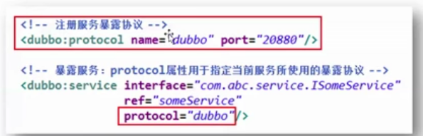

## 分布式 RPC 系统框架 Dubbo

### 1. Dubbo 概述

##### 1.1 系统架构设计的关键点

1. 水平应用架构

   当网站流量很小时，只需一个应用，将所有的功能都部署在一起，以减少节点和成本，当流量增加时通过搭建集群增肌主机的水平扩展方式就可以提升整个系统的性能。此时，用于简化增删改查工作量的数据访问框架是关键。

2. 垂直应用架构

   当访问量逐渐增大，单一应用的水平扩展，其所带来的速度提升越来越小。此时，可以将所有应用拆成互不相干的几个应用，以提升效率。这时用于加速前端页面开发的 Web 框架是关键。

3. 分布式服务框架

   当垂直应用越来越多，应用之间的交互是不可避免的。这时将核心业务抽取出来作为独立的服务，逐渐形成稳定的服务中心，使前端应用能更快速的响应多变的市场需求。此时用于提高业务服用及整合的分布式框架是关键

4. 流动计算框架

   当服务越来越多，容量的评估（主机能支撑的特定服务的能力称为容量）、小服务资源的浪费问题逐渐显现，此时增加一个调度中心，此时需增加一个调度中心，使其基于访问压力实时管理集群容量，提高集群利用率，此时用于提高机器利用率的资源调度和自理中心是关键。


使用多个独立的工程实现的系统架构，称为 SOA 系统架构（Service Oriented Architecture,  即面向对象的系统架构），各个工程之间的通信使用 PRC（远程过程调用）

其实 RPC 底层就是通过 Socket 实现的，只要知道主机名和端口号，就可以通过网络连接上，而无需知道底层怎样实现的通信。

#### 1.2 Dubbo 简介

网址：<http://dubbo.apache.org/zh-cn/>

#### 1.3 Duubo四大组件


#### 1.4 Duubo 三大领域模型

Protocol 服务域

Invoker 实体域

Invocation 会话域


#### 1.5 Duubo 两大设计原则

 

#### 1.6 Duubo 整体架构

Busniess 服务层

PRC    

Remoting 层


#### 2. Dubble 核心用法

1. 第一个 Dubbo 核心用法（无注册中心）

2. Zookeeper 注册中心

3. Zookeeper 集群注册中心

4. Dubbo 声明式缓存

   为了减轻提供者的压力，在消费者端添加缓存，因为缓存是基于消费者的，所以很简单，和提供者没关系。

   

   不能使用在如下场景

   因为缓存没有时效性，当修改提供者的数据，如果缓存空间没满，则消费者数据始终不会变。所以适用于查询结果不变的场景。

5. 多版本控制

6. 服务分组

7. 服务暴露延迟

   提供者一方

   因为有的服务启动需要一些时间，如果启动完成之后再向外暴露，可以设置一个暴露延迟时间 delay

   ， -1 表示 Spring  初始化完毕再暴露

8. 同一个服务注册到两个中心

   

9. 同一个服务引用自不同的中心

   

10. 多协议支持

    一般不用指定

    

    ​	

10. Dubbo 的高级设置建议

    在 Provider 上尽量多配置 Consumer 端属性，因为 服务端 更了解自己。

    

    ​                      actives:0 , 表示不受限制

    在 Provider 上配置合理的 Provider 属性

    ​	


12. Duboo 在 Spring Boot 的使用

    依赖下载地址：www.github.com/alibaba/dubbo-spring-boot

    创建 common 工程

    服务端：

    1. 添加 zkClient 依赖、Dubbo 与 Spring Bootg 整合依赖 common 工程依赖

    2. 主配置文件中添加 Dubbo 相关属性

       ```properties
       spring.application.name=16-provider-servicedata
       spring.dubbo.registry=zookeeper://localhost:2181
       ```

    3. 主方法上添加注解：@EnableDubboConfig  // 开启 Dubbo 自动配置

    4. Service 实现类上添加注解

       @Service //  Dubbo 包中的
       @Component // Spring  包中的

       

    消费端：

    1. 添加 zkClient 依赖、Dubbo 与 Spring Bootg 整合依赖 common 工程依赖

    2. 主配置文件中添加 Dubbo 相关属性

       ```
       spring.application.name=16-provider-servicedata
       spring.dubbo.registry=zookeeper://localhost:2181
       ```

    3. 主方法上添加注解：@EnableDubboConfig  // 开启 Dubbo 自动配置

    4. 处理器 Service 注入添加注解  @Reference （spring mvc 使用的是 @Autowired）

13. 

    


