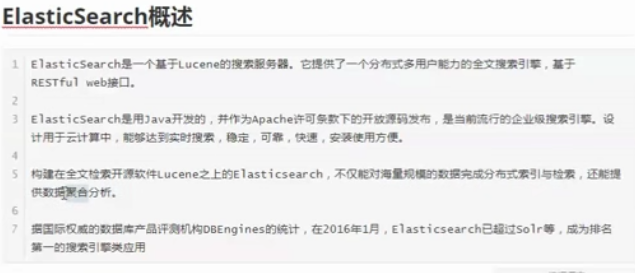
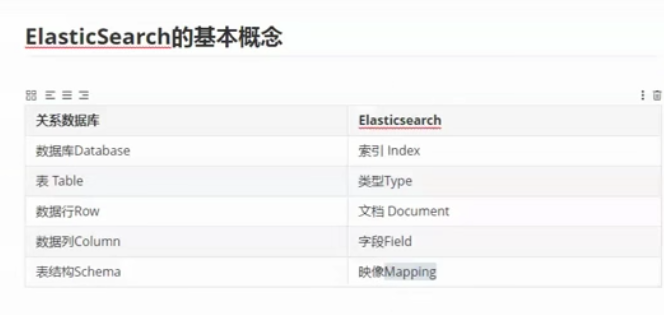
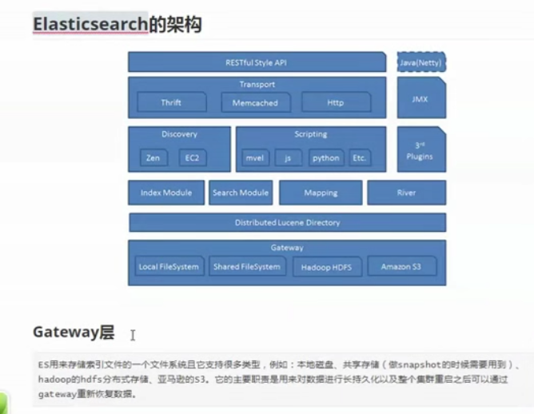
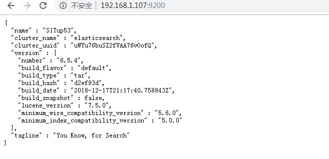
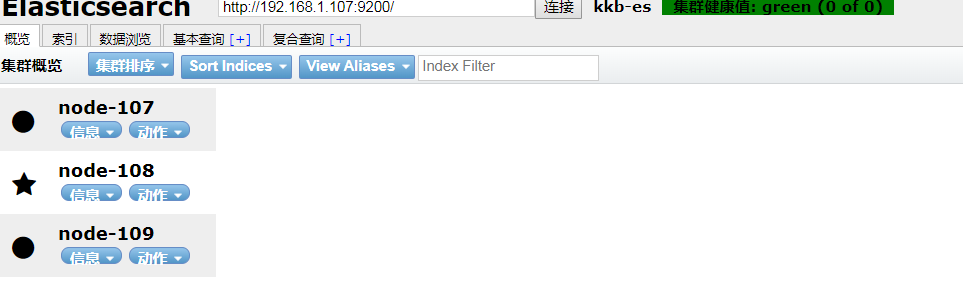
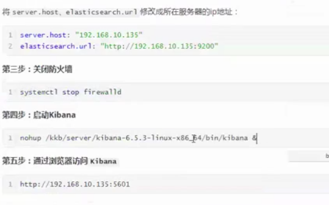
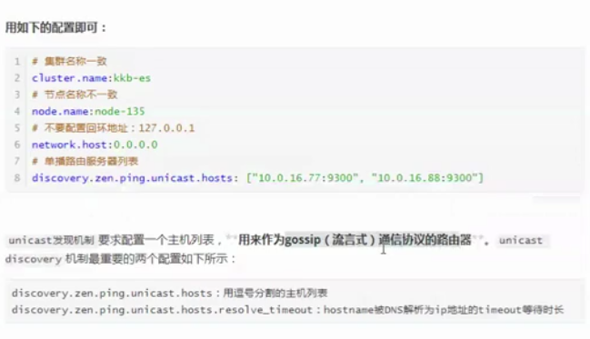

# ES

介绍



​	



ES 架构



​	


​	

## 安装


elastic-search--ik-analyzer

kibana

#### 安装单机版

>  JDK 不要安装在 root 目录下，因为启动的时候不能使用 root 账号启动

```bash
# 安装 jdk 
# 略

# 下载 elasticsearch，解压
wget https://artifacts.elastic.co/downloads/elasticsearch/elasticsearch-6.5.3.tar.gz
tar -zxvf elasticsearch-6.5.3.tar.gz -C  /usr/local/kkb

# 配置远程访问
vim /usr/local/kkb/elasticsearch/config/elasticsearch.yml
# 设置如下属性(或为本地 ip)
network.port: 0.0.0.0

# 设置进程可以拥有的 VMA(虚拟内存区域的)数量（？）
vim /etc/sysctl.conf
# 添加如下内容
vm.max_map_count=655360
# 生效配置文件
sysctl -p

# 修改允许打开的最大文件描述符常量（？）
vim /etc/security/limits.conf
# 添加以下内容
esuser soft nofile 65536
esuser hard nofile 65536
esuser soft nproc 4096
esuser hard nproc 4096

# 创建用户和组， 不能使用
groupadd esgroup
useradd esuser -g esgroup -p 123456
# 更改 elasticsearch 文件的所属用户和组
chown -R esuser:esgroup /usr/local/kkb/elasticsearch-6.5.4
# 切换到 esuser
su esuser

# 因为 es 有缓存机制，比较吃内存，启动之前根据服务器大小，修改一下 jvm.options，默认为 1g
vim /usr/local/kkb/elasticsearch-6.5.4/config/jvm.options
# 修改如下配置
-Xms512m
-Xmx512m

# 前端启动，ctrl c 就关闭了
/usr/local/kkb/elasticsearch-6.5.4/bin/elasticsearch
# 后端启动（后端运行，推荐）
/usr/local/kkb/elasticsearch-6.5.4/bin/elasticsearch -d
```

访问（IP 为服务器的 IP）



#### 集群版安装


​		


​						最后一个是：配置跨域访问


配置每台服务器的 elasticsearch.conf

```yaml
# 集群名称，唯一
cluster.name: kkb-es

# 节点名称不同
node.name: node-135

# 是否可以参与竞选 master
node.master: true

# 是否是数据节点
node.data: true

# 节点将绑定到此主机名或 IP 地址，设置成 0.0.0.0 为当前主机，允许 ip 映射访问
network.host: 0.0.0.0

# http 访问端口
http.port: 9200

# tcp 访问端口（集群服务器之间是通过 tcp 访问的）
transport.tcp.port: 9300

# 自动发现的路由节点
discovery.zen.ping.unicast.hosts:
["192.168.1.107:9300", "192.168.1.108:9300", "192.168.1.109:9300"]

# 集群中最小主机节点数，防止脑裂
discovery.zen.minimum_master_nodes: 2

# head 跨域访问
http.cors.enabled: true
http.cors.allow-origin: "*"

# 
node.max_local_storage_nodes: 2
```

启动服务

```bash
/usr/local/kkb/elasticsearch-6.5.4/bin/elasticsearch -d
```

> 查看集群状态

```bash
curl -i -XGET -H 'Content-Type: application/json' 'http://192.168.1.107:9200/_cat/health?v' 
```


#### 安装 head 插件

> 可以进行独立安装在一台服务器上或集群中一台机器上

```bash
# 安装 npm，添加淘宝镜像
yum install -y epel-release
yum install -y nodejs npm
npm install -g cnpm --registry=https://registry.npm.taobao.org

# 下载 git
yum install -y git
git clone git://github.com/mobz/elasticsearch-head.git

# 安装 head
cd /usr/local/kkb/elasticsearch-head
cnpm install

# 将 grunt 加入环境变量
cnpm install -g grunt-cli
```

修改  elastic-head/Gruntfile.js 配置文件


修改  elastic-head/_sites/app.js 配置文件

> 地址修改为了集群中的其中一台服务器的地址


启动

```bash
nohup grunt server &
```

http://192.168.1.108:9200			

	     

​		


​		


#### 安装 ik-analyzer

> 每台机器上都需要装
>
> 注意：ik 的版本要和 es 的版本一致

```bash
# 下载
wget https://github.com/medcl/elasticsearch-analysis-ik/releases/download/v6.5.4/elasticsearch-analysis-ik-6.5.4.zip

# 解压到 es 的 plugins 目录下
unzip elasticsearch-analysis-ik-6.5.4.zip  -d  /usr/local/kkb/elasticsearch-6.5.4/plugins/ik

# 重启 es
su esuser
../bin/elasticsearch -d
```

在浏览器访问

https://192.168.1.107:9200

#### Kibana 安装

> Kibana是一个开源的分析与可视化平台，设计出来用于和Elasticsearch一起使用的。你可以用kibana搜索、查看存放在Elasticsearch中的数据。Kibana与Elasticsearch的交互方式是各种不同的图表、表格、地图等，直观的展示数据，从而达到高级的数据分析与可视化的目的。
> Elasticsearch、Logstash和Kibana这三个技术就是我们常说的ELK技术栈，可以说这三个技术的组合是大数据领域中一个很巧妙的设计。一种很典型的MVC思想，模型持久层，视图层和控制层。Logstash担任控制层的角色，负责搜集和过滤数据。Elasticsearch担任数据持久层的角色，负责储存数据。而我们这章的主题Kibana担任视图层角色，拥有各种维度的查询和分析，并使用图形化的界面展示存放在Elasticsearch中的数据。

```bash
# 下载并解压
wget https://artifacts.elastic.co/downloads/kibana/kibana-6.5.4-linux-x86_64.tar.gz
tar -zxvf kibana-6.5.4-linux-x86_64.tar.gz /usr/local/kkb/

# 编辑 kibana.yml 文件
# 配置如下（修改成服务器所在 ip,集群选其中一个服务器 IP）
server.host: "192.168.1.107"
elasticsearch.url: "http://192.168.1.107：9200"

# 启动 kibana
nohup /usr/local/kkb/kibana-6.5.4-linux-x86_64/bin/kibana &
```

通过浏览器访问

http://192.168.1.107:5601

​					


#### Java 客户端


​			

#### ElasticSearch 原理

三种节点角色


节点配置选择





脑裂及其解决方案：


​			

