## FastDFS

### 一、问题引导

- 互联网环境的文件如何存储

  NFS（mount 挂载）、HDFS、FastDFS、云存储（图床等）

- 互联网环境中的文件如何访问

  Nginx、Apache 等

### 二、 FastDFS 介绍

- C 语言编写的开源的高性能分布式文件系统
- 对文件进行管理，功能包括：文件存储、文件同步、文件访问（文件上传、文件下载）等，**解决了大容量存储和负载均衡的问题**
- 特别适合以文件为载体的在线服务，如相册网站、视频网站、电商网站等等。特别适合中小文件（范围: 4kb ~ 500 Mb）
- 充分体现了冗余性、负载均衡、线性扩容等机制，并注重高可用、高性能等指标，使 FastDFS 很容易搭建一套高性能的文件服务集群提供文件上传、下载等服务

### 三、FastDFS 架构原理分析

- 架构

  > 注意：同组内的服务器存储容量最好一致，不同组内的服务器的存储容量可以不一致（因为一个组内的最大容量是由最小的服务器的存储容量决定的）

  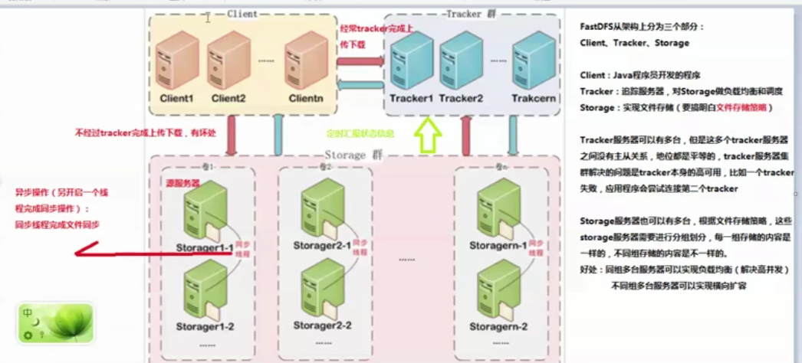


- storage 状态收集

  Storage Server 会通过配置连接集群中的所有的 Tracker Server，并定时向他们发送自己的状态（心跳），包括磁盘剩余空间，文件同步状态，文件上传下载次数统计信息

  storage server 有 7 个状态：

  ```
  FDFS_STORAGE_STATUS_INIT       ：初始化，尚未得到同步已有数据的源服务器
  FDFS_STORAGE_STATUS_WAIT_SYNC  ：等待同步，已得到同步已有数据的源服务器
  FDFS_STORAGE_STATUS_SYNCING    ：同步中
  FDFS_STORAGE_STATUS_DELETED    ：已删除，该服务器从服务器组中摘除
  FDFS_STORAGE_STATUS_OFFLINE    ：离线
  FDFS_STORAGE_STATUS_ONLINE     ：在线，尚不能提供服务
  FDFS_STORAGE_STATUS_ACTIVATE   ：在线，可以提供服务
  ```

  当 strage server 的状态为 FDFS_STORAGE_STATUS_ONLINE时，当该 storage_server 发起一次心跳时，tracker_server 将其状态改为 FDFS_STORAGE_STATUS_ACTIVATE

- 文件上传流程

  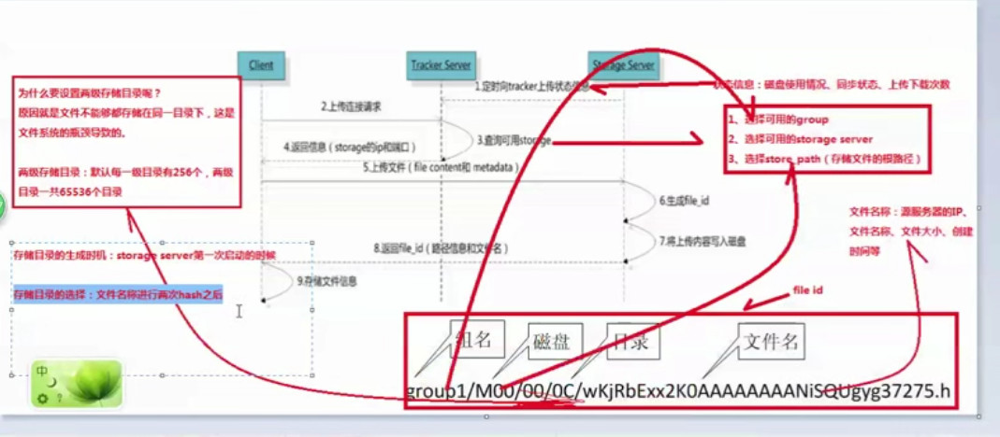

  注意：store_path 可以为多个, 目录中，M00 表示 store_path0，M01 表示 store_path1...，如果没有配置 store_path 则默认使用 base_path

- 文件同步分析

  >  注意：文件只在组内进行同步，源数据才进行同步，备份数据不进行同步，但是新增加的服务器需要同步备份数据和源数据

  


6. 文件下载流程

   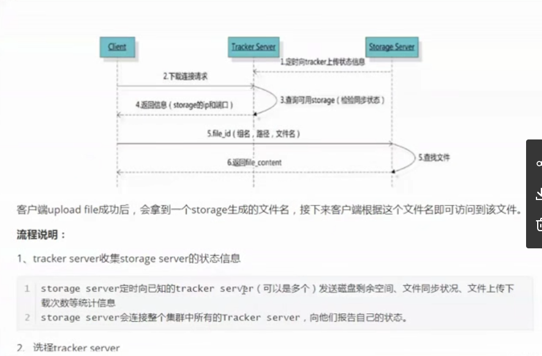

   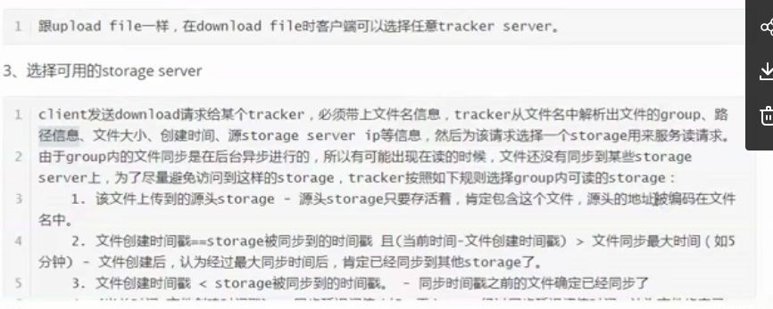


- 新增 Storage Server 

  组内新增加一台 storage_server A 时，由系统完成已有数据同步，处理逻辑如下：

  1. storage server A 连接 tracker_server，tracker_server 将 storage_server 的状态设置为 FDFS_STORAGE_STATUS_INIT。storage server A 询问追加同步的源服务器和追加同步截止时间点。

     如果该组内只有 storage server A 或该组内上传的文件数为0，则没有数据要同步，此时 tracker 将其状态设置为 FDFS_STORAGE_STATUS_ONLINE，否则 tracker_server

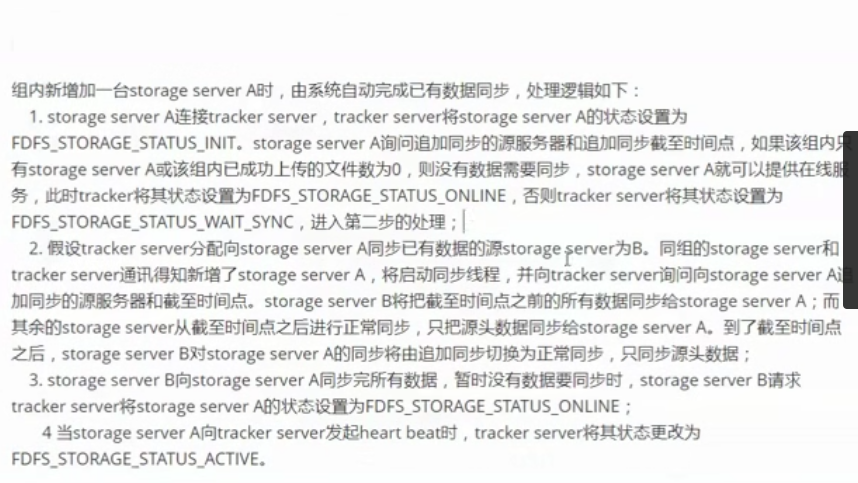

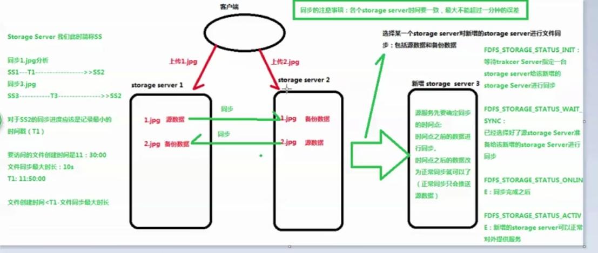

注意：设置每个服务器的时间，需要一致，最多相差不到一分钟


### 四、FastDFS 安装

- 安装

  > 至少需要一台 tracker server 和一台 storage server
  >
  > 可以把 tracker server  和 storage server同时安装，他们之间的区别是配置文件的不同

  ```bash
  # 安装 c 语言环境编译,libevent,wget
  yum install  -y gcc-c++
  yum install  -y libevent
  yum install  -y wget
  
  # 下载到指定目录，解压安装
  wget https://github.com/happyfish100/libfastcommon/archive/V1.0.39.tar.gz
  tar -zxvf V1.0.39.tar.gz 
  cd libfastcommon-1.0.39/
  ./make.sh && ./make.sh install
  
  # 拷贝 libfastcommon-1.0.39 到 /usr/lib 目录（新版本可以不装）
  # libfastcommon 是 FastDFS 公共基础库
  cp /usr/lib64/libfastcommon.so /usr/lib
  
  # 下载 fastdfs、解压并安装
  wget https://github.com/happyfish100/fastdfs/archive/V5.11.tar.gz
  tar -zxvf V5.11.tar.gz
  cd fastdfs-5.11/
  ./make.sh && ./make.sh install
  
  # 将所有配置文件拷贝到 /etc/fdfs 目录下
  cp * /etc/fdfs
  ```

- tracker server 配置

   修改 /etc/fdfs 目录下的 tracker-server 文件
  
  ```bash
  # 修改 base_pathm,指定数据和日志的存放目录
  base_path=/kkb/server/fashdfs/tracker
  
  # 创建目录
  mkdir -p /kkb/server/fashdfs/tracker
  ```
  
- 修改 storage  server 配置

   修改 /etc/fdfs 目录下的 storage  -server 文件

  ```bash
  # 指定 storage 的组名,根据组名找到相同组, 不配 store_path0，默认就是 base_path
  group_name=group1
  base_path = /kkb/server/fashdfs/storage
  store_path0 = /kkb/server/fashdfs/storage
  # 如果挂载多个磁盘使用
  # store_path0 = ...
  # store_path1 = ...
  
  # 配置 tracker server
  tracker_server = 111.231.106.221:22122 
  # 多个 tracker-server
  # tracker_server = 111.231.106.222:22122
  # tracker_server = 111.231.106.222:22122
  ```

- 启动

  ```bash
  # 关闭防火墙
  systemctl stop firewalld
  # 或 systemctl disable firewalld 表示永久失效
  
  # 不同机器上根据角色分别启动tracker-server 和 storage-server
  fdfs_trackerd /etc/fdfs/tracker.conf
  fdfs_storaged /etc/fdfs/storage.conf
  ```

- 开机启动

  ```bash
  # tracker 开机启动
  vim /etc/rc.d/rc.local
  # 添加命令
  /usr/bin/fdfs_trackerd /etcfdfs/tracker.conf
  
  # storage  开机启动
  vim /etc/rc.d/rc.local
  # 添加命令
  /usr/bin/fdfs_storaged /etc/fdfs/storage.conf
  ```

- 上传图片测试

  FastDFS 安装成功后可以通过 【fdfs_test】命令测试上传，下载等操作

  - 进入 /etc/fdfs 目录，拷贝一份 client.conf 文件

    ```
    cd /etc/fdfs
    cp client.conf.sample client.conf
    ```

  - 修改 client.conf

    ```bash
    vim /etc/fdfs/client.conf
    
    # 修改内容
    base_path=/kkb/server/fastdfs/client
    tracker_server=192.168.1.101:22122
    
    # 创建 client 数据目录
    mkdir -p /kkb/server/fastdfs/client
    
    # 使用命令测试
    fdfs_test /etc/fdfs/client.conf upload /home/1.txt
    ```

### 五、FastDFS-Nginx 扩展模块源码

不使用 Nginx 扩展模块，只安装 web 服务器（Nginx 或 Apache）也可以对文件进行访问

为什么要使用 Nginx 扩展模块？

1. 合并之后的文件，不通过 nginx 扩展模块是访问不到的
2. 文件如果文件未同步成功，使用 nginx 扩展模块可以转发或重定向到源服务器


配置文件加载流程（配置文件默认从 storage 加载）

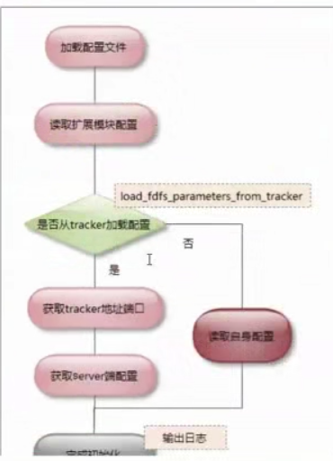


- 加载配置文件

  目标文件：/etc/fdfs/mod_fastdfs.conf

- 读取扩展模块配置

  一些重要参数：

  ```
  group_count          // group 个数
  url_have_group_name  // url 中是否包含 group
  group.store_path     // group 对应的存储路径
  connect_timeout      // 连接超时
  network_timeout      // 接收或发送超时
  response_mod         // 响应模式， proxy 或 redirect
  load_fdfs_parameters_from_tracker // 是否从 tracker 下载服务端配置
  ```

  

  文件下载过程

  

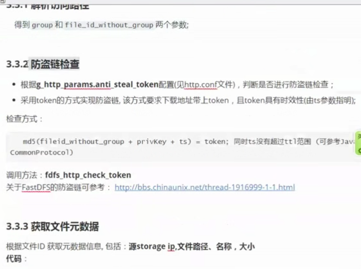

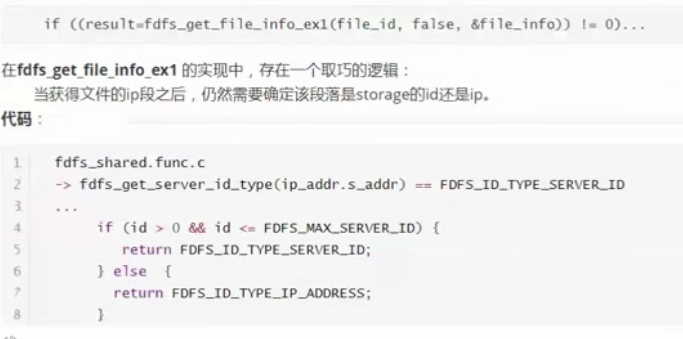


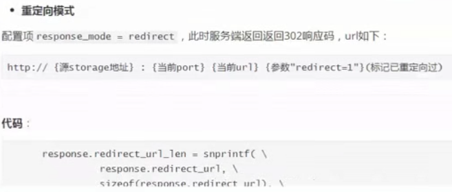

###### 若本地存在，输出本地文件

配置 FastDFS-Nginx 的 Nginx 模块（storage server）

```
wget https://github.com/happyfish100/fastdfs-nginx-module/archive/V1.20.tar.gz

# 解压

# 修改 config(特别关键)
cd fastdfs-nginx-module/src
vim config


```


拷贝文件

cp mod....conf  /tec/fdfs

编辑 

 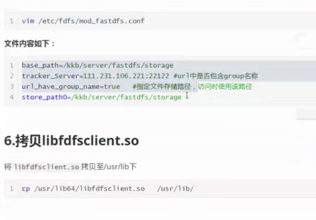


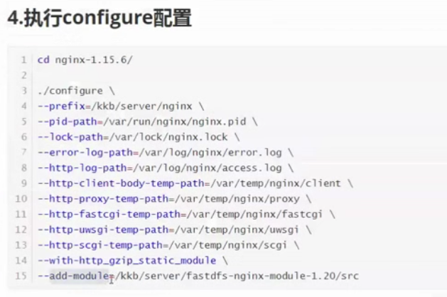

安装....

查看是否安装成功

nginx -V 

修改 nginx.conf

 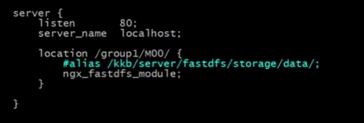

重新加载


### 七、安装 Nginx

Nginx 需要安装在每一台 Storage Server 

下载

<https://github.com/nginx/nginx/releases>

### 八、合并存储(重要)


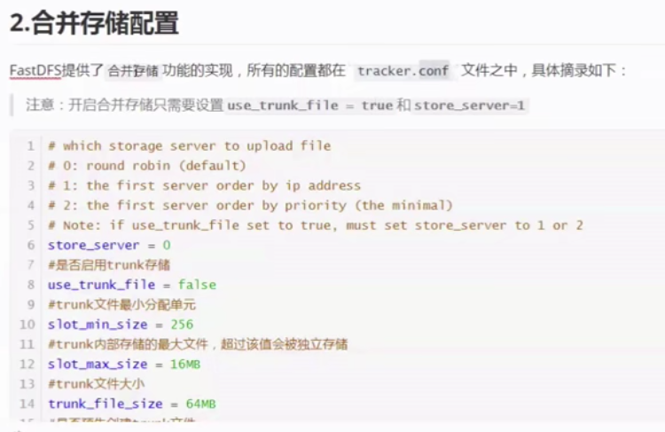 

​	


使用 M 的方式显示文件

ll   --block-size=m


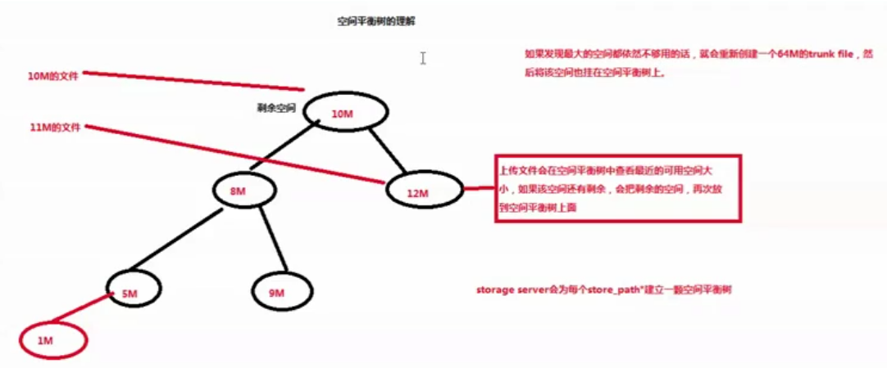


TrunkServer 的选举


选择 IP 最小的

### 九、存放缩略图


 2. 然后上传从文件（即：缩略图），指定主文件 ID

    前提：本地先要生成对应的缩略图，然后再使用FastDfs 主从文件完成上传

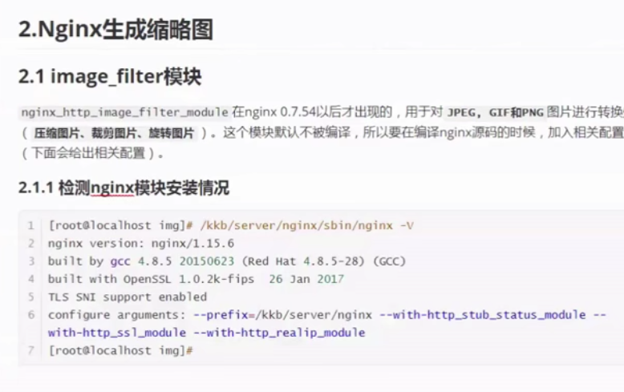

安装

安装依赖

```
yum install -y gd-devel
```


make 就可以了


$就是 （） 指定的位置

访问 FastDfs 图片


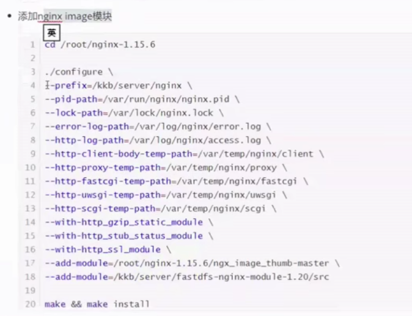

​	访问普通图片


​	

访问FastDFS


### 十、Java 客户端

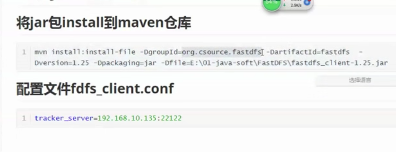


代码：

```java
/**
 * 上传文件工具类
 * @ClassName: FileUploadUtils
 * @author wrh45
 * @date 2017年8月8日下午4:14:31
 */
public class FileUploadUtils {
    private static TrackerClient trackerClient = null;
    private static TrackerServer trackerServer = null;
    private static StorageServer storageServer = null;
    private static StorageClient storageClient = null;
    private static final String groupName = "group1";

    static {
        // 加载配置文件
        try {
            ClientGlobal.initByProperties("config/fastdfs-client.properties");
            // System.out.println("ClientGlobal.configInfo():" +
            // ClientGlobal.configInfo());
        } catch (IOException | MyException e) {
            e.printStackTrace();
            System.out.println("load config file fail");
        }
    }

    /*
     * 初始化连接数据
     */
    private static void init() {
        try {
            trackerClient = new TrackerClient();
            trackerServer = trackerClient.getConnection();
            storageClient = new StorageClient(trackerServer, storageServer);
        } catch (IOException e) {
            e.printStackTrace();
            System.out.println("init fail");
        }
    }

    /**
     * 上传文件
     * @param filePath 文件路径
     * @param fileName 文件名称
     * @return 文件存储信息
     * @author: wrh45
     * @date: 2017年8月5日下午11:10:38
     */
    public static String[] uploadFile(String filePath, String fileName) {
        return uploadFile(null, filePath, fileName);
    }

    /**
     * 上传文件
     * @param fileBuff 文件字节数组
     * @param fileName 文件名称
     * @return 文件存储信息
     * @author: wrh45
     * @date: 2017年8月5日下午11:10:38
     */
    public static String[] uploadFile(byte[] fileBuff, String fileName) {
        return uploadFile(fileBuff, null, fileName);
    }

    /**
     * 上传文件
     * @param file_buff 文件字节数组
     * @param filePath 文件路径
     * @param fileName 文件名称
     * @return 文件存储信息
     * @author: wrh45
     * @date: 2017年8月5日下午10:58:19
     */
    private static String[] uploadFile(byte[] fileBuff, String filePath, String fileName) {
        try {
            if (fileBuff == null && filePath == null) {
                return new String[0];
            }
            // 初始化数据
            if (storageClient == null) {
                init();
            }

            // 获取文件扩展名称
            String fileExtName = "";
            if (fileName != null && !"".equals(fileName) && fileName.contains(".")) {
                fileExtName = fileName.substring(fileName.lastIndexOf(".") + 1);
            } else {
                return new String[0];
            }

            // 设置图片元数据
            NameValuePair[] metaList = new NameValuePair[3];
            metaList[0] = new NameValuePair("fileName", fileName);
            metaList[1] = new NameValuePair("fileExtName", fileExtName);
            metaList[2] = new NameValuePair("fileSize", String.valueOf(fileBuff.length));
            // 上传文件
            String[] uploadFile = null;
            if (fileBuff != null && filePath == null) {
                if (fileBuff.length == 0) {
                    return new String[0];
                }
                uploadFile = storageClient.upload_file(fileBuff, fileExtName, metaList);
            } else {
                //路径匹配Windown和Linux
                if ("".equals(filePath) || !(filePath.matches("^[a-zA-Z]:{1}([\u4e00-\u9fa5\\w/_\\\\-]+)$") || filePath.matches("^(/[\u4e00-\u9fa5\\w_-]+)+$"))) {
                    return new String[0];
                }
                uploadFile = storageClient.upload_file(filePath, fileExtName, metaList);
            }
            return uploadFile == null ? new String[0] : uploadFile;
        } catch (Exception e) {
            e.printStackTrace();
        } finally {
            try {
                if (trackerServer != null) {
                    trackerServer.close();
                    trackerServer = null;
                }
                if (storageServer != null) {
                    storageServer.close();
                    storageServer = null;
                }
            } catch (IOException e) {
                e.printStackTrace();
            }
        }
        return new String[0];
    }

    /**
     * 删除服务器文件
     * @param remoteFileName  文件在服务器中名称
     * @author: wrh45
     * @date: 2017年8月6日上午12:15:22
     */
    public static int deleteFile(String remoteFileName) {
        try {
            if (remoteFileName == null || "".equals(remoteFileName) || !remoteFileName.contains(groupName)) {
                return -1;
            }
            if (storageClient == null) {
                init();
            }
            String fileURL = remoteFileName.substring(remoteFileName.indexOf(groupName));
            String group = fileURL.substring(0, remoteFileName.indexOf("/") + 1);
            String fileName = fileURL.substring(remoteFileName.indexOf("/") + 2);
            int code = storageClient.delete_file(group, fileName);
            return code;
        } catch (Exception e) {
            e.printStackTrace();
            System.out.println("The File Delete Fail");
        }
        return -1;
    }

    /**
     * 获取文件信息
     * @param groupName  组名
     * @param remoteFilename  远程文件名
     * @return
     * @author: wrh45
     * @date: 2017年8月8日上午12:25:26
     */
    public static FileInfo getFileInfo(String groupName, String remoteFilename) {
        try {
            if (storageClient == null) {
                init();
            }
            FileInfo fileInfo = storageClient.get_file_info(groupName, remoteFilename);
            return fileInfo;
        } catch (Exception e) {
            e.printStackTrace();
            System.out.println("Get File Info Fail");
        }
        return null;
    }
}
```


### 十一 查看错误日志

- tracker 日志在 tracker 的 base_path 目录下
- storage 日志在 storage 的 base_path 目录下
- nginx 在安装时指定的 error-log-path，默认装在 config 目录下


### Nginx  附加资料

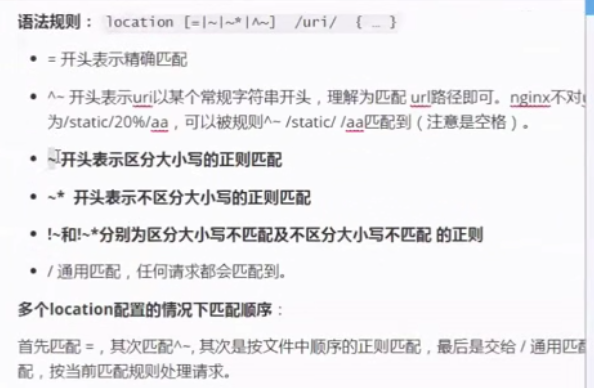

如果匹配相同，从上往下依次匹配


rewrite 语法

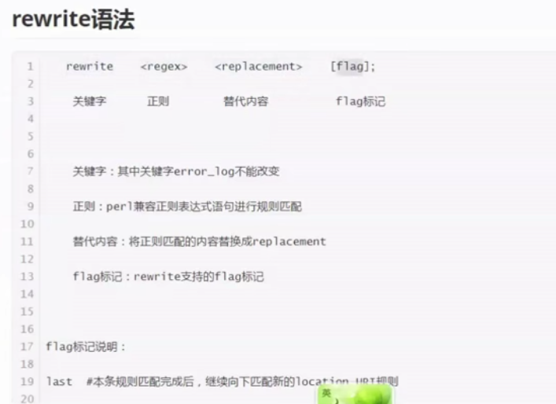

内置变量