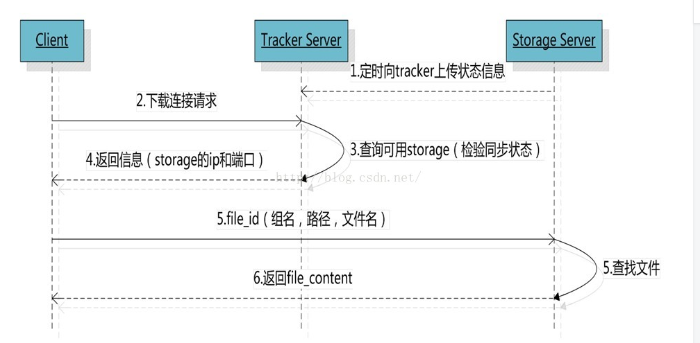

## FastDFS

### 一、问题引导

- 互联网环境的文件如何存储

  NFS（mount 挂载）、HDFS、FastDFS、云存储（图床等）

- 互联网环境中的文件如何访问

  Nginx、Apache 等

### 二、 FastDFS 介绍

- C 语言编写的开源的高性能分布式文件系统
- 对文件进行管理，功能包括：文件存储、文件同步、文件访问（文件上传、文件下载）等，**解决了大容量存储和负载均衡的问题**
- 特别适合以文件为载体的在线服务，如相册网站、视频网站、电商网站等等。特别适合中小文件（范围: 4kb ~ 500 Mb）
- 充分体现了冗余性、负载均衡、线性扩容等机制，并注重高可用、高性能等指标，使 FastDFS 很容易搭建一套高性能的文件服务集群提供文件上传、下载等服务

### 三、FastDFS 架构原理分析

> 原理中还有 文件同步、新增 torage server 流程还没有理解

- 架构

  > 注意：同组内的服务器存储容量最好一致，不同组内的服务器的存储容量可以不一致（因为一个组内的最大容量是由最小的服务器的存储容量决定的）

  


- storage 状态收集

  Storage Server 会通过配置连接集群中的所有的 Tracker Server，并定时向他们发送自己的状态（心跳），包括磁盘剩余空间，文件同步状态，文件上传下载次数统计等信息

  storage server 有 7 个状态：

  ```
  FDFS_STORAGE_STATUS_INIT       ：初始化，尚未得到同步已有数据的源服务器
  FDFS_STORAGE_STATUS_WAIT_SYNC  ：等待同步，已得到同步已有数据的源服务器
  FDFS_STORAGE_STATUS_SYNCING    ：同步中
  FDFS_STORAGE_STATUS_DELETED    ：已删除，该服务器从服务器组中摘除
  FDFS_STORAGE_STATUS_OFFLINE    ：离线
  FDFS_STORAGE_STATUS_ONLINE     ：在线，尚不能提供服务
  FDFS_STORAGE_STATUS_ACTIVATE   ：在线，可以提供服务
  ```

  当 strage server 的状态为 FDFS_STORAGE_STATUS_ONLINE时，当该 storage_server 发起一次心跳时，tracker_server 将其状态改为 FDFS_STORAGE_STATUS_ACTIVATE

- 文件上传流程

  

  注意：store_path 可以为多个, 目录中，M00 表示 store_path0，M01 表示 store_path1...，如果没有配置 store_path 则默认使用 base_path

- 文件同步分析

  >  注意：文件只在组内进行同步，源数据才进行同步，备份数据不进行同步，但是新增加的服务器需要同步备份数据和源数据

  
  
  注意：设置每个服务器的时间，需要一致，最多相差不到一分钟

- 文件下载流程

  

  注意：文件的 file_id 中已经包括了文件的源服务器 IP、文件创建时间等信息 

- 新增 Storage Server

  

### 四、FastDFS 安装

- 安装

  > 至少需要一台 tracker server 和一台 storage server
  >
  > 可以把 tracker server  和 storage server同时安装，他们之间的区别是配置文件的不同

  ```bash
  # 安装 c 语言环境编译,libevent,wget
  yum install  -y gcc-c++
  yum install  -y libevent
  yum install  -y wget
  
  # 下载到指定目录，解压安装
  wget https://github.com/happyfish100/libfastcommon/archive/V1.0.39.tar.gz
  tar -zxvf V1.0.39.tar.gz 
  cd libfastcommon-1.0.39/
  ./make.sh && ./make.sh install
  
  # 拷贝 libfastcommon-1.0.39 到 /usr/lib 目录（新版本可以不装）
  # libfastcommon 是 FastDFS 公共基础库
  cp /usr/lib64/libfastcommon.so /usr/lib
  
  # 下载 fastdfs、解压并安装
  wget https://github.com/happyfish100/fastdfs/archive/V5.11.tar.gz
  tar -zxvf V5.11.tar.gz
  cd fastdfs-5.11/
  ./make.sh && ./make.sh install
  
  # 将所有配置文件拷贝到 /etc/fdfs 目录下
  cp * /etc/fdfs
  ```

- tracker server 配置

   修改 /etc/fdfs 目录下的 tracker-server 文件
  
  ```bash
  # 修改 base_path, 指定数据和日志的存放目录
  base_path=/kkb/server/fashdfs/tracker
  
  # 创建目录
  mkdir -p /kkb/server/fashdfs/tracker
  ```
  
- storage  server 配置

   修改 /etc/fdfs 目录下的 storage  -server 文件

  ```bash
  # 指定 storage 的组名,根据组名找到相同组, 不配 store_path0，默认就是 base_path
  group_name=group1
  base_path = /kkb/server/fashdfs/storage
  store_path0 = /kkb/server/fashdfs/storage
  # 如果挂载多个磁盘使用
  # store_path0 = ...
  # store_path1 = ...
  
  # 配置 tracker server
  tracker_server = 111.231.106.221:22122 
  # 多个 tracker-server
  # tracker_server = 111.231.106.222:22122
  # tracker_server = 111.231.106.222:22122
  ```

- 启动、关闭、重启

  ```bash
  # 关闭防火墙
  systemctl stop firewalld
  # 或 systemctl disable firewalld 表示永久失效
  
  # 不同机器上根据角色分别启动 tracker-server 和 storage-server
  /usr/bin/fdfs_trackerd /etc/fdfs/tracker.conf
  /usr/bin/fdfs_storaged /etc/fdfs/storage.conf
  
  # 重启
  /usr/bin/restart.sh /usr/bin/fdfs_trackerd /etc/fdfs/tracker.conf
  /usr/bin/restart.sh /usr/bin/fdfs_storaged /etc/fdfs/storage.conf
  
  # 关闭
  /usr/bin/stop.sh /usr/bin/fdfs_trackerd /etc/fdfs/tracker.conf
  /usr/bin/stop.sh /usr/bin/fdfs_storaged /etc/fdfs/storage.conf
  ```

- 设置开机启动（有问题）

  ```bash
  # tracker 开机启动
  vim /etc/rc.d/rc.local
  # 添加命令
  /usr/bin/fdfs_trackerd /etcfdfs/tracker.conf
  
  # storage  开机启动
  vim /etc/rc.d/rc.local
  # 添加命令
  /usr/bin/fdfs_storaged /etc/fdfs/storage.conf
  ```

- 上传图片测试

  FastDFS 安装成功后可以通过 【fdfs_test】命令测试上传，下载等操作（可以在任何一台安装了 fastdfs 的机器上执行）

  - 进入 /etc/fdfs 目录，拷贝一份 client.conf 文件

    ```bash
    cd /etc/fdfs
    cp client.conf.sample client.conf
    ```

  - 修改 client.conf

    ```bash
    vim /etc/fdfs/client.conf
    
    # 修改内容
    base_path=/kkb/server/fastdfs/client
    tracker_server=192.168.1.101:22122
    
    # 创建 client 数据目录
    mkdir -p /kkb/server/fastdfs/client
    
    # 使用命令测试上传
    fdfs_test /etc/fdfs/client.conf upload 1.png
    ```

### 五、FastDFS-Nginx 扩展模块

- 原因

  不使用 Nginx 扩展模块，只安装 web 服务器（Nginx 或 Apache）也可以对文件进行访问

  为什么要使用 Nginx 扩展模块？

  1. 合并之后的文件，不通过 nginx 扩展模块是访问不到的
  2. 文件如果文件未同步成功，使用 nginx 扩展模块可以转发或重定向到源服务器

- 安装

  > 安装在每一台 storage 服务器上

  ```bash
  # 下载扩展模块
  wget https://github.com/happyfish100/fastdfs-nginx-module/archive/V1.20.tar.gz
  
  # 解压
  tar -zxvf V1.20.tar.gz
  
  # 修改 config(特别关键) 配置文件
  cd fastdfs-nginx-module-1.20/src
  vim config
  ```

  需要修改第 6 行和第 15 行（修改内容一样）

  ```shell
  1 ngx_addon_name=ngx_http_fastdfs_module
  2 
  3 if test -n "${ngx_module_link}"; then
  4     ngx_module_type=HTTP
  5     ngx_module_name=$ngx_addon_name
  6     ngx_module_incs="/usr/local/fastdfs /usr/include/fastcommon/"
  7     ngx_module_libs="-lfastcommon -lfdfsclient"
  8     ngx_module_srcs="$ngx_addon_dir/ngx_http_fastdfs_module.c"
  9     ngx_module_deps=
  10     CFLAGS="$CFLAGS -D_FILE_OFFSET_BITS=64 -DFDFS_OUTPUT_CHUNK_SIZE='256*1024' -DFDFS_MOD_CONF_FILENAME='\"/etc/fdfs/mod_fastdfs.conf\"'"
  11     . auto/module
  12 else
  13     HTTP_MODULES="$HTTP_MODULES ngx_http_fastdfs_module"
  14     NGX_ADDON_SRCS="$NGX_ADDON_SRCS $ngx_addon_dir/ngx_http_fastdfs_module.c"
  15     CORE_INCS="$CORE_INCS /usr/local/fastdfs /usr/include/fastcommon/"
  16     CORE_LIBS="$CORE_LIBS -lfastcommon -lfdfsclient"
  17     CFLAGS="$CFLAGS -D_FILE_OFFSET_BITS=64 -DFDFS_OUTPUT_CHUNK_SIZE='256*1024' -DFDFS_MOD_CONF_FILENAME='\"/etc/fdfs/mod_fastdfs.conf\"'"
  18 fi
  ```

  拷贝文件

  ```bash
  cp mod_fastdfs.conf  /etc/fdfs
  ```

  关于配置文件中的一些参数说明

  ```shell
  group_count          // group 个数
  url_have_group_name  // url 中是否包含 group
  group.store_path     // group 对应的存储路径
  connect_timeout      // 连接超时
  network_timeout      // 接收或发送超时
  response_mod         // 响应模式， proxy 或 redirect
  load_fdfs_parameters_from_tracker // 是否从 tracker 下载服务端配置
  ```

  修改配置文件

  ```bash
  vim /etc/fdfs/mod_fastdfs.conf
  ```

  修改如下内容

  ```shell
  base_path=/kkb/server/fashdfs/storage
  tracker_server=192.168.1.101:22122
  url_have_group_name=true
  store_path0=/kkb/server/fashdfs/storage
  ```

  安装 nginx 和 fastdfs-nginx-module

  ```bash
  # 安装依赖
  yum install -y  gcc-c++ pcre-devel  openssl-devel
  
  # 下载 nginx 并解压
  wget http://nginx.org/download/nginx-1.1.10.tar.gz
  tar -zxvf nginx-1.1.10.tar.gz
  
  # 进入 nginx 目录
  cd nginx-1.1.10
  
  # 执行安装， 安装到 /kkb/server目录下且添加两个模块
  ./configure  \
  	--prefix=/kkb/server/nginx \
  	--with-http_gzip_static_module \
  	--add-module=/opt/software/fastdfs-nginx-module-1.20/src
  
  make && make install
  
  # 进入 /kkb/server/nginx/sbin,查看模块是否安装成功
  cd /kkb/server/nginx/sbin
  ./nginx -V
  ```

  修改 nginx.conf，重启 nginx

  ```perl
  location /group1/M00/ {
       ngx_fastdfs_module;
  }
  ```

  浏览器访问（这张图片是在前面测试的时候上传的）：

  <http://192.168.1.103/group1/M00/00/00/wKgBZ11ks-iADQTpAAgzAENGwrE287.png>

  

### 六、合并存储(重要)

- 为什么要合并存储：

  因为对于海量的小文件处理上，文件系统的处理性能会受到显著的影响

- FastDFS 合并存储文件大小

  FastDFS 提供的合并存储功能，默认创建的大文件为默认 64 MB，然后在该大文件中存储很多小文件。大文件中容纳一个小文件的空间称为一个 Slot，规定Slot最小值为默认 256 字节，最大为默认 16MB，也就是小于 256 字节的文件也需要占用256字节，**超过16MB的文件不会合并存储而是创建独立的文件**

- 合并存储文件的 file_id 

  file_id 和普通的文件file_id 不一样，除了普通文件包括的信息外，还包括了文件所属的 `trunk_id`和 内容在文件的`偏移量 offset`，所以会比普通的文件的文件名长一些

- 配置 tracker.conf（tracker 服务器），开启合并存储

  >  tracker.conf 中的常用配置说明
  >
  > 

  修改  tracker.conf 配置

  ```shell
  usr_trunk_file=true
  store_server=1
  ```

- 空间平衡树

  > storage server 会为每个 store_path 建立一个空间平衡树，相同大小的空闲块会放到一个链表中
  >
  > 每次存储文件时都是在平衡树中找空间最相近的空闲块，若没找到又会创建一个 64M 的 trunk 文件；
  >
  > 若找到，分成两个空闲块，一个空闲块存文件，另一个空闲块重新挂载到平衡树中
  >
  > 另外，删除文件的时候也会产生空闲块

  

  

- TrunkServer

  > TrunkServer 是 一个 group 中 的 一个 storage，用于为该组内的所有 upload 操作分配空间

### 七、存放缩略图

- 主从文件

  > 先上传主文件，得到主文件的 field_id
  >
  > 然后上传从文件（缩略图），使用主文件 field_id作为关联
  >
  > fastdfs 提供了关联主从文件的 API
  >
  > **注意：从文件必须先创建好了上传**

  ```java
   public static void main(String[] args) throws Exception {
          // 主文件
          String[] result = FileUploadUtils.uploadFile("D:\\master.png", "1.png");
          System.out.println("组名：" + result[0]);
          System.out.println("文件名： " + result[1] + "\n");
  		
          // 从文件
          String[] result2 = FileUploadUtils.uploadSlaveFile(result[1], "D:\\slave.png", "_100_100", ".png");
          System.out.println("组名：" + result2[0]);
          System.out.println("文件名： " + result2[1] + "\n");
      }
  ```

  输出：

  ```
  组名：group1
  文件名： M00/00/00/wKgBZl1k9WiIYID3AAC3s_46goYAAAAAQAETsIAALfL418.png
  
  组名：group1
  文件名： M00/00/00/wKgBZl1k9WiIYID3AAC3s_46goYAAAAAQAETsIAALfL418_100_100.png
  ```

- Nginx 生成缩略图 

  > 使用 image_filter 模块，可以对图片进行压缩、裁剪、旋转等操作

  安装

  ```bash
  # 安装依赖
  yum install -y gd-devel
  
  # 配置且安装 nginx
  ./configure  \
  --prefix=/kkb/server/nginx  \
  --with-http_gzip_static_module \
  --add-module=/opt/software/fastdfs-nginx-module-1.20/src \
  --with-http_image_filter_module
  
  make && make install
  ```

  配置 nginx.conf

  ```perl
  location ~ /group1/(.*)_(\d+)x(\d+)\.(jpg|png|gif) {
  	ngx_fastdfs_module;
  
  	set $n $1;
  	set $w $2;
  	set $h $3;
  	set $t $4;
  	
  	# 设置等比例缩放后文件的大小
  	image_filter resize $w $h;
  	
  	# 如果源图片超过 10M， 将抛出 415 错误
  	image_filter_buffer 10M;
  	
  	# 裁剪图片（效果跟 resize 差不多， 不是期待的裁剪）
  	# mage_filter crop $w $h;
  	
  	# 图片进行旋转
  	# image_filter rotate 90/180/270;
  
  	rewrite ^/group1/(.*)$ /group1/$n.$t  break;
  }
  ```

  重新加载 nginx

  ```
  nginx -s reload
  ```

  浏览器访问（包括合并存储的文件）

  <http://192.168.1.103/group1/M00/00/00/wKgBZl1lZJaIDvPMAACBAwMcsjEAAAAAQAHLe4AAIEb784_600x600.png>

### 八、Java 客户端

- 安装 fastdfs-client-java 到本地仓库

  ```bash
  git clone https://github.com/happyfish100/fastdfs-client-java
  cd fastdfs-client-java
  mvn clean install
  ```

- 项目中引入依赖

  ```xml
  <dependency>
  	<groupId>org.csource</groupId>
  	<artifactId>fastdfs-client-java</artifactId>
  	<version>1.27-SNAPSHOT</version>
  </dependency>
  ```

- 添加配置文件

  ```properties
  fastdfs.connect_timeout_in_seconds = 5
  fastdfs.network_timeout_in_seconds = 30
  fastdfs.charset = UTF-8
  fastdfs.http_anti_steal_token = false
  fastdfs.http_secret_key = FastDFS1234567890
  fastdfs.http_tracker_http_port = 80
  
  # tracker server 的 ip 和端口，多个使用逗号分割
  # 这个配置是必须的，其他不是必须的
  fastdfs.tracker_servers = 192.168.1.101:22122
  ```

- 增/删/查 工具类

  ```java
  public class FileUploadUtils {
      private static TrackerClient trackerClient = null;
      private static TrackerServer trackerServer = null;
      private static StorageServer storageServer = null;
      private static StorageClient storageClient = null;
      private static final String groupName = "group1";
  
      static {
          // 加载配置文件
          try {
              ClientGlobal.initByProperties("fastdfs-client.properties");
              // System.out.println("ClientGlobal.configInfo():" +
              // ClientGlobal.configInfo());
          } catch (IOException | MyException e) {
              e.printStackTrace();
              System.out.println("load config file fail");
          }
      }
  
      /*
       * 初始化连接数据
       */
      private static void init() {
          try {
              trackerClient = new TrackerClient();
              trackerServer = trackerClient.getConnection();
              storageClient = new StorageClient(trackerServer, storageServer);
          } catch (IOException e) {
              e.printStackTrace();
              System.out.println("init fail");
          }
      }
  
      /**
       * 上传文件
       * @param filePath 文件路径
       * @param fileName 文件名称
       * @return 文件存储信息
       */
      public static String[] uploadFile(String filePath, String fileName) {
          return uploadFile(null, filePath, fileName);
      }
  
      /**
       * 上传文件
       * @param fileBuff 文件字节数组
       * @param fileName 文件名称
       * @return 文件存储信息
       */
      public static String[] uploadFile(byte[] fileBuff, String fileName) {
          return uploadFile(fileBuff, null, fileName);
      }
  
      /**
       * 上传文件
       * @param fileBuff 文件字节数组
       * @param filePath 文件路径
       * @param fileName 文件名称
       * @return 文件存储信息
       */
      private static String[] uploadFile(byte[] fileBuff, String filePath, String fileName) {
          try {
              if (fileBuff == null && filePath == null) {
                  return new String[0];
              }
  
              // 初始化数据
              if (storageClient == null) {
                  init();
              }
  
              // 获取文件扩展名称
              String fileExtName;
              if (fileName != null && !"".equals(fileName) && fileName.contains(".")) {
                  fileExtName = fileName.substring(fileName.lastIndexOf(".") + 1);
              } else {
                  return new String[0];
              }
  
              // 上传文件
              String[] uploadFile = null;
              if (fileBuff != null && filePath == null) {
                  if (fileBuff.length == 0) {
                      return new String[0];
                  }
                  uploadFile = storageClient.upload_file(fileBuff, fileExtName, null);
              } else {
                  uploadFile = storageClient.upload_file(filePath, fileExtName, null);
              }
              return uploadFile == null ? new String[0] : uploadFile;
          } catch (Exception e) {
              e.printStackTrace();
          } finally {
              try {
                  if (trackerServer != null) {
                      trackerServer.close();
                      trackerServer = null;
                  }
                  if (storageServer != null) {
                      storageServer.close();
                      storageServer = null;
                  }
              } catch (IOException e) {
                  e.printStackTrace();
              }
          }
          return new String[0];
      }
      
      // 保存为从文件
      public static String[] uploadSlaveFile(String fileId, String filePath, String prefix, String fileExtName) throws Exception {
          String[] uploadFile = storageClient.upload_file(groupName, fileId, prefix, filePath, fileExtName, null);
          return uploadFile == null ? new String[0] : uploadFile;
  }
  
      /**
       * 删除服务器文件
       * @param remoteFileName  文件在服务器中名称
       */
      public static int deleteFile(String groupName, String remoteFileName) {
          try {
              if (storageClient == null) {
                  init();
              }
              int code = storageClient.delete_file(groupName, remoteFileName);
              return code;
          } catch (Exception e) {
              e.printStackTrace();
              System.out.println("The File Delete Fail");
          }
          return -1;
      }
  
      /**
       * 获取文件信息，直接解析的文件名
       * @param groupName  组名
       * @param remoteFilename  远程文件名
       */
      public static FileInfo getFileInfo(String groupName, String remoteFilename) {
          try {
              if (storageClient == null) {
                  init();
              }
              FileInfo fileInfo = storageClient.get_file_info(groupName, remoteFilename);
              return fileInfo;
          } catch (Exception e) {
              e.printStackTrace();
              System.out.println("Get File Info Fail");
          }
          return null;
      }
  }    
  ```

- 测试类

  ```java
  public static void main(String[] args) {
      // 创建文件
      String[] result = FileUploadUtils.uploadFile("D:\\1.png", "1.png");
      System.out.println("组名：" + result[0]);
      System.out.println("文件名： " + result[1] + "\n");
  
      // 获取文件信息（解析文件名）
      FileInfo info = FileUploadUtils.getFileInfo("group1", "M00/00/00/wKgBZl1k476Ab17UAAC3s_46goY435.png");
      System.out.println("文件大小：" + info.getFileSize());
      System.out.println("文件原服务器 IP：" + info.getSourceIpAddr());
      System.out.println("文件创建时间时间戳：" + info.getCreateTimestamp() + "\n");
  
      // 删除文件
      int status = FileUploadUtils.deleteFile("group1", "M00/00/00/wKgBZ11k5e2AYki8AAC3s_46goY488.png");
      System.out.println(status);
  }
  ```

- 输出

  ```
  组名：group1
  文件名： M00/00/00/wKgBZl1k5zeAAVpCAAC3s_46goY062.png
  
  文件大小：47027
  文件原服务器 IP：192.168.1.102
  文件创建时间时间戳：Tue Aug 27 16:03:10 CST 2019
  
  2
  ```

### 九、 查看错误日志

- tracker 日志在 tracker 设定的的 base_path 目录下
- storage 日志在 storage 设定的 base_path 目录下
- nginx 在安装时指定的 error-log-path，默认装在 logs 目录下


