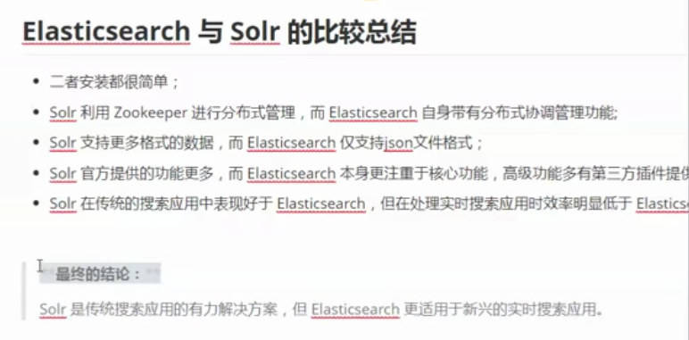
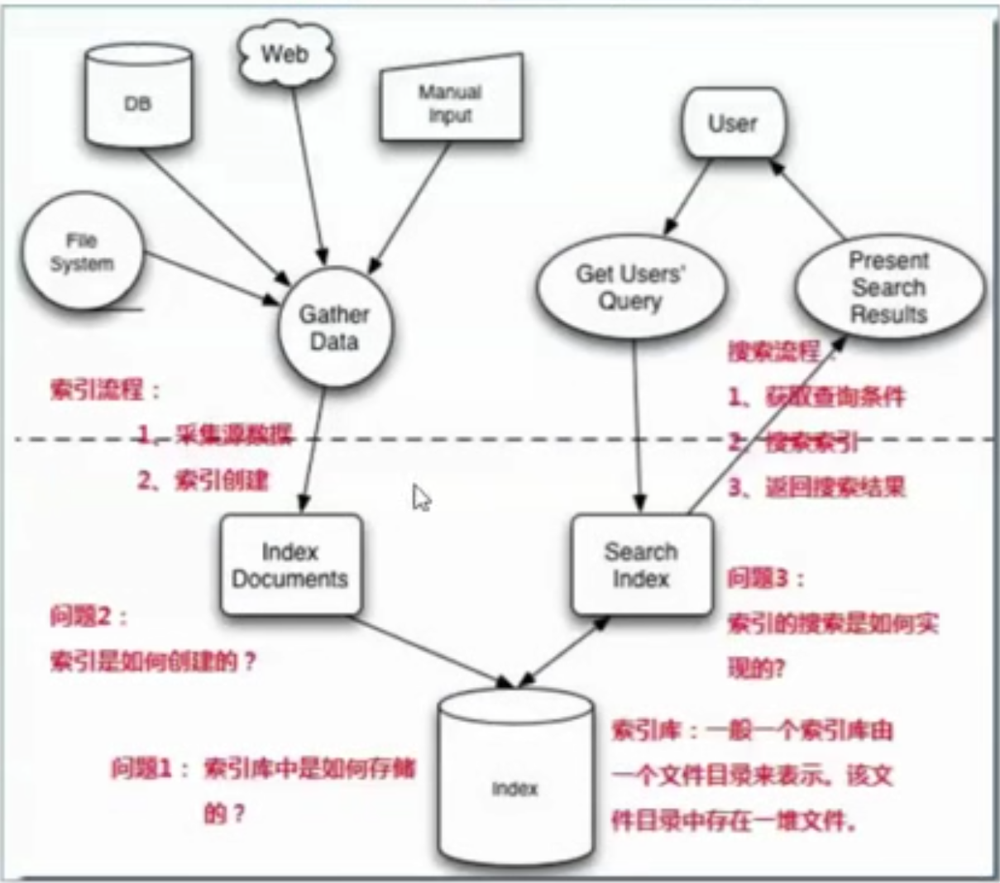
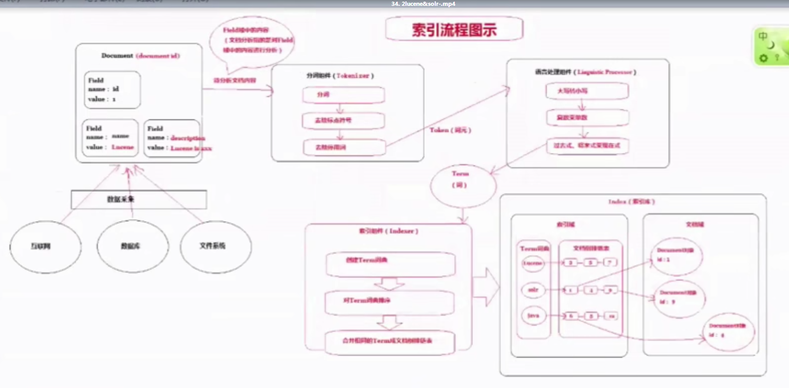
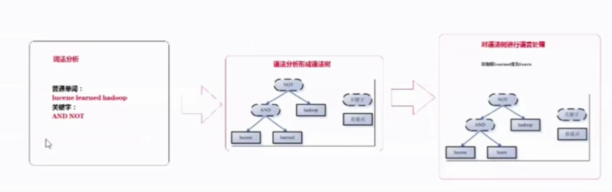
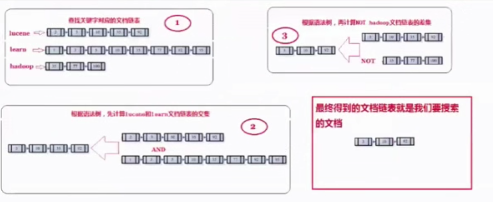
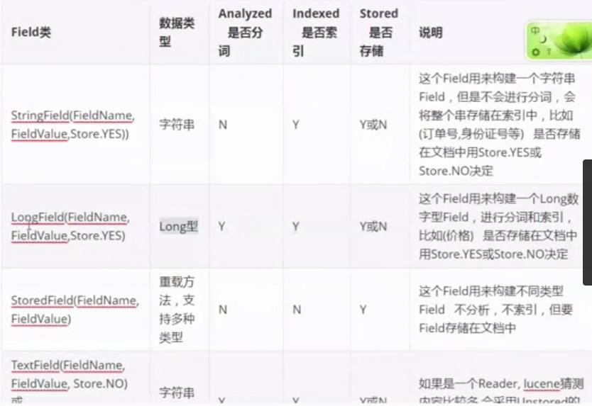
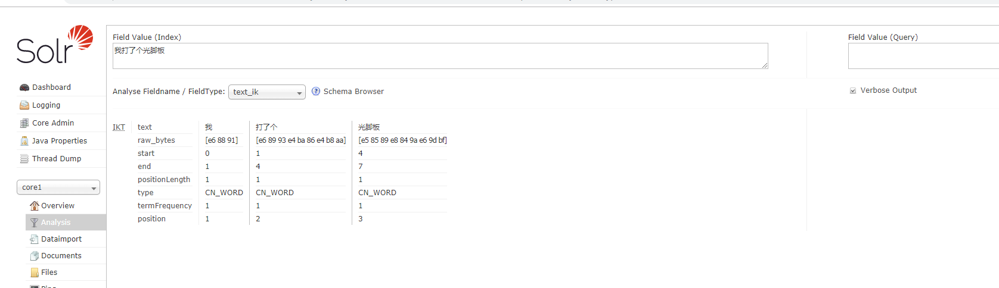

# Lucene 和 Solr

##  一、 什么是全文检索

先建立索引，再对索引进行搜索的过程就叫全文检索


## 二、Solr 和 ES的 比较

速度比较

- 当单纯对已有数据进行搜索时，Solr 更快

- 当实时建立索引时，Solr 会产生 IO 阻塞，es 更快

- 随着数据量的增加 Solr 会变慢，es 没有什么变化

  

  实时搜索与传统搜索的区别


## 三、 全文检索的流程




## 四、全文检索流程分析

创建索引流程

数据库表的记录 -> 对应 document

数据库表的 row -> 对应 field


条件树，先 and  后 or


term 是 最小单位

倒排链表（按词找文档）


#### 相关性排序

相关性自然打分

​	tf - idf 越大权重越高

人为影响分数

​	设置 Boost 值（**加权值**）


ELK




最后形成了，倒排链表（按词找文档）





### 四 、Lucene 应用代码

Luke 工具

### 五、field 域

- Field 属性

  是否分词（tokenizer）

  是否索引(indexed)

  是否存储(stored)

  注意：商品描述可以索引但不存储

- Field 常用类型

  

  ......

- Field 域的设计

### 六、中文分词器

默认是 standard_analyzer，中文分词器 ik_anlyzer

- 使用

   ik_anlyzer

- 扩展词库


> 注意：创建索引和搜索使用的分词器必须一致


#### 七、 Solr 

- 对比

  Solr  是已经开发好的 web 服务，使用 http 请求远程连接，功能更加丰富 

  Lucene 是一堆 jar，需要耦合到自己的应用中

- 部署 solr 服务器

  > 注意： solrhome  是 solr 服务器配置的主目录，该目录下配置信息和索引库都在该目录下，solrhome 包括多个 solrcore，solrcore就好比数据库的一张表，可以进行单独的索引和查询

  ```bash
  # 安装 jdk，
  # 略...
  
  # 下载 solr 并解压，修改名
  wget http://mirror.bit.edu.cn/apache/lucene/solr/7.7.2/solr-7.7.2.tgz
  tar -zxvf solr-7.7.2.tgz -C /usr/local/kkb/solr
  mv solr-7.7.2/ solr
  
  # 创建一个 solrcore
  # 进入 solr 的 bin 目录下，执行如下， core1 表示 core 名称
  ./solr start -force
  ./solr create_core  -c new_core -force
  
  
  #################### 使用自带的 jetty 启动服务器（注意：关闭防火墙） ##################
  ./solr/bin/solr  start -force
  systemctl stop firewalld
  
  # 浏览器访问（IP 根据自己服务器地址更换）
  # http://192.168.1.105:8983
  
  
  
  ############################  使用 tomcat 启动服务器 #########################
  
  #下载 tomcat 并解压，修改名称为 tomcat-solr
  wget https://mirrors.cnnic.cn/apache/tomcat/tomcat-9/v9.0.24/bin/apache-tomcat-9.0.24.tar.gz
  tar -zxvf apache-tomcat-9.0.24.tar.gz  -C /usr/local/kkb
  mv apache-tomcat-9.0.24/ tomcat-solr
  
  # 设置 solrhome，复制 /usr/local/kkb/solr/server/solr 到 solrhome
  mkdir /usr/local/kkb/solrhome
  cp -r /usr/local/kkb/solr/server/solr/* /usr/local/kkb/solrhome
  
  # 复制 solr-webapp 下的 webapp 内容到 tomcat 的 webapp 目录下
  # 修改名称 webapp 为 solr
  cp -r  solr/server/solr-webapp/webapp tomcat-solr/webapps/solr
  
  # 复制 solr/server/lib/ext/ 下所有 jar 到 tomcat/webapp/solr/WEB-INF/lib/ 下
  # 复制 solr/server/lib 下所有 metrics 开头的jar 到 tomcat/webapp/solr/WEB-INF/lib/下
  # 复制 solr/dist/下 的 solr-clustering-7.7.2.jar solr-dataimporthandler-extras-   # 7.7.2.jar和solr-dataimporthandler-7.7.2.jar 三个jar包复制到tomcat/webapp/solr/
  # WEB-INF/lib/下
  cp  /usr/local/kkb/solr/server/lib/ext/* .
  cp  /usr/local/kkb/solr/server/lib/metrics* .
  cp  /usr/local/kkb/solr/dist/solr-clustering-7.7.2.jar .
  cp  /usr/local/kkb/solr/dist/solr-dataimporthandler-extras-7.7.2.jar .
  cp  /usr/local/kkb/solr/dist/solr-dataimporthandler-7.7.2.jar .

  # 在 tomcat/webapp/solr/WEB-INF/ 创建 classes
  ```
# 复制 solr/resources 下的所有文件到 tomcat/webapp/solr/WEB-INF/classes
mkdir classes
cp /usr/local/kkb/solr/server/resources/*  .
  ```
  
  修改 tomcat/webapp/solr/WEB-INF/web.xml
  
  ```xml
  <!--注释掉下面代码-->
  <!--<security-constraint>
    <web-resource-collection>
          <web-resource-name>Disable TRACE</web-resource-name>
        <url-pattern>/</url-pattern>
          <http-method>TRACE</http-method>
      </web-resource-collection>
      <auth-constraint/>
  </security-constraint>
  <security-constraint>
      <web-resource-collection>
          <web-resource-name>Enable everything but TRACE</web-resource-name>
          <url-pattern>/</url-pattern>
          <http-method-omission>TRACE</http-method-omission>
      </web-resource-collection>
  </security-constraint>-->
  
  <!--添加下面代码-->
  <env-entry>
      <env-entry-name>solr/home</env-entry-name>
      <env-entry-value>/usr/local/kkb/solrhome </env-entry-value>
      <env-entry-type>java.lang.String</env-entry-type>
</env-entry>
  ```

  启动 tomcat

  浏览器访问（IP 根据自己服务器地址更换）

  http://192.168.1.105:8080/solr/index.html

  

  配置中文分词器 IK-analyzer

  ```bash
  # 下载 ik-analyzer
  # 略...
  
  # 复制 jar 到 /WEB-INF/lib
  mv ik-analyzer-solr5-5.x.jar /usr/local/kkb/tomcat-solr/webapps/solr/WEB-INF/lib/
  
  # 将 resources 目录下的其他 3 个配置文件放入 tomcat 的 webapp/WEB-INF/classes/ 目录下
  mv * /usr/local/kkb/tomcat-solr/webapps/solr/WEB-INF/classes/
  ```

  编辑 solrcore/conf  下的的 `managed-schema`，添加`ik分词器`

  ```xml
  <!-- ik分词器 -->
  <fieldType name="text_ik" class="solr.TextField">
    <analyzer type="index">
        <tokenizer class="org.wltea.analyzer.lucene.IKTokenizerFactory" useSmart="false" conf="ik.conf"/>
        <filter class="solr.LowerCaseFilterFactory"/>
    </analyzer>
    <analyzer type="query">
        <tokenizer class="org.wltea.analyzer.lucene.IKTokenizerFactory" useSmart="true" conf="ik.conf"/>
        <filter class="solr.LowerCaseFilterFactory"/>
    </analyzer>
  </fieldType>
  ```

  启动 tomcat

  访问： http://192.168.1.105:8080/solr/index.html

  

  

  

  可以在 ext.dict 中添加扩展词汇

- 

solrcore 下有个 schema.xml（重要）

text_id

#### SolrCloud  介绍


